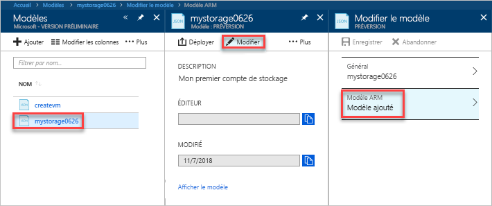

# <a name="quickstart-create-and-deploy-azure-resource-manager-templates-by-using-the-azure-portal"></a>Démarrage rapide : Créer et déployer des modèles Azure Resource Manager à l’aide du portail Azure

Découvrez comment créer votre premier modèle Azure Resource Manager à l’aide du portail Azure et comment modifier et déployer le modèle à partir du portail.

Les modèles Azure Resource Manager sont des fichiers JSON qui définissent les ressources nécessaires au déploiement de votre solution. Pour créer un modèle, vous n’êtes pas obligé de toujours démarrer de zéro. Ce tutoriel vous montre comment générer un modèle à partir du portail Azure. Vous pouvez ensuite personnaliser le modèle et le déployer.

Suivez les instructions de ce tutoriel pour créer un compte de stockage Azure. Vous pouvez utiliser le même processus pour créer d’autres ressources Azure.

Si vous ne disposez pas d’abonnement Azure, créez un [compte gratuit](https://azure.microsoft.com/free/) avant de commencer.

## <a name="generate-a-template-using-the-portal"></a>Générer un modèle à l’aide du portail Azure

Dans cette section, vous créez un compte de stockage à l’aide du portail Azure. Avant de déployer le compte de stockage, vous avez la possibilité d’explorer le modèle généré par le portail en fonction de vos configurations. Vous pouvez enregistrer le modèle et le réutiliser ultérieurement.

1. Connectez-vous au [Portail Azure](https://portal.azure.com).
2. Sélectionnez **Créer une ressource** > **Stockage** > **Compte de stockage - blob, fichier, table, file d’attente**.

    
3. Entrez les informations ci-après. Sélectionnez **Options d’automatisation** au lieu de **Créer** à l’étape suivante, de manière à pouvoir voir le modèle avant de le déployer.

    - **Nom** : attribuez un nom unique à votre compte de stockage. Sur la capture d’écran, le nom est *mystorage0626*.
    - **Groupe de ressources** : créez un nouveau groupe de ressources Azure portant le nom de votre choix. Sur la capture d’écran, le nom du groupe de ressources est *mystorage0626rg*.

    Vous pouvez utiliser les valeurs par défaut pour les autres propriétés.

    

    > [!NOTE]
    > Certains modèles exportés nécessitent des modifications avant leur déploiement.

4. Sélectionnez **Options d’automatisation** en bas de l’écran. Le portail affiche le modèle sous l’onglet **Modèle** :

    

    Le volet principal affiche le modèle. Il s’agit d’un fichier JSON avec quatre éléments de niveau supérieur. Pour plus d’informations, consultez [Comprendre la structure et la syntaxe des modèles Azure Resource Manager](./resource-group-authoring-templates.md)

    Sous l’élément **Paramètre**, cinq paramètres sont définis. Pour afficher les valeurs que vous fournissez au cours du déploiement, sélectionnez l’onglet **Paramètres**.

    

    Ces valeurs sont celles que vous avez configurées dans la section précédente. À l’aide du modèle et des fichiers de paramètres, vous pouvez créer un compte de stockage Azure.

5. En haut des onglets, figurent trois éléments de menu :

    - **Télécharger** : téléchargez le modèle et les fichiers de paramètres sur votre ordinateur local.
    - **Ajouter à la bibliothèque** : ajoutez le modèle à la bibliothèque à réutiliser ultérieurement.
    - **Déployer** : déployez le compte de stockage Azure dans Azure.

    Dans ce tutoriel, vous utilisez l’option **Ajouter à la bibliothèque**.

6. Sélectionnez **Ajouter à la bibliothèque**.
7. Entrez le **Nom** et la **Description**, puis sélectionnez **Enregistrer**.

> [!NOTE]
> La fonctionnalité de bibliothèque de modèles est en préversion. La plupart des gens choisissent d’enregistrer leurs modèles sur un ordinateur local ou un stockage public, tels que Github.  

## <a name="edit-and-deploy-the-template"></a>Modifier et déployer le modèle

Dans cette section, vous ouvrez le modèle enregistré à partir de la bibliothèque de modèles, modifiez le modèle au sein du portail et déployez le modèle modifié. Pour modifier un modèle plus complexe, envisagez d’utiliser Visual Studio Code, qui offre plus de fonctionnalités d’édition.

1. Dans le portail Azure, sélectionnez **Tous les services** dans le menu de gauche, entrez **modèle** dans la zone de filtre, puis sélectionnez **Modèle (PRÉVERSION)**.

    
2. Sélectionnez le modèle que vous avez enregistré dans la dernière section. Sur la capture d’écran, le nom utilisé est *mystorage0626*.
3. Sélectionnez **Modifier**, puis **Modèle ajouté**.

    

4. Ajoutez un élément **variables**, puis ajoutez une variable comme indiqué dans la capture d’écran suivante :

    ```json
    "variables": {
        "storageAccountName": "[concat(uniquestring(resourceGroup().id), 'standardsa')]"
    },
    ```
    

    Deux fonctions sont utilisées ici : *concat()* et *uniqueString()*. uniqueString() est utile pour la création d’un nom unique pour une ressource.

5. Supprimez le paramètre **nom** mis en surbrillance dans la capture d’écran précédente.
6. Mettez à jour l’élément nom de la ressource **Microsoft.Storage/storageaccounts** pour utiliser la variable qui vient d’être définie au lieu du paramètre :

    ```json
    "name": "[variables('storageAccountName')]",
    ```

    Le modèle final doit ressembler à ce qui suit :

    ```json
    {
        "$schema": "https://schema.management.azure.com/schemas/2015-01-01/deploymentTemplate.json#",
        "contentVersion": "1.0.0.0",
        "parameters": {
            "location": {
                "type": "string"
            },
            "accountType": {
                "type": "string"
            },
            "kind": {
                "type": "string"
            },
            "httpsTrafficOnlyEnabled": {
                "type": "bool"
            }
        },
        "variables": {
            "storageAccountName": "[concat(uniquestring(resourceGroup().id), 'standardsa')]"
        },
        "resources": [
            {
                "apiVersion": "2018-02-01",
                "name": "[variables('storageAccountName')]",
                "location": "[parameters('location')]",
                "type": "Microsoft.Storage/storageAccounts",
                "sku": {
                    "name": "[parameters('accountType')]"
                },
                "kind": "[parameters('kind')]",
                "properties": {
                    "supportsHttpsTrafficOnly": "[parameters('httpsTrafficOnlyEnabled')]",
                    "encryption": {
                        "services": {
                            "blob": {
                                "enabled": true
                            },
                            "file": {
                                "enabled": true
                            }
                        },
                        "keySource": "Microsoft.Storage"
                    }
                },
                "dependsOn": []
            }
        ]
    }
    ```
7. Sélectionnez **OK**, puis **Enregistrer** pour enregistrer les modifications.
8. Sélectionnez **Déployer**.
9. Saisissez les valeurs suivantes :

    - **Abonnement** : sélectionnez votre abonnement Azure.
    - **Groupe de ressources** : attribuez un nom unique à votre groupe de ressources.
    - **Emplacement** : sélectionnez un emplacement pour le groupe de ressources.
    - **Emplacement** : sélectionnez un emplacement pour le compte de stockage.  Vous pouvez utiliser le même emplacement que celui de votre groupe de ressources.
    - **Type de compte** : entrez **Standard_LRS** pour ce démarrage rapide.
    - **Type** : entrez **Stockage** pour ce démarrage rapide.
    - **Seul le trafic HTTPS est activé**.  Pour ce guide de démarrage rapide, sélectionnez **false**.
    - **J’accepte les termes et conditions mentionnés ci-dessus** : (cochez la case)

    Voici une capture d’écran d’un exemple de déploiement :

    

10. Sélectionnez **Achat**.
11. Sélectionnez l’icône représentant une cloche (notifications) en haut de l’écran pour afficher l’état du déploiement.

## <a name="clean-up-resources"></a>Supprimer les ressources

Lorsque vous n’en avez plus besoin, nettoyez les ressources Azure que vous avez déployées en supprimant le groupe de ressources.

1. Dans le portail Azure, sélectionnez **Groupe de ressources** dans le menu de gauche.
2. Entrez le nom du groupe de ressources dans le champ **Filtrer par nom**.
3. Sélectionnez le nom du groupe de ressources.  Vous devriez voir le compte de stockage dans le groupe de ressources.
4. Sélectionnez **Supprimer le groupe de ressources** dans le menu supérieur.

## <a name="next-steps"></a>Étapes suivantes

Ce tutoriel vous a appris à générer un modèle et à le déployer à partir du portail Azure. Le modèle utilisé dans ce démarrage rapide est un modèle simple disposant d’une seule ressource Azure. Lorsque le modèle est complexe, il est plus facile d’utiliser Visual Studio Code ou Visual Studio pour développer le modèle.

> [!div class="nextstepaction"]
> [Créer des modèles à l’aide de Visual Studio Code](./resource-manager-quickstart-create-templates-use-visual-studio-code.md)
