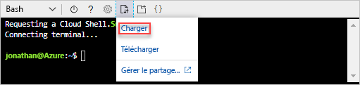

# <a name="quickstart-create-azure-resource-manager-templates-by-using-visual-studio-code"></a>Démarrage rapide : créer des modèles Azure Resource Manager à l’aide de Visual Studio Code

Découvrez comment créer des modèles Azure Resource Manager à l’aide de Visual Studio Code et de l’extension Outils Azure Resource Manager. Vous pouvez créer des modèles Resource Manager dans Visual Studio Code sans l’extension, mais cette dernière fournit des options de saisie semi-automatique qui simplifient le développement de modèles. Pour comprendre les concepts associés au déploiement et à la gestion de vos solutions Azure, voir [Présentation d’Azure Resource Manager](resource-group-overview.md).

Si vous ne disposez pas d’abonnement Azure, créez un [compte gratuit](https://azure.microsoft.com/free/) avant de commencer.

## <a name="prerequisites"></a>Prérequis

Pour effectuer ce qui est décrit dans cet article, vous avez besoin des éléments suivants :

- [Visual Studio Code](https://code.visualstudio.com/).
- Extension Outils Azure Resource Manager. Pour l’installer, procédez comme suit :

    1. Ouvrez Visual Studio Code.
    2. Appuyez sur **CTRL + MAJ + X** pour ouvrir le volet Extensions
    3. Recherchez les **Outils Azure Resource Manager** et sélectionnez **Installer**.
    4. Pour terminer l’installation de l’extension, sélectionnez **Recharger**.

## <a name="open-a-quickstart-template"></a>Ouvrir un modèle de démarrage rapide

Au lieu de créer un modèle à partir de zéro, ouvrez un modèle à partir de [Modèles de démarrage rapide Azure](https://azure.microsoft.com/resources/templates/). Modèles de démarrage rapide Azure est un référentiel pour les modèles Resource Manager.

Le modèle utilisé dans ce démarrage rapide se nomme [Créer un compte de stockage standard](https://azure.microsoft.com/resources/templates/101-storage-account-create/). Le modèle définit une ressource de compte de stockage Azure.

1. À partir de Visual Studio Code, sélectionnez **Fichier**>**Ouvrir un fichier**.
2. Collez l’URL suivante dans **Nom de fichier** :

    ```url
    https://raw.githubusercontent.com/Azure/azure-quickstart-templates/master/101-storage-account-create/azuredeploy.json
    ```
3. Sélectionnez **Ouvrir** pour ouvrir le fichier.
4. Sélectionnez **Fichier**>**Enregistrer sous** pour enregistrer le fichier sous le nom **azuredeploy.json** sur votre ordinateur local.

## <a name="edit-the-template"></a>Modifier le modèle

Pour savoir comment modifier un modèle à l’aide de Visual Studio Code, ajoutez un élément à la section des sorties.

1. À partir de Visual Studio Code, ajoutez une sortie au modèle exporté :

    ```json
    "storageUri": {
      "type": "string",
      "value": "[reference(variables('storageAccountName')).primaryEndpoints.blob]"
    }
    ```

    Lorsque vous avez terminé, la section des sorties ressemble à ce qui suit :

    ```json
    "outputs": {
      "storageAccountName": {
        "type": "string",
        "value": "[variables('storageAccountName')]"
      },
      "storageUri": {
        "type": "string",
        "value": "[reference(variables('storageAccountName')).primaryEndpoints.blob]"
      }
    }
    ```

    Si vous avez copiez et collé le code dans Visual Studio Code, essayez de retaper l’élément **valeur** pour profiter de la fonctionnalité intellisense de l’extension Outils Resource Manager.

    

2. Sélectionnez **Fichier**>**Enregistrer** pour enregistrer le fichier.

## <a name="deploy-the-template"></a>Déployer le modèle

Il existe de nombreuses méthodes pour déployer des modèles.  Dans ce démarrage rapide, vous utilisez Azure Cloud Shell à partir du portail Azure. Cloud Shell prend en charge Azure CLI et Azure PowerShell. 

1. Connectez-vous au [portail Azure](https://portal.azure.com)
2. Sélectionnez **Cloud Shell** à partir de l’angle supérieur droit, comme indiqué dans l’image suivante :

    

    Cloud Shell s’ouvre dans la partie inférieure de l’écran.

3. Dans l’angle supérieur gauche de Cloud Shell, vous voyez **PowerShell** ou **Bash**. Pour utiliser l’interface CLI, vous devez ouvrir une session Bash. Pour exécuter PowerShell, vous devez ouvrir une session PowerShell. Sélectionnez la flèche vers le bas, puis sélectionnez l’interpréteur pour basculer. L’image suivante montre comment passer de PowerShell à Bash.

    

    Il est nécessaire de redémarrer l’interpréteur de commandes lors d’un tel changement.
4. Sélectionnez **Charger/Télécharger des fichiers**, puis **Charger**.

    

    Vous devez télécharger le fichier de modèle avant de pouvoir le déployer à partir de l’interpréteur de commandes.
5. Sélectionnez le fichier que vous avez enregistré précédemment dans ce démarrage rapide. Le nom par défaut est **azuredeploy.json**.
6. À partir de Cloud Shell, exécutez la commande **ls** pour vérifier que le fichier est chargé avec succès. Vous pouvez également utiliser la commande **cat** pour vérifier le contenu du modèle. L’illustration suivante montre l’exécution de la commande à partir de Bash.  Vous utilisez les mêmes commandes depuis une session PowerShell.

    
7. Dans le Cloud Shell exécutez les commandes suivantes. Sélectionnez l’onglet pour afficher le code PowerShell ou CLI.

    # <a name="clitabcli"></a>[INTERFACE DE LIGNE DE COMMANDE](#tab/CLI)
    ```cli
    az group create --name <ResourceGroupName> --location <AzureLocation>

    az group deployment create --name <DeploymentName> --resource-group <ResourceGroupName> --template-file <TemplateFileName>
    ```
   
    # <a name="powershelltabpowershell"></a>[PowerShell](#tab/PowerShell)
    
    ```powershell
    New-AzureRmResourceGroup -Name <ResourceGroupName> -Location <AzureLocation>

    New-AzureRmResourceGroupDeployment -ResourceGroupName <ResourceGroupName> -TemplateFile <TemplateFileName>
    ```
    
    ---

    La capture d'écran ci-dessous présente un exemple de déploiement CLI :

    

    Sur la capture d’écran, les valeurs suivantes sont utilisées :

    - **&lt;ResourceGroupName>** : myresourcegroup0709. Le paramètre peut apparaître sous deux formes.  Veillez à utiliser la même valeur.
    - **&lt;AzureLocation >** : eastus2
    - **&lt;DeployName>** : mydeployment0709
    - **&lt;TemplateFile>** : azuredeploy.json

    À partir de la sortie de la capture d’écran, le nom du compte de stockage est *3tqebj3slyfyestandardsa*. 

7. Exécutez la commande PowerShell ou CLI suivante pour lister les comptes de stockage nouvellement créés :

    # <a name="clitabcli"></a>[INTERFACE DE LIGNE DE COMMANDE](#tab/CLI)
    ```cli
    az storage account show --resource-group <ResourceGroupName> --name <StorageAccountName>
    ```
   
    # <a name="powershelltabpowershell"></a>[PowerShell](#tab/PowerShell)
    
    ```powershell
    Get-AzureRmStorageAccount -ResourceGroupName <ResourceGroupName> -Name <StorageAccountName>
    ```
    
    ---

## <a name="clean-up-resources"></a>Supprimer les ressources

Lorsque vous n’en avez plus besoin, nettoyez les ressources Azure que vous avez déployées en supprimant le groupe de ressources.

1. Dans le portail Azure, sélectionnez **Groupe de ressources** dans le menu de gauche.
2. Entrez le nom du groupe de ressources dans le champ **Filtrer par nom**.
3. Sélectionnez le nom du groupe de ressources.  Vous devriez voir six ressources au total dans le groupe de ressources.
4. Sélectionnez **Supprimer le groupe de ressources** dans le menu supérieur.

## <a name="next-steps"></a>Étapes suivantes

Le principal objectif de ce didacticiel consiste à utiliser Visual Studio Code pour modifier un modèle existant à partir de modèles de démarrage rapide Azure. Vous avez également appris à déployer le modèle à l’aide de CLI ou PowerShell à partir d’Azure Cloud Shell. Il est possible que les modèles tirés des modèles de démarrage ne vous apportent pas tout ce dont vous avez besoin. Le didacticiel suivant vous montre comment rechercher les informations à partir des références de modèle pour pouvoir créer un compte de stockage Azure chiffré.

> [!div class="nextstepaction"]
> [Créer un compte de stockage chiffré](./resource-manager-tutorial-create-encrypted-storage-accounts.md)
