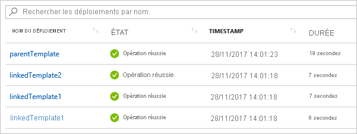

# <a name="using-linked-and-nested-templates-when-deploying-azure-resources"></a>Utilisation de modèles liés et imbriqués durant le déploiement de ressources Azure

Pour déployer des solutions complexes, vous pouvez diviser votre modèle en plusieurs modèles associés, puis les déployer ensemble au moyen d’un modèle principal. Les modèles associés peuvent être des fichiers distincts ou une syntaxe de modèle incorporée dans le modèle principal. Cet article utilise le terme **modèle lié** pour faire référence à un modèle de fichier distinct référencé par un lien à partir du modèle principal, et le terme **modèle imbriqué** pour désigner la syntaxe de modèle incorporé dans le modèle principal.

Pour les solutions petites et moyennes, un modèle unique est plus facile à comprendre et à gérer. Vous pouvez voir toutes les ressources et valeurs dans un même fichier. Pour des scénarios avancés, les modèles liés permettent de diviser la solution en composants ciblés. Vous pouvez facilement réutiliser ces modèles pour d’autres scénarios.

Pour obtenir un tutoriel, consultez [Tutoriel : Créer des modèles Azure Resource Manager liés](template-tutorial-create-linked-templates.md).

> [!NOTE]
> Pour les modèles liés ou imbriqués, vous pouvez uniquement utiliser le mode de déploiement [Incremental](deployment-modes.md).
>

## <a name="nested-template"></a>Modèle imbriqué

Pour imbriquer un modèle, ajoutez une [ressource de déploiement](/azure/templates/microsoft.resources/deployments) à votre modèle principal. Dans la propriété **template**, spécifiez la syntaxe du modèle.

```json
{
  "$schema": "https://schema.management.azure.com/schemas/2019-04-01/deploymentTemplate.json#",
  "contentVersion": "1.0.0.0",
  "parameters": {},
  "variables": {},
  "resources": [
    {
      "name": "nestedTemplate1",
      "apiVersion": "2017-05-10",
      "type": "Microsoft.Resources/deployments",
      "properties": {
        "mode": "Incremental",
        "template": {
          <nested-template-syntax>
        }
      }
    }
  ],
  "outputs": {
  }
}
```

L’exemple suivant déploie un compte de stockage au moyen d’un modèle imbriqué.

```json
{
  "$schema": "https://schema.management.azure.com/schemas/2019-04-01/deploymentTemplate.json#",
  "contentVersion": "1.0.0.0",
  "parameters": {
    "storageAccountName": {
      "type": "string"
    }
  },
  "resources": [
    {
      "name": "nestedTemplate1",
      "apiVersion": "2017-05-10",
      "type": "Microsoft.Resources/deployments",
      "properties": {
        "mode": "Incremental",
        "template": {
          "$schema": "https://schema.management.azure.com/schemas/2015-01-01/deploymentTemplate.json#",
          "contentVersion": "1.0.0.0",
          "resources": [
            {
              "type": "Microsoft.Storage/storageAccounts",
              "apiVersion": "2019-04-01",
              "name": "[parameters('storageAccountName')]",
              "location": "West US",
              "sku": {
                "name": "Standard_LRS"
              },
              "kind": "StorageV2"
            }
          ]
        }
      }
    }
  ],
  "outputs": {
  }
}
```

### <a name="expression-evaluation-scope-in-nested-templates"></a>Étendue de l’évaluation d’expressions dans les modèles imbriqués

Lorsque vous utilisez un modèle imbriqué, vous pouvez spécifier si les expressions de modèle sont évaluées dans la portée du modèle parent ou du modèle imbriqué. La portée détermine comment sont résolus les paramètres, les variables et les fonctions comme [resourceGroup](template-functions-resource.md#resourcegroup) et [subscription](template-functions-resource.md#subscription).

La portée est définie par la propriété `expressionEvaluationOptions`. Par défaut, la propriété `expressionEvaluationOptions` est définie sur `outer`, ce qui signifie qu’elle utilise la portée du modèle parent. Définissez la valeur sur `inner` pour faire en sorte que les expressions soient évaluées dans l’étendue du modèle imbriqué.

```json
{
  "type": "Microsoft.Resources/deployments",
  "apiVersion": "2017-05-10",
  "name": "nestedTemplate1",
  "properties": {
  "expressionEvaluationOptions": {
    "scope": "inner"
  },
  ...
```

Le modèle suivant montre la façon dont sont résolues les expressions de modèle en fonction de la portée. Il contient une variable nommée `exampleVar`, définie à la fois dans le modèle parent et dans le modèle imbriqué. Il retourne la valeur de la variable.

```json
{
  "$schema": "https://schema.management.azure.com/schemas/2019-04-01/deploymentTemplate.json#",
  "contentVersion": "1.0.0.0",
  "parameters": {
  },
  "variables": {
    "exampleVar": "from parent template"
  },
  "resources": [
    {
      "type": "Microsoft.Resources/deployments",
      "apiVersion": "2017-05-10",
      "name": "nestedTemplate1",
      "properties": {
        "expressionEvaluationOptions": {
          "scope": "inner"
        },
        "mode": "Incremental",
        "template": {
          "$schema": "https://schema.management.azure.com/schemas/2015-01-01/deploymentTemplate.json#",
          "contentVersion": "1.0.0.0",
          "variables": {
            "exampleVar": "from nested template"
          },
          "resources": [
          ],
          "outputs": {
            "testVar": {
              "type": "string",
              "value": "[variables('exampleVar')]"
            }
          }
        }
      }
    }
  ],
  "outputs": {
    "messageFromLinkedTemplate": {
      "type": "string",
      "value": "[reference('nestedTemplate1').outputs.testVar.value]"
    }
  }
}
```

La valeur de `exampleVar` varie en fonction de la valeur de la propriété `scope` dans `expressionEvaluationOptions`. Le tableau suivant montre les résultats pour les deux portées.

| `expressionEvaluationOptions` `scope` | Output |
| ----- | ------ |
| interne | from nested template |
| externe (ou par défaut) | from parent template |

L’exemple suivant déploie un serveur SQL et récupère un secret de coffre de clés à utiliser pour le mot de passe. L’étendue est définie sur `inner`, car elle crée dynamiquement l’ID de coffre de clés (voir `adminPassword.reference.keyVault` au niveau de `parameters` dans les modèles extérieurs) et la transmet sous forme de paramètre au modèle imbriqué.

```json
{
  "$schema": "https://schema.management.azure.com/schemas/2015-01-01/deploymentTemplate.json#",
  "contentVersion": "1.0.0.0",
  "parameters": {
    "location": {
      "type": "string",
      "defaultValue": "[resourceGroup().location]",
      "metadata": {
        "description": "The location where the resources will be deployed."
      }
    },
    "vaultName": {
      "type": "string",
      "metadata": {
        "description": "The name of the keyvault that contains the secret."
      }
    },
    "secretName": {
      "type": "string",
      "metadata": {
        "description": "The name of the secret."
      }
    },
    "vaultResourceGroupName": {
      "type": "string",
      "metadata": {
        "description": "The name of the resource group that contains the keyvault."
      }
    },
    "vaultSubscription": {
      "type": "string",
      "defaultValue": "[subscription().subscriptionId]",
      "metadata": {
        "description": "The name of the subscription that contains the keyvault."
      }
    }
  },
  "resources": [
    {
      "type": "Microsoft.Resources/deployments",
      "apiVersion": "2018-05-01",
      "name": "dynamicSecret",
      "properties": {
        "mode": "Incremental",
        "expressionEvaluationOptions": {
          "scope": "inner"
        },
        "parameters": {
          "location": {
            "value": "[parameters('location')]"
          },
          "adminLogin": {
            "value": "ghuser"
          },
          "adminPassword": {
            "reference": {
              "keyVault": {
                "id": "[resourceId(parameters('vaultSubscription'), parameters('vaultResourceGroupName'), 'Microsoft.KeyVault/vaults', parameters('vaultName'))]"
              },
              "secretName": "[parameters('secretName')]"
            }
          }
        },
        "template": {
          "$schema": "https://schema.management.azure.com/schemas/2015-01-01/deploymentTemplate.json#",
          "contentVersion": "1.0.0.0",
          "parameters": {
            "adminLogin": {
              "type": "string"
            },
            "adminPassword": {
              "type": "securestring"
            },
            "location": {
              "type": "string"
            }
          },
          "variables": {
            "sqlServerName": "[concat('sql-', uniqueString(resourceGroup().id, 'sql'))]"
          },
          "resources": [
            {
              "type": "Microsoft.Sql/servers",
              "apiVersion": "2018-06-01-preview",
              "name": "[variables('sqlServerName')]",
              "location": "[parameters('location')]",
              "properties": {
                "administratorLogin": "[parameters('adminLogin')]",
                "administratorLoginPassword": "[parameters('adminPassword')]"
              }
            }
          ],
          "outputs": {
            "sqlFQDN": {
              "type": "string",
              "value": "[reference(variables('sqlServerName')).fullyQualifiedDomainName]"
            }
          }
        }
      }
    }
  ],
  "outputs": {
  }
}
```

> [!NOTE]
>
> Lorsque la portée est définie sur `outer`, la fonction `reference` n’est pas utilisable dans la section outputs d’un modèle imbriqué pour une ressource déployée dans le modèle imbriqué. Pour retourner les valeurs d’une ressource déployée dans un modèle imbriqué, utilisez l’étendue `inner` ou bien convertissez votre modèle imbriqué en modèle lié.

## <a name="linked-template"></a>Modèle lié

Pour lier un modèle, ajoutez une [ressource de déploiement](/azure/templates/microsoft.resources/deployments) à votre modèle principal. Dans la propriété **templateLink**, spécifiez l’URI du modèle à inclure. L’exemple suivant établit un lien vers un modèle qui déploie un nouveau compte de stockage.

```json
{
  "$schema": "https://schema.management.azure.com/schemas/2019-04-01/deploymentTemplate.json#",
  "contentVersion": "1.0.0.0",
  "parameters": {},
  "variables": {},
  "resources": [
    {
      "type": "Microsoft.Resources/deployments",
      "apiVersion": "2017-05-10",
      "name": "linkedTemplate",
      "properties": {
        "mode": "Incremental",
        "templateLink": {
          "uri":"https://mystorageaccount.blob.core.windows.net/AzureTemplates/newStorageAccount.json",
          "contentVersion":"1.0.0.0"
        }
      }
    }
  ],
  "outputs": {
  }
}
```

Lors du référencement d’un modèle lié, la valeur de `uri` ne doit pas être un fichier local ou un fichier disponible uniquement sur votre réseau local. Vous devez fournir une valeur d’URI téléchargeable utilisant le protocole **http** ou **https**. 

> [!NOTE]
>
> Vous pouvez référencer des modèles à l’aide de paramètres qui, en fin de compte, sont résolus en une solution qui utilise **http** ou **https**, par exemple, à l’aide du paramètre `_artifactsLocation`, comme suit : `"uri": "[concat(parameters('_artifactsLocation'), '/shared/os-disk-parts-md.json', parameters('_artifactsLocationSasToken'))]",`


Resource Manager doit être en mesure d’accéder au modèle. Une possibilité consiste à placer votre modèle lié dans un compte de stockage et à utiliser l’URI de cet élément.

### <a name="parameters-for-linked-template"></a>Paramètres du modèle lié

Les paramètres du modèle lié peuvent être indiqués dans un fichier externe ou inline. Lorsque vous fournissez un fichier de paramètres externe, utilisez la propriété **parametersLink** :

```json
"resources": [
  {
  "type": "Microsoft.Resources/deployments",
  "apiVersion": "2018-05-01",
  "name": "linkedTemplate",
  "properties": {
    "mode": "Incremental",
    "templateLink": {
      "uri":"https://mystorageaccount.blob.core.windows.net/AzureTemplates/newStorageAccount.json",
      "contentVersion":"1.0.0.0"
    },
    "parametersLink": {
      "uri":"https://mystorageaccount.blob.core.windows.net/AzureTemplates/newStorageAccount.parameters.json",
      "contentVersion":"1.0.0.0"
    }
  }
  }
]
```

Pour passer des valeurs de paramètre inline, utilisez la propriété **parameters**.

```json
"resources": [
  {
   "type": "Microsoft.Resources/deployments",
   "apiVersion": "2018-05-01",
   "name": "linkedTemplate",
   "properties": {
     "mode": "Incremental",
     "templateLink": {
      "uri":"https://mystorageaccount.blob.core.windows.net/AzureTemplates/newStorageAccount.json",
      "contentVersion":"1.0.0.0"
     },
     "parameters": {
      "StorageAccountName":{"value": "[parameters('StorageAccountName')]"}
    }
   }
  }
]
```

Vous ne pouvez pas utiliser à la fois des paramètres inline et un lien vers un fichier de paramètres. Si `parametersLink` et `parameters` sont spécifiés tous les deux, le déploiement échoue.

## `contentVersion`

Vous n’avez pas besoin de fournir la propriété `contentVersion` pour la propriété `templateLink` ou `parametersLink`. Si vous ne fournissez pas une valeur de `contentVersion`, la version actuelle du modèle est déployée. Si vous fournissez une valeur pour la version du contenu, elle doit correspondre à la version du modèle lié ; sinon, le déploiement échoue avec une erreur.

## <a name="using-variables-to-link-templates"></a>Utilisation de variables pour lier des modèles

Les exemples précédents représentaient des valeurs d’URL codées en dur pour les liens de modèle. Cette approche peut fonctionner pour un modèle simple, mais elle ne fonctionne pas bien pour un grand ensemble de modèles modulaires. Au lieu de cela, vous pouvez créer une variable statique qui stocke une URL de base pour le modèle principal, avant de créer dynamiquement les URL pour les modèles liés à partir de cette URL de base. Cette approche permet notamment de déplacer ou de répliquer facilement le modèle. En effet, vous devez modifier uniquement la variable statique dans le modèle principal. Le modèle principal transmet les URI appropriés au modèle décomposé.

L’exemple suivant indique comment utiliser une URL de base afin de créer deux URL pour des modèles liés (**sharedTemplateUrl** et **vmTemplate**).

```json
"variables": {
  "templateBaseUrl": "https://raw.githubusercontent.com/Azure/azure-quickstart-templates/master/postgresql-on-ubuntu/",
  "sharedTemplateUrl": "[uri(variables('templateBaseUrl'), 'shared-resources.json')]",
  "vmTemplateUrl": "[uri(variables('templateBaseUrl'), 'database-2disk-resources.json')]"
}
```

Vous pouvez également utiliser [deployment()](template-functions-deployment.md#deployment) pour obtenir l’URL de base pour le modèle actuel, qui permet d’obtenir l’URL d’autres modèles dans le même emplacement. Cette approche est pratique si l’emplacement des modèles change ou si vous voulez éviter de coder en dur les URL dans le fichier du modèle. La propriété templateLink n’est renvoyée qu’en cas de liaison à un modèle distant avec une URL. Si vous utilisez un modèle local, cette propriété n’est pas disponible.

```json
"variables": {
  "sharedTemplateUrl": "[uri(deployment().properties.templateLink.uri, 'shared-resources.json')]"
}
```

Au final, vous utiliseriez la variable dans la propriété `uri` d’une propriété `templateLink`.

```json
"templateLink": {
 "uri": "[variables('sharedTemplateUrl')]",
 "contentVersion":"1.0.0.0"
}
```

## <a name="using-copy"></a>Utilisation de la copie

Pour créer plusieurs instances d’une ressource avec un modèle imbriqué, ajoutez l’élément copy au niveau de la ressource **Microsoft.Resources/deployments**. Si la portée est interne, vous pouvez ajouter la copie dans le modèle imbriqué.

L’exemple de modèle suivant montre comment utiliser copy avec un modèle imbriqué.

```json
"resources": [
  {
  "type": "Microsoft.Resources/deployments",
  "apiVersion": "2018-05-01",
  "name": "[concat('nestedTemplate', copyIndex())]",
  // yes, copy works here
  "copy":{
    "name": "storagecopy",
    "count": 2
  },
  "properties": {
    "mode": "Incremental",
    "expressionEvaluationOptions": {
    "scope": "inner"
    },
    "template": {
    "$schema": "https://schema.management.azure.com/schemas/2015-01-01/deploymentTemplate.json#",
    "contentVersion": "1.0.0.0",
    "resources": [
      {
      "type": "Microsoft.Storage/storageAccounts",
      "apiVersion": "2019-04-01",
      "name": "[concat(variables('storageName'), copyIndex())]",
      "location": "West US",
      "sku": {
        "name": "Standard_LRS"
      },
      "kind": "StorageV2"
      // Copy works here when scope is inner
      // But, when scope is default or outer, you get an error
      //"copy":{
      //  "name": "storagecopy",
      //  "count": 2
      //}
      }
    ]
    }
  }
  }
]
```

## <a name="get-values-from-linked-template"></a>Obtenir des valeurs du modèle lié

Pour obtenir une valeur de sortie d’un modèle lié, récupérez la valeur de propriété à l’aide d’une syntaxe comme : `"[reference('deploymentName').outputs.propertyName.value]"`.

Lors de l’obtention d’une propriété de sortie à partir d’un modèle lié, le nom de propriété ne doit pas inclure de tiret.

Les exemples suivants montrent comment faire référence à un modèle lié pour récupérer une valeur de sortie. Le modèle lié retourne un message simple.  Tout d’abord, le modèle lié :

```json
{
  "$schema": "https://schema.management.azure.com/schemas/2015-01-01/deploymentTemplate.json#",
  "contentVersion": "1.0.0.0",
  "parameters": {},
  "variables": {},
  "resources": [],
  "outputs": {
    "greetingMessage": {
      "value": "Hello World",
      "type" : "string"
    }
  }
}
```

Le modèle principal déploie le modèle lié et obtient la valeur retournée. Remarquez qu’il fait référence à la ressource de déploiement par son nom et qu’il utilise le nom de la propriété retournée par le modèle lié.

```json
{
  "$schema": "https://schema.management.azure.com/schemas/2015-01-01/deploymentTemplate.json#",
  "contentVersion": "1.0.0.0",
  "parameters": {},
  "variables": {},
  "resources": [
    {
      "type": "Microsoft.Resources/deployments",
      "apiVersion": "2018-05-01",
      "name": "linkedTemplate",
      "properties": {
        "mode": "Incremental",
        "templateLink": {
          "uri": "[uri(deployment().properties.templateLink.uri, 'helloworld.json')]",
          "contentVersion": "1.0.0.0"
        }
      }
    }
  ],
  "outputs": {
    "messageFromLinkedTemplate": {
      "type": "string",
      "value": "[reference('linkedTemplate').outputs.greetingMessage.value]"
    }
  }
}
```

Comme pour d’autres types de ressources, vous pouvez définir des dépendances entre le modèle lié et d’autres ressources. Lorsque d’autres ressources requièrent une valeur de sortie provenant du modèle lié, veillez à ce que celui-ci soit déployé avant les ressources. Sinon, lorsque le modèle lié s’appuie sur d’autres ressources, vérifiez que celles-ci sont déployées avant le modèle lié.

L’exemple suivant montre un modèle qui déploie une adresse IP publique et retourne l’ID de ressource de la ressource Azure de cette adresse IP publique :

```json
{
  "$schema": "https://schema.management.azure.com/schemas/2015-01-01/deploymentTemplate.json#",
  "contentVersion": "1.0.0.0",
  "parameters": {
    "publicIPAddresses_name": {
      "type": "string"
    }
  },
  "variables": {},
  "resources": [
    {
      "type": "Microsoft.Network/publicIPAddresses",
      "apiVersion": "2018-11-01",
      "name": "[parameters('publicIPAddresses_name')]",
      "location": "eastus",
      "properties": {
        "publicIPAddressVersion": "IPv4",
        "publicIPAllocationMethod": "Dynamic",
        "idleTimeoutInMinutes": 4
      },
      "dependsOn": []
    }
  ],
  "outputs": {
    "resourceID": {
      "type": "string",
      "value": "[resourceId('Microsoft.Network/publicIPAddresses', parameters('publicIPAddresses_name'))]"
    }
  }
}
```

Pour utiliser l’adresse IP publique du modèle précédent lors du déploiement d’un équilibreur de charge, établissez un lien vers le modèle et déclarez une dépendance vis-à-vis de la ressource `Microsoft.Resources/deployments`. L’adresse IP publique sur l’équilibreur de charge est définie sur la valeur de sortie du modèle lié.

```json
{
  "$schema": "https://schema.management.azure.com/schemas/2015-01-01/deploymentTemplate.json#",
  "contentVersion": "1.0.0.0",
  "parameters": {
    "loadBalancers_name": {
      "defaultValue": "mylb",
      "type": "string"
    },
    "publicIPAddresses_name": {
      "defaultValue": "myip",
      "type": "string"
    }
  },
  "variables": {},
  "resources": [
    {
      "type": "Microsoft.Network/loadBalancers",
      "apiVersion": "2018-11-01",
      "name": "[parameters('loadBalancers_name')]",
      "location": "eastus",
      "properties": {
        "frontendIPConfigurations": [
          {
            "name": "LoadBalancerFrontEnd",
            "properties": {
              "privateIPAllocationMethod": "Dynamic",
              "publicIPAddress": {
                // this is where the output value from linkedTemplate is used
                "id": "[reference('linkedTemplate').outputs.resourceID.value]"
              }
            }
          }
        ],
        "backendAddressPools": [],
        "loadBalancingRules": [],
        "probes": [],
        "inboundNatRules": [],
        "outboundNatRules": [],
        "inboundNatPools": []
      },
      // This is where the dependency is declared
      "dependsOn": [
        "linkedTemplate"
      ]
    },
    {
      "type": "Microsoft.Resources/deployments",
      "apiVersion": "2018-05-01",
      "name": "linkedTemplate",
      "properties": {
        "mode": "Incremental",
        "templateLink": {
          "uri": "[uri(deployment().properties.templateLink.uri, 'publicip.json')]",
          "contentVersion": "1.0.0.0"
        },
        "parameters":{
          "publicIPAddresses_name":{"value": "[parameters('publicIPAddresses_name')]"}
        }
      }
    }
  ]
}
```

## <a name="deployment-history"></a>Historique de déploiement

Resource Manager traite chaque modèle comme un déploiement séparé dans l’historique de déploiement. Un modèle principal comportant trois modèles liés ou imbriqués s’affiche ainsi dans l’historique de déploiement :



Vous pouvez utiliser ces entrées distinctes dans l’historique pour récupérer les valeurs de sortie après le déploiement. Le modèle suivant crée une adresse IP publique et renvoie l’adresse IP :

```json
{
  "$schema": "https://schema.management.azure.com/schemas/2015-01-01/deploymentTemplate.json#",
  "contentVersion": "1.0.0.0",
  "parameters": {
    "publicIPAddresses_name": {
      "type": "string"
    }
  },
  "variables": {},
  "resources": [
    {
      "type": "Microsoft.Network/publicIPAddresses",
      "apiVersion": "2018-11-01",
      "name": "[parameters('publicIPAddresses_name')]",
      "location": "southcentralus",
      "properties": {
        "publicIPAddressVersion": "IPv4",
        "publicIPAllocationMethod": "Static",
        "idleTimeoutInMinutes": 4,
        "dnsSettings": {
          "domainNameLabel": "[concat(parameters('publicIPAddresses_name'), uniqueString(resourceGroup().id))]"
        }
      },
      "dependsOn": []
    }
  ],
  "outputs": {
    "returnedIPAddress": {
      "type": "string",
      "value": "[reference(parameters('publicIPAddresses_name')).ipAddress]"
    }
  }
}
```

Le modèle suivant est lié au modèle précédent. Il crée trois adresses IP publiques.

```json
{
  "$schema": "https://schema.management.azure.com/schemas/2015-01-01/deploymentTemplate.json#",
  "contentVersion": "1.0.0.0",
  "parameters": {
  },
  "variables": {},
  "resources": [
    {
      "type": "Microsoft.Resources/deployments",
      "apiVersion": "2018-05-01",
      "name": "[concat('linkedTemplate', copyIndex())]",
      "copy": {
        "count": 3,
        "name": "ip-loop"
      },
      "properties": {
        "mode": "Incremental",
        "templateLink": {
        "uri": "[uri(deployment().properties.templateLink.uri, 'static-public-ip.json')]",
        "contentVersion": "1.0.0.0"
        },
        "parameters":{
          "publicIPAddresses_name":{"value": "[concat('myip-', copyIndex())]"}
        }
      }
    }
  ]
}
```

Après le déploiement, vous pouvez récupérer les valeurs de sortie avec le script PowerShell suivant :

```azurepowershell-interactive
$loopCount = 3
for ($i = 0; $i -lt $loopCount; $i++)
{
  $name = 'linkedTemplate' + $i;
  $deployment = Get-AzResourceGroupDeployment -ResourceGroupName examplegroup -Name $name
  Write-Output "deployment $($deployment.DeploymentName) returned $($deployment.Outputs.returnedIPAddress.value)"
}
```

Vous pouvez aussi utiliser un script Azure CLI dans un interpréteur de commandes Bash :

```azurecli-interactive
#!/bin/bash

for i in 0 1 2;
do
  name="linkedTemplate$i";
  deployment=$(az deployment group show -g examplegroup -n $name);
  ip=$(echo $deployment | jq .properties.outputs.returnedIPAddress.value);
  echo "deployment $name returned $ip";
done
```

## <a name="securing-an-external-template"></a>Sécurisation d’un modèle externe

Même si le modèle lié doit être disponible en externe, il n’a pas besoin d’être accessible au public. Vous pouvez ajouter votre modèle dans un compte de stockage privé, uniquement accessible au propriétaire du compte de stockage. Ensuite, vous créez un jeton de signature d’accès partagé (SAP) pour autoriser l’accès en cours de déploiement. Vous ajoutez ce jeton SAP à l’URI pour le modèle lié. Même si le jeton est transmis sous forme de chaîne sécurisée, l’URI du modèle lié, y compris le jeton SAP, est enregistré dans les opérations de déploiement. Pour limiter l’exposition, définissez un délai d’expiration pour le jeton.

Le fichier de paramètres peut également être limité à l’accès avec un jeton SAP.

Vous ne pouvez pas établir un lien vers un modèle dans un compte de stockage derrière un [pare-feu Stockage Azure](../../storage/common/storage-network-security.md).

L’exemple suivant montre comment passer un jeton SAP lors de la liaison à un modèle :

```json
{
  "$schema": "https://schema.management.azure.com/schemas/2015-01-01/deploymentTemplate.json#",
  "contentVersion": "1.0.0.0",
  "parameters": {
  "containerSasToken": { "type": "securestring" }
  },
  "resources": [
  {
    "type": "Microsoft.Resources/deployments",
    "apiVersion": "2018-05-01",
    "name": "linkedTemplate",
    "properties": {
    "mode": "Incremental",
    "templateLink": {
      "uri": "[concat(uri(deployment().properties.templateLink.uri, 'helloworld.json'), parameters('containerSasToken'))]",
      "contentVersion": "1.0.0.0"
    }
    }
  }
  ],
  "outputs": {
  }
}
```

Dans PowerShell, vous obtenez un jeton pour le conteneur et déployez les modèles avec les commandes suivantes. Notez que le paramètre **containerSasToken** est défini dans le modèle. Il ne s'agit pas d'un paramètre de la commande **New-AzResourceGroupDeployment**.

```azurepowershell-interactive
Set-AzCurrentStorageAccount -ResourceGroupName ManageGroup -Name storagecontosotemplates
$token = New-AzStorageContainerSASToken -Name templates -Permission r -ExpiryTime (Get-Date).AddMinutes(30.0)
$url = (Get-AzStorageBlob -Container templates -Blob parent.json).ICloudBlob.uri.AbsoluteUri
New-AzResourceGroupDeployment -ResourceGroupName ExampleGroup -TemplateUri ($url + $token) -containerSasToken $token
```

Avec un script Azure CLI dans un interpréteur de commandes Bash, vous obtenez un jeton pour le conteneur et vous déployez les modèles avec le code suivant :

```azurecli-interactive
#!/bin/bash

expiretime=$(date -u -d '30 minutes' +%Y-%m-%dT%H:%MZ)
connection=$(az storage account show-connection-string \
  --resource-group ManageGroup \
  --name storagecontosotemplates \
  --query connectionString)
token=$(az storage container generate-sas \
  --name templates \
  --expiry $expiretime \
  --permissions r \
  --output tsv \
  --connection-string $connection)
url=$(az storage blob url \
  --container-name templates \
  --name parent.json \
  --output tsv \
  --connection-string $connection)
parameter='{"containerSasToken":{"value":"?'$token'"}}'
az deployment group create --resource-group ExampleGroup --template-uri $url?$token --parameters $parameter
```

## <a name="example-templates"></a>Exemples de modèles

Les exemples suivants montrent des utilisations courantes des modèles liés.

|Modèle principal  |Modèle lié |Description  |
|---------|---------| ---------|
|[Hello World](https://github.com/Azure/azure-docs-json-samples/blob/master/azure-resource-manager/linkedtemplates/helloworldparent.json) |[modèle lié](https://github.com/Azure/azure-docs-json-samples/blob/master/azure-resource-manager/linkedtemplates/helloworld.json) | Retourne une chaîne du modèle lié. |
|[Équilibreur de charge avec adresse IP publique](https://github.com/Azure/azure-docs-json-samples/blob/master/azure-resource-manager/linkedtemplates/public-ip-parentloadbalancer.json) |[modèle lié](https://github.com/Azure/azure-docs-json-samples/blob/master/azure-resource-manager/linkedtemplates/public-ip.json) |Retourne l’adresse IP publique du modèle lié et affecte cette valeur à l’équilibreur de charge. |
|[Plusieurs adresses IP](https://github.com/Azure/azure-docs-json-samples/blob/master/azure-resource-manager/linkedtemplates/static-public-ip-parent.json) | [modèle lié](https://github.com/Azure/azure-docs-json-samples/blob/master/azure-resource-manager/linkedtemplates/static-public-ip.json) |Crée plusieurs adresses IP publiques dans le modèle lié.  |

## <a name="next-steps"></a>Étapes suivantes

* Pour obtenir un tutoriel, consultez [Tutoriel : Créer des modèles Azure Resource Manager liés](template-tutorial-create-linked-templates.md).
* Pour obtenir des informations sur la définition de l’ordre de déploiement de vos ressources, consultez [Définition de dépendances dans les modèles Azure Resource Manager](define-resource-dependency.md).
* Pour savoir comment définir une seule ressource mais également créer de nombreuses instances de cette dernière, consultez [Création de plusieurs instances de ressources dans Azure Resource Manager](copy-resources.md).
* Pour connaître les étapes de configuration d’un modèle dans un compte de stockage et de génération d’un jeton SAP, consultez [Déployer des ressources avec des modèles Resource Manager et Azure PowerShell](deploy-powershell.md) ou [Déployer des ressources avec des modèles Resource Manager et l’interface de ligne de commande Azure](deploy-cli.md).
