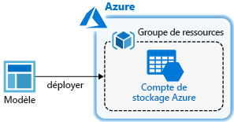
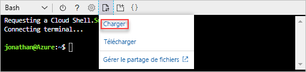
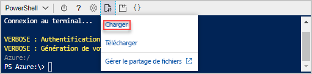

# <a name="quickstart-create-arm-templates-by-using-visual-studio-code"></a>Démarrage rapide : Créer des modèles ARM à l’aide de Visual Studio Code

Découvrez comment utiliser Visual Studio Code et l’extension Outils Azure Resource Manager pour créer et modifier des modèles ARM (Azure Resource Manager). Vous pouvez créer des modèles ARM dans Visual Studio Code sans l’extension, mais celle-ci fournit des options d’autocomplétion qui simplifient le développement de modèles. Pour comprendre les concepts associés au déploiement et à la gestion de vos solutions Azure, consultez [Vue d’ensemble du déploiement de modèles](overview.md).

Dans ce guide de démarrage rapide, vous déployez un compte de stockage :



Si vous ne disposez pas d’abonnement Azure, créez un [compte gratuit](https://azure.microsoft.com/free/) avant de commencer.

## <a name="prerequisites"></a>Prérequis

Pour effectuer ce qui est décrit dans cet article, vous avez besoin des éléments suivants :

- [Visual Studio Code](https://code.visualstudio.com/).
- Extension Outils Azure Resource Manager. Pour l’installer, procédez comme suit :

    1. Ouvrez Visual Studio Code.
    2. Appuyez sur **CTRL + MAJ + X** pour ouvrir le volet Extensions
    3. Recherchez les **Outils Azure Resource Manager** et sélectionnez **Installer**.
    4. Pour terminer l’installation de l’extension, sélectionnez **Recharger**.

## <a name="open-a-quickstart-template"></a>Ouvrir un modèle de démarrage rapide

Au lieu de créer un modèle à partir de zéro, ouvrez un modèle à partir de [Modèles de démarrage rapide Azure](https://azure.microsoft.com/resources/templates/). Le dépôt Modèles de démarrage rapide Azure contient les modèles ARM.

Le modèle utilisé dans ce démarrage rapide se nomme [Créer un compte de stockage standard](https://azure.microsoft.com/resources/templates/101-storage-account-create/). Le modèle définit une ressource de compte de stockage Azure.

1. À partir de Visual Studio Code, sélectionnez **Fichier**>**Ouvrir un fichier**.
2. Collez l’URL suivante dans **Nom de fichier** :

    ```url
    https://raw.githubusercontent.com/Azure/azure-quickstart-templates/master/101-storage-account-create/azuredeploy.json
    ```

3. Sélectionnez **Ouvrir** pour ouvrir le fichier.
4. Sélectionnez **Fichier**>**Enregistrer sous** pour enregistrer le fichier sous le nom **azuredeploy.json** sur votre ordinateur local.

## <a name="edit-the-template"></a>Modifier le modèle

Pour tester la modification d’un modèle à l’aide de Visual Studio Code, vous pouvez ajouter un élément à la section `outputs` pour afficher l’URI de stockage.

1. Ajoutez une sortie supplémentaire au modèle exporté :

    ```json
    "storageUri": {
      "type": "string",
      "value": "[reference(variables('storageAccountName')).primaryEndpoints.blob]"
    }
    ```

    Lorsque vous avez terminé, la section des sorties ressemble à ce qui suit :

    ```json
    "outputs": {
      "storageAccountName": {
        "type": "string",
        "value": "[variables('storageAccountName')]"
      },
      "storageUri": {
        "type": "string",
        "value": "[reference(variables('storageAccountName')).primaryEndpoints.blob]"
      }
    }
    ```

    Si vous avez copié et collé le code dans Visual Studio Code, essayez de retaper l’élément **valeur** pour profiter de la fonctionnalité IntelliSense de l’extension Outils Resource Manager.

    

2. Sélectionnez **Fichier**>**Enregistrer** pour enregistrer le fichier.

## <a name="deploy-the-template"></a>Déployer le modèle

Il existe de nombreuses méthodes pour déployer des modèles. Dans ce démarrage rapide, vous utilisez Azure Cloud Shell. Cloud Shell prend en charge Azure CLI et Azure PowerShell. Utilisez le sélecteur d’onglets pour choisir entre l’interface CLI et PowerShell.

[!INCLUDE [updated-for-az](../../../includes/updated-for-az.md)]

1. Se connecter à [Azure Cloud Shell](https://shell.azure.com)

2. Choisissez votre environnement préféré en sélectionnant **PowerShell** ou **Bash** (CLI) en haut à gauche.  Il est nécessaire de redémarrer l’interpréteur de commandes lors d’un tel changement.

    # <a name="cli"></a>[INTERFACE DE LIGNE DE COMMANDE](#tab/CLI)

    

    # <a name="powershell"></a>[PowerShell](#tab/PowerShell)

    

    ---

3. Sélectionnez **Charger/Télécharger des fichiers**, puis **Charger**.

    # <a name="cli"></a>[INTERFACE DE LIGNE DE COMMANDE](#tab/CLI)

    

    # <a name="powershell"></a>[PowerShell](#tab/PowerShell)

    

    ---

    Sélectionnez le fichier que vous avez enregistré dans la section précédente. Le nom par défaut est **azuredeploy.json**. Le fichier de modèle doit être accessible à partir de l’interpréteur de commandes.

    Vous pouvez éventuellement utiliser la commande **ls** et la commande **cat** pour vérifier que le fichier est bien chargé.

    # <a name="cli"></a>[INTERFACE DE LIGNE DE COMMANDE](#tab/CLI)

    

    # <a name="powershell"></a>[PowerShell](#tab/PowerShell)

    

    ---
4. Dans le Cloud Shell exécutez les commandes suivantes. Sélectionnez l’onglet pour afficher le code PowerShell ou CLI.

    # <a name="cli"></a>[INTERFACE DE LIGNE DE COMMANDE](#tab/CLI)

    ```azurecli
    echo "Enter a project name that is used to generate resource group name:" &&
    read projectName &&
    echo "Enter the location (i.e. centralus):" &&
    read location &&
    resourceGroupName="${projectName}rg" &&
    az group create --name $resourceGroupName --location "$location" &&
    az deployment group create --resource-group $resourceGroupName --template-file "$HOME/azuredeploy.json"
    ```

    # <a name="powershell"></a>[PowerShell](#tab/PowerShell)

    ```azurepowershell
    $projectName = Read-Host -Prompt "Enter a project name that is used to generate resource group name"
    $location = Read-Host -Prompt "Enter the location (i.e. centralus)"
    $resourceGroupName = "${projectName}rg"

    New-AzResourceGroup -Name $resourceGroupName -Location "$location"
    New-AzResourceGroupDeployment -ResourceGroupName $resourceGroupName -TemplateFile "$HOME/azuredeploy.json"
    ```

    ---

    Mettez à jour le nom de fichier du modèle si vous enregistrez le fichier avec un nom autre que **azuredeploy.json**.

    La capture d'écran ci-dessous représente un exemple de déploiement :

    # <a name="cli"></a>[INTERFACE DE LIGNE DE COMMANDE](#tab/CLI)

    

    # <a name="powershell"></a>[PowerShell](#tab/PowerShell)

    

    ---

    Le nom du compte de stockage et l’URL de stockage dans la section des sorties sont mis en surbrillance sur la capture d’écran. Vous aurez besoin du nom du compte de stockage à l’étape suivante.

5. Exécutez la commande PowerShell ou CLI suivante pour lister les comptes de stockage nouvellement créés :

    # <a name="cli"></a>[INTERFACE DE LIGNE DE COMMANDE](#tab/CLI)

    ```azurecli
    echo "Enter the Resource Group name:" &&
    read resourceGroupName &&
    echo "Enter the Storage Account name:" &&
    read storageAccountName &&
    az storage account show --resource-group $resourceGroupName --name $storageAccountName
    ```

    # <a name="powershell"></a>[PowerShell](#tab/PowerShell)

    ```azurepowershell
    $resourceGroupName = Read-Host -Prompt "Enter the Resource Group name"
    $storageAccountName = Read-Host -Prompt "Enter the Storage Account name"
    Get-AzStorageAccount -ResourceGroupName $resourceGroupName -Name $storageAccountName
    ```

    ---

Pour plus d’informations sur l’utilisation des comptes de stockage Azure, consultez [Démarrage rapide : Charger, télécharger et lister des objets blob à l’aide du portail Azure](../../storage/blobs/storage-quickstart-blobs-portal.md).

## <a name="clean-up-resources"></a>Nettoyer les ressources

Lorsque vous n’en avez plus besoin, nettoyez les ressources Azure que vous avez déployées en supprimant le groupe de ressources.

1. Dans le portail Azure, sélectionnez **Groupe de ressources** dans le menu de gauche.
2. Entrez le nom du groupe de ressources dans le champ **Filtrer par nom**.
3. Sélectionnez le nom du groupe de ressources.  Vous devriez voir six ressources au total dans le groupe de ressources.
4. Sélectionnez **Supprimer le groupe de ressources** dans le menu supérieur.

## <a name="next-steps"></a>Étapes suivantes

Le principal objectif de ce guide de démarrage rapide est d’utiliser Visual Studio Code pour modifier un modèle existant à partir de modèles de démarrage rapide Azure. Vous avez également appris à déployer le modèle à l’aide de l’interface CLI ou de PowerShell à partir d’Azure Cloud Shell. Il est possible que les modèles tirés des modèles de démarrage ne vous apportent pas tout ce dont vous avez besoin. Pour en savoir plus sur le développement de modèles, consultez notre nouvelle série de tutoriels pour les débutants :

> [!div class="nextstepaction"]
> [Tutoriels pour les débutants](./template-tutorial-create-first-template.md)
