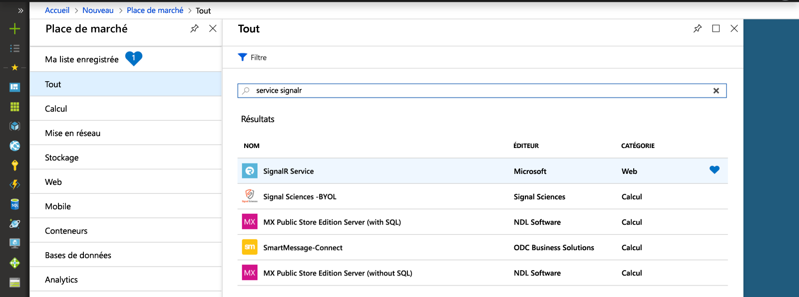
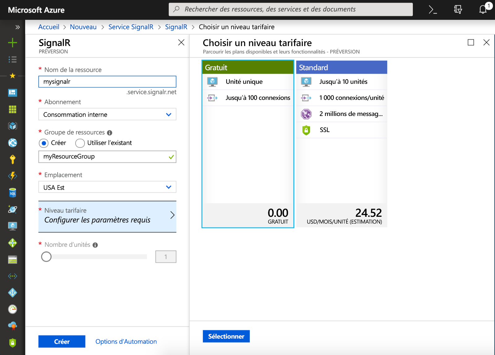

## Créer une instance de service SignalR Azure

Votre application se connectera à l’instance de service SignalR dans Azure.

1. Cliquez sur le bouton Nouveau dans le coin supérieur gauche du portail Azure. À l’écran Nouveau, tapez *Service SignalR* dans la zone de recherche et appuyez sur Entrée.

    

1. Sélectionnez **Service SignalR** dans les résultats de la recherche, puis **Créer**.

1. Entrez les paramètres suivants.

    | Paramètre      | Valeur suggérée  | Description                                        |
    | ------------ |  ------- | -------------------------------------------------- |
    | **Nom de la ressource** | Nom globalement unique | Le nom qui identifie votre nouvelle instance de service SignalR. Les caractères valides sont `a-z`, `0-9` et `-`.  | 
    | **Abonnement** | Votre abonnement | L’abonnement sous lequel cette nouvelle instance de service SignalR est créée. | 
    | **[Groupe de ressources](../../azure-resource-manager/management/overview.md)** |  myResourceGroup | Le nom du nouveau groupe de ressources dans lequel créer l’instance de service SignalR. | 
    | **Lieu** | USA Ouest | Sélectionnez une [région](https://azure.microsoft.com/regions/) proche de chez vous. |
    | **Niveau tarifaire** | Gratuit | Essayez gratuitement le service Azure SignalR. |
    | **Nombre d’unité** |  Non applicable | Le nombre d’unité spécifie le nombre de connexion que votre instance de service SignalR peut accepter. Ceci n’est configurable que dans le niveau Standard. |
    | **Mode de service** |  Sans serveur | À utiliser avec Azure Functions ou l’API REST. |

    

1. Sélectionnez **Créer** pour commencer le déploiement de l’instance de service SignalR.

1. Une fois l’instance déployée, ouvrez-la dans le portail, puis recherchez sa page Paramètres. Définissez le paramètre Mode de service sur *Serverless* seulement si vous utilisez Azure SignalR Service par le biais de la liaison Azure Functions ou de l’API REST. Sinon, laissez-le sur *Classique* ou *Par défaut*.