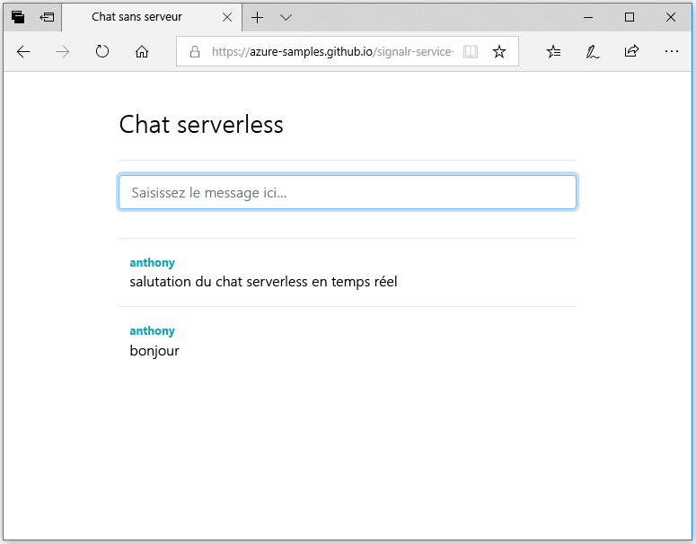

## <a name="run-the-web-application"></a>Exécuter l’application web

1. Pour simplifier le test de vos clients, ouvrez votre navigateur sur notre exemple d’application web monopage [https://azure-samples.github.io/signalr-service-quickstart-serverless-chat/demo/chat-v2/](https://azure-samples.github.io/signalr-service-quickstart-serverless-chat/demo/chat-v2/). 

    > [!NOTE]
    > La source du fichier HTML est située dans [/docs/demo/chat-v2/index.html](https://github.com/Azure-Samples/signalr-service-quickstart-serverless-chat/blob/master/docs/demo/chat-v2/index.html). Par ailleurs, si vous voulez héberger le HTML vous-même, démarrez un serveur HTTP local de type [http-server](https://www.npmjs.com/package/http-server) dans le répertoire */docs/demo/chat-v2*. Vérifiez que l’origine est ajoutée au paramètre `CORS` dans *local.settings.json* comme dans l’exemple.
    > 
    > ```javascript
    > "Host": {
    >  "LocalHttpPort": 7071,
    >  "CORS": "http://localhost:8080,https://azure-samples.github.io",
    >  "CORSCredentials": true
    > }
    >
    > ```

1. Lorsque vous êtes invité à renseigner l’URL de base de l’application de fonction, indiquez `http://localhost:7071`.

1. Saisissez un nom d’utilisateur lorsque vous y êtes invité.

1. L’application web appelle la fonction *GetSignalRInfo* dans l’application de fonction afin de récupérer les informations de connexion nécessaires pour se connecter au service Azure SignalR. Une fois la connexion effectuée, la boîte de discussion s’affiche.

1. Tapez un message puis appuyez sur Entrée. L’application envoie le message à la fonction *SendMessage* dans l’application Azure Function, qui se sert ensuite de la liaison de sortie SignalR pour diffuser le message à tous les clients connectés. Si tout fonctionne normalement, le message doit s’afficher dans l’application.

    

1. Ouvrez une autre instance de l’application web dans une fenêtre de navigation différente. Vous verrez que tous les messages envoyés s’affichent dans toutes les instances de l’application.
