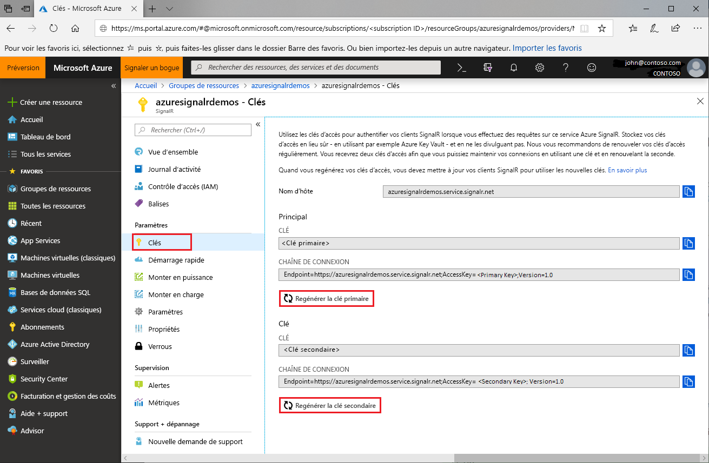

# Rotation des clés d’accès pour Azure SignalR Service

Chaque instance Azure SignalR Service a une paire de clés d’accès appelées clé primaire et clé secondaire. Ces clés servent à authentifier les clients SignalR au moment des demandes au service. Les clés sont associées à l’URL du point de terminaison de l’instance. Protégez vos clés et changez-les régulièrement. Vous disposez de deux clés d’accès, ce qui signifie que vous pouvez maintenir des connexions à l’aide d’une clé pendant que vous regénérez l’autre clé.

## Pourquoi regénérer les clés d’accès ?

Pour des raisons de sécurité et de conformité, vous devez changer régulièrement vos clés d’accès.

## Regénération de clés d'accès

1. Accédez au [portail Azure ](https://portal.azure.com/) et connectez-vous à l’aide de vos informations d’identification.

1. Recherchez la section **Clés** dans l’instance Azure SignalR Service avec les clés à regénérer.

1. Sélectionnez **Clés** dans le menu de navigation.

1. Sélectionnez **Régénérer la clé primaire** ou **Régénérer la clé secondaire**.

   Une nouvelle clé est créée et s’affiche avec la chaîne de connexion correspondante.

   

Vous pouvez également regénérer les clés à l’aide d’[Azure CLI](/cli/azure/ext/signalr/signalr/key?view=azure-cli-latest#ext-signalr-az-signalr-key-renew).

## Mettre à jour les configurations avec les nouvelles chaînes de connexion

1. Copiez la chaîne de connexion que vous venez de générer.

1. Mettez à jour toutes les configurations pour utiliser la nouvelle chaîne de connexion.

1. Redémarrez l’application si besoin.

## Regénération forcée des clés d’accès

Azure SignalR Service peut imposer une regénération des clés d’accès dans certaines situations. Le service en informe alors les clients par e-mail et via une notification sur le portail. Si vous recevez ce message ou si vous rencontrez un problème de clé d’accès au niveau du service, regénérez les clés en suivant ce guide.

## Étapes suivantes

Changez régulièrement les clés d’accès pour des raisons de sécurité.

Ce guide vous a expliqué comment regénérer des clés d’accès. Passez aux didacticiels suivants pour en savoir plus sur l’authentification avec OAuth ou Azure Functions.

> [!div class="nextstepaction"]
> [Intégrer avec une identité ASP.NET Core](./signalr-authenticate-oauth.md)

> [!div class="nextstepaction"]
> [Générer une application serverless en temps réel avec l’authentification](./signalr-authenticate-azure-functions.md)