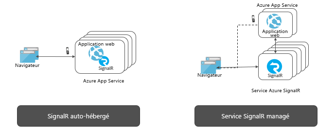

# Qu’est-ce que le service Azure SignalR ?

Le service Azure SignalR simplifie le processus d’ajout de fonctionnalités web en temps réel aux applications par HTTP. Cette fonctionnalité en temps réel permet au service d’envoyer des mises à jour de contenu aux clients connectés, comme une application web ou mobile monopage. Par conséquent, les clients sont mis à jour sans avoir à interroger le serveur ni à envoyer de nouvelles requêtes HTTP de mise à jour.

Cet article fournit une vue d’ensemble du service Azure SignalR.

## À quoi sert le service Azure SignalR ?

Tout scénario qui nécessite l’envoi (push) de données du serveur au client en temps réel peut utiliser Azure SignalR Service.

Les fonctionnalités temps réel traditionnelles souvent interrogées par le serveur peuvent également utiliser le service Azure SignalR Service.

Azure SignalR Service a été utilisé dans un large éventail de secteurs d’activité, pour tout type d’application nécessitant des mises à jour de contenu en temps réel. Voici quelques exemples d’utilisation d’Azure SignalR Service :

* **Mises à jour haute fréquence de données :** jeux, votes, sondages, enchères.
* **Tableaux de bord et surveillance :** tableau de bord d’entreprise, données des marchés financiers, mise à jour instantanée des ventes, tableau de bord multijoueurs et surveillance IoT.
* **Conversation :** visioconférence, bot conversationnel, support technique en ligne, assistant d’achat en temps réel, messagerie instantanée, conversation intégrée à un jeu, entre autres.
* **Localisation en temps réel sur une carte :** suivi logistique, suivi de l’état de livraison, mises à jour sur l’état de la circulation, applications GPS.
* **Publicités ciblées en temps réel :** publicités et offres push en temps réel personnalisées, publicités interactives.
* **Applications collaboratives :** rédaction conjointe, applications de tableau blanc et logiciels de réunion d’équipe.
* **Notifications Push :** réseau social, e-mail, jeux, alertes de voyage.
* **Diffusion en temps réel :** diffusion audio/vidéo en direct, sous-titrage en direct, traduction, diffusion d’événements/d’actualités.
* **IoT et appareils connectés :** mesures IoT en temps réel, contrôle à distance, statut en temps réel et suivi de localisation.
* **Automatisation :** déclenchement en temps réel à partir d’événements en amont.

## Quels sont les avantages de l’utilisation d’Azure SignalR Service ?

**Produit basé sur des normes :**

SignalR offre une abstraction sur de nombreuses techniques utilisées pour créer des applications web en temps réel. [WebSocket](https://wikipedia.org/wiki/WebSocket) est le mécanisme de transport optimal, mais d’autres techniques comme [SSE (Server-Sent Events)](https://wikipedia.org/wiki/Server-sent_events) et le Long Polling sont utilisées lorsque les autres options ne sont pas disponibles. SignalR détecte automatiquement et initialise le mode de transport adapté en fonction des fonctionnalités prises en charge sur le serveur et le client.

**Prise en charge native d’ASP.NET Core :**

SignalR Service offre une expérience de programmation native avec ASP.NET Core et ASP.NET. Des efforts minimes sont requis pour le développement d’une nouvelle application SignalR avec SignalR Service ou la migration d’une application existante basée sur SignalR vers SignalR Service.
SignalR Service prend également en charge la nouvelle fonctionnalité d’ASP.NET Core, Blazor côté serveur.

**Prise en charge étendue des clients :**

SignalR Service fonctionne avec un large éventail de clients, tels que les navigateurs Web et mobiles, les applications de bureau, les applications mobiles, les processus serveur, les appareils IoT et les consoles de jeu. SignalR Service propose des kits de développement logiciel dans des langues différentes. En plus des SDK natifs ASP.NET Core ou ASP.NET C#, SignalR Service fournit le SDK client JavaScript, pour activer les clients Web, ainsi que de nombreux frameworks JavaScript. Le SDK client Java est également pris en charge pour les applications Java, y compris les applications natives Android. SignalR Service prend en charge l’API REST et la technologie serverless en intégrant Azure Functions et Event Grid.

**Gérer les connexions client à grande échelle :**

SignalR Service est conçu pour les applications temps réel à grande échelle. SignalR Service permet à plusieurs instances de travailler ensemble pour s’adapter à des millions de connexions client. Le service prend également en charge de multiples régions globale pour le partitionnement, la haute disponibilité ou la récupération d’urgence.

**Supprimer la nécessité d’auto-héberger SignalR :**

Comparé aux applications SignalR hébergées par l’utilisateur, le passage à SignalR Service prend en charge les fonds de panier qui gèrent les ajustements et les connexions client. Le service entièrement géré simplifie également les applications web et réduit les coûts d’hébergement. SignalR Service offre un centre de données et un réseau de classe mondiale, s’adapte à des millions de connexions, respecte un contrat de niveau de service, tout en assurant la conformité et la sécurité au standard Azure.

**Offrir des API riches pour des modèles de messagerie différents :**

SignalR Service permet au serveur d’envoyer des messages à une connexion en particulier, à toutes les connexions ou à un sous-ensemble de connexions appartenant à un utilisateur spécifique ou qui ont été placées dans un groupe arbitraire.

## Comment utiliser le service Azure SignalR

Il existe de nombreuses façons de programmer avec Azure SignalR Service, comme le montrent les exemples répertoriés ici :

- **[Mettre à l’échelle une application ASP.NET Core SignalR](signalr-concept-scale-aspnet-core.md)** : intégrez un service Azure SignalR à une application ASP.NET Core SignalR pour augmenter la taille des instances à des centaines de milliers de connexions.
- **[Générer des applications en temps réel serverless](signalr-concept-azure-functions.md)** : utilisez l’intégration d’Azure Functions au service Azure SignalR pour générer des applications en temps réel serverless dans des langages tels que JavaScript, C# et Java.
- **[Envoyer des messages à partir du serveur aux clients via l’API REST](https://github.com/Azure/azure-signalr/blob/dev/docs/rest-api.md)** : le service Azure SignalR fournit l’API REST pour permettre aux applications de publier des messages aux clients connectés au service SignalR, dans n’importe quel langage de programmation compatible avec REST.
