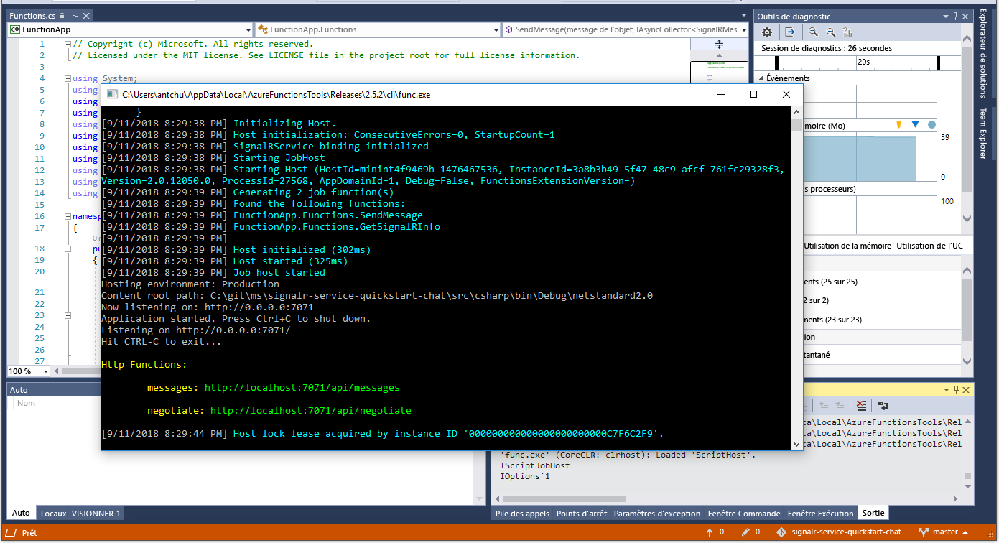

# <a name="quickstart-create-a-chat-room-with-azure-functions-and-signalr-service-using-c"></a>Démarrage rapide : Créer une salle de conversation avec Azure Functions et le service SignalR avec C\#

Le service Azure SignalR vous permet d’ajouter facilement des fonctionnalités en temps réel à votre application. Azure Functions est une plateforme serverless qui vous permet d’exécuter votre code sans gérer d’infrastructures. Dans ce démarrage rapide, découvrez comment utiliser le service SignalR et Functions pour générer une application serverless de conversation en temps réel.

## <a name="prerequisites"></a>Prérequis

Si vous n’avez pas encore installé Visual Studio 2019, vous pouvez télécharger et utiliser la version **gratuite** [Visual Studio 2019 Community Edition](https://www.visualstudio.com/downloads). Veillez à activer **le développement Azure** lors de l’installation de Visual Studio.

Vous pouvez également exécuter ce tutoriel sur une ligne de commande (macOS, Windows ou Linux) à l’aide d’[Azure Functions Core Tools (v2)](https://github.com/Azure/azure-functions-core-tools#installing), du [SDK .NET Core](https://dotnet.microsoft.com/download) et de votre éditeur de code favori.

Si vous n’avez pas d’abonnement Azure, [créez-en un gratuitement](https://azure.microsoft.com/free/dotnet) avant de commencer.

[Vous rencontrez des problèmes ? Faites-le nous savoir.](https://aka.ms/asrs/qscsharp)

## <a name="log-in-to-azure"></a>Connexion à Azure

Connectez-vous au portail Azure sur <https://portal.azure.com/> avec votre compte Azure.

[Vous rencontrez des problèmes ? Faites-le nous savoir.](https://aka.ms/asrs/qscsharp)

[!INCLUDE [Create instance](includes/signalr-quickstart-create-instance.md)]

[Vous rencontrez des problèmes ? Faites-le nous savoir.](https://aka.ms/asrs/qscsharp)

[!INCLUDE [Clone application](includes/signalr-quickstart-clone-application.md)]

[Vous rencontrez des problèmes ? Faites-le nous savoir.](https://aka.ms/asrs/qscsharp)

## <a name="configure-and-run-the-azure-function-app"></a>Configurer et exécuter l’application de fonction Azure

1. Démarrez Visual Studio (ou un autre éditeur de code), puis ouvrez la solution dans le dossier *src/chat/csharp* du référentiel cloné.

1. Dans le navigateur dans lequel le portail Azure est ouvert, vérifiez que l’instance du service SignalR que vous avez déployée précédemment a bien été créée en recherchant son nom dans la zone de recherche en haut du portail. Sélectionnez l’instance pour l’ouvrir.

    

1. Sélectionnez **Clés** pour afficher les chaînes de connexion de l’instance du service SignalR.

1. Sélectionnez et copiez la chaîne de connexion principale.

1. De retour dans Visual Studio - **Explorateur de solutions**, renommez *local.settings.sample.json* en *local.settings.json*.

1. Dans le fichier *local.settings.json*, collez la chaîne de connexion dans la valeur du paramètre **AzureSignalRConnectionString**. Enregistrez le fichier .

1. Ouvrez *Functions.cs*. Il existe deux fonctions déclenchées par HTTP dans cette application de fonction :

    - **GetSignalRInfo** : utilise la liaison d’entrée `SignalRConnectionInfo` pour générer et retourner des informations de connexion valides.
    - **SendMessage** : reçoit un message de conversation dans le corps de la demande et utilise la liaison de sortie *SignalR* pour diffuser le message à toutes les applications clientes connectées.

1. Utilisez une des options suivantes pour démarrer l’application Azure Function localement.

    - **Visual Studio** : Dans le menu *Déboguer*, sélectionnez *Démarrer le débogage* pour exécuter l’application.

        

    - **Ligne de commande** : Pour démarrer l’hôte de la fonction, exécutez la commande suivante.

        ```bash
        func start
        ```
[Vous rencontrez des problèmes ? Faites-le nous savoir.](https://aka.ms/asrs/qscsharp)

[!INCLUDE [Run web application](includes/signalr-quickstart-run-web-application.md)]

[Vous rencontrez des problèmes ? Faites-le nous savoir.](https://aka.ms/asrs/qscsharp)

[!INCLUDE [Cleanup](includes/signalr-quickstart-cleanup.md)]

[Vous rencontrez des problèmes ? Faites-le nous savoir.](https://aka.ms/asrs/qscsharp)

## <a name="next-steps"></a>Étapes suivantes

Dans ce démarrage rapide, vous avez généré et exécuté une application serverless en temps réel dans Visual Studio. Découvrez ensuite comment développer et déployer Azure Functions avec Visual Studio.

> [!div class="nextstepaction"]
> [Développer des fonctions Azure à l’aide de Visual Studio](../azure-functions/functions-develop-vs.md)

[Vous rencontrez des problèmes ? Faites-le nous savoir.](https://aka.ms/asrs/qscsharp)
