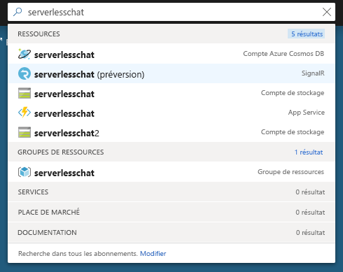
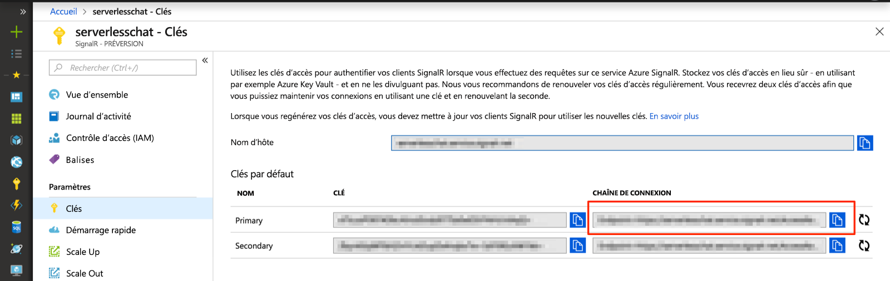

# <a name="quickstart-use-java-to-create-a-chat-room-with-azure-functions-and-signalr-service"></a>Démarrage rapide : Utiliser Java pour créer une salle de conversation avec Azure Functions et le service SignalR

Azure SignalR Service vous permet d’ajouter facilement des fonctionnalités en temps réel à votre application, et Azure Functions est une plateforme serverless qui vous permet d’exécuter votre code sans gérer d’infrastructure. Dans ce démarrage rapide, vous allez utiliser Java pour générer une application serverless de conversation en temps réel en utilisant SignalR Service et Functions.

## <a name="prerequisites"></a>Prérequis

- Un éditeur de code, comme [Visual Studio Code](https://code.visualstudio.com/).
- Compte Azure avec un abonnement actif. [Créez un compte gratuitement](https://azure.microsoft.com/free/?ref=microsoft.com&utm_source=microsoft.com&utm_medium=docs&utm_campaign=visualstudio).
- [Azure Functions Core Tools](https://github.com/Azure/azure-functions-core-tools#installing). Sert à exécuter les applications Azure Functions localement.

   > [!NOTE]
   > Les liaisons SignalR Service nécessaires dans Java sont uniquement prises en charge dans Azure Function Core Tools version 2.4.419 (version d’hôte 2.0.12332) ou supérieure.

   > [!NOTE]
   > Pour installer des extensions, Azure Functions Core Tools nécessite l’installation du kit [SDK .NET Core](https://www.microsoft.com/net/download). Toutefois, aucune connaissance de .NET n’est requise pour générer des applications de fonction Azure JavaScript.

- [Java Developer Kit (JDK)](https://www.azul.com/downloads/zulu/), version 8
- [Apache Maven](https://maven.apache.org), version 3.0 ou ultérieure

> [!NOTE]
> Ce démarrage rapide peut être exécuté sur macOS, Windows ou Linux.

Vous rencontrez des problèmes ? Essayez le [guide de résolution des problèmes](signalr-howto-troubleshoot-guide.md) ou [faites-le nous savoir](https://aka.ms/asrs/qsjava).

## <a name="log-in-to-azure"></a>Connexion à Azure

Connectez-vous au portail Azure sur <https://portal.azure.com/> avec votre compte Azure.

Vous rencontrez des problèmes ? Essayez le [guide de résolution des problèmes](signalr-howto-troubleshoot-guide.md) ou [faites-le nous savoir](https://aka.ms/asrs/qsjava).

[!INCLUDE [Create instance](includes/signalr-quickstart-create-instance.md)]

Vous rencontrez des problèmes ? Essayez le [guide de résolution des problèmes](signalr-howto-troubleshoot-guide.md) ou [faites-le nous savoir](https://aka.ms/asrs/qsjava).

[!INCLUDE [Clone application](includes/signalr-quickstart-clone-application.md)]

Vous rencontrez des problèmes ? Essayez le [guide de résolution des problèmes](signalr-howto-troubleshoot-guide.md) ou [faites-le nous savoir](https://aka.ms/asrs/qsjava).

## <a name="configure-and-run-the-azure-function-app"></a>Configurer et exécuter l’application de fonction Azure

1. Dans le navigateur dans lequel le portail Azure est ouvert, vérifiez que l’instance du service SignalR que vous avez déployée précédemment a bien été créée en recherchant son nom dans la zone de recherche en haut du portail. Sélectionnez l’instance pour l’ouvrir.

    

1. Sélectionnez **Clés** pour afficher les chaînes de connexion de l’instance du service SignalR.

1. Sélectionnez et copiez la chaîne de connexion principale.

    

1. Dans votre éditeur de code, ouvrez le dossier *src/chat/java* dans le référentiel cloné.

1. Renommez *local.settings.sample.json* en *local.settings.json*.

1. Dans le fichier **local.settings.json**, collez la chaîne de connexion dans la valeur du paramètre **AzureSignalRConnectionString**. Enregistrez le fichier .

1. Le fichier principal contenant les fonctions se trouve dans *src/chat/java/src/main/java/com/function/Functions.java* :

    - **negotiate** : utilise la liaison d’entrée *SignalRConnectionInfo* pour générer et retourner des informations de connexion valides.
    - **sendMessage** : reçoit un message de conversation dans le corps de la demande et utilise la liaison de sortie *SignalR* pour diffuser le message à toutes les applications clientes connectées.

1. Dans le terminal, vérifiez que vous vous trouvez dans le dossier *src/chat/java*. Créez l’application de fonction.

    ```bash
    mvn clean package
    ```

1. Exécutez l’application de fonction localement.

    ```bash
    mvn azure-functions:run
    ```
    
Vous rencontrez des problèmes ? Essayez le [guide de résolution des problèmes](signalr-howto-troubleshoot-guide.md) ou [faites-le nous savoir](https://aka.ms/asrs/qsjava).

[!INCLUDE [Run web application](includes/signalr-quickstart-run-web-application.md)]

Vous rencontrez des problèmes ? Essayez le [guide de résolution des problèmes](signalr-howto-troubleshoot-guide.md) ou [faites-le nous savoir](https://aka.ms/asrs/qsjava).

[!INCLUDE [Cleanup](includes/signalr-quickstart-cleanup.md)]

Vous rencontrez des problèmes ? Essayez le [guide de résolution des problèmes](signalr-howto-troubleshoot-guide.md) ou [faites-le nous savoir](https://aka.ms/asrs/qsjava).

## <a name="next-steps"></a>Étapes suivantes

Dans ce démarrage rapide, vous avez généré et exécuté une application serverless en temps réel à l’aide de Maven. Ensuite, découvrez comment créer des fonctions Azure Java à partir de rien.

> [!div class="nextstepaction"]
> [Créer votre première fonction avec Java et Maven](../azure-functions/functions-create-first-azure-function-azure-cli.md?pivots=programming-language-java%252cprogramming-language-java)
