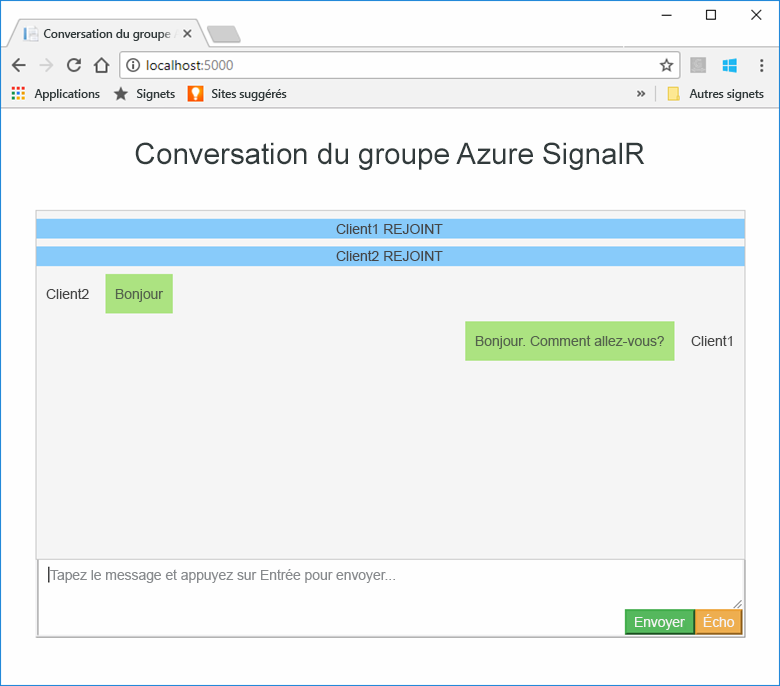
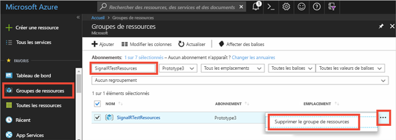

# <a name="quickstart-create-a-chat-room-by-using-signalr-service"></a>Démarrage rapide : Créer une salle de conversation à l'aide de SignalR Service

Azure SignalR Service est un service Azure qui permet aux développeurs de créer facilement des applications web avec des fonctionnalités en temps réel. Initialement, ce service était basé sur [SignalR pour ASP.NET Core 2.1](/aspnet/core/signalr/introduction?preserve-view=true&view=aspnetcore-2.1), mais il prend désormais en charge les versions ultérieures.

Cet article explique comment démarrer avec Azure SignalR Service. Dans ce guide de démarrage rapide, vous allez créer une application de conversation à l'aide d'une application web MVC ASP.NET Core. Cette application établira une connexion avec votre ressource Azure SignalR Service pour activer les mises à jour de contenu en temps réel. Vous hébergerez l'application web localement et vous connecterez à plusieurs clients de navigateur. Chaque client pourra envoyer (push) les mises à jour de contenus à tous les autres clients. 

Vous pouvez utiliser l’éditeur de code de votre choix pour exécuter les étapes de ce démarrage rapide. L'option [Visual Studio Code](https://code.visualstudio.com/) est disponible sur les plateformes Windows, macOS et Linux.

Le code de ce didacticiel est disponible au téléchargement dans le [référentiel AzureSignalR-samples GitHub](https://github.com/aspnet/AzureSignalR-samples/tree/master/samples/ChatRoom). Vous pouvez également créer les ressources Azure utilisées dans ce guide de démarrage rapide en suivant la section [Créer un script SignalR Service](scripts/signalr-cli-create-service.md).

[!INCLUDE [quickstarts-free-trial-note](../../includes/quickstarts-free-trial-note-dotnet.md)]

## <a name="prerequisites"></a>Prérequis

* Installez le [kit de développement logiciel (SDK) .NET Core](https://www.microsoft.com/net/download/windows).
* Télécharger ou cloner le référentiel GitHub [AzureSignalR-sample](https://github.com/aspnet/AzureSignalR-samples). 

Vous rencontrez des problèmes ? Essayez le [guide de résolution des problèmes](signalr-howto-troubleshoot-guide.md) ou [faites-le nous savoir](https://aka.ms/asrs/qsnetcore).

## <a name="create-an-azure-signalr-resource"></a>Créer une ressource Azure SignalR

[!INCLUDE [azure-signalr-create](../../includes/signalr-create.md)]

Vous rencontrez des problèmes ? Essayez le [guide de résolution des problèmes](signalr-howto-troubleshoot-guide.md) ou [faites-le nous savoir](https://aka.ms/asrs/qsnetcore).

## <a name="create-an-aspnet-core-web-app"></a>Créez une application web ASP.NET Core

Dans cette section, vous allez utiliser l'[interface de ligne de commande (CLI) .NET Core](/dotnet/core/tools/) pour créer un projet d'application web MVC ASP.NET Core. Par rapport à Visual Studio, l’interface CLI .NET Core offre l’avantage d’être disponible sur les plateformes Windows, macOS et Linux. 

1. Créez un dossier pour votre projet. Ce guide de démarrage rapide utilise le dossier *E:\Testing\chattest*.

2. Dans le nouveau dossier, exécutez la commande suivante pour créer le projet :

    ```dotnetcli
    dotnet new mvc
    ```

Vous rencontrez des problèmes ? Essayez le [guide de résolution des problèmes](signalr-howto-troubleshoot-guide.md) ou [faites-le nous savoir](https://aka.ms/asrs/qsnetcore).

## <a name="add-secret-manager-to-the-project"></a>Ajouter Secret Manager au projet

Dans cette section, vous allez ajouter l'[outil Secret Manager](/aspnet/core/security/app-secrets) à votre projet. L'outil Secret Manager stocke les données sensibles des travaux de développement à l'extérieur de l'arborescence de votre projet. Cette approche empêche le partage accidentel des secrets d'une application au sein du code source.

1. Ouvrez votre fichier *.csproj*. Ajoutez un élément `DotNetCliToolReference` afin d’inclure *Microsoft.Extensions.SecretManager.Tools*. Ajoutez également un élément `UserSecretsId` comme indiqué dans le code suivant pour *chattest.csproj*, et enregistrez le fichier.

    ```xml
    <Project Sdk="Microsoft.NET.Sdk.Web">

    <PropertyGroup>
        <TargetFramework>netcoreapp3.1</TargetFramework>
        <UserSecretsId>SignalRChatRoomEx</UserSecretsId>
    </PropertyGroup>

    <ItemGroup>
        <DotNetCliToolReference Include="Microsoft.VisualStudio.Web.CodeGeneration.Tools" Version="2.0.4" />
        <DotNetCliToolReference Include="Microsoft.Extensions.SecretManager.Tools" Version="2.0.2" />
    </ItemGroup>

    </Project>
    ```

Vous rencontrez des problèmes ? Essayez le [guide de résolution des problèmes](signalr-howto-troubleshoot-guide.md) ou [faites-le nous savoir](https://aka.ms/asrs/qsnetcore).

## <a name="add-azure-signalr-to-the-web-app"></a>Ajouter Azure SignalR à l’application web

1. Ajoutez une référence au package NuGet `Microsoft.Azure.SignalR` en exécutant la commande suivante :

    ```dotnetcli
    dotnet add package Microsoft.Azure.SignalR
    ```

2. Exécutez la commande suivante pour restaurer les packages de votre projet :

    ```dotnetcli
    dotnet restore
    ```

3. Ajoutez un secret nommé *Azure:SignalR:ConnectionString* à Secret Manager. 

    Ce secret contiendra la chaîne de connexion pour accéder à votre ressource SignalR Service. *Azure:SignalR:ConnectionString* est la clé de configuration par défaut recherchée par SignalR pour établir une connexion. Dans la commande suivante, remplacez la valeur par la chaîne de connexion de votre ressource SignalR Service.

    Vous devez exécuter cette commande dans le répertoire où se trouve le fichier *.csproj*.

    ```dotnetcli
    dotnet user-secrets set Azure:SignalR:ConnectionString "<Your connection string>"
    ```

    Secret Manager sera uniquement utilisé pour tester l'application web lorsque celle-ci est hébergée localement. Dans un prochain didacticiel, vous déploierez l'application web de conversation dans Azure. Une fois l'application web déployée dans Azure, vous utiliserez un paramètre d'application au lieu de stocker la chaîne de connexion avec Secret Manager.

    L'API de configuration permet d'accéder à ce secret. Avec l'API de configuration, un signe deux-points (:) fonctionne dans le nom de configuration sur toutes les plateformes prises en charge. Consultez [Configuration par environnement](/dotnet/core/extensions/configuration-providers#environment-variable-configuration-provider).


4. Ouvrez *Startup.cs* et mettez à jour la méthode `ConfigureServices` afin d’utiliser Azure SignalR Service en appelant les méthodes `AddSignalR()` et `AddAzureSignalR()` :

    ```csharp
    public void ConfigureServices(IServiceCollection services)
    {
        services.AddSignalR()
                .AddAzureSignalR();
    }
    ```

    En ne passant pas le paramètre à `AddAzureSignalR()`, ce code utilise la clé de configuration par défaut pour la chaîne de connexion de la ressource SignalR Service. La clé de configuration par défaut est *Azure:SignalR:ConnectionString*.

5. Dans *Startup.cs*, mettez à jour la méthode `Configure` en la remplaçant par le code suivant.

    ```csharp
    public void Configure(IApplicationBuilder app, IWebHostEnvironment env)
    {
        app.UseRouting();
        app.UseFileServer();
        app.UseEndpoints(endpoints =>
        {
            endpoints.MapHub<ChatHub>("/chat");
        });
    }
    ```

### <a name="add-a-hub-class"></a>Ajouter une classe de concentrateur

Dans SignalR, un concentrateur est un composant qui expose un ensemble de méthodes pouvant être appelées à partir du client. Dans cette section, vous définissez une classe de concentrateur avec deux méthodes :

* `Broadcast`: cette méthode envoie un message à tous les clients.
* `Echo`: cette méthode renvoie un message à l’appelant.

Ces deux méthodes utilisent l'interface `Clients` fournie par le kit de développement logiciel (SDK) SignalR ASP.NET Core. Cette interface vous permet d'accéder à tous les clients connectés pour envoyer (push) le contenu de votre choix à vos clients.

1. Dans le répertoire de votre projet, ajoutez un nouveau dossier nommé *Hub*. Ajoutez un nouveau fichier de code de hub nommé *ChatHub.cs* au nouveau dossier.

2. Ajoutez le code suivant au fichier *ChatHub.cs* pour définir votre classe de hub, puis enregistrez le fichier.

    Mettez à jour l'espace de noms de cette classe si vous avez utilisé un nom de projet autre que *SignalR.Mvc*.

    ```csharp
    using Microsoft.AspNetCore.SignalR;
    using System.Threading.Tasks;
    
    namespace SignalR.Mvc
    {
        public class ChatHub : Hub
        {
            public Task BroadcastMessage(string name, string message) =>
                Clients.All.SendAsync("broadcastMessage", name, message);
    
            public Task Echo(string name, string message) =>
                Clients.Client(Context.ConnectionId)
                       .SendAsync("echo", name, $"{message} (echo from server)");
        }
    }
    ```

### <a name="add-the-client-interface-for-the-web-app"></a>Ajouter l'interface du client de l'application web

L'interface utilisateur du client de cette application de salle de conversation sera composée d'éléments HTML et JavaScript enregistrés dans un fichier *index.html* figurant dans le répertoire *wwwroot*.

Copiez le fichier *css/site.css* situé dans le dossier *wwwroot* du [référentiel d'exemples](https://github.com/aspnet/AzureSignalR-samples/tree/master/samples/ChatRoom/wwwroot). Remplacez le fichier *css/site.css* de votre projet par celui que vous avez copié.

Voici le code principal du fichier *index.html* :

Créez un nouveau fichier *index.html* dans le répertoire *wwwroot*, puis copiez et collez le code HTML suivant dans le fichier nouvellement créé :

```html
<!DOCTYPE html>
<html>
<head>
    <link href="https://cdn.jsdelivr.net/npm/bootstrap@3.3.7/dist/css/bootstrap.min.css" rel="stylesheet" />
    <link href="css/site.css" rel="stylesheet" />
    <title>Azure SignalR Group Chat</title>
</head>
<body>
    <h2 class="text-center" style="margin-top: 0; padding-top: 30px; padding-bottom: 30px;">Azure SignalR Group Chat</h2>
    <div class="container" style="height: calc(100% - 110px);">
        <div id="messages" style="background-color: whitesmoke; "></div>
        <div style="width: 100%; border-left-style: ridge; border-right-style: ridge;">
            <textarea id="message"
                      style="width: 100%; padding: 5px 10px; border-style: hidden;"
                      placeholder="Type message and press Enter to send..."></textarea>
        </div>
        <div style="overflow: auto; border-style: ridge; border-top-style: hidden;">
            <button class="btn-warning pull-right" id="echo">Echo</button>
            <button class="btn-success pull-right" id="sendmessage">Send</button>
        </div>
    </div>
    <div class="modal alert alert-danger fade" id="myModal" tabindex="-1" role="dialog" aria-labelledby="myModalLabel">
        <div class="modal-dialog" role="document">
            <div class="modal-content">
                <div class="modal-header">
                    <div>Connection Error...</div>
                    <div><strong style="font-size: 1.5em;">Hit Refresh/F5</strong> to rejoin. ;)</div>
                </div>
            </div>
        </div>
    </div>

    <!--Reference the SignalR library. -->
    <script src="https://cdn.jsdelivr.net/npm/@microsoft/signalr@3.1.8/dist/browser/signalr.min.js"></script>

    <!--Add script to update the page and send messages.-->
    <script type="text/javascript">
        document.addEventListener('DOMContentLoaded', function () {

            const generateRandomName = () =>
                Math.random().toString(36).substring(2, 10);

            let username = generateRandomName();
            const promptMessage = 'Enter your name:';
            do {
                username = prompt(promptMessage, username);
                if (!username || username.startsWith('_') || username.indexOf('<') > -1 || username.indexOf('>') > -1) {
                    username = '';
                    promptMessage = 'Invalid input. Enter your name:';
                }
            } while (!username)

            const messageInput = document.getElementById('message');
            messageInput.focus();

            function createMessageEntry(encodedName, encodedMsg) {
                var entry = document.createElement('div');
                entry.classList.add("message-entry");
                if (encodedName === "_SYSTEM_") {
                    entry.innerHTML = encodedMsg;
                    entry.classList.add("text-center");
                    entry.classList.add("system-message");
                } else if (encodedName === "_BROADCAST_") {
                    entry.classList.add("text-center");
                    entry.innerHTML = `<div class="text-center broadcast-message">${encodedMsg}</div>`;
                } else if (encodedName === username) {
                    entry.innerHTML = `<div class="message-avatar pull-right">${encodedName}</div>` +
                        `<div class="message-content pull-right">${encodedMsg}<div>`;
                } else {
                    entry.innerHTML = `<div class="message-avatar pull-left">${encodedName}</div>` +
                        `<div class="message-content pull-left">${encodedMsg}<div>`;
                }
                return entry;
            }

            function bindConnectionMessage(connection) {
                var messageCallback = function (name, message) {
                    if (!message) return;
                    var encodedName = name;
                    var encodedMsg = message.replace(/&/g, "&amp;").replace(/</g, "&lt;").replace(/>/g, "&gt;");
                    var messageEntry = createMessageEntry(encodedName, encodedMsg);

                    var messageBox = document.getElementById('messages');
                    messageBox.appendChild(messageEntry);
                    messageBox.scrollTop = messageBox.scrollHeight;
                };
                connection.on('broadcastMessage', messageCallback);
                connection.on('echo', messageCallback);
                connection.onclose(onConnectionError);
            }

            function onConnected(connection) {
                console.log('connection started');
                connection.send('broadcastMessage', '_SYSTEM_', username + ' JOINED');
                document.getElementById('sendmessage').addEventListener('click', function (event) {
                    if (messageInput.value) {
                        connection.send('broadcastMessage', username, messageInput.value);
                    }

                    messageInput.value = '';
                    messageInput.focus();
                    event.preventDefault();
                });
                document.getElementById('message').addEventListener('keypress', function (event) {
                    if (event.keyCode === 13) {
                        event.preventDefault();
                        document.getElementById('sendmessage').click();
                        return false;
                    }
                });
                document.getElementById('echo').addEventListener('click', function (event) {
                    connection.send('echo', username, messageInput.value);

                    messageInput.value = '';
                    messageInput.focus();
                    event.preventDefault();
                });
            }

            function onConnectionError(error) {
                if (error && error.message) {
                    console.error(error.message);
                }
                var modal = document.getElementById('myModal');
                modal.classList.add('in');
                modal.style = 'display: block;';
            }

            const connection = new signalR.HubConnectionBuilder()
                .withUrl('/chat')
                .build();
            bindConnectionMessage(connection);
            connection.start()
                .then(() => onConnected(connection))
                .catch(error => console.error(error.message));
        });
    </script>
</body>
</html>
```

Le code du fichier *index.html* appelle `HubConnectionBuilder.build()` pour établir une connexion HTTP avec la ressource Azure SignalR.

Si elle est établie, cette connexion est passée à `bindConnectionMessage`, qui ajoute des gestionnaires d’événements pour le contenu entrant envoyé (push) au client. 

`HubConnection.start()` lance la communication avec le concentrateur. `onConnected()` ajoute ensuite les gestionnaires d'événements des boutons. Ces gestionnaires utilisent la connexion pour permettre à ce client d’envoyer (push) des mises à jour de contenu à tous les clients connectés.

## <a name="add-a-development-runtime-profile"></a>Ajouter un profil d’exécution de développement

Dans cette section, vous allez ajouter un environnement d'exécution de développement pour ASP.NET Core. Pour plus d'informations, consultez [Utilisation de plusieurs environnements dans ASP.NET Core](/aspnet/core/fundamentals/environments).

1. Créez un dossier *Propriétés* dans votre projet.

2. Ajoutez un nouveau fichier *launchSettings.json* dans le dossier, avec le contenu suivant, puis enregistrez le fichier.

    ```json
    {
        "profiles" : {
            "ChatRoom": {
                "commandName": "Project",
                "launchBrowser": true,
                "environmentVariables": {
                    "ASPNETCORE_ENVIRONMENT": "Development"
                },
                "applicationUrl": "http://localhost:5000/"
            }
        }
    }
    ```

Vous rencontrez des problèmes ? Essayez le [guide de résolution des problèmes](signalr-howto-troubleshoot-guide.md) ou [faites-le nous savoir](https://aka.ms/asrs/qsnetcore).

## <a name="build-and-run-the-app-locally"></a>Générer et exécuter l’application localement

1. Pour générer l’application à l’aide de l’interface CLI .NET Core, exécutez la commande suivante dans l’interpréteur de commandes :

    ```dotnetcli
    dotnet build
    ```

1. Au terme de la génération, exécutez la commande suivante pour exécuter l'application web localement :

    ```dotnetcli
    dotnet run
    ```

    L'application sera hébergée localement sur le port 5000, tel que configuré dans notre profil d'exécution de développement :

    ```output
    info: Microsoft.Hosting.Lifetime[0]
          Now listening on: https://localhost:5001
    info: Microsoft.Hosting.Lifetime[0]
          Now listening on: http://localhost:5000
    info: Microsoft.Hosting.Lifetime[0]
          Application started. Press Ctrl+C to shut down.
    info: Microsoft.Hosting.Lifetime[0]
          Hosting environment: Development
    info: Microsoft.Hosting.Lifetime[0]
          Content root path: E:\Testing\chattest
    ```

1. Ouvrez deux fenêtres de navigateur. Dans chaque navigateur, accédez à `http://localhost:5000`. Vous êtes invité à entrer votre nom. Entrez un nom pour les clients, puis testez l'envoi (push) d'un message entre les deux clients à l'aide du bouton **Envoyer**.

    

Vous rencontrez des problèmes ? Essayez le [guide de résolution des problèmes](signalr-howto-troubleshoot-guide.md) ou [faites-le nous savoir](https://aka.ms/asrs/qsnetcore).

## <a name="clean-up-resources"></a>Nettoyer les ressources

Si vous envisagez d'exécuter le didacticiel suivant, vous pouvez conserver les ressources créées dans le cadre de ce guide de démarrage rapide afin de les réutiliser.

Si vous en avez terminé avec l'exemple d'application de ce guide de démarrage rapide, supprimez les ressources Azure que vous avez créées afin d'éviter des frais. 

> [!IMPORTANT]
> La suppression d'un groupe de ressources est irréversible et inclut toutes les ressources de ce groupe. Veillez à ne pas supprimer accidentellement les mauvaises ressources ou le mauvais groupe de ressources. Si vous avez créé les ressources pour l'hébergement de cet exemple dans un groupe de ressources existant contenant des ressources que vous souhaitez conserver, vous pouvez supprimer chaque ressource individuellement à partir de son panneau, au lieu de supprimer l'intégralité du groupe de ressources.

Connectez-vous au [portail Azure](https://portal.azure.com), puis sélectionnez **Groupes de ressources**.

Dans la zone de texte **Filtrer par nom**, saisissez le nom de votre groupe de ressources. Les instructions relatives à ce démarrage rapide utilisaient un groupe de ressources nommé *SignalRTestResources*. Sur votre groupe de ressources dans la liste des résultats, sélectionnez les points de suspension ( **...** ), puis **Supprimer le groupe de ressources**.



Vous êtes invité à confirmer la suppression du groupe de ressources. Entrez le nom de votre groupe de ressources à confirmer, puis sélectionnez **Supprimer**.

Après quelques instants, le groupe de ressources et toutes ses ressources sont supprimés.

Vous rencontrez des problèmes ? Essayez le [guide de résolution des problèmes](signalr-howto-troubleshoot-guide.md) ou [faites-le nous savoir](https://aka.ms/asrs/qsnetcore).

## <a name="next-steps"></a>Étapes suivantes

Dans le cadre de ce guide de démarrage rapide, vous avez créé une ressource Azure SignalR Service. Vous l'avez ensuite utilisée avec une application web ASP.NET Core pour envoyer (push) des mises à jour de contenu en temps réel à plusieurs clients connectés. Pour en savoir plus sur l'utilisation d'Azure SignalR Service, accédez au didacticiel qui présente l'authentification.

> [!div class="nextstepaction"]
> [Authentification par Azure SignalR Service](./signalr-concept-authenticate-oauth.md)
