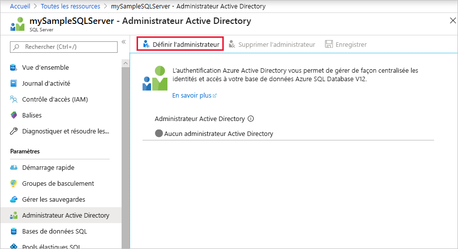
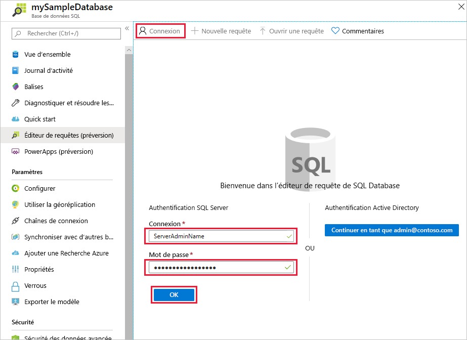
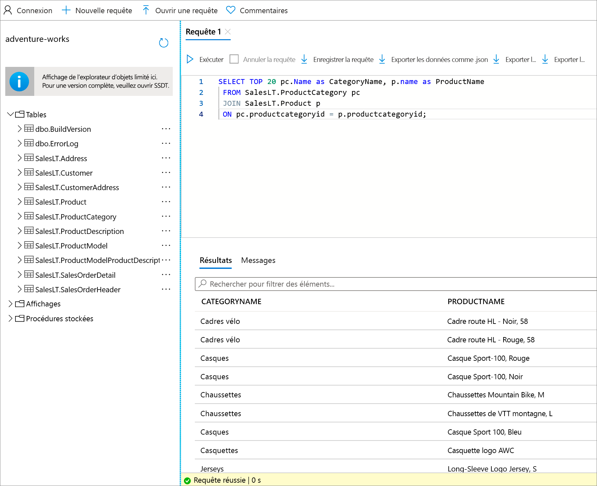

# <a name="quickstart-use-the-azure-portals-query-editor-preview-to-query-an-azure-sql-database"></a>Démarrage rapide : Utiliser l’éditeur de requête du portail Azure (préversion) pour interroger une base de données Azure SQL Database
[!INCLUDE[appliesto-sqldb](../includes/appliesto-sqldb.md)]

L’éditeur de requête est un outil du portail Azure qui permet d’exécuter des requêtes SQL sur une base de données dans Azure SQL Database ou sur un entrepôt de données dans Azure Synapse Analytics.

Dans ce guide de démarrage rapide, vous allez utiliser l’éditeur de requête pour exécuter des requêtes T-SQL (Transact-SQL) sur une base de données.

## <a name="prerequisites"></a>Prérequis

### <a name="create-a-database-with-sample-data"></a>Création d’une base de données avec des exemples de données

Pour suivre ce guide, vous avez besoin de l’exemple de base de données AdventureWorksLT. Si vous n'avez pas de copie de travail de l'exemple de base de données AdventureWorksLT dans SQL Database, le guide de démarrage rapide suivant vous permettra d'en créer une rapidement :

[Démarrage rapide : Créer une base de données dans Azure SQL Database à l’aide du portail Azure, de PowerShell et d’Azure CLI](single-database-create-quickstart.md)

### <a name="set-an-azure-active-directory-admin-for-the-server-optional"></a>Configurer un administrateur Azure Active Directory pour le serveur (facultatif)

La configuration d’un administrateur Azure AD (Azure Active Directory) vous permet d’utiliser une même identité pour vous connecter au portail Azure et à votre base de données. Si vous souhaitez utiliser Azure AD pour vous connecter à l'éditeur de requêtes, procédez comme suit.

Cette procédure est facultative. Vous pouvez également utiliser l'authentification SQL pour vous connecter à l'éditeur de requêtes.

> [!NOTE]
> * Les comptes de messagerie (par exemple outlook.com, gmail.com, yahoo.com, etc.) ne sont pas encore pris en charge comme administrateurs Azure AD. Veillez à choisir un utilisateur créé en mode natif dans Azure AD ou fédéré dans Azure AD.
> * La connexion administrateur Azure AD fonctionne avec les comptes pour lesquels l'authentification à 2 facteurs est activée, mais l'éditeur de requêtes ne prend pas en charge l'authentification à 2 facteurs.

1. Sur le portail Azure, accédez à votre serveur de base de données SQL.

2. Dans le menu **SQL Server**, sélectionnez **Administrateur Active Directory**.

3. Sur la barre d'outils de la page SQL Server **Administrateur Active Directory**, sélectionnez **Définir l'administrateur**.

    

4. Dans la page **Ajouter un administrateur**, dans la zone de recherche, entrez un utilisateur ou un groupe à rechercher, sélectionnez-le en tant qu’administrateur, puis cliquez sur le bouton **Sélectionner**.

5. De retour dans la barre d’outils de la page SQL Server **Administrateur Active Directory**, sélectionnez **Enregistrer**.

## <a name="using-sql-query-editor"></a>Utilisation de l'éditeur de requêtes SQL

1. Connectez-vous au [portail Azure](https://portal.azure.com/) et sélectionnez la base de données que vous souhaitez interroger.

2. Dans le menu **Base de données SQL**, sélectionnez **Éditeur de requête (préversion)** .

    

### <a name="establish-a-connection-to-the-database"></a>Établir une connexion à la base de données

Même si vous êtes connecté au portail, vous devez fournir des informations d’identification pour accéder à la base de données. Vous pouvez vous connecter à l’aide de l’authentification SQL ou Azure Active Directory pour vous connecter à votre base de données.

#### <a name="connect-using-sql-authentication"></a>Se connecter à l’aide de l’authentification SQL

1. Dans la page **Connexion**, sous **Authentification SQL Server**, entrez un **nom d’utilisateur** et un **mot de passe** pour l’utilisateur qui a accès à la base de données. Si vous ne savez pas lesquels utiliser, utilisez ceux de l’administrateur du serveur de la base de données.

    

2. Sélectionnez **OK**.

#### <a name="connect-using-azure-active-directory"></a>Se connecter avec Azure Active Directory

Dans l'**éditeur de requêtes (préversion)** , consultez la page **Connexion** de la section **Authentification Active Directory**. L'authentification est automatique. Par conséquent, si vous êtes un administrateur Azure AD de la base de données, vous verrez apparaître un message indiquant que vous êtes connecté. Sélectionnez ensuite le bouton **Continuer en tant que** *\<your user or group ID>* . Si la page indique que la connexion a échoué, essayez d’actualiser la page.

### <a name="query-a-database-in-sql-database"></a>Interroger une base de données dans SQL Database

Les exemples de requêtes suivants doivent pouvoir s’exécuter sur l’exemple de base de données AdventureWorksLT.

#### <a name="run-a-select-query"></a>Exécuter une requête SELECT

1. Collez la requête ci-après dans l’éditeur de requête :

   ```sql
    SELECT TOP 20 pc.Name as CategoryName, p.name as ProductName
    FROM SalesLT.ProductCategory pc
    JOIN SalesLT.Product p
    ON pc.productcategoryid = p.productcategoryid;
   ```

2. Sélectionnez **Exécuter**, puis passez en revue la sortie dans le volet **Résultats**.

   

3. Si vous le souhaitez, vous pouvez enregistrer la requête sous la forme d’un fichier .sql ou exporter les données retournées dans un fichier .json, .csv ou .xml.

#### <a name="run-an-insert-query"></a>Exécuter une requête INSERT

Exécutez l’instruction T-SQL [INSERT](/sql/t-sql/statements/insert-transact-sql/) suivante pour ajouter un nouveau produit dans la table `SalesLT.Product`.

1. Remplacez la requête précédente par celle-ci.

    ```sql
    INSERT INTO [SalesLT].[Product]
           ( [Name]
           , [ProductNumber]
           , [Color]
           , [ProductCategoryID]
           , [StandardCost]
           , [ListPrice]
           , [SellStartDate]
           )
    VALUES
           ('myNewProduct'
           ,123456789
           ,'NewColor'
           ,1
           ,100
           ,100
           ,GETDATE() );
   ```


2. Sélectionnez **Exécuter** pour insérer une nouvelle ligne dans la table `Product`. Le volet **Messages** affiche **Requête réussie : Lignes affectées : 1**.


#### <a name="run-an-update-query"></a>Exécuter une requête UPDATE

Exécutez l’instruction T-SQL [UPDATE](/sql/t-sql/queries/update-transact-sql/) suivante pour modifier votre nouveau produit.

1. Remplacez la requête précédente par celle-ci.

   ```sql
   UPDATE [SalesLT].[Product]
   SET [ListPrice] = 125
   WHERE Name = 'myNewProduct';
   ```

2. Sélectionnez **Exécuter** pour mettre à jour la ligne spécifiée dans la table `Product`. Le volet **Messages** affiche **Requête réussie : Lignes affectées : 1**.

#### <a name="run-a-delete-query"></a>Exécuter une requête DELETE

Exécutez l’instruction T-SQL [DELETE](/sql/t-sql/statements/delete-transact-sql/) suivante pour supprimer votre nouveau produit.

1. Remplacez la requête précédente par celle-ci :

   ```sql
   DELETE FROM [SalesLT].[Product]
   WHERE Name = 'myNewProduct';
   ```

2. Sélectionnez **Exécuter** pour supprimer la ligne spécifiée dans la table `Product`. Le volet **Messages** affiche **Requête réussie : Lignes affectées : 1**.


## <a name="troubleshooting-and-considerations"></a>Résolution des problèmes et considérations

Il y a quelques informations à connaître quand vous travaillez avec l’éditeur de requête.

### <a name="configure-local-network-settings"></a>Configurer les paramètres du réseau local

Si l’une des erreurs suivantes s’affiche dans l’éditeur de requête :
 - *Les paramètres de votre réseau local empêchent peut-être l’éditeur de requête d’émettre des requêtes. Cliquez ici pour obtenir des instructions sur la configuration de vos paramètres réseau*
 - *La connexion avec le serveur n'a pas pu être établie. Le problème est peut-être dû à la configuration de votre pare-feu local ou de votre proxy réseau*

Cela est dû au fait que l'éditeur de requêtes utilise les ports 443 et 1443 pour communiquer. Vous devez vérifier que vous avez activé le trafic HTTPS sortant sur ces ports. Suivez les instructions ci-dessous pour savoir comment procéder en fonction de votre système d'exploitation. Vous devrez peut-être faire appel au service informatique de votre entreprise pour obtenir l'autorisation d'ouvrir cette connexion sur votre réseau local.

#### <a name="steps-for-windows"></a>Étapes à suivre pour Windows

1. Ouvrez le **pare-feu Windows Defender**.
2. Dans le menu de gauche, sélectionnez **Paramètres avancés**.
3. Dans **Pare-feu Windows Defender avec fonctions avancées de sécurité**, sélectionnez **Règles de trafic sortant** dans le menu de gauche.
4. Sélectionnez **Nouvelle règle...** dans le menu de droite.

Dans l'**Assistant Nouvelle règle de trafic sortant**, procédez comme suit :

1. Sélectionnez **Port** comme type de règle à créer. Sélectionnez **Suivant**.
2. Sélectionnez **TCP**.
3. Sélectionnez **Ports distants spécifiques** et entrez « 443, 1443 ». Sélectionnez **Suivant**.
4. Sélectionnez « Autoriser la connexion si elle est sécurisée ».
5. Sélectionnez **Suivant**, puis à nouveau **Suivant**.
5. Maintenez « Domaine », « Privé » et « Public » sélectionnés.
6. Donnez un nom à la règle, par exemple « Accéder à l'éditeur de requêtes Azure SQL », et entrez éventuellement une description. Sélectionnez **Terminer**.

#### <a name="steps-for-mac"></a>Étapes à suivre pour Mac
1. Ouvrez **Préférences système** (menu Apple > Préférences système).
2. Cliquez sur **Sécurité et confidentialité**.
3. Cliquez sur **Pare-feu**.
4. Si le pare-feu est désactivé, sélectionnez **Cliquez sur le verrou pour apporter des modifications** en bas, puis sélectionnez **Activer le pare-feu**.
4. Cliquez sur **Options de pare-feu**.
5. Dans la fenêtre **Sécurité et confidentialité**, sélectionnez l'option suivante : « Autoriser automatiquement les logiciels signés à recevoir des connexions entrantes ».

#### <a name="steps-for-linux"></a>Étapes à suivre pour Linux
Exécutez les commandes suivantes pour mettre à jour iptables.
  ```
  sudo iptables -A OUTPUT -p tcp --dport 443 -j ACCEPT
  sudo iptables -A OUTPUT -p tcp --dport 1443 -j ACCEPT
  ```

### <a name="connection-considerations"></a>Considérations relatives à la connexion

* Pour les connexions publiques à l'éditeur de requêtes, vous devez [ajouter votre adresse IP sortante aux règles de pare-feu autorisées du serveur](firewall-create-server-level-portal-quickstart.md) afin d'accéder à vos bases de données et entrepôts de données.

* Si une connexion Private Link est configurée sur le serveur et que vous vous connectez à l'éditeur de requêtes à partir d'une adresse IP du réseau virtuel privé, l'éditeur de requêtes fonctionne sans qu'il soit nécessaire d'ajouter l'adresse IP du client dans les règles de pare-feu du serveur de base de données SQL.

* Les autorisations RBAC les plus élémentaires nécessaires pour utiliser l'éditeur de requêtes sont l'accès en lecture au serveur et à la base de données. Toute personne disposant de ce niveau d'accès peut accéder à l'éditeur de requêtes. Pour restreindre l'accès à certains utilisateurs, vous devez empêcher la connexion à l'éditeur de requêtes via les informations d'authentification Azure Active Directory ou SQL. Si les utilisateurs ne peuvent pas s'attribuer le rôle d'administrateur AAD du serveur ou accéder/ajouter un compte d'administrateur SQL, ils ne doivent pas être en mesure d'utiliser l'éditeur de requêtes.

* L’éditeur de requête ne prend pas en charge la connexion à la base de données `master`.

* L'éditeur de requêtes ne peut pas se connecter à une base de données réplica avec `ApplicationIntent=ReadOnly`

* En présence du message d'erreur « L'en-tête X-CSRF-Signature n'a pas pu être validé », procédez comme suit pour résoudre le problème :

    * Assurez-vous que l'horloge de votre ordinateur est réglée sur la bonne heure et le bon fuseau horaire. Vous pouvez également essayer de faire correspondre le fuseau horaire de votre ordinateur avec Azure en recherchant le fuseau horaire de l'emplacement de votre instance, par exemple USA Est, Pacifique, etc.
    * Si vous êtes sur un réseau proxy, assurez-vous que l'en-tête de demande « X-CSRF-Signature » n'a pas été modifié ou supprimé.

### <a name="other-considerations"></a>Autres considérations

* Le fait d’appuyer sur **F5** réinitialise la page de l’éditeur de requête, effaçant la requête sur laquelle vous travaillez.

* Il y a un délai d’expiration de 5 minutes pour l’exécution des requêtes.

* L’éditeur de requête prend en charge seulement la projection cylindrique des types de données géographiques.

* Il n’existe pas de prise en charge d’IntelliSense pour les tables et les vues de base de données. Toutefois, l’éditeur prend en charge la saisie semi-automatique des noms qui ont déjà été tapés.

## <a name="next-steps"></a>Étapes suivantes

Pour plus d’informations sur les instructions T-SQL (Transact-SQL) prises en charge dans Azure SQL Database, consultez [Résolution des différences de Transact-SQL durant la migration vers SQL Database](transact-sql-tsql-differences-sql-server.md).
