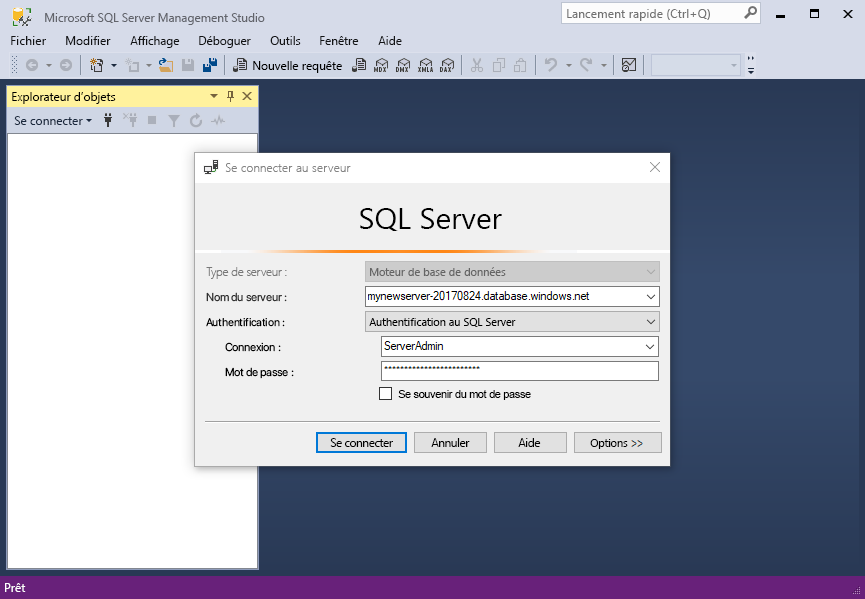
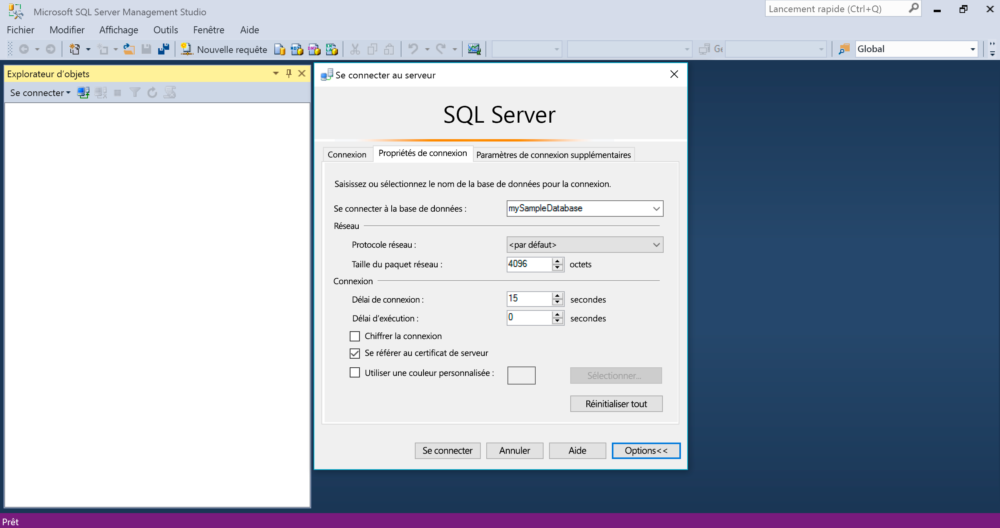
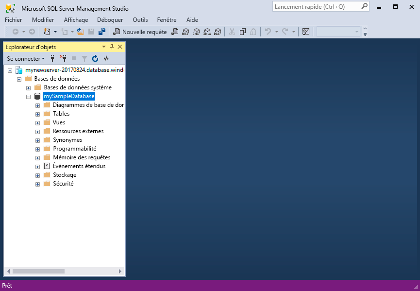
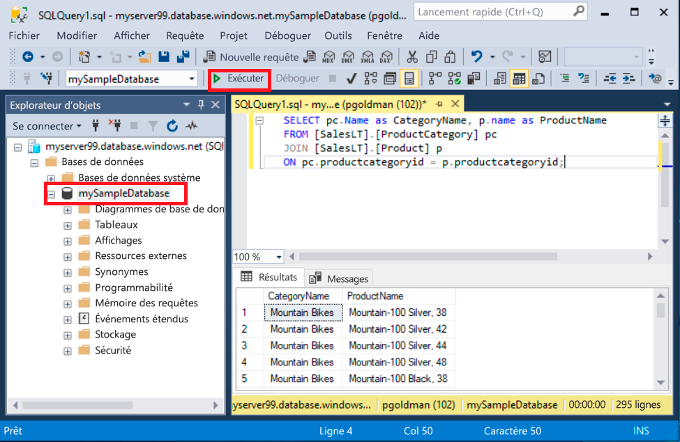
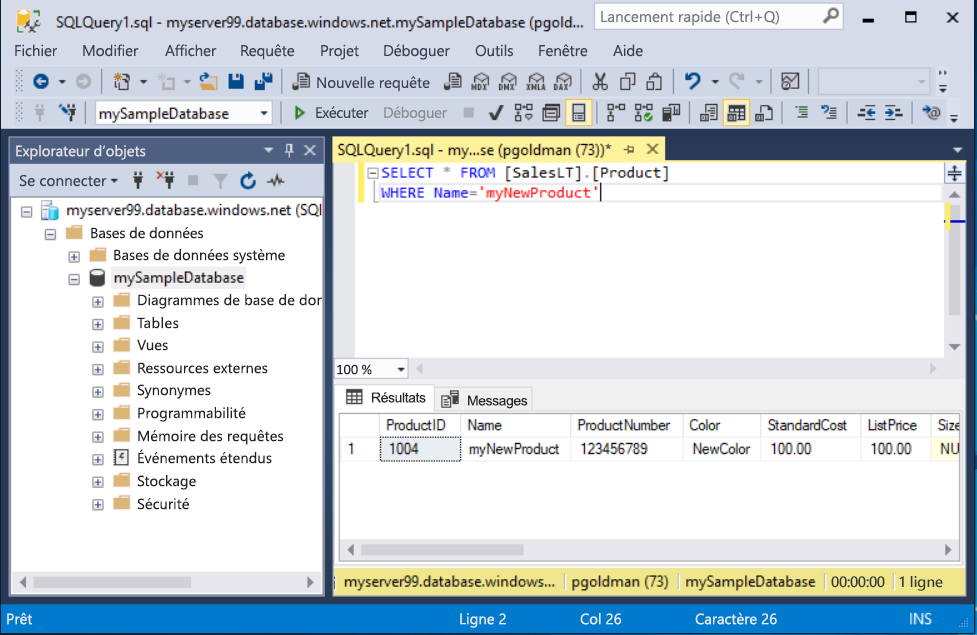

# <a name="quickstart-use-ssms-to-connect-to-and-query-azure-sql-database-or-azure-sql-managed-instance"></a>Démarrage rapide : Utiliser SSMS pour se connecter à Azure SQL Database ou Azure SQL Managed Instance et exécuter des requêtes
[!INCLUDE[appliesto-sqldb-sqlmi](../includes/appliesto-sqldb-sqlmi.md)]

Dans ce guide de démarrage rapide, vous découvrez comment utiliser SQL Server Management Studio (SSMS) pour vous connecter à Azure SQL Database ou Azure SQL Managed Instance, et exécuter des requêtes.

## <a name="prerequisites"></a>Prérequis

Ce guide de démarrage rapide nécessite les éléments suivants :

- [SQL Server Management Studio (SSMS)](/sql/ssms/download-sql-server-management-studio-ssms/).

- Une base de données dans Azure SQL Database. Utilisez l’un de ces guides de démarrage rapide pour créer et configurer une base de données dans Azure SQL Database :

  || SQL Database | Instance managée SQL | SQL Server sur une machine virtuelle Azure |
  |:--- |:--- |:---|:---|
  | Créer| [Portail](single-database-create-quickstart.md) | [Portail](../managed-instance/instance-create-quickstart.md) | [Portail](../virtual-machines/windows/sql-vm-create-portal-quickstart.md)
  || [INTERFACE DE LIGNE DE COMMANDE](scripts/create-and-configure-database-cli.md) | [INTERFACE DE LIGNE DE COMMANDE](https://medium.com/azure-sqldb-managed-instance/working-with-sql-managed-instance-using-azure-cli-611795fe0b44) |
  || [PowerShell](scripts/create-and-configure-database-powershell.md) | [PowerShell](../managed-instance/scripts/create-configure-managed-instance-powershell.md) | [PowerShell](../virtual-machines/windows/sql-vm-create-powershell-quickstart.md)
  | Configurer | [Règle de pare-feu IP au niveau du serveur](firewall-create-server-level-portal-quickstart.md)| [Connectivité à partir d’une machine virtuelle](../managed-instance/connect-vm-instance-configure.md)|
  |||[Connectivité à partir d’une machine locale](../managed-instance/point-to-site-p2s-configure.md) | [Se connecter à SQL Server](../virtual-machines/windows/sql-vm-create-portal-quickstart.md)
  |Charger les données|Adventure Works chargé dans le cadre du guide de démarrage rapide|[Restaurer Wide World Importers](../managed-instance/restore-sample-database-quickstart.md) | [Restaurer Wide World Importers](../managed-instance/restore-sample-database-quickstart.md) |
  |||Restaurer ou importer Adventure Works à partir du fichier [BACPAC](database-import.md) disponible sur [GitHub](https://github.com/Microsoft/sql-server-samples/tree/master/samples/databases/adventure-works)| Restaurer ou importer Adventure Works à partir du fichier [BACPAC](database-import.md) disponible sur [GitHub](https://github.com/Microsoft/sql-server-samples/tree/master/samples/databases/adventure-works)|
  |||

  > [!IMPORTANT]
  > Les scripts fournis dans cet article utilisent la base de données Adventure Works. Avec une instance managée, vous devez importer la base de données Adventure Works dans une base de données d’instance, ou modifier les scripts fournis dans cet article pour utiliser la base de données Wide World Importers.

Si vous souhaitez simplement exécuter des requêtes ad hoc sans installer SSMS, consultez [Démarrage rapide : Utiliser l’éditeur de requête du portail Azure pour interroger une base de données SQL](connect-query-portal.md).

## <a name="get-server-connection-information"></a>Obtenir les informations de connexion du serveur SQL

Procurez-vous les informations de connexion dont vous avez besoin pour vous connecter à la base de données. Pour exécuter ce démarrage rapide, vous avez besoin du nom de [serveur](logical-servers.md) complet ou du nom d’hôte, du nom de la base de données et des informations de connexion.

1. Connectez-vous au [portail Azure](https://portal.azure.com/).

2. Accédez à la **base de données** ou à l’**instance managée** à interroger.

3. Dans la page **Vue d’ensemble**, vérifiez le nom de serveur complet à côté de **Nom de serveur** pour votre base de données dans SQL Database, ou le nom de serveur complet (ou l’adresse IP) à côté de **Hôte** pour votre instance managée dans SQL Managed Instance ou votre instance SQL Server sur votre machine virtuelle. Pour copier le nom du serveur ou de l’hôte, pointez dessus et sélectionnez l’icône **Copier**.

> [!NOTE]
> Pour obtenir les informations de connexion de SQL Server sur une machine virtuelle Azure, consultez [Se connecter à SQL Server](../virtual-machines/windows/sql-vm-create-portal-quickstart.md#connect-to-sql-server)

## <a name="connect-to-your-database"></a>Connectez-vous à votre base de données

Dans SSMS, connectez-vous à votre serveur.

> [!IMPORTANT]
> Un serveur écoute sur le port 1433. Pour vous connecter à un serveur derrière un pare-feu d’entreprise, le port de ce dernier doit être ouvert.

1. Ouvrez SSMS.

2. La boîte de dialogue **Se connecter au serveur** s’affiche. Entrez les informations suivantes :

   | Paramètre      | Valeur suggérée    | Description |
   | ------------ | ------------------ | ----------- |
   | **Type de serveur** | Moteur de base de données | Valeur requise |
   | **Nom du serveur** | Nom complet du serveur | Par exemple : **servername.database.windows.net**. |
   | **Authentification** | l’authentification SQL Server | Ce didacticiel utilise l’authentification SQL. |
   | **Connexion** | ID utilisateur du compte d'administrateur de serveur | ID utilisateur du compte d'administrateur de serveur utilisé pour créer le serveur. |
   | **Mot de passe** | Mot de passe du compte d'administrateur de serveur | Mot de passe du compte d'administrateur de serveur utilisé pour créer le serveur. |
   ||||

     

3. Sélectionnez **Options** dans la boîte de dialogue **Se connecter au serveur**. Dans le menu déroulant **Se connecter à la base de données**, sélectionnez **mySampleDatabase**. Lorsque vous suivez le guide de démarrage rapide dans la [section Prérequis](#prerequisites), vous créez une base de données AdventureWorksLT nommée mySampleDatabase. Si votre copie de travail de la base de données AdventureWorks porte un nom différent de mySampleDatabase, sélectionnez-la à la place de celle-ci.

     

4. Sélectionnez **Connecter**. La fenêtre Explorateur d’objets s’ouvre.

5. Pour afficher les objets de la base de données, développez **Bases de données**, puis développez le nœud de votre base de données.

     

## <a name="query-data"></a>Interroger des données

Exécutez ce code Transact-SQL [SELECT](/sql/t-sql/queries/select-transact-sql/) pour rechercher les 20 premiers produits par catégorie.

1. Dans l’Explorateur d’objets, cliquez avec le bouton droit sur **mySampleDatabase**, puis sélectionnez **Nouvelle requête**. Une nouvelle fenêtre de requête connectée à votre base de données s’ouvre.

2. Dans la fenêtre de requête, collez la requête SQL suivante :

   ```sql
   SELECT pc.Name as CategoryName, p.name as ProductName
   FROM [SalesLT].[ProductCategory] pc
   JOIN [SalesLT].[Product] p
   ON pc.productcategoryid = p.productcategoryid;
   ```

3. Dans la barre d’outils, sélectionnez **Exécuter** pour exécuter la requête et récupérer les données des tables `Product` et `ProductCategory`.

    

### <a name="insert-data"></a>Insertion des données

Exécutez ce code Transact-SQL [INSERT](/sql/t-sql/statements/insert-transact-sql/) pour créer un produit dans la table `SalesLT.Product`.

1. Remplacez la requête précédente par celle-ci.

   ```sql
   INSERT INTO [SalesLT].[Product]
           ( [Name]
           , [ProductNumber]
           , [Color]
           , [ProductCategoryID]
           , [StandardCost]
           , [ListPrice]
           , [SellStartDate] )
     VALUES
           ('myNewProduct'
           ,123456789
           ,'NewColor'
           ,1
           ,100
           ,100
           ,GETDATE() );
   ```

2. Sélectionnez **Exécuter** pour insérer une nouvelle ligne dans la table `Product`. Le volet **Messages** affiche **(1 ligne affectée)** .

#### <a name="view-the-result"></a>Afficher le résultat

1. Remplacez la requête précédente par celle-ci.

   ```sql
   SELECT * FROM [SalesLT].[Product]
   WHERE Name='myNewProduct'
   ```

2. Sélectionnez **Exécuter**. Le résultat suivant s’affiche.

   

### <a name="update-data"></a>Mettre à jour des données

Exécutez ce code Transact-SQL [UPDATE](/sql/t-sql/statements/update-transact-sql) pour modifier votre nouveau produit.

1. Remplacez la requête précédente par celle qui retourne le nouvel enregistrement créé précédemment :

   ```sql
   UPDATE [SalesLT].[Product]
   SET [ListPrice] = 125
   WHERE Name = 'myNewProduct';
   ```

2. Sélectionnez **Exécuter** pour mettre à jour la ligne spécifiée dans la table `Product`. Le volet **Messages** affiche **(1 ligne affectée)** .

### <a name="delete-data"></a>Suppression de données

Exécutez ce code Transact-SQL [DELETE](/sql/t-sql/statements/delete-transact-sql/) pour supprimer votre nouveau produit.

1. Remplacez la requête précédente par celle-ci.

   ```sql
   DELETE FROM [SalesLT].[Product]
   WHERE Name = 'myNewProduct';
   ```

2. Sélectionnez **Exécuter** pour supprimer la ligne spécifiée dans la table `Product`. Le volet **Messages** affiche **(1 ligne affectée)** .

## <a name="next-steps"></a>Étapes suivantes

- Pour plus d’informations sur SSMS, consultez [SQL Server Management Studio](/sql/ssms/sql-server-management-studio-ssms/).
- Pour vous connecter et exécuter des requêtes via le portail Azure, consultez [Se connecter et effectuer des requêtes avec l’éditeur de requêtes SQL du portail Azure](connect-query-portal.md).
- Pour vous connecter et exécuter des requêtes à l’aide de Visual Studio Code, consultez l’article décrivant comment [se connecter et effectuer des requêtes avec Visual Studio Code](connect-query-vscode.md).
- Pour vous connecter et exécuter des requêtes à l’aide de .NET, consultez l’article décrivant comment [se connecter et effectuer des requêtes avec .NET](connect-query-dotnet-visual-studio.md).
- Pour vous connecter et exécuter des requêtes avec PHP, consultez la page [se connecter et effectuer des requêtes avec PHP](connect-query-php.md).
- Pour vous connecter et exécuter des requêtes avec Node.js, consultez la page [se connecter et effectuer des requêtes avec Node.js](connect-query-nodejs.md).
- Pour vous connecter et exécuter des requêtes avec Java, consultez la page [se connecter et effectuer des requêtes avec Java](connect-query-java.md).
- Pour vous connecter et exécuter des requêtes avec Python, consultez la page [se connecter et effectuer des requêtes avec Python](connect-query-python.md).
- Pour vous connecter et exécuter des requêtes avec Ruby, consultez la page [se connecter et effectuer des requêtes avec Ruby](connect-query-ruby.md).
