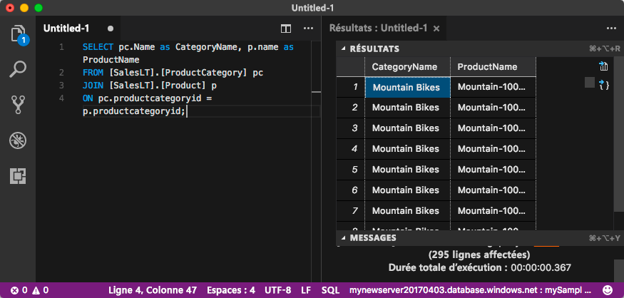

# <a name="quickstart-use-visual-studio-code-to-connect-and-query"></a>Démarrage rapide : Utiliser Visual Studio Code pour se connecter et interroger 
[!INCLUDE[appliesto-sqldb-sqlmi](../includes/appliesto-sqldb-sqlmi.md)]

[Visual Studio Code](https://code.visualstudio.com/docs) est un éditeur de code graphique pour Linux, macOS et Windows. Il prend en charge des extensions, y compris l’[extension mssql](https://aka.ms/mssql-marketplace), qui permettent d’interroger une instance SQL Server, Azure SQL Database, une instance managée SQL Azure et une base de données dans Azure Synapse Analytics. Dans ce guide de démarrage rapide, vous utilisez Visual Studio Code pour vous connecter à Azure SQL Database ou Azure SQL Managed Instance, puis vous exécutez des instructions Transact-SQL pour interroger, ajouter, mettre à jour et supprimer des données.

## <a name="prerequisites"></a>Prérequis

- Une base de données dans Azure SQL Database ou Azure SQL Managed Instance. Utilisez l’un de ces guides de démarrage rapide pour créer et configurer une base de données dans Azure SQL Database :

  | Action | Azure SQL Database | Azure SQL Managed Instance |
  |:--- |:--- |:---|
  | Créer| [Portail](single-database-create-quickstart.md) | [Portail](../managed-instance/instance-create-quickstart.md) |
  || [INTERFACE DE LIGNE DE COMMANDE](scripts/create-and-configure-database-cli.md) | [INTERFACE DE LIGNE DE COMMANDE](https://medium.com/azure-sqldb-managed-instance/working-with-sql-managed-instance-using-azure-cli-611795fe0b44) |
  || [PowerShell](scripts/create-and-configure-database-powershell.md) | [PowerShell](../managed-instance/scripts/create-configure-managed-instance-powershell.md) |
  | Configurer | [Règle de pare-feu IP au niveau du serveur](firewall-create-server-level-portal-quickstart.md)| [Connectivité à partir d’une machine virtuelle](../managed-instance/connect-vm-instance-configure.md)|
  |||[Connectivité locale](../managed-instance/point-to-site-p2s-configure.md)
  |Charger les données|Adventure Works chargé dans le cadre du guide de démarrage rapide|[Restaurer Wide World Importers](../managed-instance/restore-sample-database-quickstart.md)
  |||Restaurer ou importer Adventure Works à partir d’un fichier [BACPAC](database-import.md) disponible sur [GitHub](https://github.com/Microsoft/sql-server-samples/tree/master/samples/databases/adventure-works)|
  |||

  > [!IMPORTANT]
  > Les scripts fournis dans cet article utilisent la base de données Adventure Works. Avec une instance managée SQL, vous devez importer la base de données Adventure Works dans une base de données d’instance, ou modifier les scripts fournis dans cet article pour utiliser la base de données Wide World Importers.

## <a name="install-visual-studio-code"></a>Installation de Visual Studio Code

Assurez-vous d'avoir installé la dernière version de [Visual Studio Code](https://code.visualstudio.com/Download) et chargé l’[extension mssql](https://aka.ms/mssql-marketplace). Pour obtenir des conseils sur l’installation de l’extension mssql, consultez [Installer Visual Studio Code](https://docs.microsoft.com/sql/linux/sql-server-linux-develop-use-vscode#install-and-start-visual-studio-code) et [mssql pour Visual Studio Code](https://marketplace.visualstudio.com/items?itemName=ms-mssql.mssql).

## <a name="configure-visual-studio-code"></a>Configurer Visual Studio Code

### <a name="macos"></a>**macOS**

Pour macOS, vous devez installer OpenSSL qui est un composant requis pour .NET Core utilisé par l’extension mssql. Ouvrez votre terminal et entrez les commandes ci-après pour installer **brew** et **OpenSSL**.

```bash
ruby -e "$(curl -fsSL https://raw.githubusercontent.com/Homebrew/install/master/install)"
brew update
brew install openssl
mkdir -p /usr/local/lib
ln -s /usr/local/opt/openssl/lib/libcrypto.1.0.0.dylib /usr/local/lib/
ln -s /usr/local/opt/openssl/lib/libssl.1.0.0.dylib /usr/local/lib/
```

### <a name="linux-ubuntu"></a>**Linux (Ubuntu)**

Aucune configuration spéciale nécessaire.

### <a name="windows"></a>**Windows**

Aucune configuration spéciale nécessaire.

## <a name="get-server-connection-information"></a>Obtenir les informations de connexion du serveur

Obtenez les informations de connexion dont vous avez besoin pour vous connecter à Azure SQL Database. Vous aurez besoin du nom complet du serveur ou de l’hôte, du nom de la base de données et des informations de connexion pour les procédures suivantes.

1. Connectez-vous au [portail Azure](https://portal.azure.com/).

2. Accédez à la page **Bases de données SQL** ou **Instances managées SQL**.

3. Dans la page **Vue d’ensemble**, vérifiez le nom de serveur complet à côté de **Nom de serveur** pour une base de données SQL, ou le nom de serveur complet à côté de **Hôte** pour une instance managée SQL. Pour copier le nom du serveur ou de l’hôte, pointez dessus et sélectionnez l’icône **Copier**.

## <a name="set-language-mode-to-sql"></a>Définition du mode de langage sur SQL

Dans Visual Studio Code, définissez le mode de langage sur **SQL** pour activer les commandes mssql et T-SQL IntelliSense.

1. Ouvrez une nouvelle fenêtre Visual Studio Code.

2. Appuyez sur **CTRL**+**N**. Un nouveau fichier texte brut s’ouvre.

3. Sélectionnez **Texte brut** dans le coin inférieur droit de la barre d’état.

4. Dans le menu déroulant **Sélectionner un mode de langage** qui s’affiche, sélectionnez **SQL**.

## <a name="connect-to-your-database"></a>Connectez-vous à votre base de données

Utilisez Visual Studio Code pour établir une connexion à votre serveur.

> [!IMPORTANT]
> Avant de poursuivre, vérifiez que votre serveur est prêt et que vous avez vos informations de connexion. Une fois que vous avez commencé à saisir les informations concernant le profil de connexion, si vous modifiez le focus à partir de Visual Studio Code, vous devez redémarrer la création du profil.

1. Dans Visual Studio Code, appuyez sur **Ctrl+Maj+P** (ou **F1**) pour ouvrir la Palette de commandes.

2. Sélectionnez **MS SQL : Se Connecter** et choisissez **Entrée**.

3. Sélectionnez **Créer un profil de connexion**.

4. Suivez les invites pour spécifier les propriétés du nouveau profil de connexion. Après avoir spécifié chaque valeur, choisissez **Entrée** pour continuer.

   | Propriété       | Valeur suggérée | Description |
   | ------------ | ------------------ | ------------------------------------------------- |
   | **Nom du serveur** | Nom complet du serveur | Similaire à ce qui suit : **mynewserver20170313.database.windows.net**. |
   | **Nom de la base de données** | mySampleDatabase | Base de données à laquelle se connecter. |
   | **Authentification** | Connexion SQL| Ce didacticiel utilise l’authentification SQL. |
   | **Nom d'utilisateur** | Nom d'utilisateur | Nom d'utilisateur du compte d'administrateur de serveur utilisé pour créer le serveur. |
   | **Mot de passe (connexion SQL)** | Mot de passe | Mot de passe du compte d'administrateur de serveur utilisé pour créer le serveur. |
   | **Enregistrer le mot de passe ?** | Oui ou Non | Sélectionnez **Oui** si vous ne souhaitez pas entrer le mot de passe à chaque fois. |
   | **Entrez un nom pour ce profil** | Nom de profil, par exemple **mySampleProfile** | Un profil enregistré permet d’accélérer votre connexion lors des connexions suivantes. |

   Si cela aboutit, une notification s’affiche et indique que votre profil est créé et connecté.

## <a name="query-data"></a>Interroger des données

Exécutez l’instruction Transact-SQL [SELECT](https://msdn.microsoft.com/library/ms189499.aspx) suivante pour interroger les 20 premiers produits par catégorie.

1. Dans la fenêtre de l'éditeur, collez la requête SQL suivante.

   ```sql
   SELECT pc.Name as CategoryName, p.name as ProductName
   FROM [SalesLT].[ProductCategory] pc
   JOIN [SalesLT].[Product] p
   ON pc.productcategoryid = p.productcategoryid;
   ```

2. Appuyez sur **Ctrl**+**Maj**+**E** pour exécuter la requête et afficher les résultats à partir des tables `Product` et `ProductCategory`.

    

## <a name="insert-data"></a>Insertion des données

Exécutez l’instruction Transact-SQL [INSERT](https://msdn.microsoft.com/library/ms174335.aspx) suivante pour ajouter un nouveau produit dans la table `SalesLT.Product`.

1. Remplacez la requête précédente par celle-ci.

   ```sql
   INSERT INTO [SalesLT].[Product]
        ( [Name]
        , [ProductNumber]
        , [Color]
        , [ProductCategoryID]
        , [StandardCost]
        , [ListPrice]
        , [SellStartDate]
        )
     VALUES
        ('myNewProduct'
        ,123456789
        ,'NewColor'
        ,1
         ,100
         ,100
         ,GETDATE() );
   ```

2. Appuyez sur **Ctrl**+**Maj**+**E** pour insérer une nouvelle ligne dans la table `Product`.

## <a name="update-data"></a>Mettre à jour des données

Exécutez l’instruction Transact-SQL [UPDATE](https://msdn.microsoft.com/library/ms177523.aspx) suivante pour mettre à jour le produit ajouté.

1. Remplacez la requête précédente par celle-ci :

   ```sql
   UPDATE [SalesLT].[Product]
   SET [ListPrice] = 125
   WHERE Name = 'myNewProduct';
   ```

2. Appuyez sur **Ctrl**+**Maj**+**E** pour mettre à jour la ligne spécifiée dans la table `Product`.

## <a name="delete-data"></a>Suppression de données

Exécutez l’instruction Transact-SQL [DELETE](https://docs.microsoft.com/sql/t-sql/statements/delete-transact-sql) suivante pour supprimer le nouveau produit.

1. Remplacez la requête précédente par celle-ci :

   ```sql
   DELETE FROM [SalesLT].[Product]
   WHERE Name = 'myNewProduct';
   ```

2. Appuyez sur **Ctrl**+**Maj**+**E** pour supprimer la ligne spécifiée dans la table `Product`.

## <a name="next-steps"></a>Étapes suivantes

- Pour vous connecter et effectuer des requêtes à l’aide de SQL Server Management Studio, consultez [Démarrage rapide : Utiliser SQL Server Management Studio pour se connecter à une base de données dans Azure SQL Database et interroger les données](connect-query-ssms.md).
- Pour vous connecter et effectuer des requêtes à l’aide du portail Azure, consultez [Démarrage rapide : Utilisez l’éditeur de requête SQL dans le portail Azure pour vous connecter et interroger les données](connect-query-portal.md).
- Pour lire un article du magazine MSDN sur l’utilisation de Visual Studio Code, consultez le [billet de blog Créer un IDE de base de données avec une extension MSSQL](https://msdn.microsoft.com/magazine/mt809115).
