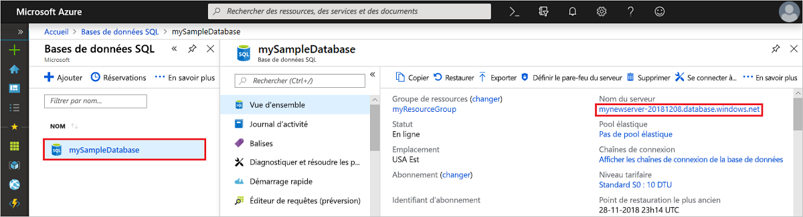
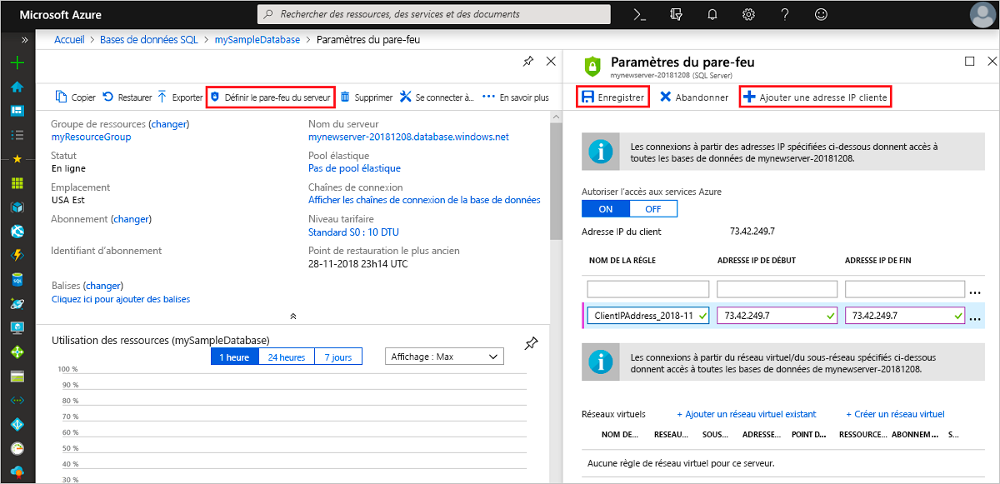

# Démarrage rapide : Créer une règle de pare-feu au niveau du serveur à l’aide du portail Azure
[!INCLUDE[appliesto-sqldb](../includes/appliesto-sqldb.md)]

Ce guide de démarrage rapide vous montre comment créer une [règle de pare-feu au niveau du serveur](firewall-configure.md) dans Azure SQL Database à l’aide du Portail Azure. Cette règle vous permettra de vous connecter à des [serveurs SQL logiques](logical-servers.md), à des bases de données uniques ainsi qu’à des bases de données mises dans des pools élastiques. Vous avez besoin d’une règle de pare-feu pour vous connecter à partir d’autres ressources Azure et des ressources locales. Les règles de pare-feu au niveau du serveur ne s’appliquent pas à Azure SQL Managed Instance.

## Prérequis

Ce tutoriel utilise les ressources créées dans l’article [Créer une base de données unique à l’aide du portail Azure](single-database-create-quickstart.md) comme point de départ.

## Connectez-vous au portail Azure.

Connectez-vous au [portail Azure](https://portal.azure.com/).

## Créer une règle de pare-feu IP au niveau du serveur

 SQL Database crée un pare-feu au niveau du serveur pour les bases de données uniques et mises en pool. Ce pare-feu empêche les applications clientes de se connecter au serveur ou à l’une de ses bases de données, sauf si vous créez une règle de pare-feu IP pour ouvrir le pare-feu. Pour établir une connexion à partir d’une adresse IP hors Azure, créez une règle de pare-feu pour une adresse IP spécifique ou une plage d’adresses IP à partir desquelles vous souhaitez vous connecter. Pour plus d’informations sur les règles de pare-feu IP au niveau du serveur et au niveau de la base de données, consultez [Règles de pare-feu IP au niveau de la base de données et au niveau du serveur](firewall-configure.md).

> [!NOTE]
> Azure SQL Database communique par le biais du port 1433. Si vous essayez de vous connecter à partir d’un réseau d’entreprise, le trafic sortant sur le port 1433 peut être bloqué par le pare-feu de votre réseau. Si c’est le cas, vous ne pouvez pas vous connecter à votre serveur, sauf si votre service informatique ouvre le port 1433.
> [!IMPORTANT]
> La règle de pare-feu 0.0.0.0 permet à tous les services Azure de franchir la règle de pare-feu au niveau du serveur et de tenter de se connecter à une base de données par le biais du serveur.

Effectuez ces étapes pour créer une règle de pare-feu IP au niveau du serveur pour l’adresse IP de votre client et fournir ainsi une connectivité externe par le biais du pare-feu Azure SQL Database à votre adresse IP uniquement.

1. Une fois le déploiement de la [base de données](#prerequisites) terminé, sélectionnez **Bases de données SQL** dans le menu de gauche, puis choisissez **mySampleDatabase** dans la page **Bases de données SQL**. La page de présentation de votre base de données s’ouvre, elle affiche le nom de serveur complet (tel que **mynewserver-20170824.database.windows.net**) et fournit des options pour poursuivre la configuration.

2. Copiez ce nom de serveur complet pour vous connecter à votre serveur et à ses bases de données dans les guides de démarrage rapide suivants.

   

3. Sélectionnez **Définir le pare-feu du serveur** dans la barre d’outils. La page **Paramètres de pare-feu** du serveur s’ouvre.

   

4. Dans la barre d’outils, choisissez **Ajouter une adresse IP de client** pour ajouter votre adresse IP actuelle à une nouvelle règle de pare-feu IP au niveau du serveur. Une règle de pare-feu IP au niveau du serveur peut ouvrir le port 1433 pour une seule adresse IP ou une plage d’adresses IP.

   > [!IMPORTANT]
   > Par défaut, l’accès via le pare-feu Azure SQL Database est désactivé pour tous les services Azure. Choisissez **ACTIVÉ** sur cette page si vous voulez activer l’accès pour tous les services Azure.
   >

5. Sélectionnez **Enregistrer**. Une règle de pare-feu IP au niveau du serveur est créée pour votre adresse IP actuelle et ouvre le port 1433 sur le serveur.

6. Fermez la page **Paramètres de pare-feu**.

À l’aide de SQL Server Management Studio ou de tout autre outil de votre choix, vous pouvez maintenant vous connecter au serveur et à ses bases de données à partir de cette adresse IP en utilisant le compte Administrateur de serveur créé au préalable.

## Nettoyer les ressources

Enregistrez les ressources si vous souhaitez passer aux [Étapes suivantes](#next-steps) et découvrir comment vous connecter à votre base de données et les différentes méthodes à votre disposition pour l’interroger. Toutefois, si vous souhaitez supprimer les ressources créées dans ce guide de démarrage rapide, effectuez les étapes suivantes.

1. Dans le menu gauche du portail Azure, sélectionnez **Groupes de ressources**, puis **myResourceGroup**.
2. Dans la page de votre groupe de ressources, sélectionnez **Supprimer**, tapez **myResourceGroup** dans la zone de texte, puis sélectionnez **Supprimer**.

## Étapes suivantes

- Maintenant que vous disposez d’une base de données, vous pouvez [vous y connecter et l’interroger](connect-query-content-reference-guide.md) à l’aide d’un de vos outils ou langages préférés. Par exemple :
  - [Se connecter et effectuer des requêtes à l’aide de SQL Server Management Studio](connect-query-ssms.md)
  - [Se connecter et effectuer des requêtes à l’aide d’Azure Data Studio](/sql/azure-data-studio/quickstart-sql-database?toc=/azure/sql-database/toc.json)
- Pour apprendre à concevoir votre première base de données, créer des tables et insérer des données, consultez un de ces didacticiels :
  - [Concevoir votre première base de données unique dans Azure SQL Database avec SSMS](design-first-database-tutorial.md)
  - [Concevoir une base de données unique dans Azure SQL Database et se connecter avec C# et ADO.NET](design-first-database-csharp-tutorial.md)
