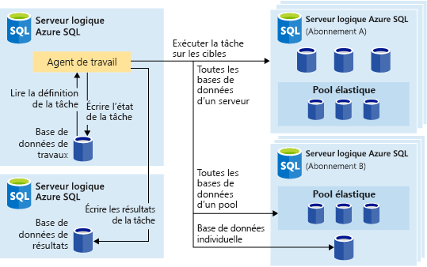
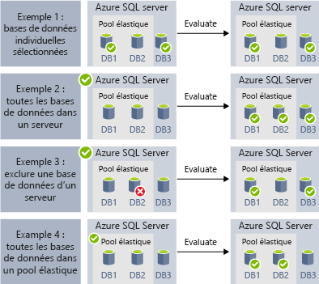
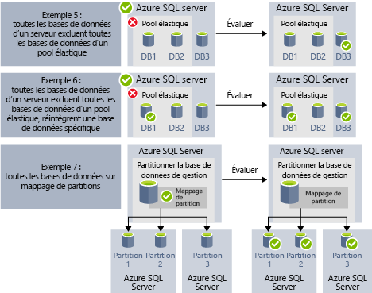

# Automatiser des tâches de gestion avec des travaux élastiques (préversion)

[!INCLUDE[appliesto-sqldb](../includes/appliesto-sqldb.md)]

Vous pouvez créer et planifier des travaux élastiques qui s’exécutent périodiquement sur une ou plusieurs bases de données Azure SQL afin d’exécuter des requêtes T-SQL (Transact-SQL) et d’effectuer des tâches de maintenance. 

Vous pouvez définir la base de données ou les groupes de bases de données cibles où le travail sera exécuté, et aussi définir des planifications pour l’exécution d’un travail.
Un travail gère la tâche de connexion à la base de données cible. Vous pouvez également définir, gérer et conserver des scripts Transact-SQL à exécuter sur un groupe de bases de données.

Chaque tâche consigne l’état de l’exécution et retente également automatiquement les opérations en cas d’échec.

## Quand utiliser des travaux élastiques ?

Vous pouvez utiliser l’automatisation des travaux élastiques dans plusieurs scénarios :

- Automatiser des tâches de gestion et les planifier pour qu’elles s’exécutent tous les jours ouvrés, en dehors des heures d’ouverture, etc.
  - Déployer des changements de schéma, la gestion des informations d’identification, la collecte des données de performances ou la collecte des données de télémétrie du locataire (client).
  - Mettre à jour des données de référence (des informations communes à toutes les bases de données), charger des données depuis Stockage Blob Azure.
- Configurer des travaux de manière à ce qu’ils s’exécutent sur une collection de bases de données de façon récurrente, par exemple pendant les heures creuses.
  - Collecter les résultats de la requête à partir d'un ensemble de bases de données dans une table centrale sur une base continue. Les requêtes de performances peuvent être exécutées en permanence et configurées pour déclencher des tâches supplémentaires à exécuter.
- Collecter des données de création de rapports
  - Agréger des données provenant d’une collection de bases de données dans une table de destination unique.
  - Exécuter des requêtes de traitement de données avec un temps d’exécution plus long sur un grand ensemble de bases de données, par exemple, la collection de télémétrie de client. Les résultats sont rassemblés dans une table de destination unique pour une analyse ultérieure.
- Déplacements de données 

### Automatisation sur d’autres plateformes

Tenez compte des technologies de planification des travaux suivantes sur différentes plateformes :

- Les **travaux élastiques** sont des services de planification de travaux qui exécutent des travaux personnalisés sur une ou plusieurs bases de données dans Azure SQL Database.
- Les **travaux SQL Agent** sont exécutés par le service SQL Agent qui continue à être utilisé pour l’automatisation des tâches dans SQL Server et qui est également inclus avec Azure SQL Managed Instance. Les travaux SQL Agent ne sont pas disponibles dans Azure SQL Database.

Les travaux élastiques peuvent cibler des [bases de données Azure SQL](sql-database-paas-overview.md), des [pools élastiques Azure SQL Database](elastic-pool-overview.md) et des bases de données Azure SQL dans des [cartes de partitions](elastic-scale-shard-map-management.md).

Pour l’automatisation des travaux de script T-SQL dans SQL Server et Azure SQL Managed Instance, envisagez d’utiliser [SQL Agent](job-automation-managed-instances.md). 

Pour l’automatisation des tâches de script T-SQL dans Azure Synapse Analytics, envisagez d’utiliser des [pipelines avec des déclencheurs récurrents](../../synapse-analytics/data-integration/concepts-data-factory-differences.md), qui sont [basés sur Azure Data Factory](../../synapse-analytics/data-integration/concepts-data-factory-differences.md).

Il convient de noter les différences entre SQL Agent (disponible dans SQL Server et dans le cadre de SQL Managed Instance) et l’agent de travail élastique de base de données (qui peut exécuter T-SQL sur des bases de données Azure SQL ou sur des bases de données dans SQL Server et Azure SQL Managed Instance, Azure Synapse Analytics).

| |Travaux élastiques |SQL Agent |
|---------|---------|---------|
|**Portée** | N’importe quel nombre de bases de données dans Azure SQL Database et/ou d’entrepôts de données dans le même cloud Azure que l’agent de travail. Les cibles peuvent se trouver dans des serveurs, régions et/ou abonnements différents.   Les groupes cibles peuvent être composés de bases de données ou d’entrepôts de données individuels, ou bien de toutes les bases de données d’un serveur, d’un pool ou d’une carte de partitions (énumérées dynamiquement au moment de l’exécution du travail). | N’importe quelle base de données individuelle dans la même instance que SQL Agent. La fonctionnalité d’administration multiserveur de SQL Server Agent permet aux instances maître/cible de coordonner l’exécution des travaux, bien que cette fonctionnalité ne soit pas disponible dans SQL Managed Instance. |
|**API et outils pris en charge** | Portail, PowerShell, T-SQL, Azure Resource Manager | T-SQL, SSMS (SQL Server Management Studio) |
 
## Cibles de travaux élastiques

Les **travaux élastiques** permettent d’exécuter un ou plusieurs scripts T-SQL en parallèle sur un grand nombre de bases de données, selon une planification ou à la demande.

Vous pouvez exécuter des travaux sur n’importe quelle combinaison de bases de données : une ou plusieurs bases de données individuelles, toutes les bases de données d’un serveur, toutes les bases de données dans un pool élastique ou une carte de partitions, avec en plus la possibilité d’inclure ou d’exclure des bases de données spécifiques. Les travaux peuvent s’exécuter sur plusieurs serveurs, plusieurs pools et même sur des bases de données dans différents abonnements. Les serveurs et les pools sont énumérés dynamiquement au moment de l’exécution, ce qui permet aux travaux de s’exécuter sur toutes les bases de données présentes dans le groupe cible au moment de l’exécution.

L’image suivante montre un agent de travail qui exécute des travaux sur les différents types de groupes cibles :

### Composants des travaux élastiques

|Composant | Description (détails supplémentaires sous le tableau) |
|---------|---------|
|[**Agent de travail élastique**](#elastic-job-agent) | Ressource Azure que vous créez pour exécuter et gérer des travaux. |
|[**Base de données de travaux**](#elastic-job-database) | Base de données dans Azure SQL Database qui est utilisée par l’agent de travail pour stocker les données associées aux travaux, les définitions des travaux, etc. |
|[**Groupe cible**](#target-group) | Ensemble de serveurs, de pools, de bases de données et de cartes de partitions sur lesquels un travail est exécuté. |
|[**Travail**](#elastic-jobs-and-job-steps) | Un travail est une unité de travail composée d’une ou plusieurs étapes de travail. Celles-ci spécifient le script T-SQL à exécuter, ainsi que d’autres détails nécessaires pour exécuter le script. |

#### Agent de travail élastique

Un agent de travail élastique est la ressource Azure qui permet de créer, d’exécuter et de gérer des travaux. L’agent de travail élastique est une ressource Azure que vous créez dans le portail ([PowerShell](elastic-jobs-powershell-create.md) et REST sont également pris en charge).

La création d’un **agent de travail élastique** nécessite l’existence d’une base de données dans Azure SQL Database. L’agent configure cette base de données Azure SQL existante comme [*base de données de travaux*](#elastic-job-database).

L’agent de travail élastique est gratuit. La base de données de travaux est facturée au même tarif que les autres bases de données dans Azure SQL Database.

#### Base de données de travaux élastiques

La *base de données de travaux* permet de définir des travaux et de suivre l’état et l’historique des exécutions des travaux. La *base de données de travaux* permet également de stocker les métadonnées de l’agent, les journaux d’activité, les résultats et les définitions des travaux. Par ailleurs, elle contient de nombreuses procédures stockées utiles, ainsi que d’autres objets de base de données pour créer, exécuter et gérer des travaux avec T-SQL.

Pour la préversion actuelle, une base de données existante dans Azure SQL Database (S0 au minimum) est nécessaire pour créer un agent de travail élastique.

La *base de données de travaux* doit être une base de données Azure SQL propre et vide, et configurée avec l’objectif de service S0 ou supérieur. L’objectif de service recommandé pour la *base de données de travaux* est au moins S1, mais le meilleur choix varie en fonction des besoins en termes de performances de vos travaux : nombre d’étapes de travail, nombre de cibles de travail et fréquence d’exécution des travaux. 

Si les opérations sur la base de données de travaux sont plus lentes que prévu, [supervisez](monitor-tune-overview.md#azure-sql-database-and-azure-sql-managed-instance-resource-monitoring) les performances de la base de données et l’utilisation des ressources dans la base de données de travaux pendant les périodes de lenteur en utilisant le portail Azure ou la vue de gestion dynamique [sys.dm_db_resource_stats](/sql/relational-databases/system-dynamic-management-views/sys-dm-db-resource-stats-azure-sql-database). Si l’utilisation d’une ressource, telle que le processeur, les E/S de données ou l’écriture de journal, approche 100 % et correspond aux périodes de lenteur, envisagez de mettre la base de données à l’échelle de manière incrémentielle pour atteindre des objectifs de service plus élevés (dans le [modèle DTU](service-tiers-dtu.md) ou dans le [modèle vCore](service-tiers-vcore.md)) jusqu’à ce que les performances de la base de données de travaux soient satisfaisantes.

##### Autorisations de la base de données de travaux élastiques

Durant la création de l’agent de travail, un schéma, des tables et un rôle appelé *jobs_reader* sont créés dans la *base de données de travaux*. Le rôle, créé avec l’autorisation suivante, est conçu pour permettre aux administrateurs de contrôler plus précisément les accès aux travaux à des fins de monitoring :

|Nom de rôle |Autorisations de schéma « jobs » |Autorisations de schéma « jobs_internal » |
|---------|---------|---------|
|**jobs_reader** | SELECT | None |

> [!IMPORTANT]
> Tenez compte des implications en matière de sécurité avant d’accorder l’accès à la *base de données de travaux* en tant qu’administrateur de base de données. Un utilisateur malveillant disposant d’autorisations appropriées peut créer ou modifier un travail utilisant des informations d’identification stockées pour se connecter à une base de données, ce qui peut ensuite lui permettre de déterminer le mot de passe des informations d’identification.

#### Groupe cible

Un *groupe cible* définit l’ensemble de bases de données sur lequel une étape de travail s’exécute. Un groupe cible peut contenir les éléments suivants, dont le nombre et la combinaison peuvent varier :

- **Serveur SQL logique** : si un serveur est spécifié, toutes les bases de données présentes sur le serveur au moment de l’exécution du travail font partie du groupe. Les informations d’identification de la base de données master doivent être fournies pour que le groupe puisse être énuméré et mis à jour avant l’exécution du travail. Pour plus d’informations sur les serveurs logiques, consultez [Qu’est-ce qu’un serveur dans Azure SQL Database et Azure Synapse Analytics ?](logical-servers.md).
- **Pool élastique** : si un pool élastique est spécifié, toutes les bases de données qui se trouvent dans ce pool au moment de l’exécution du travail font partie du groupe. Au même titre qu’un serveur, les informations d’identification de la base de données master doivent être fournies pour que le groupe puisse être mis à jour avant l’exécution du travail.
- **Base de données unique** : spécifiez une ou plusieurs bases de données individuelles à inclure dans le groupe.
- **Carte de partitions** -bases de données d’une carte de partitions.

> [!TIP]
> Au moment de l’exécution du travail, *l’énumération dynamique* réévalue l’ensemble des bases de données dans les groupes de cibles qui incluent des serveurs ou des pools. L’énumération dynamique garantit que **les travaux s’exécutent sur toutes les bases de données qui existent dans le serveur ou le pool au moment de l’exécution du travail**. La réévaluation de la liste des bases de données au moment de l’exécution est particulièrement utile dans les scénarios où l’appartenance au pool ou au serveur change fréquemment.

Il est possible de désigner des pools et des bases de données uniques comme faisant partie ou non du groupe. Vous pouvez ainsi créer un groupe cible avec n’importe quelle combinaison de bases de données. Par exemple, vous pouvez ajouter un serveur à un groupe cible, mais exclure certaines bases de données d’un pool élastique (ou exclure un pool entier).

Un groupe cible peut inclure des bases de données dans plusieurs abonnements et dans plusieurs régions. Notez que les exécutions entre régions ont une latence plus élevée que celles dans une même région.

Les exemples suivants montrent comment différentes définitions de groupes cibles sont énumérées dynamiquement au moment de l’exécution du travail pour déterminer les bases de données qui seront exécutées par le travail :

L’**exemple 1** montre un groupe cible se composant d’une liste de bases de données individuelles. Lorsqu’une étape de travail est exécutée à l’aide de ce groupe cible, l’action de l’étape de travail sera exécutée dans chacune de ces bases de données. 
L’**exemple 2** montre un groupe cible qui contient un serveur comme cible. Lorsqu’une étape de travail est exécutée à l’aide de ce groupe cible, le serveur est énuméré dynamiquement pour déterminer la liste des bases de données qui se trouvent actuellement dans le serveur. L’action de l’étape de travail sera exécutée dans chacun de ces bases de données. 
L’**exemple 3** montre un groupe cible similaire à l’*exemple 2*, mais une base de données individuelle est explicitement exclue. L’action de l’étape de travail ne sera *pas* exécutée dans la base de données exclue. 
L’**exemple 4** montre un groupe cible qui contient un pool élastique comme cible. Semblable à *exemple 2*, le pool est énuméré dynamiquement à l’exécution du travail pour déterminer la liste des bases de données dans le pool.
  

L’**exemple 5** et l’**exemple 6** montrent des scénarios avancés où les serveurs, les pools élastiques et les bases de données peuvent être combinés avec des règles d’inclusion et d’exclusion. 
L’**exemple 7** montre que les partitions d’une carte de partitions peuvent également être évaluées au moment de l’exécution du travail.

> [!NOTE]
> La base de données de travaux peut être la cible d’un travail. Dans ce scénario, la base de données de travaux est traitée comme toute autre base de données cible. L’utilisateur du travail doit être créé et disposer d’autorisations suffisantes dans la base de données de travaux, et les informations d’identification délimitées à la base de données de l’utilisateur du travail doivent également exister dans la base de données de travaux, comme pour toute autre base de données cible.

#### Travaux élastiques et étapes de travail

Un *travail* est un élément unitaire exécuté selon une planification ou de manière ponctuelle. Un travail est constitué d’une ou plusieurs *étapes de travail*.

Chaque étape de travail spécifie un script T-SQL à exécuter, un ou plusieurs groupes cibles sur lesquels exécuter le script T-SQL, ainsi que les informations d’identification dont l’agent de travail a besoin pour se connecter à la base de données cible. Chaque étape de travail est associée à un délai d’expiration et à des stratégies de nouvelle tentative personnalisables, et peut éventuellement spécifier des paramètres de sortie.

#### Sortie du travail

Les résultats des étapes d’un travail sur chaque base de données sont enregistrés en détail, et la sortie du script peut être capturée dans une table spécifiée. Vous pouvez aussi indiquer une base de données pour enregistrer toutes les données retournées par un travail.

#### Historique des travaux

Affichez l’historique d’exécution des travaux élastiques dans la *base de données de travaux* en [interrogeant la table jobs.job_executions](elastic-jobs-tsql-create-manage.md#monitor-job-execution-status). Un travail de nettoyage système vide les éléments de l’historique d’exécution qui datent de plus de 45 jours. Pour supprimer ceux de moins de 45 jours, appelez la procédure stockée **sp_purge_jobhistory** dans la *base de données de travaux*.

#### Statut de tâche

Vous pouvez surveiller les exécutions des tâches élastiques dans la *base de données de travaux* en interrogeant la table [jobs.job_executions](elastic-jobs-tsql-create-manage.md#monitor-job-execution-status). 

### Performances, capacité et limitations de l’agent

Les travaux élastiques utilisent des ressources de calcul minimales dans l’attente de la finalisation des travaux de longue durée.

En fonction de la taille du groupe cible de bases de données et du délai d’exécution souhaité d’un travail (nombre de workers simultanés), l’agent nécessite différents niveaux de calcul et de performance de la part de la *base de données de travaux* (plus le nombre de cibles et de travaux est élevé, plus les calculs nécessaires sont importants).

Actuellement, la limite est de 100 travaux simultanés.

#### Empêcher les travaux de réduire le niveau de performance de la base de données cible

Pour éviter la surcharge des ressources durant l’exécution de travaux sur des bases de données dans un pool élastique SQL, vous pouvez configurer les travaux de manière à limiter le nombre de bases de données sur lesquelles un travail peut s’exécuter simultanément.

## Étapes suivantes

- [Guide pour créer et gérer des travaux élastiques](elastic-jobs-overview.md)
- [Créer et gérer des tâches élastiques à l’aide de PowerShell](elastic-jobs-powershell-create.md)
- [Créer et gérer des tâches élastiques à l’aide de T-SQL (Transact-SQL)](elastic-jobs-tsql-create-manage.md)
