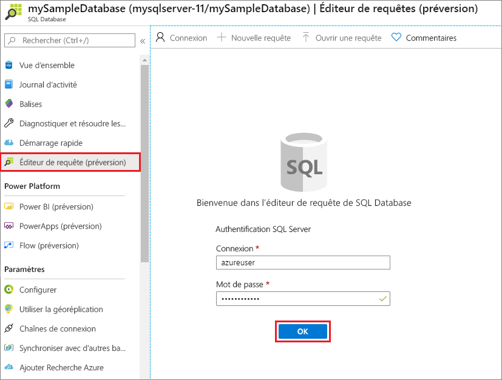
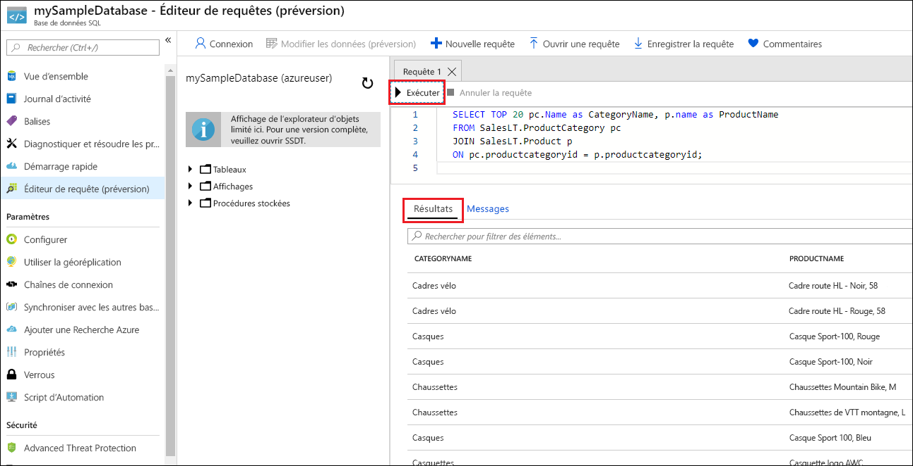

# <a name="quickstart-create-an-azure-sql-database-single-database"></a>Démarrage rapide : Créer une base de données Azure SQL
[!INCLUDE[appliesto-sqldb](../includes/appliesto-sqldb.md)]

Dans ce guide de démarrage rapide, vous utilisez le portail Azure, un script PowerShell ou un script Azure CLI pour créer une base de données Azure SQL Database unique. Vous allez ensuite interroger la base de données à l’aide de l’**éditeur de requête** dans le portail Azure.

La création d’une [base de données unique](single-database-overview.md) est la méthode la plus rapide et la plus simple dans Azure SQL Database. Vous gérez une base de données unique sur un [serveur](logical-servers.md) et cette base de données se trouve dans un [groupe de ressources Azure](../../active-directory-b2c/overview.md), lui-même situé dans une région Azure spécifiée. Dans ce guide de démarrage rapide, vous créez un groupe de ressources et un serveur pour la nouvelle base de données.

Vous pouvez créer une base de données unique avec le niveau de calcul *provisionné* ou *serverless*. Une base de données provisionnée se voit préallouer une quantité définie de ressources de calcul, notamment des ressources mémoire et processeur, et utilise l’un des deux [modèles d’achat](purchasing-models.md). Ce guide de démarrage rapide crée une base de données provisionnée à l’aide du modèle d’achat [vCore](service-tiers-vcore.md). Toutefois, vous pouvez également choisir un modèle [DTU](service-tiers-dtu.md).

Le niveau de calcul serverless n’est disponible qu’avec le modèle d’achat vCore. Il dispose d’une plage de ressources de calcul avec mise à l’échelle automatique, y compris le processeur et la mémoire. Pour créer une base de données unique avec le niveau de calcul serverless, consultez [Créer une base de données serverless](serverless-tier-overview.md#create-new-database-in-serverless-compute-tier).

## <a name="prerequisite"></a>Configuration requise

- Un abonnement Azure actif. Si vous n’en avez pas, [créez un compte gratuit](https://azure.microsoft.com/free/).

## <a name="create-a-single-database"></a>Créer une base de données unique

[!INCLUDE [sql-database-create-single-database](../includes/sql-database-create-single-database.md)]

## <a name="query-the-database"></a>Interroger la base de données

Une fois la base de données créée, vous pouvez utiliser l’**éditeur de requête** intégré au portail Azure pour vous connecter à la base de données et interroger ses données.

1. Dans le portail, recherchez et sélectionnez **Bases de données SQL**, puis sélectionnez votre base de données dans la liste.
1. Sur la page **SQL Database** de votre base de données, sélectionnez **Éditeur de requête (préversion)** dans le menu de gauche.
1. Entrez vos informations de connexion d’administrateur de serveur, puis sélectionnez **OK**.

   

1. Entrez la requête suivante dans le volet **Éditeur de requêtes**.

   ```sql
   SELECT TOP 20 pc.Name as CategoryName, p.name as ProductName
   FROM SalesLT.ProductCategory pc
   JOIN SalesLT.Product p
   ON pc.productcategoryid = p.productcategoryid;
   ```

1. Sélectionnez **Exécuter**, puis passez en revue les résultats de la requête dans le volet **Résultats**.

   

1. Fermez la page **Éditeur de requêtes**, puis sélectionnez **OK** à l’invite pour ignorer les modifications que vous n’avez pas enregistrées.

## <a name="clean-up-resources"></a>Nettoyer les ressources

Conservez le groupe de ressources, le serveur et la base de données unique pour passer aux étapes suivantes et savoir comment vous connecter à votre base de données et interroger ses données à l’aide de différentes méthodes.

Lorsque vous avez terminé d’utiliser ces ressources, vous pouvez supprimer le groupe de ressources que vous avez créé, ce qui supprimera également le serveur et la base de données unique qu’il contient.

### <a name="portal"></a>[Portail](#tab/azure-portal)

Pour supprimer **myResourceGroup** et toutes ses ressources à l’aide du portail Azure :

1. Dans le portail Azure, recherchez puis sélectionnez **Groupes de ressources**, puis sélectionnez **myResourceGroup** dans la liste.
1. Sur la page Groupe de ressources, sélectionnez **Supprimer un groupe de ressources**.
1. Sous **Tapez le nom du groupe de ressources**, entrez *myResourceGroup*, puis sélectionnez **Supprimer**.

### <a name="azure-cli"></a>[Azure CLI](#tab/azure-cli)

Pour supprimer le groupe de ressources et toutes les ressources qu’il contient, exécutez la commande Azure CLI suivante, en utilisant le nom de votre groupe de ressources :

```azurecli-interactive
az group delete --name <your resource group>
```

### <a name="powershell"></a>[PowerShell](#tab/azure-powershell)

Pour supprimer le groupe de ressources et toutes les ressources qu’il contient, exécutez l’applet de commande PowerShell suivante, en utilisant le nom de votre groupe de ressources :

```azurepowershell-interactive
Remove-AzResourceGroup -Name <your resource group>
```

---

## <a name="next-steps"></a>Étapes suivantes

[Connectez-vous à votre base de données et interrogez ses données](connect-query-content-reference-guide.md) à l’aide de différents outils et langages :
> [!div class="nextstepaction"]
> [Connectez-vous à votre base de données et interrogez-la à l’aide de SQL Server Management Studio](connect-query-ssms.md)
> [Connectez-vous à votre base de données et interrogez-la à l’aide d’Azure Data Studio](/sql/azure-data-studio/quickstart-sql-database?toc=/azure/sql-database/toc.json)
