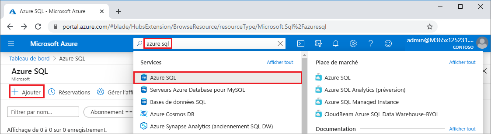
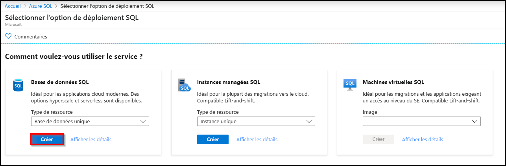
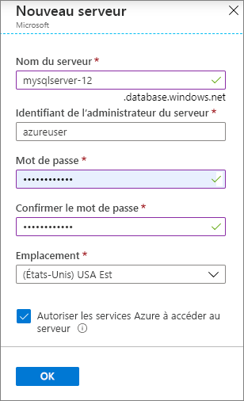
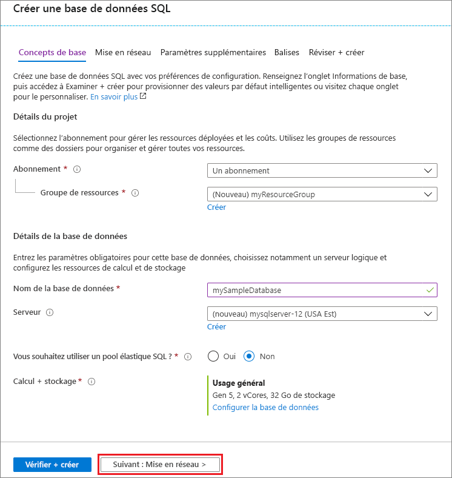
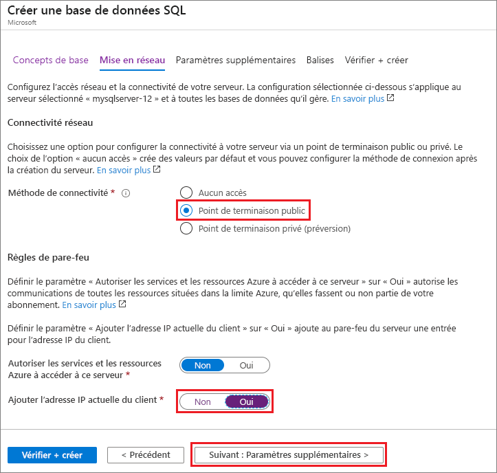
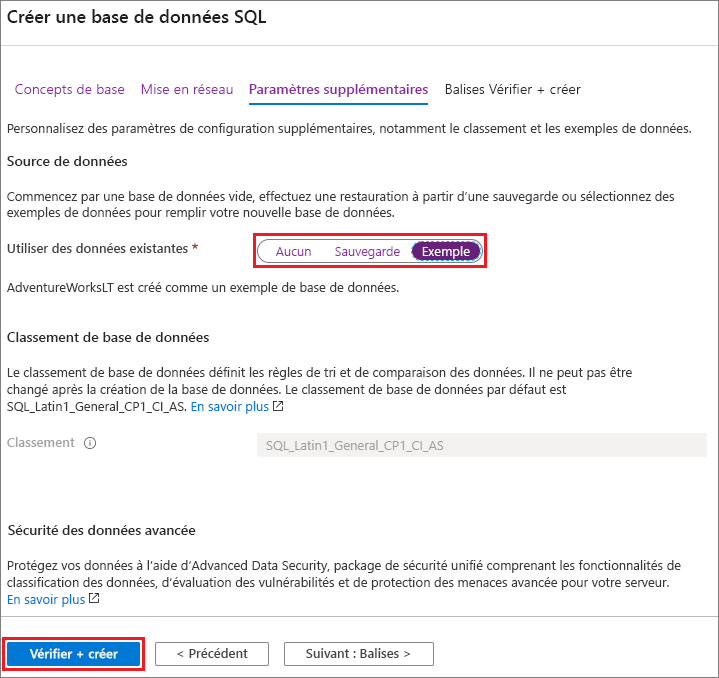

Dans cette étape, vous créez un [serveur SQL logique](../database/logical-servers.md) et une [base de données unique](../database/single-database-overview.md) qui utilise des exemples de données AdventureWorksLT. Vous pouvez créer la base de données à l’aide des menus et écrans du portail Azure, ou à l’aide d’un script Azure CLI ou PowerShell dans Azure Cloud Shell.

Toutes les méthodes incluent la configuration d’une règle de pare-feu au niveau du serveur pour autoriser l’adresse IP publique de l’ordinateur que vous utilisez pour accéder au serveur. Pour plus d’informations sur la création de règles de pare-feu de niveau serveur, consultez [Créer une règle de pare-feu de niveau serveur](../database/firewall-create-server-level-portal-quickstart.md). Vous pouvez également définir des règles de pare-feu au niveau de la base de données. Voir [Créer une règle de pare-feu au niveau de la base de données](/sql/relational-databases/system-stored-procedures/sp-set-database-firewall-rule-azure-sql-database).

# <a name="portal"></a>[Portail](#tab/azure-portal)

Pour créer un groupe de ressources, un serveur et une base de données unique dans le portail Azure :

1. Connectez-vous au [portail](https://portal.azure.com).
1. Dans la barre de recherche, recherchez et sélectionnez **Azure SQL**.
1. Dans la page **Azure SQL**, sélectionnez **Ajouter**.

   

1. Dans la page **Sélectionner l’option de déploiement SQL**, sélectionnez la vignette **Bases de données SQL**, avec **Base de données unique** sous **Type de ressource**. Vous pouvez afficher plus d’informations sur les différentes bases de données en sélectionnant **Afficher les détails**.
1. Sélectionnez **Create** (Créer).

   

1. Sous l’onglet **De base** du formulaire **Créer une base de données SQL**, sous **Détails du projet**, sélectionnez l’**Abonnement** Azure approprié s’il n’est pas déjà sélectionné.
1. Sous **Groupe de ressources**, sélectionnez **Créer**, entrez *myResourceGroup*, puis sélectionnez **OK**.
1. Sous **Détails de la base de données**, comme **Nom de la base de données**, entrez *mySampleDatabase*.
1. Pour **Serveur**, sélectionnez **Créer**, puis remplissez le formulaire **Nouveau serveur** comme suit :
   - **Nom du serveur** : entrez *mysqlserver* et quelques caractères pour l’unicité.
   - **Connexion administrateur au serveur** : entrez *azureuser*.
   - **Mot de passe** : entrez un mot de passe qui répond aux exigences, puis réentrez-le dans le champ **Confirmer le mot de passe**.
   - **Emplacement** : Faites défiler et choisissez un emplacement, par exemple **(États-Unis) USA Est**.

   Sélectionnez **OK**.

   

   Enregistrez la connexion et le mot de passe de l’administrateur du serveur pour pouvoir vous connecter au serveur et à ses bases de données. Si vous oubliez votre mot de passe ou vos identifiants de connexion, vous pouvez obtenir le nom de connexion ou réinitialiser le mot de passe dans la page **SQL Server** après avoir créé la base de données. Pour ouvrir la page **SQL Server**, sélectionnez le nom du serveur dans la page **Vue d’ensemble** de la base de données.

1. Sous **Calcul + stockage**, si vous souhaitez reconfigurer les valeurs par défaut, sélectionnez **Configurer la base de données**.

   Dans la page **Configurer**, vous pouvez éventuellement :
   - Choisir **Provisionné** au lieu de **Serverless** comme **Niveau de calcul**.
   - Passer en revue et modifier les paramètres pour **vCores** et **Taille max. des données**.
   - Sélectionner **Changer la configuration** pour modifier la génération matérielle.

   Après avoir apporté les modifications nécessaires, sélectionnez **Appliquer**.

1. Sélectionnez **Suivant : Réseau** en bas de la page.

   

1. Sous l’onglet **Réseau**, sous **Méthode de connectivité**, sélectionnez **Point de terminaison public**.
1. Sous **Règles de pare-feu**, affectez la valeur **Oui** à **Ajouter l’adresse IP actuelle du client**.
1. Sélectionnez **Suivant : Paramètres supplémentaires** en bas de la page.

   
  
   Pour plus d’informations sur les paramètres de pare-feu, consultez [Autoriser les services et les ressources Azure à accéder à ce serveur](../database/network-access-controls-overview.md) et [Ajouter un point de terminaison privé](../database/private-endpoint-overview.md).

1. Sous l’onglet **Paramètres supplémentaires**, dans la section **Source de données**, pour **Utiliser des données existantes**, sélectionnez **Exemple**.
1. Au bas de la page, sélectionnez **Examiner et créer**.

   

1. Après avoir passé en revue les paramètres, sélectionnez **Créer**.

# <a name="azure-cli"></a>[Azure CLI](#tab/azure-cli)

Vous pouvez créer un groupe de ressources Azure, un serveur et une base de données unique à l’aide de l’interface de ligne de commande Azure (Azure CLI). Si vous ne souhaitez pas utiliser Azure Cloud Shell, [installez Azure CLI](/cli/azure/install-azure-cli) sur votre ordinateur.

Pour exécuter l’exemple de code suivant dans Azure Cloud Shell, sélectionnez **Essayer** dans la barre de titre de l’exemple de code. Quand Cloud Shell s’ouvre, sélectionnez **Copier** dans la barre de titre de l’exemple de code, puis collez l’exemple de code dans la fenêtre Cloud Shell. Dans le code, remplacez `<Subscription ID>` par votre ID d’abonnement Azure et, pour `$startip` et `$endip`, remplacez `0.0.0.0` par l’adresse IP publique de l’ordinateur que vous utilisez.

Suivez les invites à l’écran pour vous connecter à Azure et exécuter le code.

Vous pouvez également utiliser Azure Cloud Shell à partir du portail Azure, en sélectionnant l’icône Cloud Shell dans la barre supérieure.

   

La première fois que vous utilisez Cloud Shell dans le portail, sélectionnez **Bash** dans la boîte de dialogue **Welcome**. Les sessions ultérieures utiliseront Azure CLI dans un environnement Bash, ou vous pouvez sélectionner **Bash** dans la barre de contrôle Cloud Shell.

Le code Azure CLI suivant crée un groupe de ressources, un serveur, une base de données unique et une règle de pare-feu de niveau serveur pour accéder au serveur. Veillez à prendre note du groupe de ressources et des noms de serveurs générés, afin de pouvoir gérer ces ressources ultérieurement.

```azurecli-interactive
#!/bin/bash

# Sign in to Azure and set execution context (if necessary)
az login
az account set --subscription <Subscription ID>

# Set the resource group name and location for your server
resourceGroupName=myResourceGroup-$RANDOM
location=westus2

# Set an admin login and password for your database
adminlogin=azureuser
password=Azure1234567

# Set a server name that is unique to Azure DNS (<server_name>.database.windows.net)
servername=server-$RANDOM

# Set the ip address range that can access your database
startip=0.0.0.0
endip=0.0.0.0

# Create a resource group
az group create \
    --name $resourceGroupName \
    --location $location

# Create a server in the resource group
az sql server create \
    --name $servername \
    --resource-group $resourceGroupName \
    --location $location  \
    --admin-user $adminlogin \
    --admin-password $password

# Configure a server-level firewall rule for the server
az sql server firewall-rule create \
    --resource-group $resourceGroupName \
    --server $servername \
    -n AllowYourIp \
    --start-ip-address $startip \
    --end-ip-address $endip

# Create a gen5 2 vCore database in the server
az sql db create \
    --resource-group $resourceGroupName \
    --server $servername \
    --name mySampleDatabase \
    --sample-name AdventureWorksLT \
    --edition GeneralPurpose \
    --family Gen5 \
    --capacity 2 \
```

Le code précédent utilise ces commandes Azure CLI :

| Commande | Description |
|---|---|
| [az account set](/cli/azure/account?view=azure-cli-latest#az-account-set) | Définit un abonnement en tant qu’abonnement actif. |
| [az group create](/cli/azure/group#az-group-create) | Crée un groupe de ressources dans lequel toutes les ressources sont stockées. |
| [az sql server create](/cli/azure/sql/server#az-sql-server-create) | Crée un serveur qui héberge des bases de données et des pools élastiques. |
| [az sql server firewall-rule create](/cli/azure/sql/server/firewall-rule##az-sql-server-firewall-rule-create) | Crée une règle de pare-feu de niveau serveur. |
| [az sql db create](/cli/azure/sql/db#az-sql-db-create?view=azure-cli-latest) | Crée une base de données. |

Pour obtenir plus d’exemples Azure CLI Azure SQL Database, consultez [Exemples d’interface de ligne de commande Azure](../database/az-cli-script-samples-content-guide.md).

# <a name="powershell"></a>[PowerShell](#tab/azure-powershell)

Vous pouvez créer un groupe de ressources, un serveur et une base de données unique à l’aide de Windows PowerShell. Si vous ne souhaitez pas utiliser Azure Cloud Shell, [installez le module Azure PowerShell](/powershell/azure/install-az-ps).

[!INCLUDE [updated-for-az](../../../includes/updated-for-az.md)]

Pour exécuter l’exemple de code suivant dans Azure Cloud Shell, sélectionnez **Essayer** dans la barre de titre du code. Quand Cloud Shell s’ouvre, sélectionnez **Copier** dans la barre de titre de l’exemple de code, puis collez l’exemple de code dans la fenêtre Cloud Shell. Dans le code, remplacez `<Subscription ID>` par votre ID d’abonnement Azure et, pour `$startIp` et `$endIp`, remplacez `0.0.0.0` par l’adresse IP publique de l’ordinateur que vous utilisez.

Suivez les invites à l’écran pour vous connecter à Azure et exécuter le code.

Vous pouvez également utiliser Azure Cloud Shell à partir du portail Azure, en sélectionnant l’icône Cloud Shell dans la barre supérieure.

   

La première fois que vous utilisez Cloud Shell à partir du portail, sélectionnez **PowerShell** dans la boîte de dialogue **Welcome**. Les sessions ultérieures utiliseront PowerShell, ou vous pouvez le sélectionner à partir de la barre de contrôle Cloud Shell.

Le code PowerShell suivant crée un groupe de ressources Azure, un serveur, une base de données unique et une règle de pare-feu pour accéder au serveur. Veillez à prendre note du groupe de ressources et des noms de serveurs générés, afin de pouvoir gérer ces ressources ultérieurement.

   ```powershell-interactive
   # Set variables for your server and database
   $subscriptionId = '<SubscriptionID>'
   $resourceGroupName = "myResourceGroup-$(Get-Random)"
   $location = "West US"
   $adminLogin = "azureuser"
   $password = "Azure1234567"
   $serverName = "mysqlserver-$(Get-Random)"
   $databaseName = "mySampleDatabase"

   # The ip address range that you want to allow to access your server
   $startIp = "0.0.0.0"
   $endIp = "0.0.0.0"

   # Show randomized variables
   Write-host "Resource group name is" $resourceGroupName
   Write-host "Server name is" $serverName

   # Connect to Azure
   Connect-AzAccount

   # Set subscription ID
   Set-AzContext -SubscriptionId $subscriptionId

   # Create a resource group
   Write-host "Creating resource group..."
   $resourceGroup = New-AzResourceGroup -Name $resourceGroupName -Location $location -Tag @{Owner="SQLDB-Samples"}
   $resourceGroup

   # Create a server with a system wide unique server name
   Write-host "Creating primary server..."
   $server = New-AzSqlServer -ResourceGroupName $resourceGroupName `
      -ServerName $serverName `
      -Location $location `
      -SqlAdministratorCredentials $(New-Object -TypeName System.Management.Automation.PSCredential `
      -ArgumentList $adminLogin, $(ConvertTo-SecureString -String $password -AsPlainText -Force))
   $server

   # Create a server firewall rule that allows access from the specified IP range
   Write-host "Configuring firewall for primary server..."
   $serverFirewallRule = New-AzSqlServerFirewallRule -ResourceGroupName $resourceGroupName `
      -ServerName $serverName `
      -FirewallRuleName "AllowedIPs" -StartIpAddress $startIp -EndIpAddress $endIp
   $serverFirewallRule

   # Create General Purpose Gen4 database with 1 vCore
   Write-host "Creating a gen5 2 vCore database..."
   $database = New-AzSqlDatabase  -ResourceGroupName $resourceGroupName `
      -ServerName $serverName `
      -DatabaseName $databaseName `
      -Edition GeneralPurpose `
      -VCore 2 `
      -ComputeGeneration Gen5 `
      -MinimumCapacity 2 `
      -SampleName "AdventureWorksLT"
   $database
   ```

Le code précédent utilise les applets de commande PowerShell suivantes :

| Commande | Notes |
|---|---|
| [New-AzResourceGroup](/powershell/module/az.resources/new-azresourcegroup) | Crée un groupe de ressources dans lequel toutes les ressources sont stockées. |
| [New-AzSqlServer](/powershell/module/az.sql/new-azsqlserver) | Crée un serveur qui héberge des bases de données et des pools élastiques. |
| [New-AzSqlServerFirewallRule](/powershell/module/az.sql/new-azsqlserverfirewallrule) | Crée une règle de pare-feu de niveau serveur pour un serveur. |
| [New-AzSqlDatabase](/powershell/module/az.sql/new-azsqldatabase) | Crée une base de données. |

Pour obtenir plus d’exemples PowerShell Azure SQL Database, consultez [Exemples Azure PowerShell](../database/powershell-script-content-guide.md).

---
