# Démarrage rapide : Créer une instance managée de SQL Managed Instance
[!INCLUDE[appliesto-sqlmi](../includes/appliesto-sqlmi.md)]

Ce guide de démarrage rapide explique comment créer une instance managée de [SQL Managed Instance](sql-managed-instance-paas-overview.md) dans le portail Azure.

> [!IMPORTANT]
> Pour connaître les limitations, consultez les [régions prises en charge](resource-limits.md#supported-regions) et les [types d’abonnement pris en charge](resource-limits.md#supported-subscription-types).

## Créer une instance gérée

Pour créer une instance managée, effectuez les étapes suivantes : 

### Connectez-vous au portail Azure.

Si vous n’avez pas d’abonnement Azure, [créez un compte gratuit](https://azure.microsoft.com/free/).

1. Connectez-vous au [portail Azure](https://portal.azure.com/).
1. Sélectionnez **Azure SQL** dans le menu de gauche du portail Azure. Si **Azure SQL** ne figure pas dans la liste, sélectionnez **Tous les services**, puis entrez **Azure SQL** dans la zone de recherche.
1. Sélectionnez **+Ajouter** pour ouvrir la page **Sélectionner l’option de déploiement SQL**. Vous pouvez consulter des informations supplémentaires sur Azure SQL Managed Instance en sélectionnant **Afficher les détails** sur la vignette **Instances managées SQL**.
1. Sélectionnez **Create** (Créer).

   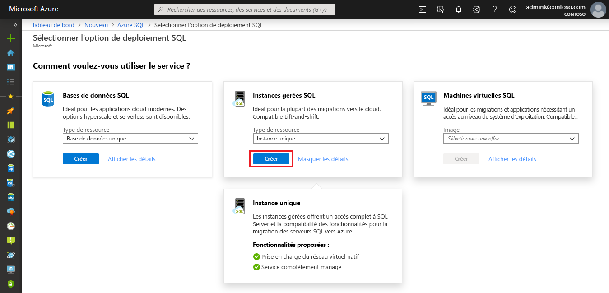

4. Utilisez les onglets du formulaire de provisionnement **Créer une instance managée SQL Azure** pour ajouter les informations obligatoires et facultatives. Les sections suivantes décrivent ces onglets.

### Onglet Informations de base

- Renseignez les informations obligatoires sous l’onglet **Informations de base**. Il s’agit d’informations de base qui sont obligatoires pour provisionner une instance managée.

   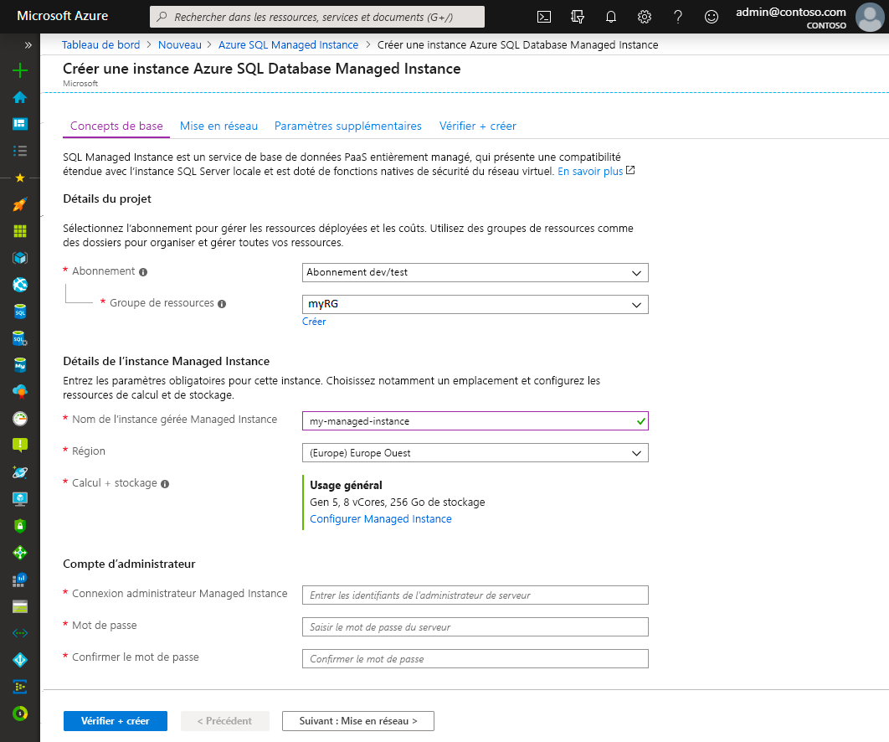

   Référez-vous au tableau ci-dessous pour connaître les informations à renseigner sous cet onglet.

   | Paramètre| Valeur suggérée | Description |
   | ------ | --------------- | ----------- |
   | **Abonnement** | Votre abonnement. | Abonnement vous autorisant à créer des ressources. |
   | **Groupe de ressources** | nouveau groupe de ressources ou groupe de ressources existant.|Pour les noms de groupe de ressources valides, consultez [Naming conventions](/azure/architecture/best-practices/resource-naming) (Conventions d’affectation de nom).|
   | **Nom de l’instance managée** | Nom valide.|Pour connaître les noms valides, consultez [Conventions d’affectation de noms](/azure/architecture/best-practices/resource-naming).|
   | **Région** |Région dans laquelle vous voulez créer l’instance managée.|Pour plus d’informations sur les régions, consultez [Régions Azure](https://azure.microsoft.com/regions/).|
   | **Connexion administrateur de l’instance managée** | N’importe quel nom d’utilisateur valide. | Pour connaître les noms valides, consultez [Conventions d’affectation de noms](/azure/architecture/best-practices/resource-naming). N’utilisez pas « serveradmin », car il s’agit d’un rôle réservé au niveau du serveur.|
   | **Mot de passe** | Mot de passe valide.| Le mot de passe doit contenir au moins 16 caractères et satisfaire aux [exigences de complexité définies](../../virtual-machines/windows/faq.md#what-are-the-password-requirements-when-creating-a-vm).|

- Sélectionnez **Configurer l’instance managée** pour dimensionner les ressources de calcul et de stockage, et pour examiner les niveaux tarifaires. Utilisez les curseurs ou zones de texte pour spécifier la quantité de stockage et le nombre de v-cores. Quand vous avez terminé, sélectionnez **Appliquer** pour enregistrer votre sélection. 

   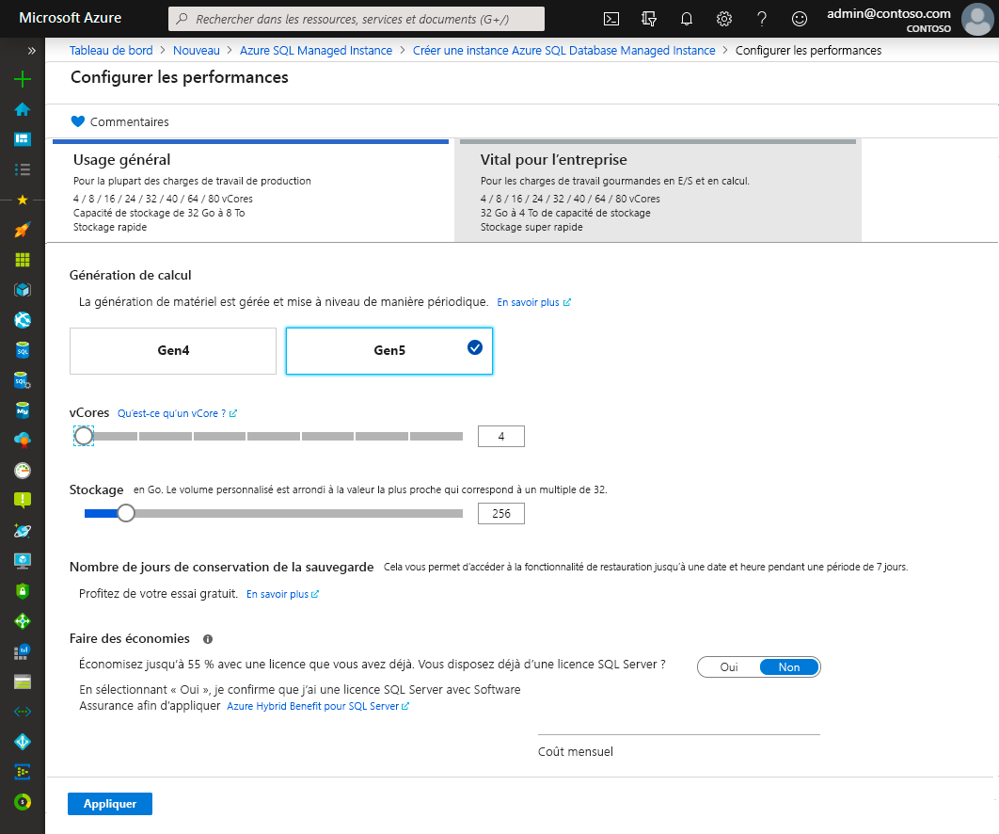

- Pour passer en revue vos choix avant de créer une instance managée SQL, vous pouvez sélectionner **Vérifier + créer**. Vous pouvez aussi configurer les options de réseau en sélectionnant **Suivant : Mise en réseau**.

### Onglet Réseau

- Renseignez les informations facultatives sous l’onglet **Réseau**. Si vous omettez ces informations, le portail applique les paramètres par défaut.

   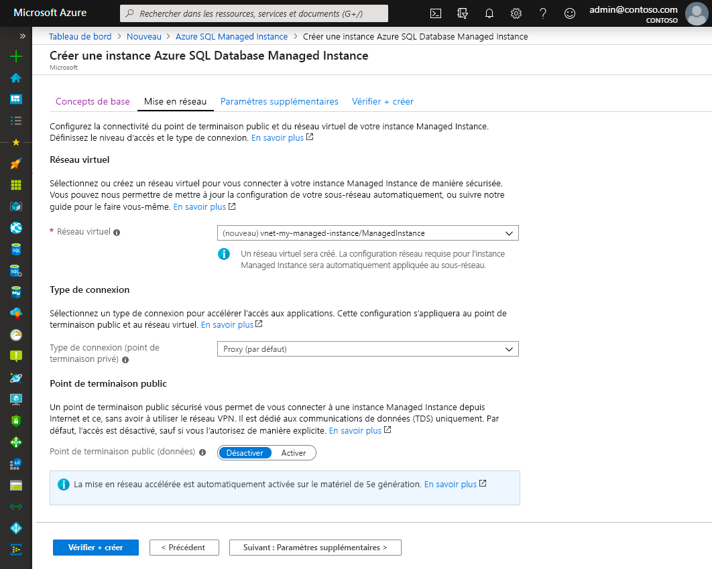

   Référez-vous au tableau ci-dessous pour connaître les informations à renseigner sous cet onglet.

   | Paramètre| Valeur suggérée | Description |
   | ------ | --------------- | ----------- |
   | **Réseau virtuel** | Sélectionnez **Créer un réseau virtuel** ou un réseau virtuel et un sous-réseau valides.| Si un réseau ou un sous-réseau n’est pas disponible, il doit être [modifié pour respecter les exigences réseau](vnet-existing-add-subnet.md) afin de pouvoir être sélectionné comme cible de la nouvelle instance managée. Pour obtenir des informations sur les exigences liées à la configuration de l’environnement réseau pour SQL Managed Instance, consultez [Configurer un réseau virtuel pour SQL Managed Instance](connectivity-architecture-overview.md). |
   | **Type de connexion** | Choisissez entre le type de connexion de proxy et de redirection.|Pour plus d’informations sur les types de connexion, consultez [Type de connexion Azure SQL Managed Instance](../database/connectivity-architecture.md#connection-policy).|
   | **Point de terminaison public**  | Sélectionnez **Activer**. | Pour qu’une instance managée soit accessible via le point de terminaison de données public, vous devez activer cette option. | 
   | **Autoriser l’accès depuis** (si **Point de terminaison public** est activé) | Sélectionnez l'une des options.   |L’expérience du portail vous permet de configurer un groupe de sécurité avec un point de terminaison public.     Selon votre scénario, sélectionnez l’une des options suivantes :   <ul> <li>**Services Azure** : Nous vous recommandons d’utiliser cette option quand vous vous connectez depuis Power BI ou d’un autre service multilocataire. </li> <li> **Internet** : Utilisez cette option à des fins de test quand vous voulez lancer rapidement une instance managée. Son utilisation n’est pas recommandée pour les environnements de production. </li> <li> **Pas d’accès** : Cette option crée une règle de sécurité **Refuser**. Modifiez cette règle pour rendre une instance managée accessible via un point de terminaison public. </li> </ul>   Pour plus d’informations sur la sécurité du point de terminaison public, consultez [Utilisation d’Azure SQL Managed Instance de manière sécurisée avec un point de terminaison public](public-endpoint-overview.md).|

- Sélectionnez **Vérifier + créer** pour passer en revue vos choix avant de créer une instance managée. Vous pouvez aussi configurer d’autres paramètres personnalisés en sélectionnant **Suivant : Paramètres supplémentaires**.

### Paramètres supplémentaires

- Renseignez les informations facultatives sous l’onglet **Paramètres supplémentaires**. Si vous omettez ces informations, le portail applique les paramètres par défaut.

   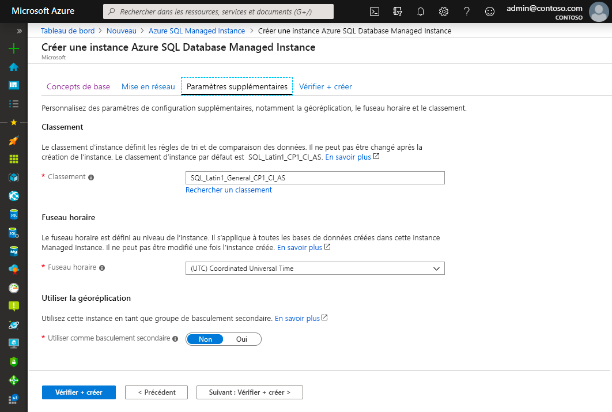

   Référez-vous au tableau ci-dessous pour connaître les informations à renseigner sous cet onglet.

   | Paramètre| Valeur suggérée | Description |
   | ------ | --------------- | ----------- |
   | **Classement** | Choisissez le classement à utiliser pour votre instance managée. Si vous migrez des bases de données à partir de SQL Server, vérifiez le classement de la source avec `SELECT SERVERPROPERTY(N'Collation')` et utilisez cette valeur.| Pour plus d’informations sur les classements, consultez [Définir ou changer le classement du serveur](https://docs.microsoft.com/sql/relational-databases/collations/set-or-change-the-server-collation).|   
   | **Fuseau horaire** | Sélectionnez le fuseau horaire que l’instance managée doit utiliser.|Pour plus d’informations, consultez [Fuseaux horaires](timezones-overview.md).|
   | **Utiliser comme basculement secondaire** | Sélectionnez **Oui**. | Activez cette option pour utiliser l’instance managée comme groupe de basculement secondaire.|
   | **Instance managée SQL principale** (si **Utiliser comme basculement secondaire** est défini sur **Oui**) | Choisissez une instance managée principale existante qui sera jointe à la même zone DNS avec l’instance managée que vous créez. | Cette étape permet de configurer le groupe de basculement après sa création. Pour plus d’informations, consultez [Didacticiel : Ajoutez une instance managée à un groupe de basculement](failover-group-add-instance-tutorial.md).|

## Vérifier + créer

1. Sélectionnez l’onglet **Vérifier + créer** pour passer en revue vos choix avant de créer une instance managée.

   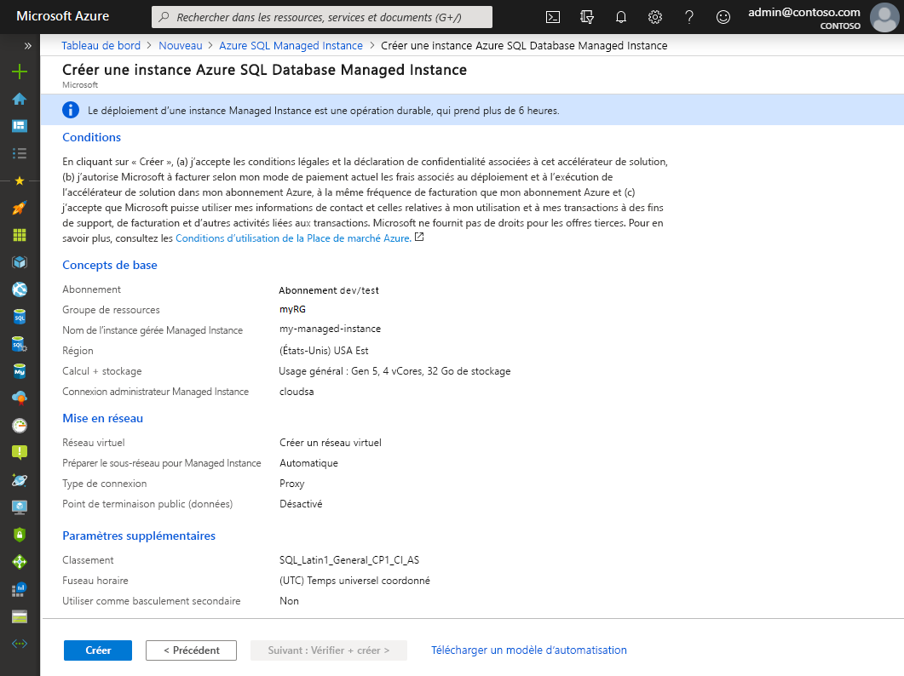

1. Sélectionnez **Créer** pour commencer le provisionnement de l’instance managée.

> [!IMPORTANT]
> Le déploiement d’une instance managée est une opération longue. Le déploiement de la première instance dans le sous-réseau prend généralement plus de temps que le déploiement dans un sous-réseau avec des instances managées existantes. Pour plus d’informations sur les temps de provisionnement moyens, consultez [Opérations de gestion des instances managées SQL](sql-managed-instance-paas-overview.md#management-operations).

## Superviser la progression du déploiement

1. Sélectionnez l’icône **Notifications** pour afficher l’état du déploiement.

   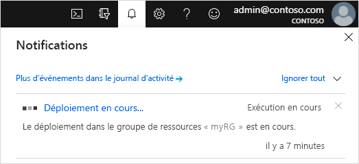

1. Sélectionnez **Déploiement en cours** dans la notification pour ouvrir la fenêtre SQL Managed Instance et pour superviser de façon plus approfondie la progression du déploiement. 

> [!TIP]
> Si vous avez fermé votre navigateur web ou quitté l’écran de progression du déploiement, suivez ces étapes pour accéder à cet écran :
> 1. Dans le portail Azure, ouvrez le groupe de ressources (sous l’onglet **De base**) sur lequel vous déployez SQL Managed Instance.
> 2. Sélectionnez **Déploiements**.
> 3. Sélectionnez l’opération de déploiement de l’instance managée SQL en cours.

> [!IMPORTANT]
> Pour connaître l’état de la création d’une instance managée, vous devez disposer d’**autorisations de lecture** pour le groupe de ressources. Si vous ne disposez pas de cette autorisation ou si vous la révoquez pendant la création de l’instance managée, SQL Managed Instance peut ne pas figurer dans la liste des déploiements de groupes de ressources.
>

## Afficher les ressources créées

Lorsque le déploiement d’une instance managée a réussi, pour voir les ressources créées :

1. Ouvrez le groupe de ressources de votre instance managée. 

   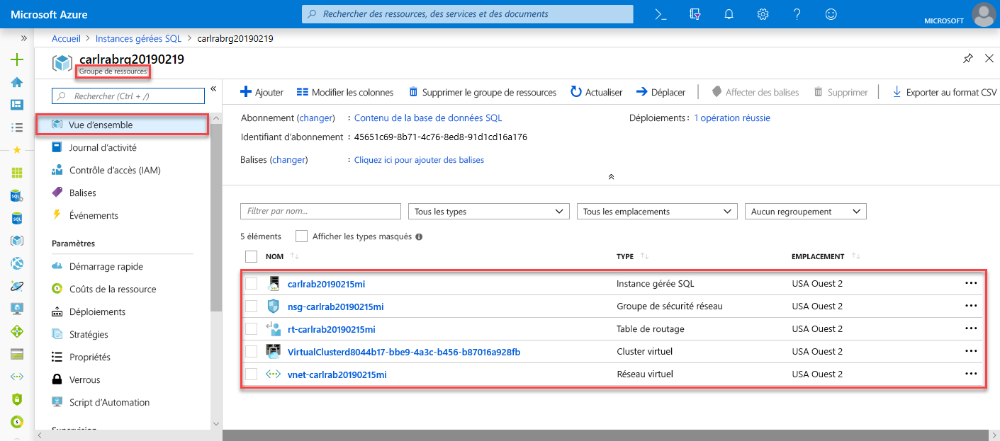

## Consulter et ajuster les paramètres réseau

Pour ajuster les paramètres réseau, examinez les éléments suivants :

1. Sélectionnez la table de routage pour examiner la route définie par l’utilisateur qui a été créée pour vous.

   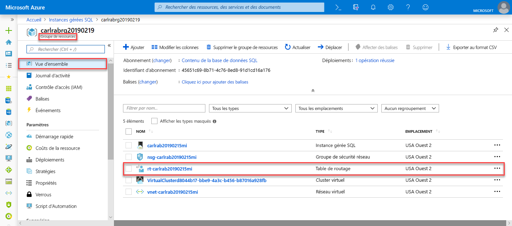

2. Dans la table de routage, passez en revue les entrées pour router le trafic à partir et au sein du réseau virtuel SQL Managed Instance. Si vous créez ou configurez votre table de routage manuellement, veillez à créer ces entrées dans la table de routage de l’instance managée SQL.

   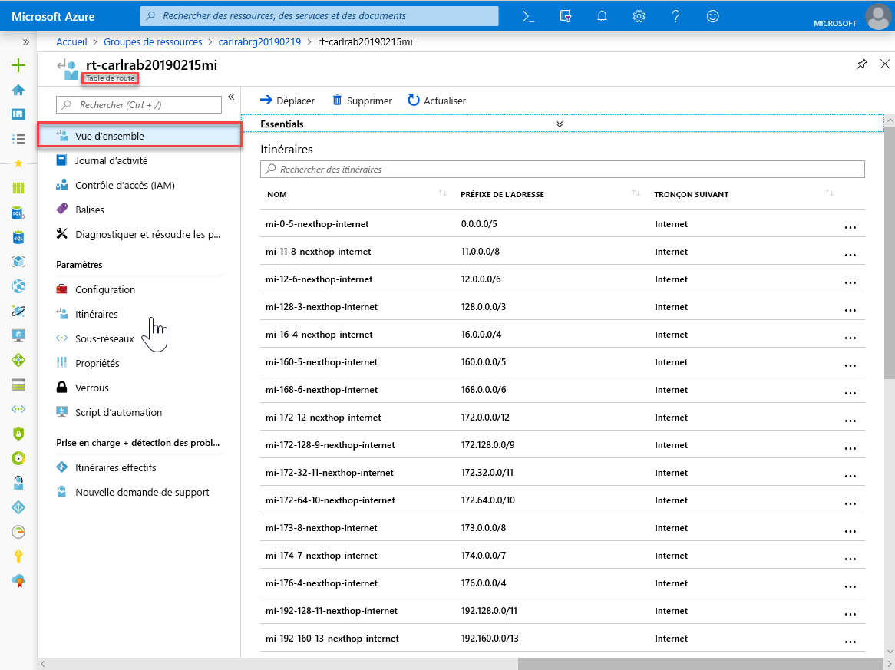

3. Revenez au groupe de ressources et sélectionnez le groupe de sécurité réseau.

   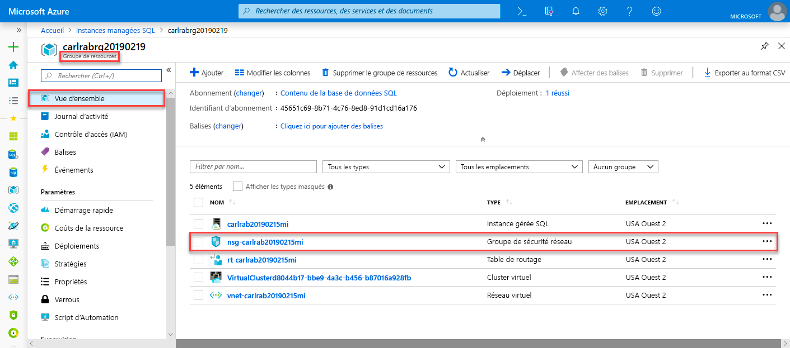

4. Passez en revue les règles de sécurité entrantes et sortantes. 

   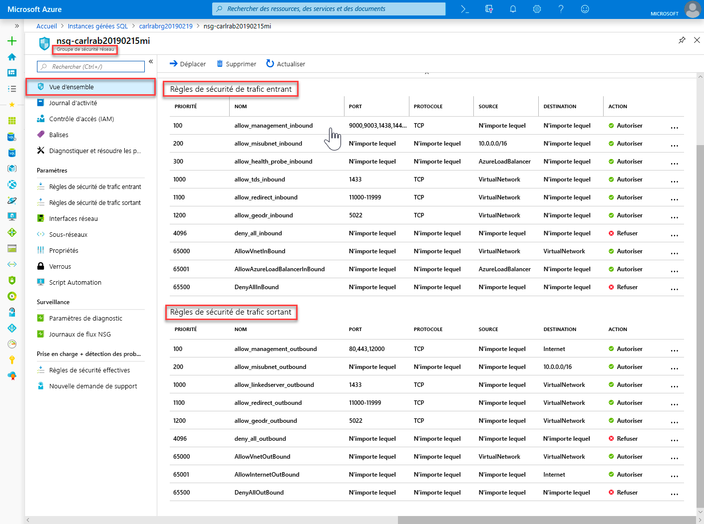

> [!IMPORTANT]
> Si vous avez configuré un point de terminaison public pour SQL Managed Instance, vous devez ouvrir les ports pour autoriser le trafic réseau en autorisant les connexions à SQL Managed Instance à partir de l’Internet public. Pour plus d’informations, consultez [Configurer un point de terminaison public pour SQL Managed Instance](public-endpoint-configure.md#allow-public-endpoint-traffic-on-the-network-security-group).
>

## Récupérer les informations concernant la connexion à l’instance managée SQL

Pour vous connecter à SQL Managed Instance, effectuez les étapes suivantes afin de récupérer le nom d’hôte et le nom de domaine complet (FQDN) :

1. Revenez au groupe de ressources et sélectionnez votre instance managée.

   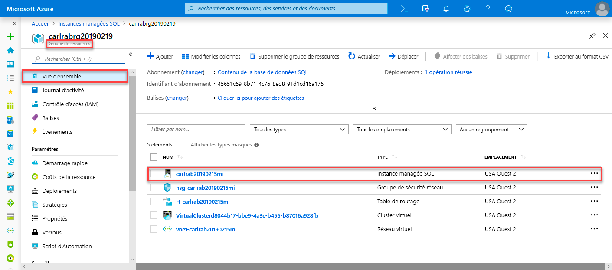

2. Sous l’onglet **Vue d’ensemble**, recherchez la propriété **Hôte**. Copiez le nom d’hôte de l’instance managée pour l’utiliser dans le guide de démarrage rapide suivant.

   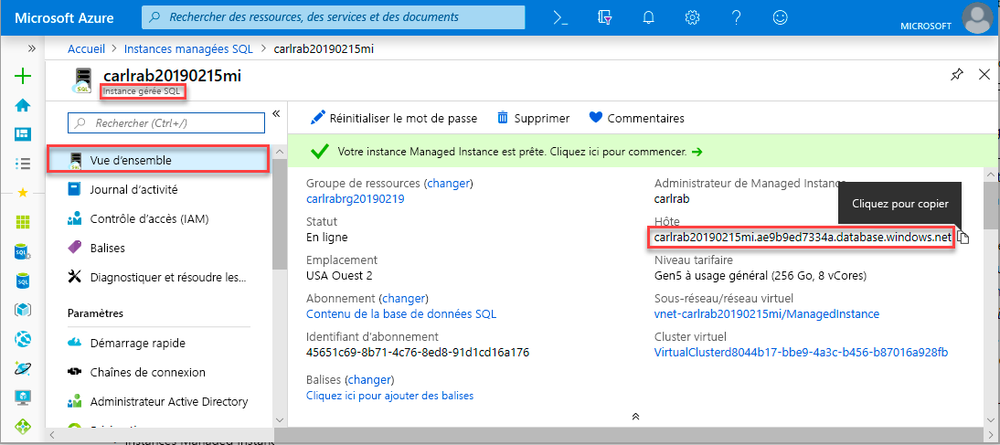

   La valeur copiée représente un nom de domaine complet (FQDN) qui peut être utilisé pour se connecter à l’instance managée SQL. Il est similaire à l’exemple d’adresse suivant : *votre_nom_d’hôte.a1b2c3d4e5f6.database.windows.net*.

## Étapes suivantes

Pour savoir comment se connecter à SQL Managed Instance :
- Pour obtenir une vue d'ensemble des options de connexion des applications, consultez [Connecter vos applications à SQL Managed Instance](connect-application-instance.md).
- Pour suivre un guide de démarrage rapide montrant comment se connecter à SQL Managed Instance à partir d’une machine virtuelle Azure, consultez [Configurer une connexion de machine virtuelle Azure](connect-vm-instance-configure.md).
- Pour suivre un guide de démarrage rapide montrant comment se connecter à SQL Managed Instance à partir d’un ordinateur client local avec une connexion point à site, consultez [Configurer une connexion point à site](point-to-site-p2s-configure.md).

Pour restaurer une base de données SQL Server locale existante dans SQL Managed Instance : 
- Utilisez [Azure Database Migration Service pour la migration](../../dms/tutorial-sql-server-to-managed-instance.md) pour effectuer la restauration à partir d’un fichier de sauvegarde de base de données. 
- Utilisez la [commande T-SQL RESTORE](restore-sample-database-quickstart.md) pour effectuer la restauration à partir d’un fichier de sauvegarde de base de données.

Pour une supervision avancée des performances de base de données SQL Managed Instance avec des informations de dépannage intégrées, consultez [Superviser Azure SQL Managed Instance avec Azure SQL Analytics](../../azure-monitor/insights/azure-sql.md).
