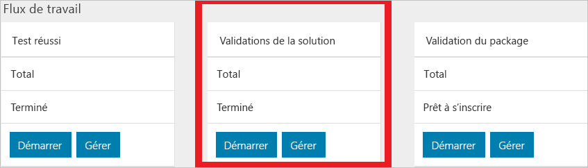

# Démarrage rapide : utiliser le portail de validation en tant que service pour planifier votre premier test

[!INCLUDE[Azure_Stack_Partner](./includes/azure-stack-partner-appliesto.md)]

Apprenez à planifier votre premier test avec la validation comme un portail de service (VaaS) pour vérifier votre matériel. Vous devez déployer l’agent local sur la solution Azure Stack en cours de validation avant d’exécuter les tests de validation.

Dans ce démarrage rapide, vous allez ajouter votre solution et exécuter des tests.

## Prérequis

Avant de suivre ce démarrage rapide, vous devez avoir :
 - Un compte de validation en tant que service. Pour obtenir des instructions, consultez [Configurer votre compte de validation en tant que service](azure-stack-vaas-set-up-account.md).  
- L’agent local installé sur votre système. Pour obtenir des instructions, consultez [Déployer l’agent local et tester les machines virtuelles](azure-stack-vaas-test-vm.md).

## Ajouter une nouvelle solution

1. Connectez-vous au [portail de validation](https://azurestackvalidation.com).

      

2. Sélectionnez **Nouvelle solution**.
3. Entrez un nom pour la solution, puis sélectionnez **Enregistrer**.

## Créer un flux de travail de validation de solution

1. Sélectionnez le nom de la solution.
2. Sélectionnez **Gérer** sur la vignette **Validations de solution**.

    

## Créer un flux de travail de solution

1. Sélectionnez **Validation de nouvelle solution**.
2. Tapez le nom de la validation.
3. Sélectionnez **Minimum** ou **Maximum**.  
    - **Minimum**  
    La solution est configurée avec le nombre minimal de nœuds pris en charge.  
    - **Maximum**  
    La solution est configurée avec le nombre maximal de nœuds pris en charge.
4. Ajoutez vos paramètres d’environnement. Pour plus d’informations, consultez la section [Ajouter des paramètres d’environnement](#add-environmental-parameters).
5. Ajoutez vos paramètres de test courants. Pour plus d’informations, consultez la section [Ajouter des paramètres de test courants](#add-common-test-parameters).

    Selon la définition du test, le test peut vous obliger à entrer une valeur indépendamment des paramètres courants, ou peut vous autoriser à remplacer la valeur du paramètre courant.
6. Cliquez sur **Envoyer** pour planifier le test.

## Ajouter des paramètres d’environnement

Ajoutez les paramètres d’environnement suivants :

| Informations de passe de test | Obligatoire | Description |
| --- | --- | --- | --- |
| Build Azure Stack | Obligatoire | La valeur du numéro de build de Azure Stack (par exemple 20170501.1) doit être un numéro de build ou une version de Azure Stack, par exemple, 1.0.170330.9 |
| ID client | Obligatoire | ID du locataire Active Directory. Il doit s’agir d’un identificateur global unique (par exemple ECA23256-6BA0-4F27-8E4D-AFB02F088363) |
| Région | Obligatoire | Région de déploiement Azure Stack |
| Point de terminaison Resource Manager du locataire | Obligatoire | Point de terminaison pour les opérations Azure Resource Manager du locataire (par exemple https://management.loc-ext.domain.com) |
| Point de terminaison Resource Manager de l’administrateur | Non requis | Point de terminaison pour les opérations Azure Resource Manager du locataire (par exemple https://management.loc-ext.domain.com) |
| FQDN externe | Non requis | Nom de domaine complet externe utilisé comme suffixe pour les points de terminaison. (par exemple, local.azurestack.external ou redmond.contoso.com) |
| Nombre de nœuds | Obligatoire | Nombre de nœuds de votre solution. |

## Ajouter des paramètres de test courants

Ajoutez les paramètres de test courants suivants :

| Informations de passe de test | Obligatoire | Description |
| --- | --- | --- |
| Nom d'utilisateur du locataire | Obligatoire | Nom d’utilisateur du locataire (par exemple tenant@contoso.onmicrosoft.com) |
| Mot de passe du locataire | Obligatoire | Mot de passe du locataire. |
| Nom d’utilisateur de l’administrateur du service | Non requis | Nom d’utilisateur du locataire (par exemple tenant@contoso.onmicrosoft.com) |
| Mot de passe de l’administrateur du service | Non requis | Nom d’utilisateur de l’administrateur du service (par exemple serviceadmin@contoso.onmicrosoft.com) |
| Nom d’utilisateur de l’administrateur du cloud | Non requis | Compte d’administrateur de domaine Azure Stack (par exemple, contoso\cloudadmin) |
| Mot de passe d’administrateur du cloud | Non requis | |
|  Chaîne de connexion des diagnostics | Non requis | URI de signature d'accès partagé (SAP) d’un compte de stockage Azure dans lequel les journaux de diagnostic seront copiés pendant l’exécution des tests. Consultez la section [Créer un blob de stockage Azure pour stocker les journaux](azure-stack-vaas-set-up-account.md#create-an-azure-storage-blob-to-store-logs).   La valeur du paramètre courant **Chaîne de connexion des diagnostics** est stockée par le service et fourni au moment de la planification à tous les tests du flux de travail qui utilisent ce paramètre. Lorsque l’URL SAP doit arriver à expiration dans les 30 jours, vous êtes invité à indiquer une nouvelle URL SAP sur la page des paramètres courants. |
| Balise - Nom | Non requis |  Vous pouvez entrer des balises descriptives pour libeller le flux de travail. Il s’agit du nom de la balise. |
| Balise - Valeur | Non requis | Vous pouvez entrer des balises descriptives pour libeller le flux de travail. Il s’agit de la valeur de la balise. |

## Étapes suivantes

- [Valider une nouvelle solution Azure Stack](azure-stack-vaas-validate-solution-new.md)  
- Apprenez-en davantage sur le service [Validation en tant que service pour Azure Stack](https://docs.microsoft.com/azure/azure-stack/partner).
