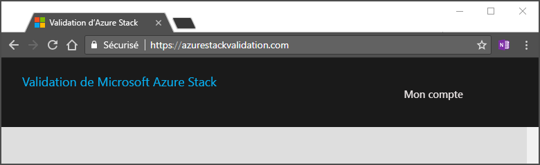

# Configurer votre compte de validation en tant que service

[!INCLUDE [Azure_Stack_Partner](./includes/azure-stack-partner-appliesto.md)]

Validation en tant que service (VaaS) est un service Azure mis à la disposition des partenaires Microsoft Azure Stack ayant un contrat de conception conjointe avec Microsoft pour concevoir, développer, valider, vendre, déployer et prendre en charge les solutions Azure Stack sur le marché.

Découvrez comment préparer votre système pour la validation en tant que service. Configurez l’instance Azure Active Directory et effectuez les autres tâches requises pour préparer l’utilisation de VaaS. 

Les tâches sont les suivantes :

- Créer un blob de stockage Azure pour stocker les journaux
- Déployer l’agent local
- Télécharger l’image de test des machines virtuelles sur l’instance Azure Stack à tester

## Créer un ID de locataire Azure Active Directory

1. Créer un locataire Azure Active Directory dans le [portail Azure](https://portal.azure.com) ou utiliser un locataire existant.

    Nous vous recommandons de créer un locataire spécifiquement pour VaaS en utilisant un nom descriptif, comme ContosoVaaS@onmicrosoft.com. Les fonctionnalités de contrôle d’accès en fonction du rôle (RBAC) du locataire seront utilisées par le partenaire pour gérer les personnes pouvant utiliser VaaS dans son organisation.  
    
    Pour plus d’informations, consultez [Gérer votre répertoire Azure AD](https://docs.microsoft.com/azure/active-directory/active-directory-administer).

    > [!Note]  
    > Pour plus d’informations sur la création de nouveaux locataires Azure Active Directory, consultez [Prise en main de Azure AD](https://docs.microsoft.com/azure/active-directory/get-started-azure-ad).

2. Ajoutez des membres de votre organisation qui seront responsables de l’utilisation du service pour le locataire. Attribuez à chaque utilisateur dans le locataire l’un des rôles suivants pour contrôler leur niveau d’accès à VaaS :

    | Nom du rôle | Description |
    |---------------------|------------------------------------------|
    | Propriétaire | A un accès total à toutes les ressources. |
    | Lecteur | Peut afficher toutes les ressources, mais ne peut pas les modifier. |
    | Contributeur du test | Peut gérer les ressources de test. |
    | Contributeur du catalogue | Peut gérer les ressources de publication de solution. |

## Configurer votre locataire

Configurez votre locataire dans l’application **Azure Stack Validation Service**. 

1. Envoyez les informations suivantes sur le locataire à Microsoft à l’adresse vaashelp@microsoft.com.

    | Données | Description |
    |--------------------------------|---------------------------------------------------------------------------------------------|
    | Nom de l’organisation | Nom officiel de l’organisation. |
    | Nom du répertoire du locataire Azure AD | Nom du répertoire du locataire Azure AD en cours d’inscription. |
    | ID du répertoire du locataire Azure AD | GUID du répertoire du locataire AD Azure associé au répertoire.  Pour plus d’informations sur la façon de trouver votre ID de répertoire de locataire Azure AD, consultez « [Obtenir l’ID de locataire](https://docs.microsoft.com/azure/azure-resource-manager/resource-group-create-service-principal-portal#get-tenant-id) ». |

    

2. L’équipe Azure Stack confirme que votre locataire peut utiliser le portail VaaS.

3. Utilisez les informations d’identification d’administrateur général pour connecter le locataire au [portail VaaS](https://azurestackvalidation.com/
). Sélectionnez **My Account**.

    

3. Le site vous invite à accorder l’accès à VaaS. Acceptez les conditions pour continuer.

## Assigner des rôles d’utilisateur

Pour assigner un rôle d’utilisateur :

1. Connectez-vous au [Portail Azure](https://portal.azure.com).
2. Sélectionnez **Tous les Services** > **Azure Active Directory** dans le groupe **Identité**.
3. Sélectionnez **Applications d’entreprise** > **application Azure Stack Validation Service**.
4. Sélectionnez **Utilisateurs et groupes**. Le panneau **Azure Stack Validation services - Utilisateurs et groupes** répertorie les utilisateurs ayant l’autorisation d’utiliser l’application.
5. Sélectionnez **+ Ajouter un utilisateur** pour ajouter une affectation.

## Créer un blob de stockage Azure pour stocker les journaux

VaaS crée des journaux de diagnostic lors de l’exécution des tests de validation. Pour stocker vos journaux, vous avez besoin d’un emplacement/une URL SAS de service blob Azure. Vous pouvez aussi utiliser le compte de stockage pour stocker les packages de personnalisation OEM.

Ces étapes vous expliquent comment configurer et générer un URI (SAS) de stockage en tant que service pour un compte de stockage Azure et à quel endroit spécifier le compte de stockage dans le portail VaaS lors du démarrage des tests dans le portail.

### Créer un compte de stockage Azure

1. Pour créer un compte de stockage, suivez les instructions [Créer un compte de stockage](../../storage/common/storage-quickstart-create-account.md).

2. Lorsque vous sélectionnez le type de compte de stockage, sélectionnez le type de compte **Stockage Blob**.

### Générer une URL SAS pour le compte de stockage

1. Accédez au compte de stockage créé ci-dessus.

2. Dans le panneau sous **Paramètres**, sélectionnez **Signature d’accès partagé**.

3. Sélectionnez uniquement l’option **Blob** dans **Services autorisés** (désélectionnez les autres options).

4. Sélectionnez **Service**, **Conteneur et **Objet** dans **Types de ressources autorisés**.

5. Sélectionnez **Lire**, **Ecrire**, **Lister**, **Ajouter**, **Créer**  dans **Permissions autorisées** (désélectionnez les autres options).

6. Définissez **Heure de début** sur l’heure actuelle et **Heure de fin** sur trois mois à partir de l’heure actuelle.

7. Sélectionnez **Générer la chaîne de connexion et SAP** et enregistrez la chaîne **URL de la signature d’accès partagé du service BLOB**.

> [!Note]  
> L’URL SAS expire à l’heure de fin définie lors de la génération de l’URL. Assurez-vous que l’URL est suffisamment valide avant de la partager avec l’équipe du produit pour le débogage ou vérifiez que l’URL est valide pendant plus de 30 jours lors de la planification des tests.

## Étapes suivantes

- Utilisez l’agent local VaaS pour vérifier votre matériel. Pour obtenir des instructions, consultez [Déployer l’agent local et tester les machines virtuelles](azure-stack-vaas-test-vm.md).
- Apprenez-en davantage sur la [Validation en tant que service Azure Stack](https://docs.microsoft.com/azure/azure-stack/partner).