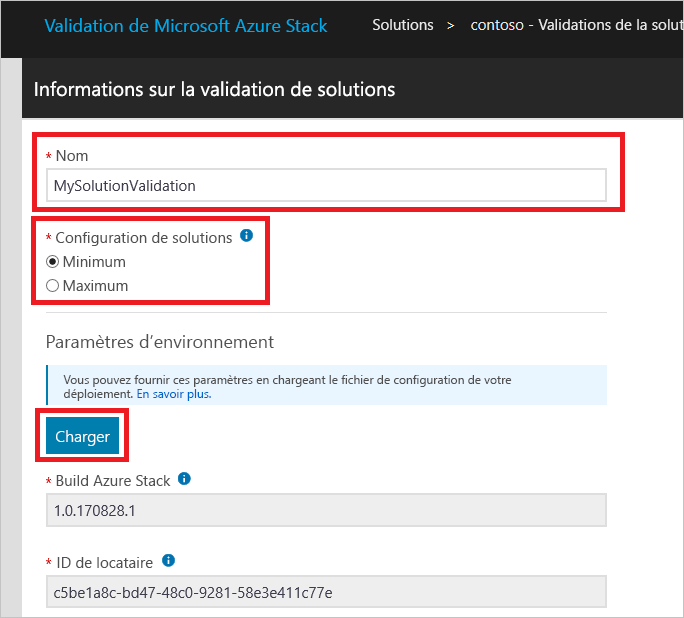
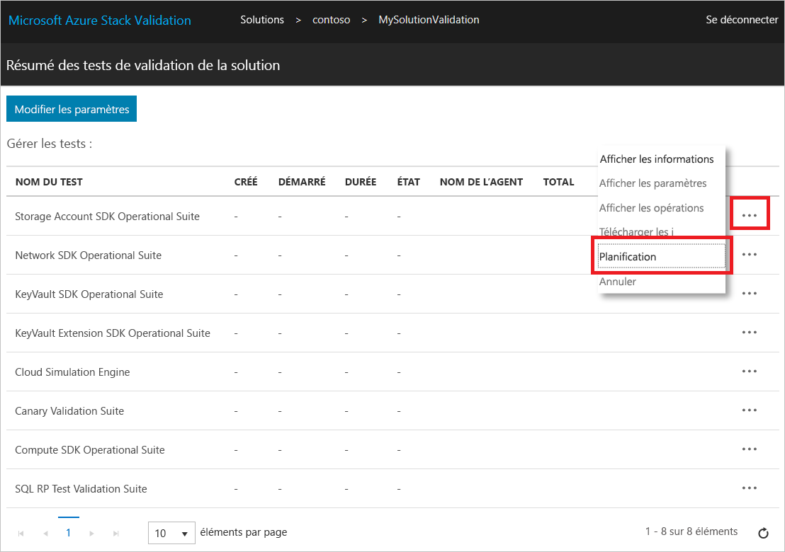

# Valider une nouvelle solution Azure Stack

[!INCLUDE [Azure_Stack_Partner](./includes/azure-stack-partner-appliesto.md)]

Apprenez à utiliser le workflow de **validation de solution** pour certifier de nouvelles solutions Azure Stack.

Une solution Azure Stack est une nomenclature matérielle qui a été convenue conjointement entre Microsoft et le partenaire après avoir satisfait aux exigences de certification du logo Windows Server. Une solution doit être renouvelée en cas d’une modification de la nomenclature matérielle. Si vous avez d’autres questions concernant le renouvellement de la certification de solutions, contactez l’équipe à l’adresse [vaashelp@microsoft.com](mailto:vaashelp@microsoft.com).

Pour certifier votre solution, exécutez deux fois le workflow de validation de solution. Exécutez-le une première fois pour la configuration *minimale* prise en charge. Exécutez-le une seconde fois pour la configuration *maximale* prise en charge. Microsoft certifie la solution si les deux configurations réussissent tous les tests.

[!INCLUDE [azure-stack-vaas-workflow-validation-completion](includes/azure-stack-vaas-workflow-validation-completion.md)]

## Créer un workflow de validation de solution

1. [!INCLUDE [azure-stack-vaas-workflow-step_select-solution](includes/azure-stack-vaas-workflow-step_select-solution.md)]

3. Sélectionnez **Démarrer** sur la vignette **Validations de solution**.

    

4. [!INCLUDE [azure-stack-vaas-workflow-step_naming](includes/azure-stack-vaas-workflow-step_naming.md)]

5. Sélectionnez la **Configuration de la solution**.
    - **Minimale** : la solution est configurée avec le nombre minimal de nœuds pris en charge.
    - **Maximale** : la solution est configurée avec le nombre maximal de nœuds pris en charge.
6. [!INCLUDE [azure-stack-vaas-workflow-step_upload-stampinfo](includes/azure-stack-vaas-workflow-step_upload-stampinfo.md)]

    

7. [!INCLUDE [azure-stack-vaas-workflow-step_test-params](includes/azure-stack-vaas-workflow-step_test-params.md)]

    > [!NOTE]
    > Après la création d’un workflow, les paramètres d’environnement ne peuvent plus être modifiés.

8. [!INCLUDE [azure-stack-vaas-workflow-step_tags](includes/azure-stack-vaas-workflow-step_tags.md)]
9. [!INCLUDE [azure-stack-vaas-workflow-step_submit](includes/azure-stack-vaas-workflow-step_submit.md)]
    Vous allez être redirigé vers la page de résumé de tests.

## Exécuter des tests de validation de solution

Dans la page **Résumé des tests de validation de solution**, vous trouverez une liste des tests à réaliser pour terminer la validation.

Dans les workflows de validation, la **planification** d’un test utilise des paramètres communs au niveau du workflow que vous avez spécifiés lors de la création de votre workflow (voir [Paramètres de flux de travail communs dans la validation en tant que service Azure Stack](azure-stack-vaas-parameters.md)). Si l’une des valeurs de paramètres de test devient non valide, vous devez les redéfinir comme indiqué dans la section relative à la [modification des paramètres de workflow](azure-stack-vaas-monitor-test.md#change-workflow-parameters).

> [!NOTE]
> La planification d’un test de validation sur une instance existante créera une nouvelle instance à la place de l’ancienne contenue dans le portail. Les journaux de l’ancienne instance sont conservés, mais ne sont pas accessibles à partir du portail.  
Dès lors qu’un test est concluant, l’action de **planification** est désactivée.

1. [!INCLUDE [azure-stack-vaas-workflow-step_select-agent](includes/azure-stack-vaas-workflow-step_select-agent.md)]

2. Sélectionnez les tests suivants :
    - Cloud Simulation Engine
    - Compute SDK Operational Suite
    - Disk Identification Test
    - KeyVault Extension SDK Operational Suite
    - KeyVault SDK Operational Suite
    - Network SDK Operational Suite
    - Storage Account SDK Operational Suite

3. Sélectionnez **Planifier** dans le menu contextuel pour ouvrir une invite de planification de l’instance de test.

4. Passez en revue les paramètres de test, puis sélectionnez **Envoyer** pour planifier l’exécution du test.

## Étapes suivantes

- [Surveiller et gérer les tests dans le portail VaaS](azure-stack-vaas-monitor-test.md)