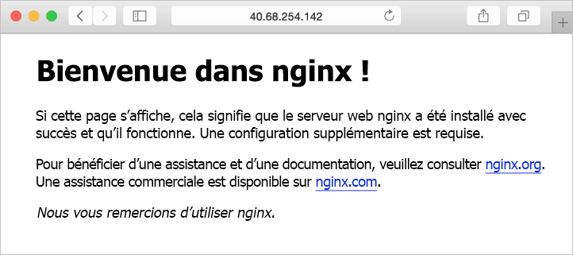

# <a name="quickstart-create-a-linux-server-virtual-machine-by-using-powershell-in-azure-stack"></a>Démarrage rapide : Créer une machine virtuelle de serveur Linux en utilisant PowerShell dans Azure Stack

*S’applique à : systèmes intégrés Azure Stack et Kit de développement Azure Stack*

Vous pouvez créer une machine virtuelle Ubuntu Server 16.04 LTS à l’aide d’Azure Stack PowerShell. Suivez les étapes décrites dans cet article pour créer et utiliser une machine virtuelle.  Cet article vous présente également les étapes pour :

* Se connecter à la machine virtuelle avec un client distant.
* Installer le serveur web NGINX et afficher la page d’accueil par défaut.
* Nettoyer les ressources inutiles.

## <a name="prerequisites"></a>Prérequis

* **Une image Linux dans la Place de Marché Azure Stack**

   La Place de Marché Azure Stack ne contient pas d’image Linux par défaut. Obtenez de l’opérateur d’Azure Stack qu’il vous fournisse l’image **Ubuntu Server 16.04 LTS** dont vous avez besoin. L’opérateur peut utiliser la procédure décrite dans l’article [Télécharger des éléments de la Place de Marché à partir d’Azure dans Azure Stack](../azure-stack-download-azure-marketplace-item.md).

* Azure Stack nécessite une version spécifique d’Azure PowerShell pour créer et gérer les ressources. Si PowerShell n’est pas configuré pour Azure Stack, suivez les étapes permettant [d’installer](azure-stack-powershell-install.md) PowerShell.

* Une fois Azure Stack PowerShell configuré, vous devrez vous connecter à votre environnement Azure Stack. Pour plus d’informations, consultez [Se connecter en tant qu’utilisateur à Azure Stack à l’aide de PowerShell](azure-stack-powershell-configure-user.md).

* Une clé SSH publique nommée id_rsa.pub enregistrée dans le répertoire .ssh de votre profil utilisateur Windows. Pour plus d’informations sur la création de clés SSH, consultez [Création de clés SSH sur Windows](../../virtual-machines/linux/ssh-from-windows.md).

## <a name="create-a-resource-group"></a>Créer un groupe de ressources

Un groupe de ressources est un conteneur logique dans lequel vous pouvez déployer et gérer des ressources Azure Stack. À partir de votre kit de développement ou du système intégré Azure Stack, exécutez le bloc de code suivant pour créer un groupe de ressources. Des valeurs sont attribuées à toutes les variables dans ce document. Vous pouvez utiliser ces valeurs ou en attribuer de nouvelles.

```powershell  
# Create variables to store the location and resource group names.
$location = "local"
$ResourceGroupName = "myResourceGroup"

New-AzureRmResourceGroup `
  -Name $ResourceGroupName `
  -Location $location
```

## <a name="create-storage-resources"></a>Créer des ressources de stockage

Créez un compte de stockage, puis un conteneur de stockage pour l’image Ubuntu Server 16.04 LTS.

```powershell  
# Create variables to store the storage account name and the storage account SKU information
$StorageAccountName = "mystorageaccount"
$SkuName = "Standard_LRS"

# Create a new storage account
$StorageAccount = New-AzureRMStorageAccount `
  -Location $location `
  -ResourceGroupName $ResourceGroupName `
  -Type $SkuName `
  -Name $StorageAccountName

Set-AzureRmCurrentStorageAccount `
  -StorageAccountName $storageAccountName `
  -ResourceGroupName $resourceGroupName

# Create a storage container to store the virtual machine image
$containerName = 'osdisks'
$container = New-AzureStorageContainer `
  -Name $containerName `
  -Permission Blob
```

## <a name="create-networking-resources"></a>Création de ressources de mise en réseau

Créez un réseau virtuel, un sous-réseau et une adresse IP publique. Ces ressources sont utilisées pour fournir une connectivité réseau à la machine virtuelle.

```powershell
# Create a subnet configuration
$subnetConfig = New-AzureRmVirtualNetworkSubnetConfig `
  -Name mySubnet `
  -AddressPrefix 192.168.1.0/24

# Create a virtual network
$vnet = New-AzureRmVirtualNetwork `
  -ResourceGroupName $ResourceGroupName `
  -Location $location `
  -Name MyVnet `
  -AddressPrefix 192.168.0.0/16 `
  -Subnet $subnetConfig

# Create a public IP address and specify a DNS name
$pip = New-AzureRmPublicIpAddress `
  -ResourceGroupName $ResourceGroupName `
  -Location $location `
  -AllocationMethod Static `
  -IdleTimeoutInMinutes 4 `
  -Name "mypublicdns$(Get-Random)"

```

### <a name="create-a-network-security-group-and-a-network-security-group-rule"></a>Créez un groupe de sécurité réseau et une règle de groupe de sécurité réseau

Le groupe de sécurité réseau sécurise la machine virtuelle à l’aide de règles de trafic entrantes et sortantes. Créez une règle de trafic entrant pour le port 3389 pour autoriser les connexions Bureau à distance entrantes, et une règle de trafic entrant pour le port 80 pour autoriser le trafic web entrant.

```powershell
# Create variables to store the network security group and rules names.
$nsgName = "myNetworkSecurityGroup"
$nsgRuleSSHName = "myNetworkSecurityGroupRuleSSH"
$nsgRuleWebName = "myNetworkSecurityGroupRuleWeb"


# Create an inbound network security group rule for port 22
$nsgRuleSSH = New-AzureRmNetworkSecurityRuleConfig -Name $nsgRuleSSHName -Protocol Tcp `
-Direction Inbound -Priority 1000 -SourceAddressPrefix * -SourcePortRange * -DestinationAddressPrefix * `
-DestinationPortRange 22 -Access Allow

# Create an inbound network security group rule for port 80
$nsgRuleWeb = New-AzureRmNetworkSecurityRuleConfig -Name $nsgRuleWebName -Protocol Tcp `
-Direction Inbound -Priority 1001 -SourceAddressPrefix * -SourcePortRange * -DestinationAddressPrefix * `
-DestinationPortRange 80 -Access Allow

# Create a network security group
$nsg = New-AzureRmNetworkSecurityGroup -ResourceGroupName $ResourceGroupName -Location $location `
-Name $nsgName -SecurityRules $nsgRuleSSH,$nsgRuleWeb
```

### <a name="create-a-network-card-for-the-virtual-machine"></a>Créer une carte réseau pour la machine virtuelle

La carte réseau connecte la machine virtuelle à un sous-réseau, un groupe de sécurité réseau et une adresse IP publique.

```powershell
# Create a virtual network card and associate it with public IP address and NSG
$nic = New-AzureRmNetworkInterface `
  -Name myNic `
  -ResourceGroupName $ResourceGroupName `
  -Location $location `
  -SubnetId $vnet.Subnets[0].Id `
  -PublicIpAddressId $pip.Id `
  -NetworkSecurityGroupId $nsg.Id
```

## <a name="create-a-virtual-machine"></a>Création d'une machine virtuelle

Créez une configuration de machine virtuelle. Cette configuration inclut les paramètres utilisés lors du déploiement de la machine virtuelle. Par exemple : informations d’identification de l’utilisateur, taille et image de la machine virtuelle.

```powershell
# Define a credential object.
$UserName='demouser'
$securePassword = ConvertTo-SecureString ' ' -AsPlainText -Force
$cred = New-Object System.Management.Automation.PSCredential ($UserName, $securePassword)

# Create the virtual machine configuration object
$VmName = "VirtualMachinelatest"
$VmSize = "Standard_D1"
$VirtualMachine = New-AzureRmVMConfig `
  -VMName $VmName `
  -VMSize $VmSize

$VirtualMachine = Set-AzureRmVMOperatingSystem `
  -VM $VirtualMachine `
  -Linux `
  -ComputerName "MainComputer" `
  -Credential $cred

$VirtualMachine = Set-AzureRmVMSourceImage `
  -VM $VirtualMachine `
  -PublisherName "Canonical" `
  -Offer "UbuntuServer" `
  -Skus "16.04-LTS" `
  -Version "latest"

$osDiskName = "OsDisk"
$osDiskUri = '{0}vhds/{1}-{2}.vhd' -f `
  $StorageAccount.PrimaryEndpoints.Blob.ToString(),`
  $vmName.ToLower(), `
  $osDiskName

# Sets the operating system disk properties on a virtual machine.
$VirtualMachine = Set-AzureRmVMOSDisk `
  -VM $VirtualMachine `
  -Name $osDiskName `
  -VhdUri $OsDiskUri `
  -CreateOption FromImage | `
  Add-AzureRmVMNetworkInterface -Id $nic.Id

# Configure SSH Keys
$sshPublicKey = Get-Content "$env:USERPROFILE\.ssh\id_rsa.pub"

# Adds the SSH Key to the virtual machine
Add-AzureRmVMSshPublicKey -VM $VirtualMachine `
 -KeyData $sshPublicKey `
 -Path "/home/azureuser/.ssh/authorized_keys"

# Create the virtual machine.
New-AzureRmVM `
  -ResourceGroupName $ResourceGroupName `
 -Location $location `
  -VM $VirtualMachine
```

## <a name="quick-create-virtual-machine---full-script"></a>Création rapide d’une machine virtuelle - Script entier

> [!NOTE]
> Il s’agit plus ou moins du code ci-dessus fusionné, avec un mot de passe plutôt qu’une clé SSH pour l’authentification.

```powershell
## Create a resource group

<#
A resource group is a logical container where you can deploy and manage Azure Stack resources. From your development kit or the Azure Stack integrated system, run the following code block to create a resource group. Values are assigned for all the variables in this document, you can use these values or assign new values.
#>

# Edit your variables here if required

# Create variables to store the location and resource group names.
$location = "local"
$ResourceGroupName = "myResourceGroup"

# Create variables to store the storage account name and the storage account SKU information
$StorageAccountName = "mystorageaccount"
$SkuName = "Standard_LRS"

# Create variables to store the network security group and rules names.
$nsgName = "myNetworkSecurityGroup"
$nsgRuleSSHName = "myNetworkSecurityGroupRuleSSH"
$nsgRuleWebName = "myNetworkSecurityGroupRuleWeb"

# Create variable for virtual machine password
$VMPassword = 'Password123!'

# End of Variables - no need to edit anything past that point to deploy a single VM

# Create Resource Group
New-AzureRmResourceGroup `
  -Name $ResourceGroupName `
  -Location $location

## Create storage resources

# Create a storage account and then create a storage container for the Ubuntu Server 16.04 LTS image.

# Create a new storage account
$StorageAccount = New-AzureRMStorageAccount `
  -Location $location `
  -ResourceGroupName $ResourceGroupName `
  -Type $SkuName `
  -Name $StorageAccountName

Set-AzureRmCurrentStorageAccount `
  -StorageAccountName $storageAccountName `
  -ResourceGroupName $resourceGroupName

# Create a storage container to store the virtual machine image
$containerName = 'osdisks'
$container = New-AzureStorageContainer `
  -Name $containerName `
  -Permission Blob


## Create networking resources

# Create a virtual network, subnet, and a public IP address. These resources are used to provide network connectivity to the virtual machine.

# Create a subnet configuration
$subnetConfig = New-AzureRmVirtualNetworkSubnetConfig `
  -Name mySubnet `
  -AddressPrefix 192.168.1.0/24

# Create a virtual network
$vnet = New-AzureRmVirtualNetwork `
  -ResourceGroupName $ResourceGroupName `
  -Location $location `
  -Name MyVnet `
  -AddressPrefix 192.168.0.0/16 `
  -Subnet $subnetConfig

# Create a public IP address and specify a DNS name
$pip = New-AzureRmPublicIpAddress `
  -ResourceGroupName $ResourceGroupName `
  -Location $location `
  -AllocationMethod Static `
  -IdleTimeoutInMinutes 4 `
  -Name "mypublicdns$(Get-Random)"


### Create a network security group and a network security group rule

<#
The network security group secures the virtual machine by using inbound and outbound rules. Create an inbound rule for port 3389 to allow incoming Remote Desktop connections and an inbound rule for port 80 to allow incoming web traffic.
#>

# Create an inbound network security group rule for port 22
$nsgRuleSSH = New-AzureRmNetworkSecurityRuleConfig -Name $nsgRuleSSHName -Protocol Tcp `
-Direction Inbound -Priority 1000 -SourceAddressPrefix * -SourcePortRange * -DestinationAddressPrefix * `
-DestinationPortRange 22 -Access Allow

# Create an inbound network security group rule for port 80
$nsgRuleWeb = New-AzureRmNetworkSecurityRuleConfig -Name $nsgRuleWebName -Protocol Tcp `
-Direction Inbound -Priority 1001 -SourceAddressPrefix * -SourcePortRange * -DestinationAddressPrefix * `
-DestinationPortRange 80 -Access Allow

# Create a network security group
$nsg = New-AzureRmNetworkSecurityGroup -ResourceGroupName $ResourceGroupName -Location $location `
-Name $nsgName -SecurityRules $nsgRuleSSH,$nsgRuleWeb

### Create a network card for the virtual machine

# The network card connects the virtual machine to a subnet, network security group, and public IP address.

# Create a virtual network card and associate it with public IP address and NSG
$nic = New-AzureRmNetworkInterface `
  -Name myNic `
  -ResourceGroupName $ResourceGroupName `
  -Location $location `
  -SubnetId $vnet.Subnets[0].Id `
  -PublicIpAddressId $pip.Id `
  -NetworkSecurityGroupId $nsg.Id

## Create a virtual machine
<#
Create a virtual machine configuration. This configuration includes the settings used when deploying the virtual machine. For example: user credentials, size, and the virtual machine image.
#>

# Define a credential object.
$UserName='demouser'
$securePassword = ConvertTo-SecureString $VMPassword -AsPlainText -Force
$cred = New-Object System.Management.Automation.PSCredential ($UserName, $securePassword)

# Create the virtual machine configuration object
$VmName = "VirtualMachinelatest"
$VmSize = "Standard_D1"
$VirtualMachine = New-AzureRmVMConfig `
  -VMName $VmName `
  -VMSize $VmSize

$VirtualMachine = Set-AzureRmVMOperatingSystem `
  -VM $VirtualMachine `
  -Linux `
  -ComputerName "MainComputer" `
  -Credential $cred

$VirtualMachine = Set-AzureRmVMSourceImage `
  -VM $VirtualMachine `
  -PublisherName "Canonical" `
  -Offer "UbuntuServer" `
  -Skus "16.04-LTS" `
  -Version "latest"

$osDiskName = "OsDisk"
$osDiskUri = '{0}vhds/{1}-{2}.vhd' -f `
  $StorageAccount.PrimaryEndpoints.Blob.ToString(),`
  $vmName.ToLower(), `
  $osDiskName

# Sets the operating system disk properties on a virtual machine.
$VirtualMachine = Set-AzureRmVMOSDisk `
  -VM $VirtualMachine `
  -Name $osDiskName `
  -VhdUri $OsDiskUri `
  -CreateOption FromImage | `
  Add-AzureRmVMNetworkInterface -Id $nic.Id

# Create the virtual machine.
New-AzureRmVM `
  -ResourceGroupName $ResourceGroupName `
 -Location $location `
  -VM $VirtualMachine
```

## <a name="connect-to-the-virtual-machine"></a>Connectez-vous à la machine virtuelle.

Une fois la machine virtuelle déployée, configurez une connexion SSH pour la machine virtuelle. Utilisez la commande [Get-AzureRmPublicIpAddress](/powershell/module/azurerm.network/get-azurermpublicipaddress?view=azurermps-4.3.1) pour renvoyer l’adresse IP publique de la machine virtuelle.

```powershell
Get-AzureRmPublicIpAddress -ResourceGroupName myResourceGroup | Select IpAddress
```

Sur un système client avec SSH installé, utilisez la commande suivante pour vous connecter à la machine virtuelle. Si vous travaillez sur Windows, vous pouvez utiliser [Putty](http://www.putty.org/) pour créer la connexion.

```
ssh <Public IP Address>
```

Quand vous y êtes invité, connectez-vous en tant que **azureuser**. Si vous avez utilisé une phrase secrète lors de la création des clés SSH, vous devez la fournir.

## <a name="install-the-nginx-web-server"></a>Installer le serveur web NGINX

Pour mettre à jour les ressources du package et installer le dernier package NGINX, exécutez le script suivant :

```bash
#!/bin/bash

# update package source
apt-get -y update

# install NGINX
apt-get -y install nginx
```

## <a name="view-the-nginx-welcome-page"></a>Afficher la page d’accueil NGINX

Avec NGINX installé et le port 80 ouvert sur votre machine virtuelle, vous pouvez accéder au serveur web à l’aide de l’adresse IP publique de la machine virtuelle. Ouvrez un navigateur web et accédez à ```http://<public IP address>```.



## <a name="clean-up-resources"></a>Supprimer des ressources

Nettoyez les ressources dont vous n’avez plus besoin. Pour supprimer ces ressources, vous pouvez utiliser la commande [Remove-AzureRmResourceGroup](/powershell/module/azurerm.resources/remove-azurermresourcegroup?view=azurermps-4.3.1). Pour supprimer le groupe de ressources et toutes ses ressources, exécutez la commande suivante :

```powershell
Remove-AzureRmResourceGroup -Name myResourceGroup
```

## <a name="next-steps"></a>Étapes suivantes

Dans ce guide de démarrage rapide, vous avez déployé une machine virtuelle de serveur Linux de base. Pour en savoir plus sur les machines virtuelles Azure Stack, accédez à [Considérations relatives aux machines virtuelles dans Azure Stack](azure-stack-vm-considerations.md).
