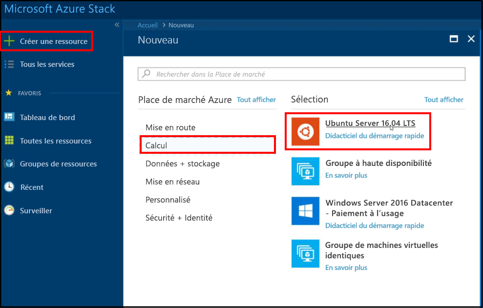
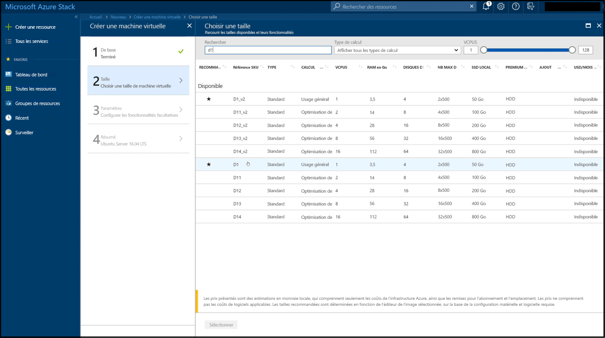
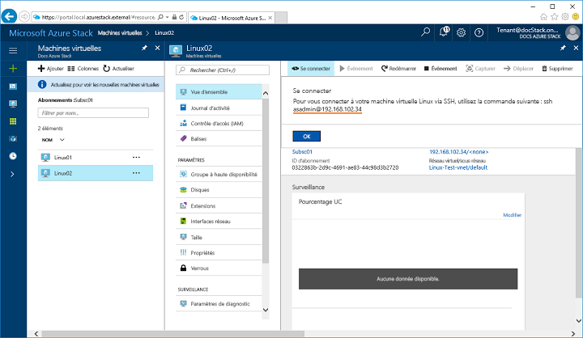
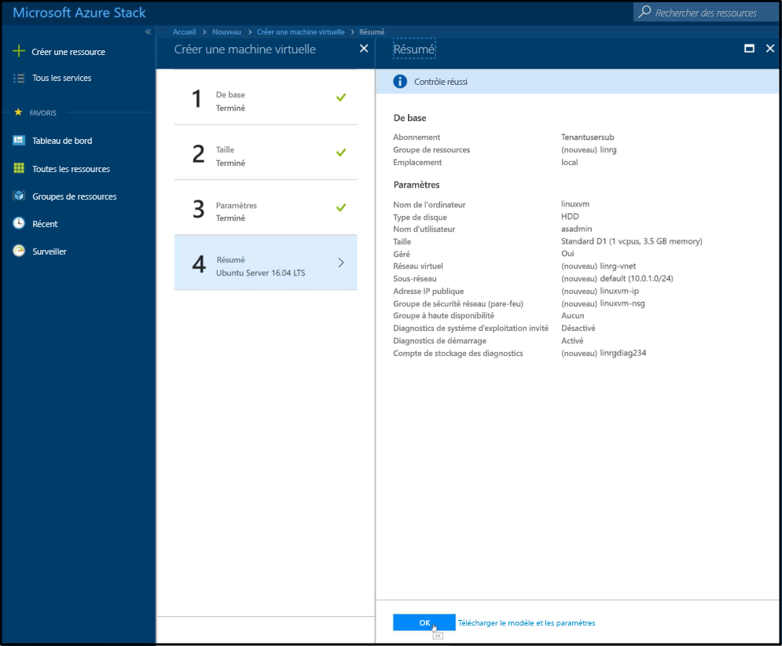

# <a name="quickstart-create-a-linux-server-virtual-machine-with-the-azure-stack-portal"></a>Démarrage rapide : créer une machine virtuelle serveur Linux avec le portail Azure Stack

*S’applique à : systèmes intégrés Azure Stack et Kit de développement Azure Stack*

Vous pouvez créer une machine virtuelle Ubuntu Server 16.04 LTS à partir du portail Azure Stack. Suivez les étapes décrites dans cet article pour créer et utiliser une machine virtuelle. Cet article vous présente également les étapes pour :

* Se connecter à la machine virtuelle avec un client distant.
* Installer un serveur web NGINX.
* Nettoyer des ressources.

> [!NOTE]  
> Dans cet article, les images d’écran sont mises à jour pour correspondre aux modifications apportées à la version 1808 d’Azure Stack. Cette version ajoute la prise en charge de l’utilisation de *disques managés* à celle des disques non managés. Si vous utilisez une version antérieure, certaines images pour des tâches, comme la sélection de disques, sont différentes de celles qui sont affichées dans cet article.  


## <a name="prerequisites"></a>Prérequis

* **Une image Linux dans la Place de Marché Azure Stack**

   La Place de Marché Azure Stack ne propose pas d’image Linux par défaut. Vérifiez que votre opérateur Azure Stack propose l’image **Ubuntu Server 16.04 LTS** dans votre place de marché. L’opérateur peut utiliser la procédure décrite dans l’article [Télécharger des éléments de la Place de Marché à partir d’Azure dans Azure Stack](../azure-stack-download-azure-marketplace-item.md).

* **Accès à un client SSH**

   Si vous utilisez le Kit de développement Azure Stack (ASDK), vous n’aurez peut-être pas accès à un client SSH. Si vous avez besoin d’un client, il existe plusieurs packages comprenant un client SSH. Par exemple, PuTTY comprend un client SSH et un générateur de clé SSH (puttygen.exe). Pour plus d’informations sur les packages disponibles, consultez l’article Azure suivant : [Guide pratique pour utiliser des clés SSH avec Windows sur Azure](https://docs.microsoft.com/azure/virtual-machines/linux/ssh-from-windows#windows-packages-and-ssh-clients).

   Ce guide de démarrage rapide utilise PuTTY pour générer des clés SSH et établir une connexion à la machine virtuelle serveur Linux. Pour télécharger et installer PuTTY, accédez à [https://www.putty.org/](https://www.putty.org).

## <a name="create-an-ssh-key-pair"></a>Création d’une paire de clés SSH

Vous avez besoin d’une paire de clés SSH pour terminer toutes les étapes de cet article. Si vous disposez déjà d’une paire de clés SSH, vous pouvez ignorer cette étape.

1. Accédez au dossier d’installation PuTTY (l’emplacement par défaut est ```C:\Program Files\PuTTY```) et exécutez ```puttygen.exe```.
2. Dans la fenêtre PuTTY Key Generator (Générateur de clé PuTTY), vérifiez que le type de clé à générer (**Type of key to generate**) est **RSA** et que le nombre de bits dans une clé générée (**Number of bits in a generated key**) est **2048**. Quand vous êtes prêt, cliquez sur **Générer**.

   

3. Pour générer une clé, déplacez votre curseur de façon aléatoire dans la fenêtre du générateur de clé PuTTY.
4. Une fois la clé générée, cliquez sur **Enregistrer la clé publique** et **Enregistrer la clé privée** pour enregistrer vos clés privée et publique dans des fichiers.

   

## <a name="sign-in-to-the-azure-stack-portal"></a>Se connecter au portail Azure Stack

Connectez-vous au portail Azure Stack. L’adresse du portail Azure Stack varie en fonction du produit Azure Stack auquel vous vous connectez :

* Pour le Kit de développement Azure Stack (ASDK), accédez à : https://portal.local.azurestack.external.
* Pour un système intégré Azure Stack, accédez à l’URL fournie par votre opérateur Azure Stack.

## <a name="create-the-virtual-machine"></a>Créer la machine virtuelle

1. Cliquez sur **Créer une ressource** en haut à gauche du portail Azure Stack.

2. Sélectionnez **Compute**, puis sélectionnez **Ubuntu Server 16.04 LTS**.
   
   
1. Cliquez sur **Créer**.

4. Tapez les informations relatives à la machine virtuelle. Dans **Type d’authentification**, sélectionnez **Clé publique SSH**. Collez la clé publique SSH enregistrée, puis cliquez sur **OK**.

   > [!NOTE]
   > Veillez à supprimer tout espace blanc au début ou la fin de la clé.

   

5. Sélectionnez **D1** pour la machine virtuelle.

   

6. Dans la page **Paramètres**, apportez les modifications souhaitées aux valeurs par défaut.
   
   - À compter de la version 1808 d’Azure Stack, vous pouvez désormais choisir d’utiliser des *disques managés* lorsque vous configurez le **Stockage**. Avant la version 1808, seuls les disques non managés peuvent être utilisés.    
     
    
     Lorsque vos configurations sont prêtes, sélectionnez **OK** pour continuer.

7. Dans la page **Résumé**, cliquez sur **OK** pour démarrer le déploiement de machine virtuelle.  
   

## <a name="connect-to-the-virtual-machine"></a>Connectez-vous à la machine virtuelle.

1. Cliquez sur **Se connecter** dans la page de la machine virtuelle. Vous pouvez trouver la chaîne de connexion SSH dont vous avez besoin pour vous connecter à la machine virtuelle. 

2. Ouvrez PuTTY.

3. Dans l’écran Configuration PuTTY, vous utiliserez la fenêtre **Catégorie** pour faire défiler vers le haut ou vers le bas. Faites défiler jusqu'à **SSH**, développez **SSH**, puis cliquez sur **Auth**. Cliquez sur **Parcourir** et choisissez le fichier de clé privée que vous avez enregistré.
   

4. Défiler vers le haut dans la fenêtre **catégorie**, puis cliquez sur **Session**.
5. Dans la zone **Nom d’hôte (ou adresse IP)**, collez la chaîne de connexion affichée dans le portail Azure Stack. Dans cet exemple, la chaîne est ```asadmin@192.168.102.34```.

   

6. Cliquez sur **Ouvrir** pour ouvrir une session pour la machine virtuelle.

   

## <a name="install-the-nginx-web-server"></a>Installer le serveur web NGINX

Utilisez les commandes Bash suivantes pour mettre à jour les sources de package et installer le dernier package NGINX sur la machine virtuelle.

```bash
#!/bin/bash

# update package source
sudo apt-get -y update

# install NGINX
sudo apt-get -y install nginx
```

Une fois que vous avez terminé l’installation de NGINX, fermez la session SSH et ouvrez la page Vue d’ensemble de la machine virtuelle dans le portail Azure Stack.

## <a name="open-port-80-for-web-traffic"></a>Ouvrez le port 80 pour le trafic web

Un groupe de sécurité réseau (NSG) sécurise les trafics entrant et sortant. Quand une machine virtuelle est créée dans le portail Azure Stack, une règle de trafic entrant est créée sur le port 22 pour les connexions SSH. Comme cette machine virtuelle héberge un serveur web, vous devez créer une règle NSG pour permettre un trafic web par le port 80.

1. Sur la page **Vue d’ensemble** de la machine virtuelle, cliquez sur le nom du **Groupe de ressources**.
2. Sélectionnez le **groupe de sécurité réseau** pour la machine virtuelle. Le groupe de sécurité réseau peut être identifié à l’aide de la colonne **Type**.
3. Dans le menu de gauche, sous **Paramètres**, cliquez sur **Règles de sécurité entrantes**.
4. Cliquez sur **Add**.
5. Dans **Nom**, tapez **http**. Assurez-vous que l’option **Plage de ports** est définie sur 80 et l’option **Action** sur **Autoriser**.
6. Cliquez sur **OK**

## <a name="view-the-nginx-welcome-page"></a>Afficher la page d’accueil NGINX

Avec NGINX installé et le port 80 ouvert sur votre machine virtuelle, vous pouvez accéder au serveur web à l’aide de l’adresse IP publique de la machine virtuelle. (L’adresse IP publique est affichée sur la page de vue d’ensemble de la machine virtuelle.)

Ouvrez un navigateur web et accédez à ```http://<public IP address>```.


## <a name="clean-up-resources"></a>Supprimer des ressources

Nettoyez les ressources dont vous n’avez plus besoin. Pour supprimer la machine virtuelle et ses ressources, sélectionnez le groupe de ressources sur la page de la machine virtuelle, puis cliquez sur **Supprimer**.

## <a name="next-steps"></a>Étapes suivantes

Dans ce guide de démarrage rapide, vous avez déployé une machine virtuelle serveur de base sous Linux avec un serveur web. Pour en savoir plus sur les machines virtuelles Azure Stack, continuez avec [Considérations relatives aux machines virtuelles dans Azure Stack](azure-stack-vm-considerations.md).
