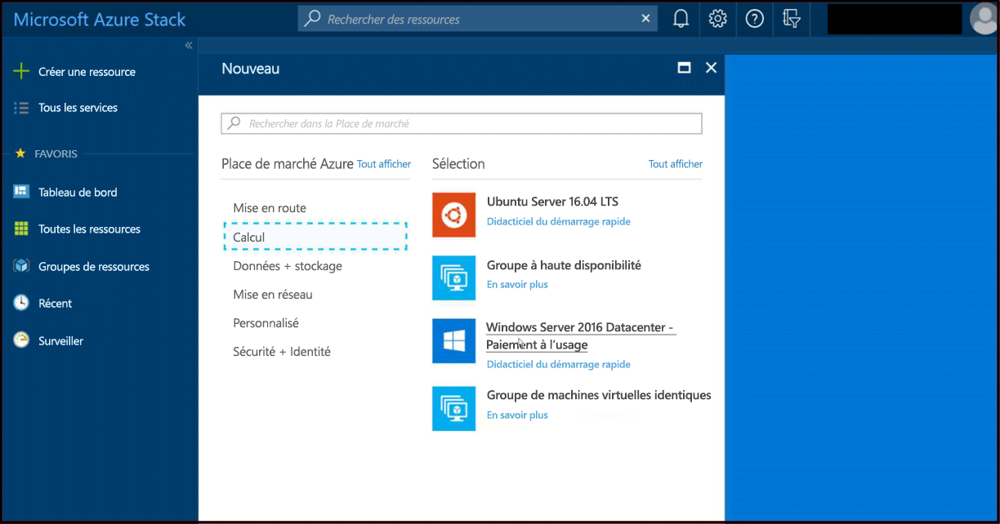
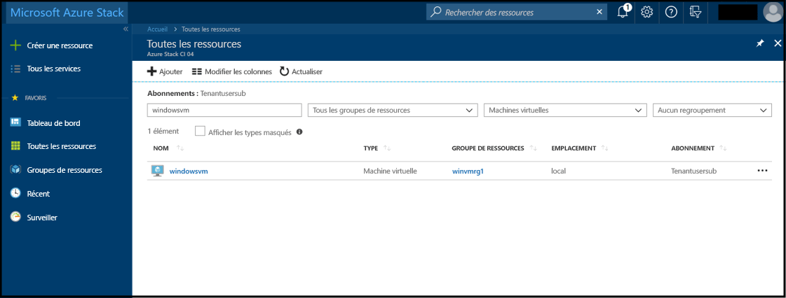

# Démarrage rapide : créer une machine virtuelle Windows Server avec le portail Azure Stack

*S’applique à : systèmes intégrés Azure Stack et Kit de développement Azure Stack*

Vous pouvez créer une machine virtuelle Windows Server 2016 dans le portail Azure Stack. Suivez les étapes décrites dans cet article pour créer et utiliser une machine virtuelle.

## Se connecter au portail Azure Stack

Connectez-vous au portail Azure Stack. L’adresse du portail Azure Stack varie en fonction du produit Azure Stack auquel vous vous connectez :

* Pour le Kit de développement Azure Stack (ASDK), accédez à : https://portal.local.azurestack.external.
* Pour un système intégré Azure Stack, accédez à l’URL fournie par votre opérateur Azure Stack.

## Création d'une machine virtuelle

1. Dans le portail, cliquez sur **Nouveau** > **Calcul** > **Windows Server 2016 Datacenter Eval** > **Créer**. Si vous ne voyez pas l’entrée **Windows Server 2016 Datacenter Eval**, contactez votre opérateur Azure Stack. Demandez-lui de l’ajouter à la Place de Marché comme expliqué dans l’article [Ajouter l’image de machine virtuelle Windows Server 2016 à la Place de Marché Azure Stack](../azure-stack-add-default-image.md).

    
2. Sous **De base**, tapez un **Nom**, un **Nom d’utilisateur** et un **Mot de passe**. Choisissez un **Abonnement**. Créez un **Groupe de ressources** ou sélectionnez un groupe existant, sélectionnez un **Emplacement**, puis cliquez sur **OK**.

    
3. Sous **Choisir une taille**, cliquez sur **D1 Standard** > **Sélectionner**.
    
4. Sous **Paramètres**, acceptez les valeurs par défaut et cliquez sur **OK**.
    
5. Sous **Résumé**, cliquez sur **OK** pour créer la machine virtuelle.
    
6. Pour voir votre nouvelle machine virtuelle, cliquez sur **Toutes les ressources**, recherchez le nom de la machine virtuelle, puis cliquez sur son nom dans les résultats de la recherche.
    

## Supprimer des ressources

Quand vous avez fini d’utiliser la machine virtuelle, supprimez-la tout comme ses ressources. Pour ce faire, sélectionnez le groupe de ressources dans la page de la machine virtuelle, puis cliquez sur **Supprimer**.

## Étapes suivantes

Dans ce guide de démarrage rapide, vous avez déployé une machine virtuelle Windows Server de base. Pour en savoir plus sur les machines virtuelles Azure Stack, continuez avec [Considérations relatives aux machines virtuelles dans Azure Stack](azure-stack-vm-considerations.md).
