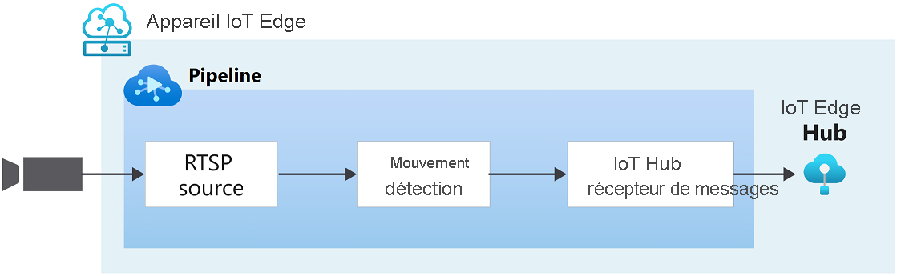

# Démarrage rapide : Détecter les événements de mouvement et d’émission

Ce guide de démarrage rapide vous guide tout au long des étapes de prise en main d’Azure Video Analyzer. Il utilise une machine virtuelle Azure comme appareil IoT Edge et un flux vidéo en direct simulé. Une fois les étapes de configuration terminées, vous pourrez exécuter un flux vidéo en direct simulé via un pipeline vidéo qui détecte et signale les mouvements dans ce flux. Le diagramme suivant montre une représentation graphique de ce pipeline.

> [!div class="mx-imgBorder"]
> :::image type="content" source="./media/get-started-detect-motion-emit-events/motion-detection.svg" alt-text="Détecter le mouvement":::

::: zone pivot="programming-language-csharp"
[!INCLUDE [header](includes/detect-motion-emit-events-quickstart/csharp/header.md)]
::: zone-end

::: zone pivot="programming-language-python"
[!INCLUDE [header](includes/detect-motion-emit-events-quickstart/python/header.md)]
::: zone-end

## Prérequis

::: zone pivot="programming-language-csharp"
[!INCLUDE [prerequisites](./includes/common-includes/csharp-prerequisites.md)]
::: zone-end

::: zone pivot="programming-language-python"
[!INCLUDE [prerequisites](./includes/common-includes/python-prerequisites.md)]
::: zone-end

## Configurer les ressources Azure

[!INCLUDE [resources](./includes/common-includes/azure-resources.md)]

## Vue d’ensemble

Ce diagramme montre comment les signaux circulent dans ce guide de démarrage rapide. Un [module de périphérie](https://github.com/Azure/video-analyzer/tree/main/edge-modules/sources/rtspsim-live555) simule une caméra IP hébergeant un serveur RTSP (Real-Time Streaming Protocol). Un nœud [source RTSP](pipeline.md#rtsp-source) extrait le flux vidéo provenant de ce serveur et envoie des images vidéo au nœud [processeur de détection de mouvement](pipeline.md#motion-detection-processor). Le nœud processeur de détection de mouvement vous permet de détecter les mouvements dans une vidéo en direct. Il examine les images vidéo entrantes et détermine s’il y a un mouvement dans la vidéo. Si un mouvement est détecté, il déclenche le passage de l’image vidéo au nœud suivant du pipeline, et l’émission d’un événement. Enfin, tous les événements émis sont envoyés au récepteur de messages du hub IoT où ils sont publiés sur IoT Hub.

## Configurer l''environnement de développement

::: zone pivot="programming-language-csharp"
[!INCLUDE [setup development environment](./includes/set-up-dev-environment/csharp/csharp-set-up-dev-env.md)]
::: zone-end

::: zone pivot="programming-language-python"
[!INCLUDE [setup development environment](./includes/set-up-dev-environment/python/python-set-up-dev-env.md)]
::: zone-end

## Réviser l’exemple de vidéo

::: zone pivot="programming-language-csharp"
[!INCLUDE [review-sample-video](./includes/detect-motion-emit-events-quickstart/csharp/review-sample-video.md)]
::: zone-end

::: zone pivot="programming-language-python"
[!INCLUDE [review-sample-video](./includes/detect-motion-emit-events-quickstart/python/review-sample-video.md)]
::: zone-end

## Examiner les exemples de fichiers

::: zone pivot="programming-language-csharp"
[!INCLUDE [examine-sample-files](./includes/detect-motion-emit-events-quickstart/csharp/examine-sample-files.md)]
::: zone-end

::: zone pivot="programming-language-python"
[!INCLUDE [examine-sample-files](./includes/detect-motion-emit-events-quickstart/python/examine-sample-files.md)]
::: zone-end

## Générer et déployer le manifeste de déploiement

::: zone pivot="programming-language-csharp"
[!INCLUDE [generate-deploy-deployment-manifest](./includes/detect-motion-emit-events-quickstart/csharp/generate-deploy-deployment-manifest.md)]
::: zone-end

::: zone pivot="programming-language-python"
[!INCLUDE [generate-deploy-deployment-manifest](./includes/detect-motion-emit-events-quickstart/python/generate-deploy-deployment-manifest.md)]
::: zone-end

## Préparer la supervision d’événements

::: zone pivot="programming-language-csharp"
[!INCLUDE [prepare-monitor-events](./includes/detect-motion-emit-events-quickstart/csharp/prepare-monitor-events.md)]
::: zone-end

::: zone pivot="programming-language-python"
[!INCLUDE [prepare-monitor-events](./includes/detect-motion-emit-events-quickstart/python/prepare-monitor-events.md)]
::: zone-end

## Exécuter l'exemple de programme

::: zone pivot="programming-language-csharp"
[!INCLUDE [run-sample-program](./includes/detect-motion-emit-events-quickstart/csharp/run-sample-program.md)]
::: zone-end

::: zone pivot="programming-language-python"
[!INCLUDE [run-sample-program](./includes/detect-motion-emit-events-quickstart/python/run-sample-program.md)]
::: zone-end

## Interpréter les résultats

::: zone pivot="programming-language-csharp"
[!INCLUDE [interpret-results](includes/detect-motion-emit-events-quickstart/csharp/interpret-results.md)]
::: zone-end

::: zone pivot="programming-language-python"
[!INCLUDE [interpret-results](includes/detect-motion-emit-events-quickstart/python/interpret-results.md)]
::: zone-end

## Nettoyer les ressources

Si vous envisagez d’essayer les autres guides de démarrage rapide, vous devez conserver les ressources que vous avez créées. Dans le cas contraire, dans le portail Azure, accédez à vos groupes de ressources, sélectionnez le groupe de ressources où vous avez exécuté ce guide de démarrage rapide, puis supprimez toutes les ressources.

## Étapes suivantes

- Suivez le guide de démarrage rapide [Analyser une vidéo en direct avec votre propre modèle](analyze-live-video-use-your-model-http.md) pour appliquer l’IA à des flux vidéo en direct.
- Passez en revue les défis supplémentaires pour les utilisateurs expérimentés :

  - Utilisez une [caméra IP](https://en.wikipedia.org/wiki/IP_camera) qui prend en charge RTSP au lieu d’utiliser le simulateur RTSP. Vous trouverez les caméras IP qui prennent RTSP en charge dans la page des [produits conformes ONVIF](https://www.onvif.org/conformant-products/). Recherchez les appareils conformes aux profils G, S ou T.
  - Utilisez un appareil Linux AMD64 ou x64 au lieu d’utiliser une machine virtuelle Linux dans Azure. Cet appareil doit se trouver dans le même réseau que la caméra IP. Suivez les instructions données dans [Installer le runtime Azure IoT Edge sur Linux](/azure/iot-edge/how-to-install-iot-edge?view=iotedge-2020-11&preserve-view=true). Suivez ensuite les instructions dans [Déployer votre premier module IoT Edge sur un appareil virtuel Linux](/azure/iot-edge/quickstart-linux?view=iotedge-2020-11&preserve-view=true) pour inscrire l’appareil auprès d’Azure IoT Hub.
