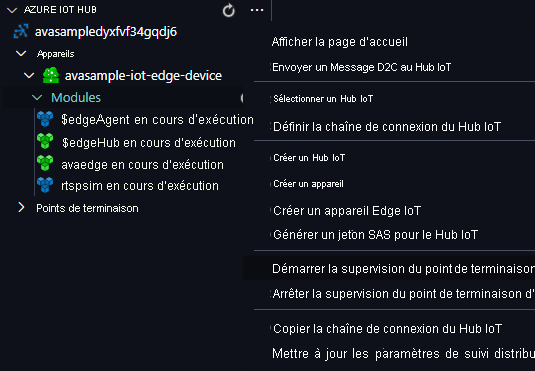

Vous allez utiliser le module périphérique Video Analyzer pour détecter les mouvements dans le flux vidéo en direct entrant et envoyer des événements à IoT Hub. Pour voir ces événements, effectuez les étapes suivantes :

1. Ouvrez le volet Explorateur dans Visual Studio Code, puis recherchez Azure IoT Hub dans l’angle inférieur gauche.
1. Développez le nœud **Appareils**.
1. Cliquez avec le bouton droit sur **avasample-iot-edge-device**, puis sélectionnez **Démarrer la supervision du point de terminaison d’événements intégré**.

   

> [!NOTE]
> Vous pouvez être invité à fournir des informations sur le point de terminaison intégré pour le hub IoT. Pour obtenir ces informations, dans le portail Azure, accédez à votre hub IoT et recherchez l’option **Points de terminaison intégrés** dans le volet de navigation gauche. Cliquez et recherchez l’option **Point de terminaison compatible Event Hub** sous la section **Point de terminaison compatible Event Hub**. Copiez et utilisez le texte dans la zone. Le point de terminaison doit ressembler à ceci :  `Endpoint=sb://iothub-ns-xxx.servicebus.windows.net/;SharedAccessKeyName=iothubowner;SharedAccessKey=XXX;EntityPath=<IoT Hub name>`
