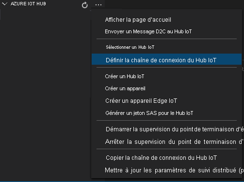
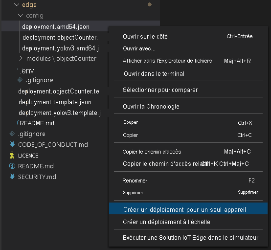

Le manifeste de déploiement définit les modules qui sont déployés sur un appareil de périphérie. Il définit également les paramètres de configuration de ces modules.

Effectuez les étapes suivantes pour générer le manifeste à partir du fichier de modèle, puis déployez-le sur l’appareil de périphérie.

1.  Ouvrez Visual Studio Code.
1.  En regard du volet **AZURE IOT HUB**, sélectionnez l’icône **Autres actions** pour définir la chaîne de connexion IoT Hub. Vous pouvez copier la chaîne à partir du fichier _src/cloud-to-device-console-app/appsettings.json_.

    

    > [!NOTE]
    > Vous pouvez être invité à fournir des informations sur le point de terminaison intégré pour le hub IoT. Pour obtenir ces informations, dans le portail Azure, accédez à votre hub IoT et recherchez l’option **Points de terminaison intégrés** dans le volet de navigation gauche. Cliquez et recherchez l’option **Point de terminaison compatible Event Hub** sous la section **Point de terminaison compatible Event Hub**. Copiez et utilisez le texte dans la zone. Le point de terminaison doit ressembler à ceci :  `Endpoint=sb://iothub-ns-xxx.servicebus.windows.net/;SharedAccessKeyName=iothubowner;SharedAccessKey=XXX;EntityPath=<IoT Hub name>`

1.  Cliquez avec le bouton droit sur **src/edge/deployment.template.json**, puis sélectionnez **Générez un manifeste de déploiement IoT Edge**.

    

    Cette action doit créer un fichier manifeste nommé _deployment.amd64.json_ dans le dossier _src/edge/config_.

1.  Cliquez avec le bouton droit sur **src/edge/config/deployment.amd64.json**, sélectionnez **Créer un déploiement pour un seul appareil**, puis sélectionnez le nom de votre appareil de périphérie.

    

1.  Quand vous êtes invité à sélectionner un appareil IoT Hub, choisissez **avasample-iot-edge-device** dans le menu déroulant.
1.  Après environ 30 secondes, dans l’angle en bas à gauche de la fenêtre, actualisez Azure IoT Hub. L’appareil de périphérie affiche maintenant les modules déployés suivants :

    - Azure Video Analyzer (nom de module `avaedge`)
    - Simulateur RTSP (Real-Time Streaming Protocol) (nom de module `rtspsim`)
