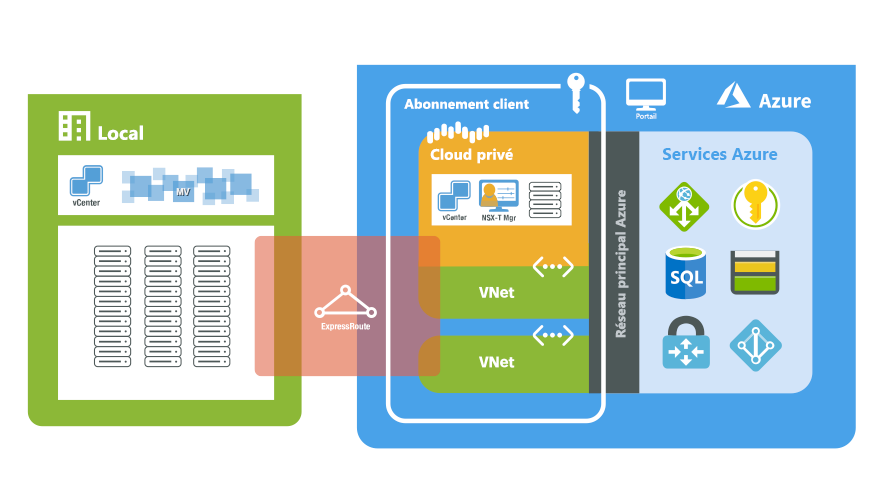

# Qu’est-ce qu’Azure VMware Solution (préversion) ?

Azure VMware Solution met à votre disposition des clouds privés dans Azure. Les clouds privés contiennent des clusters vSphere, générés à partir d’une infrastructure Azure complète dédiée. Vous pouvez mettre à l’échelle des clusters de cloud privé de trois à 16 hôtes, avec la possibilité d’avoir plusieurs clusters dans un même cloud privé. Tous les clouds privés sont provisionnés avec vCenter Server, vSAN, vSphere et NSX-T. Vous pouvez migrer des charges de travail à partir de vos environnements locaux, créer ou déployer de nouvelles machines virtuelles, et consommer des services Azure à partir de vos clouds privés.

Azure VMware Solution est une solution validée par VMware, qui teste et valide constamment les améliorations et les mises à niveau. L’infrastructure et les logiciels de cloud privé sont managés et tenus à jour par Microsoft, ce qui vous permet de vous concentrer sur le développement et l’exécution de charges de travail dans vos clouds privés.

Le diagramme suivant illustre la contiguïté entre les clouds privés et les réseaux virtuels dans Azure, les services Azure et les environnements locaux. L’accès réseau des clouds privés vers les services Azure ou les réseaux virtuels fournit une intégration pilotée par SLA des points de terminaison de service Azure. L’accès au cloud privé à partir d’environnements locaux utilise ExpressRoute Global Reach pour une connexion privée et sécurisée.

## Hôtes, clusters et clouds privés

Les clusters et clouds privés Azure VMware Solution reposent sur un hôte d’infrastructure Azure nu et hyper-convergé. Les hôtes haut de gamme ont une RAM de 576 Go et deux processeurs Intel 18 cœurs de 2,3 GHz. Ils bénéficient en outre de deux groupes de disques vSAN avec un niveau de capacité brut vSAN brut de 15,36 To (SSD) et un niveau de cache vSAN de 3,2 To (NVMe).

Les nouveaux clouds privés sont déployés par le biais du portail Azure ou d’Azure CLI.

## Mise en réseau

Lors du déploiement d’un cloud privé, des réseaux privés pour la gestion, le provisionnement et vMotion sont créés. Ces réseaux privés sont utilisés pour accéder à vCenter et à NSX-T Manager, et pour le déploiement ou la migration vMotion de machines virtuelles. Tous les réseaux privés sont accessibles à partir d’un réseau virtuel dans Azure ou à partir d’environnements locaux. ExpressRoute Global Reach est utilisé pour connecter des clouds privés à des environnements locaux, et cette connexion nécessite un réseau virtuel avec un circuit ExpressRoute dans votre abonnement.

L’accès à Internet et aux services Azure est provisionné lors du déploiement d’un cloud privé. L’accès est fourni afin que les machines virtuelles sur les réseaux de charges de travail de production puissent consommer des services basés sur Internet ou Azure. L’accès à Internet est désactivé par défaut pour les nouveaux clouds privés, et peut être activé ou désactivé à tout moment.

Pour plus d’informations sur la mise en réseau et l’interconnexion, consultez l’article sur les [concepts de mise en réseau](concepts-networking.md).

## Accès et sécurité

Pour une sécurité renforcée, les clouds privés Azure VMware Solution utilisent le contrôle d’accès en fonction du rôle vSphere. Les fonctionnalités LDAP SSO vSphere peuvent être intégrées à Azure Active Directory. Pour plus d’informations sur l’identité et les privilèges, consultez l’article sur les [concepts d’accès et d’identité](concepts-identity.md).

Le chiffrement des données au repos vSAN est activé par défaut et est utilisé pour assurer la sécurité du magasin de données vSAN. Il est décrit plus en détail dans l’article sur les [concepts de stockage](concepts-storage.md).

## Maintenance du cycle de vie des hôtes et des logiciels

Les mises à niveau régulières du cloud privé Azure VMware Solution et des logiciels VMware garantissent la sécurité, la stabilité et les ensembles de fonctionnalités les plus récents dans vos clouds privés. Vous trouverez plus d’informations sur la maintenance et les mises à niveau de la plateforme dans l’article sur les [concepts de mise à niveau](concepts-upgrades.md).

## Supervision de votre cloud privé

Vous pouvez utiliser les [journaux dans Azure Monitor](../azure-monitor/overview.md) pour collecter des journaux sur vos machines virtuelles s’exécutant dans votre cloud privé Azure VMware Solution. Vous pouvez [télécharger et installer l’agent MMA](../azure-monitor/platform/log-analytics-agent.md#installation-options) sur des machines virtuelles Linux et Windows s’exécutant dans vos clouds privés Azure VMware Solution, en utilisant les mêmes requêtes que celles que vous exécutez sur vos machines virtuelles locales. Vous pouvez exécuter les mêmes requêtes que celles que vous exécuteriez normalement sur vos machines virtuelles. Pour en savoir plus sur la création de requêtes, consultez le [guide pratique pour écrire des requêtes](../azure-monitor/log-query/log-query-overview.md#how-can-i-learn-how-to-write-queries).

## Étapes suivantes

L’étape suivante consiste à se familiariser avec les [concepts clés des clouds privés et des clusters](concepts-private-clouds-clusters.md).

<!-- LINKS - external -->

<!-- LINKS - internal -->
[concepts-private-clouds-clusters]: ./concepts-private-clouds-clusters.md
