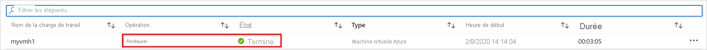

# <a name="how-to-restore-azure-vm-data-in-azure-portal"></a>Comment restaurer des données de machine virtuelle Azure dans le Portail Azure

Cet article décrit comment restaurer les données de machines virtuelles Azure à partir de points de récupération stockés dans des coffres Recovery Services [Sauvegarde Azure](backup-overview.md).

## <a name="restore-options"></a>Options de restauration

Sauvegarde Azure permet de restaurer une machine virtuelle de plusieurs façons.

**Option de restauration** | **Détails**
--- | ---
**Créer une machine virtuelle** | Permet d’avoir rapidement une machine virtuelle de base opérationnelle à partir d’un point de restauration.<br/><br/> Vous pouvez nommer la machine virtuelle, sélectionner le groupe de ressources et le réseau virtuel (VNet) où elle sera placée et spécifier un type de stockage pour la machine virtuelle restaurée. La nouvelle machine virtuelle doit être créée dans la même région que la machine virtuelle source.<br><br>Si une restauration de machine virtuelle échoue parce qu’une référence SKU de machine virtuelle Azure n’est pas disponible dans la région spécifiée d’Azure, ou en raison de tout autre problème, la Sauvegarde Microsoft Azure restaure toujours les disques dans le groupe de ressources spécifié.
**Restaurer un disque** | Restaure un disque de machine virtuelle que vous pouvez ensuite utiliser pour créer une machine virtuelle.<br/><br/> Sauvegarde Azure fournit un modèle pour vous aider à personnaliser et à créer une machine virtuelle. <br/><br> Le travail de restauration génère un modèle que vous pouvez télécharger et utiliser pour spécifier des paramètres de machine virtuelle personnalisés et créer une machine virtuelle.<br/><br/> Les disques sont copiés dans le groupe de ressources spécifié.<br/><br/> Vous pouvez également attacher le disque à une machine virtuelle existante ou créer une machine virtuelle à l’aide de PowerShell.<br/><br/> Cette option est utile si vous souhaitez personnaliser la machine virtuelle, ajouter des paramètres de configuration qui n’existaient pas au moment de la sauvegarde ou encore ajouter des paramètres qui doivent être configurés à l’aide du modèle ou de PowerShell.
**Remplacer l’existant** | Vous pouvez restaurer un disque et l’utiliser pour remplacer un disque sur la machine virtuelle existante.<br/><br/> La machine virtuelle actuelle doit exister. Si elle a été supprimée, vous ne pouvez pas utiliser cette option.<br/><br/> La Sauvegarde Azure prend un instantané de la machine virtuelle existante avant de remplacer le disque et le stocke à l’emplacement intermédiaire spécifié. Les disques existants connectés à la machine virtuelle sont remplacés par le point de restauration sélectionné.<br/><br/> L’instantané est copié dans le coffre et conservé conformément à la stratégie de conservation. <br/><br/> Après l’opération de remplacement du disque, le disque d’origine est conservé dans le groupe de ressources. Vous pouvez choisir de supprimer manuellement les disques d’origine si vous n’en avez pas besoin. <br/><br/>Le remplacement des disques existants est pris en charge pour les machines virtuelles managées non chiffrées, notamment les machines virtuelles [créées à l’aide d’images personnalisées](https://azure.microsoft.com/resources/videos/create-a-custom-virtual-machine-image-in-azure-resource-manager-with-powershell/). Il n’est pas pris en charge pour les machines virtuelles classiques.<br/><br/> Si le point de restauration a plus ou moins de disques que la machine virtuelle actuelle, le nombre de disques du point de restauration reflète alors uniquement la configuration de la machine virtuelle.<br><br> Replace existing est également pris en charge pour les machines virtuelles avec des ressources liées, par exemple [identité gérée par l’utilisateur ](../active-directory/managed-identities-azure-resources/overview.md)ou [Key Vault](../key-vault/general/overview.md).
**Interrégion (région secondaire)** | La restauration interrégion peut être utilisée pour restaurer des machines virtuelles Azure dans la région secondaire, qui est une [région jumelée à Azure](../best-practices-availability-paired-regions.md#what-are-paired-regions).<br><br> Vous pouvez restaurer toutes les machines virtuelles Azure pour le point de récupération sélectionné si la sauvegarde est effectuée dans la région secondaire.<br><br> Cette fonctionnalité est disponible pour les options ci-dessous :<br> <li> [Créer une machine virtuelle](#create-a-vm) <br> <li> [Restaurer des disques](#restore-disks) <br><br> Nous ne prenons actuellement pas en charge l’option [Remplacer des disques existants](#replace-existing-disks).<br><br> Autorisations<br> L’opération de restauration sur la région secondaire peut être effectuée par les administrateurs de sauvegarde et les administrateurs d’applications.

> [!NOTE]
> Vous pouvez également récupérer des fichiers et des dossiers spécifiques sur une machine virtuelle Azure. [Plus d’informations](backup-azure-restore-files-from-vm.md)

## <a name="storage-accounts"></a>Comptes de stockage

Informations sur les comptes de stockage :

- **Créer une machine virtuelle** : lorsque vous créez une machine virtuelle, celle-ci est placée dans le compte de stockage que vous spécifiez.
- **Restaurer un disque** : lorsque vous restaurez un disque, celui-ci est copié dans le compte de stockage que vous spécifiez. Le travail de restauration génère un modèle que vous pouvez télécharger et utiliser pour spécifier des paramètres de machine virtuelle personnalisés. Ce modèle est placé dans le compte de stockage spécifié.
- **Remplacer un disque** : Lorsque vous remplacez un disque sur une machine virtuelle existante, la Sauvegarde Azure prend un instantané de cette machine avant de remplacer le disque. L’instantané est également copié dans le coffre Recovery Services via le transfert de données, en tant que processus en arrière-plan. Toutefois, une fois la phase de capture instantanée terminée, l’opération de remplacement de disques est déclenchée. Après l’opération de remplacement de disque, les disques de la machine virtuelle Azure source sont conservés dans le groupe de ressources spécifié pour votre opération et les disques durs virtuels sont stockés dans le compte de stockage spécifié. Vous pouvez choisir de supprimer ou de conserver ces disques durs virtuels et disques.
- **Emplacement du compte de stockage** : le compte de stockage doit se trouver dans la même région que le coffre. Seuls ces comptes sont affichés. S’il n’y a aucun compte de stockage à cet emplacement, vous devez en créer un.
- **Type de stockage** : le stockage d'objets blob n’est pas pris en charge.
- **Redondance du stockage** : Le stockage redondant interzone (ZRS) n’est pas pris en charge. Les informations de réplication et de redondance pour le compte sont indiquées entre parenthèses après le nom du compte.
- **Stockage Premium** :
  - lorsque vous restaurez des machines virtuelles non Premium, les comptes de stockage Premium ne sont pas pris en charge.
  - Lors de la restauration de machines virtuelles gérées, les comptes de stockage Premium configurés avec des règles de réseau ne sont pas pris en charge.

## <a name="before-you-start"></a>Avant de commencer

Pour restaurer une machine virtuelle (créer une machine virtuelle), vérifiez que vous disposez des [autorisations](backup-rbac-rs-vault.md#mapping-backup-built-in-roles-to-backup-management-actions) appropriées de contrôle de l’accès en fonction du rôle (RBAC) pour l’opération de restauration de machine virtuelle.

Si vous n’avez pas ces autorisations, vous pouvez [restaurer un disque](#restore-disks) et, une fois le disque restauré, [utiliser le modèle](#use-templates-to-customize-a-restored-vm) généré dans le cadre de l’opération de restauration pour créer une machine virtuelle.

## <a name="select-a-restore-point"></a>Sélectionner un point de restauration

1. Dans le coffre associé à la machine virtuelle à restaurer, cliquez sur **Éléments de sauvegarde** > **Machine virtuelle Azure**.
2. Cliquez sur une machine virtuelle. Par défaut, les points de récupération des 30 derniers jours sont affichés sur le tableau de bord de la machine virtuelle. Vous pouvez afficher les points de récupération de plus de 30 jours ou appliquer un filtre pour rechercher des points de récupération en fonction de dates, plages de dates et différents types de cohérence d’instantané.
3. Pour restaurer la machine virtuelle, cliquez sur **Restaurer la machine virtuelle**.

    

4. Sélectionnez un point de restauration à utiliser pour la récupération.

## <a name="choose-a-vm-restore-configuration"></a>Choisir une configuration de restauration de machine virtuelle

1. Dans **Configuration de la restauration**, sélectionnez une option de restauration :
    - **Créer** : Utilisez cette option si vous souhaitez créer une machine virtuelle. Vous pouvez créer une machine virtuelle avec des paramètres simples, ou restaurer un disque et créer une machine virtuelle personnalisée.
    - **Remplacer l’existant** : Utilisez cette option si vous souhaitez remplacer les disques sur une machine virtuelle existante.

        

2. Spécifiez les paramètres de l’option de restauration sélectionnée.

## <a name="create-a-vm"></a>Créer une machine virtuelle

Cette [option de restauration](#restore-options) vous permet de créer rapidement une machine virtuelle avec des paramètres de base à partir d’un point de restauration.

1. Dans **Configuration de la restauration** > **Créer** > **Type de restauration**, sélectionnez **Créer une machine virtuelle**.
2. Dans **Nom de la machine virtuelle**, spécifiez une machine virtuelle qui n’existe pas dans l’abonnement.
3. Dans **Groupe de ressources**, sélectionnez un groupe de ressources existant pour la nouvelle machine virtuelle ou créez-en un avec un nom global unique. Si vous attribuez un nom qui existe déjà, Azure attribue au groupe le même nom que celui de la machine virtuelle.
4. Dans **Réseau virtuel**, sélectionnez le réseau virtuel dans lequel la machine virtuelle sera placée. Tous les réseaux virtuels associés à l’abonnement sont affichés. Sélectionnez le sous-réseau. Le premier sous-réseau est sélectionné par défaut.
5. Dans **Emplacement de stockage**, spécifiez le compte de stockage pour la machine virtuelle. [Plus d’informations](#storage-accounts)

    

6. Dans **Configuration de la restauration**, sélectionnez **OK**. Dans **Restaurer**, cliquez sur **Restaurer** pour déclencher l’opération de restauration.

## <a name="restore-disks"></a>Restaurer des disques

Cette [option de restauration](#restore-options) vous permet de créer un disque à partir d’un point de restauration. Une fois le disque créé, vous pouvez effectuer l’une des opérations suivantes :

- Utiliser le modèle généré durant l’opération de restauration pour personnaliser les paramètres et déclencher le déploiement de la machine virtuelle. Vous modifiez les paramètres de modèle par défaut, puis vous envoyez le modèle pour le déploiement de machine virtuelle.
- [Attacher des disques restaurés](../virtual-machines/windows/attach-managed-disk-portal.md) à une machine virtuelle existante.
- [Créer une machine virtuelle](./backup-azure-vms-automation.md#create-a-vm-from-restored-disks) à partir des disques restaurés à l’aide de PowerShell.

1. Dans **Configuration de la restauration** > **Créer** > **Type de restauration**, sélectionnez **Restaurer des disques**.
2. Dans **Groupe de ressources**, sélectionnez un groupe de ressources existant pour les disques restaurés ou créez-en un avec un nom global unique.
3. Dans **Compte de stockage**, spécifiez le compte dans lequel copier les disques durs virtuels. [Plus d’informations](#storage-accounts)

    

4. Dans **Configuration de la restauration**, sélectionnez **OK**. Dans **Restaurer**, cliquez sur **Restaurer** pour déclencher l’opération de restauration.

Quand votre machine virtuelle utilise des disques managés et que vous sélectionnez l’option **Créer une machine virtuelle**, Sauvegarde Azure n’utilise pas le compte de stockage spécifié. Dans le cas d’une **restauration de disques** et d’une **restauration instantanée**, le compte de stockage est utilisé uniquement pour stocker le modèle. Les disques managés sont créés dans le groupe de ressources spécifié.
Lorsque votre machine virtuelle utilise des disques non gérés, ceux-ci sont restaurés en tant qu’objets blob dans le compte de stockage.

### <a name="use-templates-to-customize-a-restored-vm"></a>Utiliser des modèles pour personnaliser une machine virtuelle restaurée

Une fois le disque restauré, utilisez le modèle généré dans le cadre de l’opération de restauration pour personnaliser et créer une machine virtuelle :

1. Ouvrez **Restaurer > Détails du travail** pour le travail approprié.

2. Dans **Détails du travail de restauration**, sélectionnez **Déployer le modèle** pour lancer le déploiement du modèle.

    

3. Pour personnaliser le paramètre de la machine virtuelle fourni dans le modèle, cliquez sur **Modifier le modèle**. Si vous souhaitez ajouter d’autres personnalisations, cliquez sur **Modifier les paramètres**.
    - [Découvrez-en plus](../azure-resource-manager/templates/deploy-portal.md#deploy-resources-from-custom-template) sur le déploiement de ressources à partir d’un modèle personnalisé.
    - [Découvrez-en plus](../azure-resource-manager/templates/template-syntax.md) sur la création de modèles.

   

4. Entrez les valeurs personnalisées pour la machine virtuelle, acceptez les **conditions générales**, puis cliquez sur **Acheter**.

   

## <a name="replace-existing-disks"></a>Remplacer les disques existants

Cette [option de restauration](#restore-options) vous permet de remplacer un disque de machine virtuelle existant par le point de restauration sélectionné. [Passez en revue](#restore-options) toutes les options de restauration.

1. Dans **Configuration de la restauration**, cliquez sur **Remplacer l’existant**.
2. Dans **Type de restauration**, sélectionnez **Remplacer le(s) disque(s)** . Il s’agit du point de restauration qui sera utilisé pour remplacer les disques existants de la machine virtuelle.
3. Dans **Emplacement intermédiaire**, spécifiez l’emplacement où les instantanés des disques managés actuels doivent être enregistrés pendant le processus de restauration. [Plus d’informations](#storage-accounts)

   

## <a name="cross-region-restore"></a>Restauration interrégion

Parmi les [options de restauration](#restore-options), la restauration interrégion (CRR) vous permet de restaurer des machines virtuelles Azure dans une région secondaire, qui est une région jumelée Azure.

Pour intégrer la fonctionnalité à la préversion, lisez la [section Avant de commencer](./backup-create-rs-vault.md#set-cross-region-restore).

Pour voir si la CRR est activée, suivez les instructions indiquées dans [Configurer la restauration interrégion](backup-create-rs-vault.md#configure-cross-region-restore)

### <a name="view-backup-items-in-secondary-region"></a>Afficher les éléments de sauvegarde dans la région secondaire

Si la CRR est activée, vous pouvez afficher les éléments de sauvegarde dans la région secondaire.

1. À partir du portail, accédez à **Coffre Recovery Services** > **Éléments de sauvegarde**.
2. Cliquez sur **Région secondaire** pour afficher les éléments de la région secondaire.


### <a name="restore-in-secondary-region"></a>Restaurer dans la région secondaire

L’expérience utilisateur de restauration de la région secondaire est similaire à celle de la région primaire. Quand vous configurez votre restauration dans le panneau Configuration de la restauration, vous êtes invité à fournir uniquement les paramètres de région secondaire.


>[!NOTE]
>Le réseau virtuel de la région secondaire doit être attribué de manière unique et ne peut être utilisé pour aucune autre machine virtuelle de ce groupe de ressources.


- Pour restaurer et créer une machine virtuelle, reportez-vous à [Créer une machine virtuelle](#create-a-vm).
- Pour restaurer en tant que disque, reportez-vous à [Restaurer des disques](#restore-disks).

>[!NOTE]
>
>- Une fois la restauration déclenchée et au cours de la phase de transfert des données, le travail de restauration ne peut pas être annulé.
>- La fonctionnalité de restauration inter-régions restaure les machines virtuelles Azure compatibles avec CMK (clés gérées par le client), qui ne sont pas sauvegardées dans un coffre Recovery Services avec CMK activé, en tant que machines virtuelles non compatibles CMK dans la région secondaire.

### <a name="monitoring-secondary-region-restore-jobs"></a>Surveillance des travaux de restauration de la région secondaire

1. À partir du portail, accédez à **Coffre Recovery Services** > **Travaux de sauvegarde**.
2. Cliquez sur **Région secondaire** pour afficher les éléments de la région secondaire.


## <a name="restoring-unmanaged-vms-and-disks-as-managed"></a>Restauration des VM et des disques non gérés comme étant gérés

Vous disposez d’une option pour restaurer les [disques non gérés](../storage/common/storage-disaster-recovery-guidance.md#azure-unmanaged-disks) en tant que [disques gérés](../virtual-machines/windows/managed-disks-overview.md) lors de la restauration. Par défaut, les machines virtuelles/disques non gérés sont restaurés en tant que machines virtuelles/disques non gérés. Toutefois, si vous choisissez de restaurer en tant que machines virtuelles/disques gérés, il est maintenant possible de le faire. Ces restaurations ne sont pas déclenchées à partir de la phase d’instantané, mais uniquement à partir de la phase de coffre. Cette fonctionnalité n’est pas disponible pour les machines virtuelles chiffrées non gérées.


## <a name="restore-vms-with-special-configurations"></a>Restaurer des machines virtuelles avec des configurations spéciales

Il existe un certain nombre de scénarios courants dans lesquels vous pouvez avoir besoin de restaurer des machines virtuelles.

**Scénario** | **Assistance**
--- | ---
**Restaurer des machines virtuelles avec Hybrid Use Benefit** | Si une machine virtuelle Windows utilise une [licence HUB (Hybrid Use Benefit)](../virtual-machines/windows/hybrid-use-benefit-licensing.md), restaurez les disques et créez une machine virtuelle à l’aide du modèle fourni (**Type de licence** ayant pour valeur **Windows_Server**) ou de PowerShell.  Vous pouvez également appliquer ce paramètre après avoir créé la machine virtuelle.
**Restaurer des machines virtuelles en cas de défaillance du centre de données Azure** | Si le coffre utilise GRS et que le centre de données principal de la machine virtuelle tombe en panne, Sauvegarde Azure prend en charge la restauration des machines virtuelles sauvegardées sur le centre de données appairé. Sélectionnez un compte de stockage dans le centre de données appairé et restaurez-le comme d’habitude. Sauvegarde Azure utilise le service de calcul dans la région associée pour créer la machine virtuelle restaurée. [Découvrez-en plus](../resiliency/resiliency-technical-guidance-recovery-loss-azure-region.md) sur la résilience des centres de données.<br><br> Si le coffre utilise le stockage géoredondant (GRS), vous pouvez choisir la nouvelle fonctionnalité, la [restauration interrégion](#cross-region-restore). Cela vous permet de restaurer dans une région secondaire en cas de panne complète ou partielle, ou même s’il n’y a pas de panne du tout.
**Restaurer une machine virtuelle contrôleur de domaine unique dans un seul domaine** | Restaurez la machine virtuelle comme n’importe quelle autre machine virtuelle. Notez les points suivants :<br/><br/> Du point de vue d’Active Directory, la machine virtuelle Azure est semblable à toute autre machine virtuelle.<br/><br/> Le mode DSRM (Directory Restore Mode) étant également disponible, tous les scénarios de récupération Active Directory sont viables. [Découvrez-en plus](#post-restore-steps) sur les considérations relatives à la sauvegarde et à la restauration de contrôleurs de domaine virtualisés.
**Restaurer plusieurs machines virtuelles contrôleurs de domaine dans un seul domaine** | Si d’autres contrôleurs de domaine du même domaine sont accessibles sur le réseau, le contrôleur de domaine peut être restauré comme n’importe quelle machine virtuelle. S’il s’agit du dernier contrôleur de domaine dans le domaine ou si une récupération dans un réseau isolé est effectuée, utilisez une [récupération de forêt](/windows-server/identity/ad-ds/manage/ad-forest-recovery-single-domain-in-multidomain-recovery).
**Restaurer plusieurs domaines dans une forêt** | Nous recommandons une [récupération de forêt](/windows-server/identity/ad-ds/manage/ad-forest-recovery-single-domain-in-multidomain-recovery).
**Restauration complète** | La principale différence entre les machines virtuelles Azure et les hyperviseurs locaux est l’absence d’une console de machine virtuelle dans Azure. Une console est nécessaire pour certains scénarios tels que la récupération à l’aide d’une sauvegarde de type Récupération complète (BMR, Bare Metal Recovery). Toutefois, la restauration d’une machine virtuelle à partir du coffre constitue un remplacement total pour la récupération complète.
**Restaurer des machines virtuelles avec des configurations réseau spéciales** | Les machines virtuelles qui utilisent un équilibrage de charge interne ou externe, plusieurs cartes réseau ou plusieurs adresses IP réservées sont des exemples de configurations réseau spéciales. Vous pouvez restaurer ces machines virtuelles à l’aide de l’[option de restauration de disque](#restore-disks). Cette option effectue une copie des disques durs virtuels dans le compte de stockage spécifié. Vous pouvez ensuite créer une machine virtuelle avec un équilibreur de charge[ interne](../load-balancer/load-balancer-get-started-ilb-arm-ps.md) ou [externe](../load-balancer/quickstart-create-standard-load-balancer-powershell.md), [plusieurs cartes réseau](../virtual-machines/windows/multiple-nics.md) ou [plusieurs adresses IP réservées](../virtual-network/virtual-network-multiple-ip-addresses-powershell.md), conformément à votre configuration.
**Groupe de sécurité réseau sur une carte réseau/un sous-réseau.** | La sauvegarde des machines virtuelles Azure prend en charge les informations de sauvegarde et de restauration de groupe de sécurité réseau au niveau de la carte réseau, du sous-réseau et du réseau virtuel.
**Machines virtuelles épinglées à des zones** | Si vous sauvegardez une machine virtuelle Azure qui est épinglée à une zone (avec Sauvegarde Azure), vous pouvez la restaurer dans la même zone où elle a été épinglée. [En savoir plus](../availability-zones/az-overview.md)
**Restaurer une machine virtuelle dans un groupe à haute disponibilité** | Lorsqu’une machine virtuelle est restaurée à partir du portail, il n’est pas possible de choisir un groupe à haute disponibilité. Une machine virtuelle restaurée n’a pas de groupe à haute disponibilité. Si vous utilisez l’option de restauration de disque, vous pouvez [spécifier un groupe à haute disponibilité](../virtual-machines/windows/tutorial-availability-sets.md) quand vous créez une machine virtuelle à partir du disque à l’aide du modèle fourni ou de PowerShell.
**Restaurer les machines virtuelles spéciales telles que les machines virtuelles SQL** | Si vous sauvegardez une machine virtuelle SQL à l’aide de la sauvegarde de la machine virtuelle Azure et que vous utilisez ensuite l’option de restauration de la machine virtuelle ou que vous créez une machine virtuelle après avoir restauré des disques, la machine virtuelle créée doit être inscrite auprès du fournisseur SQL comme mentionné [ici](../azure-sql/virtual-machines/windows/sql-vm-resource-provider-register.md?tabs=azure-cli%2Cbash). Cette opération convertit la machine virtuelle restaurée en machine virtuelle SQL.

## <a name="track-the-restore-operation"></a>Suivi de l’opération de restauration

Une fois que vous déclenchez l’opération de restauration, le service de sauvegarde crée un travail à des fins de suivi. Sauvegarde Azure affiche des notifications sur le travail dans le portail. Si elles ne sont pas visibles, sélectionnez le symbole **Notifications**, puis sélectionnez **Afficher tous les travaux** pour afficher le statut du processus de restauration.


 Faites le suivi de la restauration comme ceci :

1. Pour afficher les opérations du travail, cliquez sur le lien hypertexte de notifications. Vous pouvez également cliquer sur **Travaux de sauvegarde** dans le coffre, puis sur la machine virtuelle appropriée.

    

2. Pour suivre la progression de la restauration, cliquez sur n’importe quel travail de restauration avec l’état **En cours**. Vous obtenez une barre de progression qui affiche des informations sur l’avancement de la restauration :

    - **Estimation de la durée de la restauration** : indique initialement le temps nécessaire pour terminer l’opération de restauration. Au fur et à mesure que l’opération progresse, le temps nécessaire se réduit pour atteindre zéro une fois l’opération de restauration terminée.
    - **Pourcentage de la restauration** : affiche le pourcentage de l’opération de restauration terminée.
    - **Nombre d’octets transférés** : si vous restaurez en créant une machine virtuelle, indique les octets qui ont été transférés par rapport au nombre total d’octets à transférer.

## <a name="post-restore-steps"></a>Étapes post-restauration

Tenez compte de ce qui suit après la restauration d’une machine virtuelle :

- Les extensions présentes durant la configuration de sauvegarde sont installées, mais pas activées. Si vous rencontrez un problème, réinstallez les extensions.
- Si la machine virtuelle sauvegardée a une adresse IP statique, la machine virtuelle restaurée a une adresse IP dynamique pour éviter tout conflit. Vous pouvez [ajouter une adresse IP statique à la machine virtuelle restaurée](/powershell/module/az.network/set-aznetworkinterfaceipconfig#description).
- Une machine virtuelle restaurée n’a pas de groupe à haute disponibilité. Si vous utilisez l’option de restauration de disque, vous pouvez [spécifier un groupe à haute disponibilité](../virtual-machines/windows/tutorial-availability-sets.md) quand vous créez une machine virtuelle à partir du disque à l’aide du modèle fourni ou de PowerShell.
- Si vous utilisez une distribution Linux basée sur cloud-init telle qu’Ubuntu, le mot de passe est bloqué après la restauration pour des raisons de sécurité. Utilisez l’extension VMAccess sur la machine virtuelle restaurée pour [réinitialiser le mot de passe](../virtual-machines/troubleshooting/reset-password.md). Nous vous recommandons d’utiliser des clés SSH sur ces distributions pour ne pas avoir à réinitialiser le mot de passe après la restauration.
- Si vous ne parvenez pas à accéder à une machine virtuelle après sa restauration en raison d’une rupture de la relation entre la machine virtuelle et le contrôleur de domaine, suivez les étapes ci-dessous pour afficher la machine virtuelle :
  - Attachez un disque de système d’exploitation en tant que disque de données à une machine virtuelle récupérée.
  - Installez manuellement l’agent de machine virtuelle si l’agent Azure ne répond pas en suivant ce [lien](../virtual-machines/troubleshooting/install-vm-agent-offline.md).
  - Activer l’accès à la console série sur la machine virtuelle pour autoriser l’accès en ligne de commande à la machine virtuelle

  ```cmd
    bcdedit /store <drive letter>:\boot\bcd /enum
    bcdedit /store <VOLUME LETTER WHERE THE BCD FOLDER IS>:\boot\bcd /set {bootmgr} displaybootmenu yes
    bcdedit /store <VOLUME LETTER WHERE THE BCD FOLDER IS>:\boot\bcd /set {bootmgr} timeout 5
    bcdedit /store <VOLUME LETTER WHERE THE BCD FOLDER IS>:\boot\bcd /set {bootmgr} bootems yes
    bcdedit /store <VOLUME LETTER WHERE THE BCD FOLDER IS>:\boot\bcd /ems {<<BOOT LOADER IDENTIFIER>>} ON
    bcdedit /store <VOLUME LETTER WHERE THE BCD FOLDER IS>:\boot\bcd /emssettings EMSPORT:1 EMSBAUDRATE:115200
    ```

  - Quand la machine virtuelle est reconstruite, utilisez le portail Azure pour réinitialiser le compte et le mot de passe de l’administrateur local
  - Utiliser l’accès à la console série et CMD pour séparer la machine virtuelle du domaine

    ```cmd
    cmd /c "netdom remove <<MachineName>> /domain:<<DomainName>> /userD:<<DomainAdminhere>> /passwordD:<<PasswordHere>> /reboot:10 /Force"
    ```

- Une fois que la machine virtuelle est séparée et redémarrée, vous pouvez établir une connexion RDP à la machine virtuelle avec les informations d’identification d’administrateur local et reconnecter correctement la machine virtuelle au domaine.

## <a name="backing-up-restored-vms"></a>Sauvegarde de machines virtuelles restaurées

- Si vous avez restauré une machine virtuelle sur le même groupe de ressources avec le même nom que la machine virtuelle sauvegardée d’origine, la sauvegarde se poursuit sur la machine virtuelle après la restauration.
- Si vous avez restauré la machine virtuelle sur un groupe de ressources différent ou que vous avez spécifié un nom différent pour la machine virtuelle restaurée, vous devez configurer la sauvegarde pour la machine virtuelle restaurée.

## <a name="next-steps"></a>Étapes suivantes

- Si vous rencontrez des problèmes durant le processus de restauration, [passez en revue](backup-azure-vms-troubleshoot.md#restore) les erreurs et les problèmes courants.
- Une fois la machine virtuelle restaurée, découvrez-en plus sur la [gestion des machines virtuelles](backup-azure-manage-vms.md)
