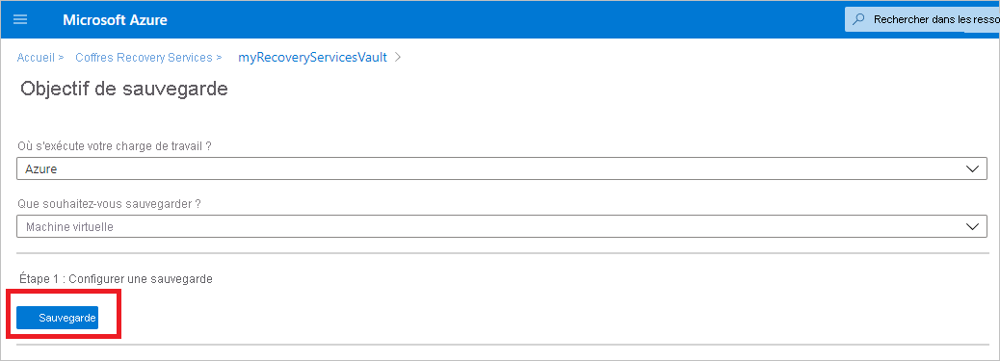
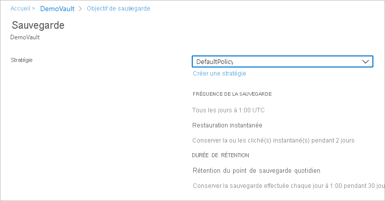
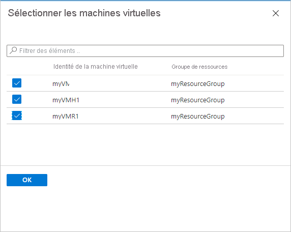
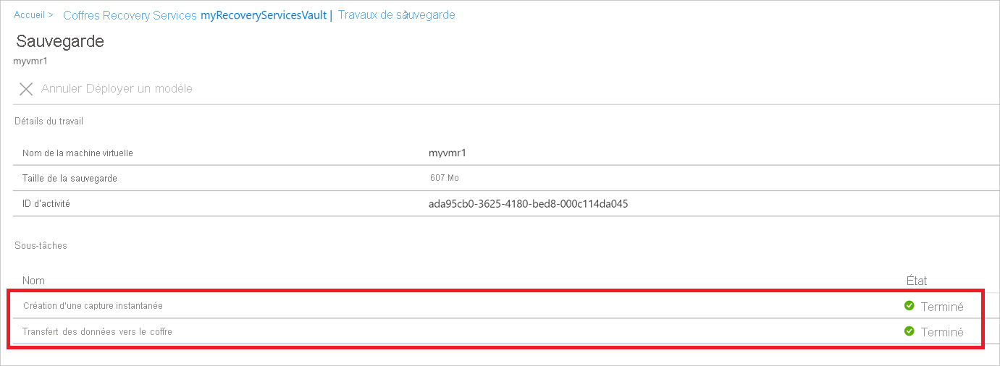

# Sauvegarder des machines virtuelles Azure dans un coffre Recovery Services

Cet article explique comment sauvegarder des machines virtuelles Azure dans un coffre Recovery Services à l’aide du service [Sauvegarde Azure](backup-overview.md).

Dans cet article, vous apprendrez comment :

> [!div class="checklist"]
>
> * Préparez les machines virtuelles Azure.
> * Créer un coffre.
> * Découvrir les machines virtuelles et configurer une stratégie de sauvegarde.
> * Activer la sauvegarde pour les machines virtuelles Azure.
> * Effectuez la sauvegarde initiale.

> [!NOTE]
> Cet article explique comment configurer un coffre et sélectionner les machines virtuelles à sauvegarder. Cette méthode s’avère utile pour sauvegarder plusieurs machines virtuelles. Vous pouvez également [sauvegarder une seule machine virtuelle Azure](backup-azure-vms-first-look-arm.md) directement à partir de ses paramètres.

## Avant de commencer

* [Passez en revue](backup-architecture.md#architecture-built-in-azure-vm-backup) l’architecture de sauvegarde de machine virtuelle Azure.
* [En savoir plus sur](backup-azure-vms-introduction.md) la sauvegarde des machines virtuelles Azure et l’extension de la sauvegarde.
* [Passez en revue la matrice de prise en charge](backup-support-matrix-iaas.md) avant de configurer la sauvegarde.

Par ailleurs, vous risquez de devoir faire deux choses dans certaines circonstances :

* **Installer l’agent de machine virtuelle sur la machine virtuelle** : Sauvegarde Azure sauvegarde les machines virtuelles Azure en installant une extension à l’agent de machine virtuelle Azure en cours d’exécution sur l’ordinateur. Si votre machine virtuelle a été créée à partir d’une image de la Place de marché Azure, l’agent est installé et en cours d’exécution. Si vous créez une machine virtuelle personnalisée ou que vous migrez une machine locale, vous devrez peut-être [installer l’agent manuellement](#install-the-vm-agent).

## Création d'un coffre

 Un coffre stocke les sauvegardes et points de récupération créés au fil du temps, ainsi que les stratégies de sauvegarde associées aux machines sauvegardées. Créez un coffre comme suit :

1. Connectez-vous au [portail Azure](https://portal.azure.com/).
2. Dans Rechercher, tapez **Recovery Services**. Sous **Services**, cliquez sur **Coffres Recovery Services**.

     

3. Dans le menu **Coffres Recovery Services**, cliquez sur **+Ajouter**.

     

4. Dans **Coffre Recovery Services**, tapez un nom convivial permettant d’identifier le coffre.
    * Le nom doit être unique pour l’abonnement Azure.
    * Il peut comprendre entre 2 et 50 caractères.
    * Il doit commencer par une lettre, et ne peut contenir que des lettres, des chiffres et des traits d’union.
5. Sélectionnez l’abonnement Azure, le groupe de ressources et la région géographique où le coffre doit être créé. Cliquez ensuite sur **Créer**.
    * La création du coffre peut prendre du temps.
    * Surveillez les notifications d’état dans l’angle supérieur droit du portail.

Une fois le coffre créé, il apparaît dans la liste Coffres Recovery Services. Si vous ne voyez pas votre coffre, sélectionnez **Actualiser**.

>[!NOTE]
> Il est désormais possible de personnaliser le nom du groupe de ressources créé par le service Sauvegarde Azure. Pour plus d’informations, consultez [Groupe de ressources Sauvegarde Azure pour les machines virtuelles](backup-during-vm-creation.md#azure-backup-resource-group-for-virtual-machines).

### Modifier la réplication du stockage

Par défaut, les coffres utilisent le [stockage géoredondant (GRS)](https://docs.microsoft.com/azure/storage/common/storage-redundancy-grs).

* Si le coffre est votre principal mécanisme de sauvegarde, nous vous recommandons d’utiliser le GRS.
* Vous pouvez utiliser le [stockage localement redondant (LRS)](https://docs.microsoft.com/azure/storage/common/storage-redundancy-lrs?toc=%2fazure%2fstorage%2fblobs%2ftoc.json) en guise d’option plus économique.

Modifiez le type de réplication de stockage comme suit :

1. Dans le nouveau coffre, cliquez sur **Propriétés** dans la section **Paramètres**.
2. Dans **Propriétés**, sous **Configuration de la sauvegarde**, cliquez sur **Mise à jour**.
3. Sélectionnez le type de réplication de stockage, puis cliquez sur **Enregistrer**.

      

> [!NOTE]
   > Vous ne pouvez pas modifier le type de réplication de stockage une fois que le coffre est configuré et qu’il contient des éléments de sauvegarde. Pour ce faire, vous devez recréer le coffre.

## Appliquer une stratégie de sauvegarde

Configurez une stratégie de sauvegarde pour le coffre.

1. Dans le coffre, cliquez sur **+Sauvegarde** dans la section **Vue d’ensemble**.

   

2. Dans **Objectif de sauvegarde** > **Où s’exécute votre charge de travail ?** , sélectionnez **Azure**. Dans **Que voulez-vous sauvegarder ?** , sélectionnez **Machine virtuelle** >  **OK**. L’extension de machine virtuelle est inscrite dans le coffre.

   

3. Dans **Stratégie de sauvegarde**, sélectionnez la stratégie à associer au coffre.
    * La stratégie par défaut sauvegarde la machine virtuelle une fois par jour. Les sauvegardes quotidiennes sont conservées pendant 30 jours. Les instantanés de récupération instantanée sont conservés pendant deux jours.
    * Si vous ne souhaitez pas utiliser la stratégie par défaut, sélectionnez **Créer** et créez une stratégie personnalisée comme indiqué dans la prochaine procédure.

      

4. Dans **Sélectionner des machines virtuelles**, sélectionnez les machines virtuelles que vous souhaitez sauvegarder à l’aide de la stratégie. Cliquez ensuite sur **OK**.

   * Les machines virtuelles sélectionnées sont validées.
   * Vous pouvez uniquement sélectionner les machines virtuelles situées dans la même région que le coffre.
   * Vous pouvez sauvegarder des machines virtuelles uniquement dans un même coffre.

     

5. Dans **Sauvegarde**, cliquez sur **Activer la sauvegarde**. Cette action permet de déployer la stratégie dans le coffre et sur les machines virtuelles, puis d’installer l’extension de sauvegarde sur l’agent de machine virtuelle en cours d’exécution sur la machine virtuelle Azure.

     

Après avoir activé la sauvegarde :

* Il installe l’extension de sauvegarde, que la machine virtuelle soit ou non en cours d’exécution.
* Une sauvegarde initiale s’exécute conformément à votre planification de sauvegarde.
* Lors de l’exécution des sauvegardes, notez que :
  * Une machine virtuelle en cours d’exécution a le plus de chance de capturer un point de récupération cohérent au niveau applicatif.
  * Toutefois, même si la machine virtuelle est désactivée, elle est sauvegardée. Une machine virtuelle de ce type est appelée machine virtuelle en mode hors connexion. Dans ce cas, le point de récupération est cohérent en cas de plantage.
* Aucune connectivité sortante explicite n’est nécessaire pour permettre la sauvegarde de machines virtuelles Azure.

### Créer une stratégie personnalisée

Si vous avez choisi de créer une stratégie de sauvegarde, renseignez les paramètres de stratégie.

1. Dans **Nom de la stratégie**, spécifiez un nom explicite.
2. Dans **Planification de sauvegarde**, spécifiez quand les sauvegardes doivent être effectuées. Vous pouvez effectuer des sauvegardes quotidiennes ou hebdomadaires pour les machines virtuelles Azure.
3. Dans **Restauration instantanée**, spécifiez la durée pendant laquelle vous souhaitez conserver les instantanés localement en vue d’une restauration instantanée.
    * Quand vous effectuez une restauration, les disques de la machine virtuelle sauvegardée sont copiés depuis le stockage vers l’emplacement de stockage de récupération, via le réseau. Avec la restauration instantanée, vous pouvez tirer parti des instantanés stockés localement effectués pendant un travail de sauvegarde, sans attendre que les données de sauvegarde soient transférées vers le coffre.
    * Vous pouvez conserver les instantanés en vue de la restauration instantanée entre un à cinq jours. Le paramétrage par défaut correspond à deux jours.
4. Dans **Durée de rétention**, spécifiez la durée pendant laquelle vous souhaitez conserver vos points de sauvegarde quotidiens ou hebdomadaires.
5. Dans **Rétention du point de sauvegarde mensuel**, spécifiez si vous souhaitez conserver une sauvegarde mensuelle de vos sauvegardes quotidiennes ou hebdomadaires.
6. Cliquez sur **OK** pour enregistrer les modifications.

    

> [!NOTE]
   > Sauvegarde Azure ne prend pas en charge l’ajustement automatique de l’horloge lors du passage à l’heure d’été pour les sauvegardes de machines virtuelles Azure. Au moment des changements horaires, modifiez les stratégies de sauvegarde manuellement selon les besoins.

## Déclencher la sauvegarde initiale

La sauvegarde initiale s’exécutera conformément à la planification, mais vous pouvez l’exécuter immédiatement comme suit :

1. Dans le menu du coffre, cliquez sur **Éléments de sauvegarde**.
2. Sur **Éléments de sauvegarde**, cliquez sur **Machine virtuelle Azure**.
3. Dans la liste **Éléments de sauvegarde**, cliquez sur le bouton de sélection (...).
4. Cliquez sur **Sauvegarder maintenant**.
5. Dans **Sauvegarder maintenant**, utilisez le contrôle de calendrier pour sélectionner le dernier jour de rétention du point de récupération. Cliquez ensuite sur **OK**.
6. Surveiller les notifications du portail. Vous pouvez surveiller la progression du travail dans le tableau de bord du coffre > **Travaux de sauvegarde** > **En cours d’exécution**. Selon la taille de votre machine virtuelle, la création de la sauvegarde initiale peut prendre un certain temps.

## Vérifier l’état du travail de sauvegarde

Les détails du travail de sauvegarde pour chaque sauvegarde de machine virtuelle se composent de deux phases : la phase **Capture instantanée**, suivie de la phase **Transférer les données vers le coffre**. 
La phase de capture instantanée garantit la disponibilité d’un point de récupération stocké avec les disques pour les **restaurations instantanées**, et les captures instantanées sont disponibles pendant au maximum cinq jours en fonction de la conservation des captures instantanées configurée par l’utilisateur. Le transfert des données vers le coffre crée un point de récupération dans le coffre pour la conservation à long terme. Le transfert des données vers le coffre ne démarre qu’une fois la phase de prise d’instantané terminée.

  

Il existe deux **sous-tâches** en cours d’exécution sur le back-end, dont une pour le travail de sauvegarde front-end que vous pouvez consulter à partir du panneau des détails du **travail de sauvegarde**, comme indiqué ci-dessous :

  

La phase **Transférer les données vers le coffre** peut prendre plusieurs jours selon la taille des disques, l’activité par disque et plusieurs autres facteurs.

L’état du travail peut varier selon les scénarios suivants :

**Instantané** | **Transférer les données vers le coffre** | **État du travail**
--- | --- | ---
Completed | En cours | En cours
Completed | Ignoré | Completed
Completed | Completed | Completed
Completed | Échec | Terminé avec un avertissement
Échec | Échec | Échec

Désormais, avec cette fonctionnalité, pour la même machine virtuelle, deux sauvegardes peuvent s’exécuter en parallèle, mais dans chaque phase (prise d’instantané, transfert des données vers le coffre), une seule sous-tâche peut être en cours d’exécution. Ainsi, les scénarios où un travail de sauvegarde en cours entraîne l’échec de la sauvegarde du jour suivant sont évités grâce à cette fonctionnalité de découplage. Les sauvegardes du jour suivant peuvent voir la réalisation de la phase de prise d’instantané, mais pas celle de la phase **Transférer les données vers le coffre**, si le travail de sauvegarde d’un jour précédent est dans l’état en cours.
Le point de récupération incrémentielle créé dans le coffre capture toute l’évolution depuis le dernier point de récupération créé dans le coffre. Il n’y a aucun impact sur l’utilisateur concernant les coûts.

## Étapes facultatives

### Installer l’agent de machine virtuelle

Sauvegarde Azure sauvegarde les machines virtuelles Azure en installant une extension à l’agent de machine virtuelle Azure en cours d’exécution sur l’ordinateur. Si votre machine virtuelle a été créée à partir d’une image de la Place de marché Azure, l’agent est installé et en cours d’exécution. Si vous créez une machine virtuelle personnalisée ou que vous migrez une machine locale, vous devrez peut-être installer l’agent manuellement, comme le récapitule le tableau.

**Machine virtuelle** | **Détails**
--- | ---
**Windows** | 1. [Téléchargez et installez](https://go.microsoft.com/fwlink/?LinkID=394789&clcid=0x409) le fichier MSI de l’agent.   2. Installez-le avec les autorisations d’administrateur pour l’ordinateur.   3. Vérifiez l’installation. Dans *C:\WindowsAzure\Packages* sur la machine virtuelle, cliquez avec le bouton droit sur **WaAppAgent.exe** > **Propriétés**. Sous l’onglet **Détails**, la **version du produit** doit être 2.6.1198.718 ou une version ultérieure.   Si vous mettez à jour l’agent, veillez à ce qu’aucune opération de sauvegarde ne soit en cours d’exécution et [réinstallez l’agent](https://go.microsoft.com/fwlink/?LinkID=394789&clcid=0x409).
**Linux** | Effectuez l’installation à l’aide d’un package RPM ou DEB à partir du dépôt de packages de votre distribution. Il s’agit de la méthode recommandée pour installer et mettre à niveau l’agent Linux Azure. Tous les [fournisseurs de distribution approuvés](https://docs.microsoft.com/azure/virtual-machines/linux/endorsed-distros) intègrent l’agent Azure Linux dans leurs images et référentiels. L’agent est disponible sur [GitHub](https://github.com/Azure/WALinuxAgent), mais nous ne recommandons pas d’effectuer une installation depuis ce site.   Si vous mettez à jour l’agent, veillez à ce qu’aucune opération de sauvegarde ne soit en cours d’exécution et mettez à jour les fichiers binaires.

>[!NOTE]
> La Sauvegarde Azure prend désormais en charge la sauvegarde et la restauration sélectives de disque à l’aide de la solution de sauvegarde de machine virtuelle Azure.
>
>Aujourd’hui, la Sauvegarde Azure prend en charge la sauvegarde de tous les disques (de système d’exploitation et de données) d’une machine virtuelle à l’aide de la solution de sauvegarde de machines virtuelles. Avec la fonctionnalité d’exclusion de disque, vous avez la possibilité de sauvegarder un seul ou plusieurs des nombreux disques de données d’une machine virtuelle. Cela offre une solution efficace et économique pour vos besoins en matière de sauvegarde et de restauration. Chaque point de récupération contient des données des disques inclus dans l’opération de sauvegarde, ce qui vous permet par ailleurs de disposer d’un sous-ensemble de disques restaurés à partir du point de récupération donné au cours de l’opération de restauration. Cela s’applique à la restauration aussi bien à partir de l’instantané que du coffre.
>
> Cette solution est particulièrement utile dans les scénarios suivants :
>  
>1. Vous avez des données critiques à sauvegarder sur un seul disque et vous ne voulez pas sauvegarder les autres disques attachés à une machine virtuelle. Cela réduit les coûts de stockage de sauvegarde.  
>2. Vous disposez d’autres solutions de sauvegarde pour une partie des données de vos machines virtuelles. Par exemple, vous sauvegardez vos bases de données ou vos données avec une autre solution de sauvegarde de charge de travail, et vous souhaitez utiliser la sauvegarde au niveau de la machine virtuelle Azure pour le reste de vos disques et données afin de générer un système efficace et robuste en utilisant les meilleures fonctionnalités disponibles.
>
>Pour vous inscrire à la préversion, écrivez-nous à l’adresse AskAzureBackupTeam@microsoft.com

## Étapes suivantes

* Résolvez les problèmes liés aux [agents de machine virtuelle Azure](backup-azure-troubleshoot-vm-backup-fails-snapshot-timeout.md) ou à la [sauvegarde de machine virtuelle Azure](backup-azure-vms-troubleshoot.md).
* [Restaurez](backup-azure-arm-restore-vms.md) des machines virtuelles Azure.
