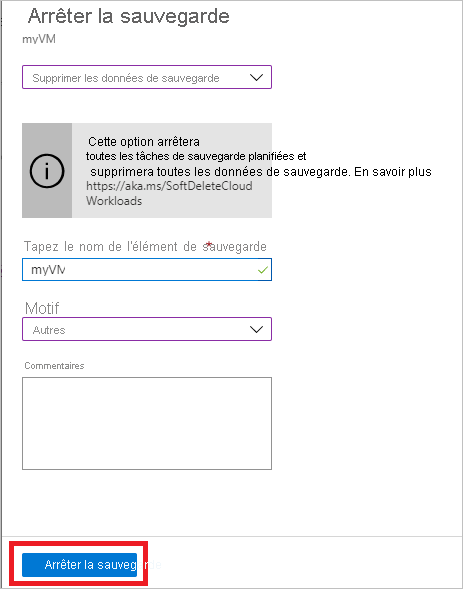

# Gérer les sauvegardes de machines virtuelles Azure avec le service Sauvegarde Azure

Cet article explique comment gérer les machines virtuelles Azure sauvegardées avec le [service Sauvegarde Azure](backup-overview.md). De plus, cet article récapitule les informations de sauvegarde que vous pouvez trouver sur le tableau de bord du coffre.

Dans le portail Azure, le tableau de bord du coffre Recovery Services permet d’accéder à des informations sur le coffre, notamment :

* La sauvegarde la plus récente, c’est-à-dire le dernier point de restauration.
* La stratégie de sauvegarde.
* La taille totale de tous les instantanés de sauvegarde.
* Le nombre de machines virtuelles qui sont activées pour les sauvegardes.

Vous pouvez gérer les sauvegardes à l’aide du tableau de bord et en accédant aux machines virtuelles individuelles. Pour commencer les sauvegardes des machines, ouvrez le coffre sur le tableau de bord.

## Afficher les machines virtuelles sur le tableau de bord

Pour afficher les machines virtuelles sur le tableau de bord du coffre :

1. Connectez-vous au [portail Azure](https://portal.azure.com/).
1. Dans le menu de gauche, sélectionnez **Tous les services**.

    

1. Dans la boîte de dialogue **Tous les services**, entrez *Recovery Services*. Liste des filtres de ressources variant en fonction de votre entrée. Dans la liste des ressources, sélectionnez **Coffres Recovery Services**.

    

    La liste des coffres Recovery Services de l’abonnement s’affiche.

1. Pour faciliter l’utilisation, sélectionnez l’icône d’épingle en regard du nom de votre coffre, puis sélectionnez **Épingler au tableau de bord**.
1. Ouvrez le tableau de bord du coffre.

    

1. Sur la vignette **Éléments de sauvegarde**, sélectionnez **Machine virtuelle Azure**.

    

1. Dans le volet **Éléments de sauvegarde**, vous pouvez voir la liste des machines virtuelles protégées. Dans cet exemple, le coffre protège une seule machine virtuelle : *myVMR1*.  

    

1. À partir du tableau de bord de l’élément de coffre, vous pouvez modifier les stratégies de sauvegarde, exécuter une sauvegarde à la demande, arrêter ou reprendre la protection des machines virtuelles, supprimer des données de sauvegarde, afficher les points de restauration et exécuter une restauration.

    

## Gérer la stratégie de sauvegarde pour une machine virtuelle

### Modifier la stratégie de sauvegarde

Pour modifier une stratégie de sauvegarde existante :

1. Connectez-vous au [portail Azure](https://portal.azure.com/). Ouvrez le tableau de bord du coffre.
2. À partir de **Gérer > Stratégies de sauvegarde**, sélectionnez la stratégie de sauvegarde pour le type **Machine virtuelle Azure**.
3. Sélectionnez **Modifier** et changez les paramètres.

### Changer de stratégie de sauvegarde

Pour gérer une stratégie de sauvegarde :

1. Connectez-vous au [portail Azure](https://portal.azure.com/). Ouvrez le tableau de bord du coffre.
2. Sur la vignette **Éléments de sauvegarde**, sélectionnez **Machine virtuelle Azure**.

    

3. Dans le volet **Éléments de sauvegarde**, vous pouvez voir la liste des machines virtuelles protégées et l’état de la dernière sauvegarde avec l’heure des derniers points de restauration.

    

4. À partir du tableau de bord de l’élément de coffre, vous pouvez sélectionner une stratégie de sauvegarde.

   * Pour changer de stratégie, sélectionnez une stratégie différente, puis sélectionnez **Enregistrer**. La nouvelle stratégie est appliquée immédiatement au coffre.

     

## Exécuter une sauvegarde à la demande

Vous pouvez exécuter une sauvegarde à la demande d’une machine virtuelle une fois que vous avez configuré sa protection. Gardez à l’esprit les détails ci-après :

* Si la sauvegarde initiale est en attente, la sauvegarde à la demande crée une copie complète de la machine virtuelle dans le coffre Recovery Services.
* Si la sauvegarde initiale est terminée, une sauvegarde à la demande envoie au coffre Recovery Services uniquement les modifications par rapport à l’instantané précédent. Autrement dit, les sauvegardes ultérieures sont toujours incrémentielles.
* La plage de conservation pour une sauvegarde à la demande correspond à la valeur de conservation que vous spécifiez quand vous déclenchez la sauvegarde.

> [!NOTE]
> Le service Sauvegarde Azure prend en charge jusqu’à neuf sauvegardes à la demande par jour, mais Microsoft recommande d’effectuer au maximum quatre sauvegardes quotidiennes à la demande afin d’assurer un niveau de performance optimal.

Pour déclencher une sauvegarde à la demande :

1. Sur le [tableau de bord de l’élément de coffre](#view-vms-on-the-dashboard), sous **Élément protégé**, sélectionnez **Sauvegarder maintenant**.

    

2. À partir de **Type de gestion des sauvegardes**, sélectionnez **Machine virtuelle Azure**. Le volet **Élément de sauvegarde (Machine virtuelle Azure)** apparaît.
3. Sélectionnez une machine virtuelle, puis sélectionnez **Sauvegarder maintenant** pour créer une sauvegarde à la demande. Le volet **Sauvegarder maintenant** apparaît.
4. Dans le champ **Conserver la sauvegarde jusqu’au**, spécifiez une date pour la sauvegarde à conserver.

    

5. Sélectionnez **OK** pour exécuter le travail de sauvegarde.

Pour suivre la progression du travail, sur le tableau de bord du coffre, sélectionnez la vignette **Travaux de sauvegarde**.

## Arrêter la protection d’une machine virtuelle

Il existe deux façons d’arrêter la protection d’une machine virtuelle :

* **Arrêter la protection et conserver les données de sauvegarde**. Avec cette option, tous les futurs travaux de sauvegarde cesseront de protéger votre machine virtuelle. Cependant, le service Sauvegarde Azure conservera les points de récupération qui ont été sauvegardés.  Vous devrez payer pour conserver ces points de récupération dans le coffre (consultez l’article [Tarification de Sauvegarde Azure](https://azure.microsoft.com/pricing/details/backup/) pour en savoir plus). Vous serez en mesure de restaurer la machine virtuelle si nécessaire. Si vous décidez de reprendre la protection des machines virtuelles, vous pourrez utiliser l’option *Reprendre la sauvegarde*.
* **Arrêter la protection et supprimer les données de sauvegarde**. Cette option empêche toutes les futures tâches de sauvegarde de protéger votre machine virtuelle et supprime tous les points de récupération. Vous ne pourrez pas restaurer la machine virtuelle, ni utiliser l’option *Reprendre la sauvegarde*.

>[!NOTE]
>Si vous supprimez une source de données sans arrêter les sauvegardes, les nouvelles sauvegardes échouent. Les anciens points de récupération expirent conformément à la stratégie, mais un dernier point de récupération est conservé jusqu’à ce que vous arrêtiez les sauvegardes et supprimiez les données.
>

### Arrêter la protection et conserver les données de sauvegarde

Pour arrêter la protection et conserver les données d’une machine virtuelle :

1. Sur le [tableau de bord de l’élément de coffre](#view-vms-on-the-dashboard), sélectionnez **Arrêter la sauvegarde**.
2. Choisissez **Conserver les données de sauvegarde** et confirmez votre choix si nécessaire. Ajoutez un commentaire si vous le souhaitez. Si vous n’êtes pas sûr du nom de l’élément, survolez le point d’exclamation pour en afficher le nom.

    

Une notification vous informe que les travaux de sauvegarde ont été interrompus.

### Arrêter la protection et supprimer les données de sauvegarde

Pour arrêter la protection et supprimer les données d’une machine virtuelle :

1. Sur le [tableau de bord de l’élément de coffre](#view-vms-on-the-dashboard), sélectionnez **Arrêter la sauvegarde**.
2. Choisissez **Supprimer les données de sauvegarde** et confirmez votre choix si nécessaire. Entrez le nom de l’élément de sauvegarde et ajoutez un commentaire si vous le souhaitez.

    

> [!NOTE]
> Une fois l’opération de suppression terminée, les données sauvegardées sont conservées pendant 14 jours à l’[état de suppression réversible](./soft-delete-virtual-machines.md).  Par ailleurs, vous pouvez aussi [activer ou désactiver la suppression réversible](./backup-azure-security-feature-cloud.md#enabling-and-disabling-soft-delete).

## Reprendre la protection d’une machine virtuelle

Si vous avez choisi l’option [Arrêter la protection et conserver les données de sauvegarde](#stop-protection-and-retain-backup-data) lors de la configuration de l’arrêt de la protection de la machine virtuelle, vous pouvez utiliser l’option **Reprendre la sauvegarde**. Cette option n’est pas disponible si vous choisissez [Arrêter la protection et supprimer les données de sauvegarde](#stop-protection-and-delete-backup-data) ou [Supprimer les données de sauvegarde](#delete-backup-data).

Pour reprendre la protection d’une machine virtuelle :

1. Sur le [tableau de bord de l’élément de coffre](#view-vms-on-the-dashboard), sélectionnez **Reprendre la sauvegarde**.

2. Suivez les étapes de la section [Modifier les stratégies de sauvegarde](#manage-backup-policy-for-a-vm) pour affecter la stratégie de la machine virtuelle. Vous n’avez pas besoin de choisir la stratégie de protection initiale de la machine virtuelle.
3. Après avoir appliqué la stratégie de sauvegarde à la machine virtuelle, vous voyez le message suivant :

    

## Supprimer les données de sauvegarde

Il existe deux façons de supprimer les données de sauvegarde d’une machine virtuelle :

* À partir du tableau de bord d’un élément du coffre, sélectionnez Arrêter la sauvegarde et suivez les instructions pour [Arrêter la protection et supprimer les données de sauvegarde](#stop-protection-and-delete-backup-data).

  

* Dans le tableau de bord d’un élément du coffre, sélectionnez Supprimer les données de sauvegarde. Cette option est disponible si vous aviez choisi l’option [Arrêter la protection et conserver les données de sauvegarde](#stop-protection-and-retain-backup-data) au moment de configurer l’arrêt de la protection de la machine virtuelle.

  

  * Sur le [tableau de bord de l’élément de coffre](#view-vms-on-the-dashboard), sélectionnez **Supprimer les données de sauvegarde**.
  * Tapez le nom de l’élément de sauvegarde pour confirmer la suppression des points de récupération.

    

  * Pour supprimer les données de sauvegarde relatives à l’élément, sélectionnez **Supprimer**. Un message de notification vous informe que les données de sauvegarde ont été supprimées.

Pour protéger vos données, Sauvegarde Azure comprend la fonctionnalité de suppression réversible. Avec la suppression réversible, même après la suppression de la sauvegarde (tous les points de récupération) d’une machine virtuelle, les données de sauvegarde sont conservées pendant 14 jours supplémentaires. Pour plus d’informations, consultez la [documentation relative à la suppression réversible](./backup-azure-security-feature-cloud.md).

  > [!NOTE]
  > Lorsque vous supprimez les données de sauvegarde, vous supprimez tous les points de récupération associés. Vous ne pouvez pas choisir des points de récupération spécifiques à supprimer.

### Élément de sauvegarde où la source de données primaire n’existe plus

* Si les machines virtuelles Azure configurées pour la sauvegarde Azure sont supprimées ou déplacées sans arrêter la protection, les travaux de sauvegarde planifiés et à la demande (ad hoc) échouent avec l’erreur UserErrorVmNotFoundV2. La prévérification de sauvegarde apparaît comme étant critique uniquement pour les travaux de sauvegarde à la demande qui ont échoué (les travaux planifiés qui ont échoué n’apparaissent pas).
* Ces éléments de sauvegarde restent actifs dans le système qui adhère à la stratégie de sauvegarde et de conservation définie par l’utilisateur. Les données sauvegardées pour ces machines virtuelles Azure sont conservées conformément à la stratégie de conservation. Les points de récupération qui ont expiré (à l’exception du dernier) sont nettoyés en fonction de la plage de conservation définie dans la stratégie de sauvegarde.
* Il est recommandé aux utilisateurs de supprimer les éléments de sauvegarde dans lesquels la source de données principale n'existe plus afin d'éviter tout surcoût, si l'élément/les données de sauvegarde des ressources supprimées ne sont plus nécessaires, car le dernier point de récupération est conservé indéfiniment et l'utilisateur est facturé conformément aux tarifs de sauvegarde applicables.

## Étapes suivantes

* Découvrez comment [sauvegarder une machine virtuelle Azure à partir des paramètres de celle-ci](backup-azure-vms-first-look-arm.md).
* Découvrez comment [restaurer des machines virtuelles](backup-azure-arm-restore-vms.md).
* Découvrez comment [superviser des sauvegardes de machines virtuelles Azure](./backup-azure-monitoring-built-in-monitor.md).
