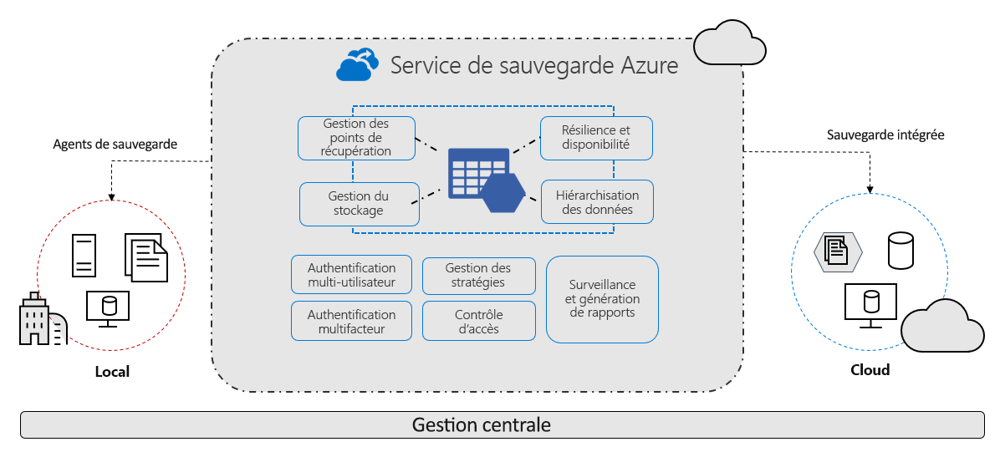

# Qu’est-ce que le service Sauvegarde Azure ?

Le service de sauvegarde Azure fournit des solutions simples, sécurisées et rentables pour sauvegarder vos données et les récupérer à partir du cloud Microsoft Azure.

> [!VIDEO https://www.youtube.com/embed/elODShatt-c]

## Que puis-je sauvegarder ?

- **Localement** - Sauvegardez des fichiers, des dossiers et l’état du système à l’aide de l’[agent Microsoft Azure Recovery Services (MARS)](backup-support-matrix-mars-agent.md). Ou utilisez l’agent DPM ou Microsoft Azure Backup Server (MABS) pour protéger les machines virtuelles locales ([Hyper-V](back-up-hyper-v-virtual-machines-mabs.md) et [VMWare](backup-azure-backup-server-vmware.md)) et d’autres [charges de travail locales](backup-mabs-protection-matrix.md).
- **Machines virtuelles Azure** - [Sauvegardez des machines virtuelles Windows/Linux entières](backup-azure-vms-introduction.md) (à l’aide d’extensions de sauvegarde) ou sauvegardez des fichiers, des dossiers et l’état du système à l’aide de l’[agent MARS](backup-azure-manage-mars.md).
- **Partages Azure Files** - [Sauvegarder des partages de fichiers Azure sur un compte de stockage](backup-afs.md)
- **SQL Server sur des machines virtuelles Azure** -  [Sauvegardez des bases de données SQL Server qui s’exécutent sur les machines virtuelles Azure](backup-azure-sql-database.md).
- **Bases de données SAP HANA sur des machines virtuelles Azure** - [Sauvegardez des bases de données SAP HANA qui s’exécutent sur des machines virtuelles Azure](backup-azure-sap-hana-database.md).

## Pourquoi utiliser Azure Backup ?

Le service Sauvegarde Azure offre les principaux avantages suivants :

- **Sauvegarde locale de déchargement** : Le service Sauvegarde Azure offre une solution simple pour la sauvegarde de vos ressources locales dans le cloud. Obtenez une sauvegarde à court terme et à long terme sans avoir besoin de déployer des solutions de sauvegarde locale complexes.
- **Sauvegarder des machines virtuelles Azure IaaS** : Le service Sauvegarde Azure fournit des sauvegardes indépendantes et isolées pour éviter une destruction accidentelle des données d’origine. Les sauvegardes sont stockées dans un coffre Recovery Services avec gestion intégrée des points de récupération. La configuration et la scalabilité sont simples : les sauvegardes sont optimisées, et vous pouvez facilement effectuer des restaurations en fonction des besoins.
- **Mettre à l’échelle facilement** : Sauvegarde Azure utilise la puissance sous-jacente et la mise à l’échelle illimitée du cloud Azure pour offrir une haute disponibilité, sans tâche supplémentaire de maintenance ou de supervision.
- **Obtenir un transfert de données illimitées** : Le service Sauvegarde Azure ne limite pas la quantité de données entrantes ou sortantes transférées, et ne génère pas de frais pour les données transférées.
  - Les données sortantes sont les données transférées à partir d’un coffre Recovery Services pendant une opération de restauration.
  - Si vous effectuez une sauvegarde initiale hors connexion avec le service Azure Import/Export pour importer de grandes quantités de données, des frais associés aux données entrantes sont facturés.  [Plus d’informations](backup-azure-backup-import-export.md)
- **Sécuriser les données** : Le service Sauvegarde Azure fournit des solutions pour sécuriser les données [en transit](backup-azure-security-feature.md) et [au repos](backup-azure-security-feature-cloud.md).
- **Supervision et gestion centralisées** : Sauvegarde Azure fournit [des fonctionnalités intégrées de supervision et d’alerte](backup-azure-monitoring-built-in-monitor.md) dans un coffre Recovery Services. Ces fonctionnalités sont disponibles sans infrastructure de gestion supplémentaire. Vous pouvez également augmenter l’échelle de votre supervision et de vos rapports [à l’aide d’Azure Monitor](backup-azure-monitoring-use-azuremonitor.md).
- **Obtenir des sauvegardes cohérentes au niveau application** : une sauvegarde cohérente au niveau application signifie qu’un point de récupération dispose de toutes les données nécessaires pour restaurer la copie de sauvegarde. Le service Sauvegarde Azure fournit des sauvegardes cohérentes avec les applications, qui garantissent qu’aucun correctif supplémentaire n’est requis pour restaurer les données. La restauration de données cohérentes avec les applications réduit le délai de restauration, ce qui permet de rétablir rapidement le fonctionnement normal.
- **Conserver des données à court et à long terme** : Vous pouvez utiliser des [coffres Recovery Services](backup-azure-recovery-services-vault-overview.md) pour la conservation des données à court et à long termes.
- **Gestion automatique du stockage** : les environnements hybrides impliquent souvent un stockage hétérogène (une partie en local et une autre dans le cloud). Avec le service Sauvegarde Azure, l’utilisation d’appareils de stockage locaux ne génère aucun coût. Azure Backup alloue et gère automatiquement le stockage de sauvegarde sur la base d’un modèle de paiement à l’utilisation. Vous payez uniquement le stockage que vous consommez. [Apprenez-en davantage sur la](https://azure.microsoft.com/pricing/details/backup) tarification.
- **Plusieurs options de stockage** : Sauvegarde Azure offre deux types de réplication pour conserver votre stockage/vos données hautement disponibles.
  - Le [stockage localement redondant (LRS)](../storage/common/storage-redundancy.md) réplique vos données trois fois (il crée trois copies de vos données) dans une unité d’échelle de stockage d’un centre de données. Toutes les copies des données existent dans la même région. Le stockage LRS est une option à faible coût qui protège vos données contre les défaillances matérielles locales.
  - Le [stockage géoredondant (GRS)](../storage/common/storage-redundancy.md) est l’option de réplication par défaut : c’est l’option recommandée. Le stockage géo-redondant réplique vos données vers une région secondaire, distante de plusieurs centaines de kilomètres de l’emplacement principal des données sources. Le stockage GRS est plus onéreux que le stockage LRS, mais il offre une durabilité des données supérieure, même en cas de panne au niveau régional.

## Étapes suivantes

- [Examinez](backup-architecture.md) l’architecture et les composants de différents scénarios de sauvegarde.
- [Vérifiez](backup-support-matrix.md) les exigences de prise en charge et les limitations pour la sauvegarde et la [sauvegarde de machine virtuelle Azure](backup-support-matrix-iaas.md).
