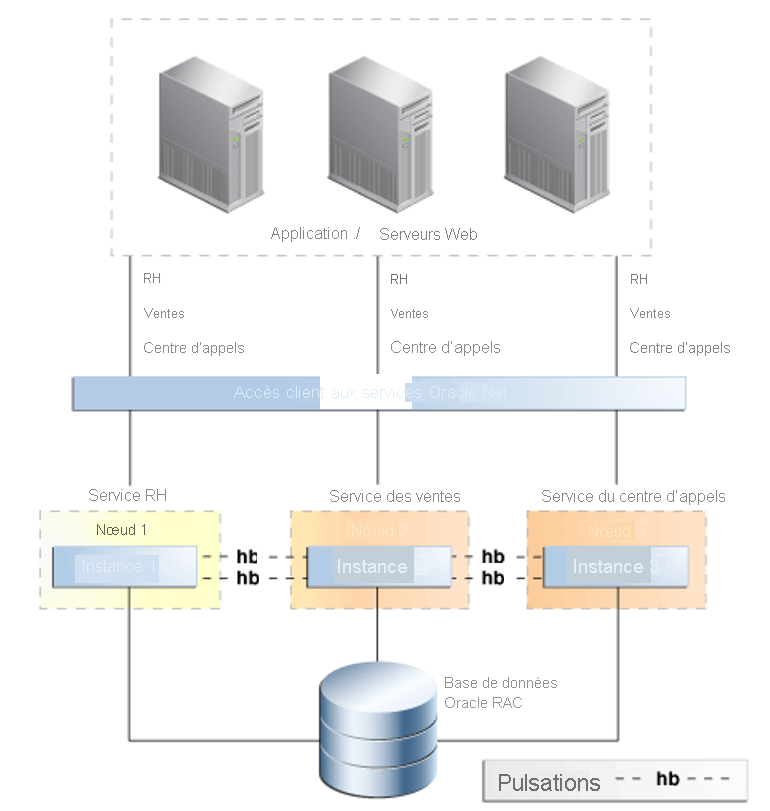

# Fonctionnalités de haute disponibilité pour Oracle sur Azure BareMetal

Dans cet article, nous allons examiner les principales fonctionnalités de haute disponibilité et de reprise d’activité d’Oracle.

Oracle offre de nombreuses fonctionnalités qui permettent de créer une plateforme résiliente pour l’exécution des bases de données Oracle. Si aucune fonctionnalité ne fournit à elle seule une couverture pour chaque type de défaillance, la combinaison de technologies en couches crée, elle, un système hautement disponible. Les fonctionnalités ne sont pas toutes nécessaires au maintien de la disponibilité. Pour autant, la combinaison de stratégies vous offre la meilleure protection qui soit contre toutes sortes de déficiences qui se produisent. 

## Flashback Database

La fonctionnalité [Flashback Database](https://docs.oracle.com/en/database/oracle/oracle-database/21/rcmrf/FLASHBACK-DATABASE.html#GUID-584AC79A-40C5-45CA-8C63-DED3BE3A4511) est disponible dans Oracle Database Enterprise Edition. Flashback Database rembobine la base de données à un point précis dans le temps. Cette fonctionnalité diffère d’une récupération jusqu’à une date et heure de [Recovery Manager (RMAN)](https://docs.oracle.com/en/cloud/paas/db-backup-cloud/csdbb/performing-general-restore-and-recovery-operations.html) en ce sens qu’elle rembobine à partir de l’heure actuelle, au lieu d’avancer après une restauration. De ce fait, Flashback Database offre des délais d’exécution beaucoup plus rapides.
 
Vous pouvez utiliser cette fonctionnalité avec [Oracle Data Guard](https://docs.oracle.com/en/database/oracle/oracle-database/19/sbydb/preface.html#GUID-B6209E95-9DA8-4D37-9BAD-3F000C7E3590). Flashback Database permet à un administrateur de base de données d’instancier de nouveau une base de données défaillante dans une configuration Data Guard, sans procéder à une récupération et une restauration RMAN complètes. Cette fonctionnalité vous permet de restaurer les fonctionnalités de reprise d’activité (ainsi que les avantages de la sauvegarde et la création de rapports déchargés avec Active Data Guard) beaucoup plus rapidement.
 
Vous pouvez utiliser cette fonctionnalité au lieu d’une restauration par progression retardée sur la base de données de secours. Une base de données de secours peut être rétablie à un point situé chronologiquement avant la survenue du problème.
 
Oracle Database conserve les journaux Flashback dans la zone de récupération rapide (FRA, Fast Recovery Area). Ces journaux sont distincts des journaux de restauration par progression et nécessitent plus d’espace dans la zone de récupération rapide. Par défaut, 24 heures de journaux Flashback sont conservées, mais vous pouvez modifier ce paramètre en fonction de vos besoins.

## Oracle Real Application Clusters

[Oracle Real Application Clusters (RAC)](https://docs.oracle.com/en/database/oracle/oracle-database/19/racad/introduction-to-oracle-rac.html#GUID-5A1B02A2-A327-42DD-A1AD-20610B2A9D92) permet à plusieurs serveurs interconnectés d’apparaître sous la forme d’un seul service de base de données pour les utilisateurs finals et les applications. Cette fonctionnalité supprime de nombreux points de défaillance et constitue une solution active/active à haute disponibilité reconnue pour les bases de données Oracle.

Comme montré dans l’illustration suivante provenant de [Vue d’ensemble et bonnes pratiques de la haute disponibilité](https://docs.oracle.com/en/database/oracle/oracle-database/19/haovw/ha-features.html) d’Oracle, une seule base de données RAC est présentée à la couche Application. Les applications se connectent à l’écouteur d’ANALYSE, qui dirige le trafic vers une instance de base de données spécifique. RAC contrôle l’accès depuis plusieurs instances pour maintenir la cohérence des données sur les nœuds de calcul distincts.

Si une instance échoue, le service continue sur toutes les autres instances restantes. Chaque base de données déployée sur la solution sera dans une configuration RAC de n+1, dans laquelle « n » est la puissance de traitement minimale nécessaire pour prendre en charge le service.

Les services Oracle Database sont utilisés pour autoriser les connexions permettant de basculer entre les nœuds lorsqu’une instance échoue de manière transparente. De telles défaillances peuvent être planifiées ou non planifiées. Si vous utilisez l’application (événements de notification d’application rapide), quand une instance devient indisponible, le service est déplacé vers un nœud survivant. Le service se déplace vers un nœud indiqué dans la configuration du service comme étant préféré ou disponible.

Une autre fonctionnalité clé des services Oracle Database consiste à ne démarrer un service qu’en fonction de son rôle. Cette fonctionnalité est utilisée en cas de basculement de Data Guard. Tous les modèles déployés à l’aide de Data Guard sont nécessaires pour lier un service de base de données à un rôle Data Guard.

Par exemple, deux services peuvent être créés, MY\_DB\_APP (MON APPLICATION DE BASE DE DONNÉES) et MY\_DB\_AS (MON RÔLE ACTIF/DE SECOURS DE BASE DE DONNÉES). Le service MY\_DB\_APP est démarré uniquement lorsque l’instance de base de données est démarrée avec le rôle Data Guard de PRIMARY (PRIMAIRE). Le service MY\_DB\_AS est démarré uniquement lorsque le rôle Data Guard est PHYSICAL\_STANDBY (PHYSIQUE_DE SECOURS). Cette configuration permet aux applications de pointer vers le service \_APP, tout en créant également des rapports, ce qui peut être déchargé dans Active Standby (Actif De secours) et pointé vers le service \_AS.

## Oracle Data Guard

Avec Data Guard, vous pouvez conserver une copie identique d’une base de données sur un matériel physique distinct. En principe, ce matériel doit être retiré de la zone géographique de la base de données primaire. Data Guard n’impose aucune limite de distance, bien que la distance ait une incidence sur les modes de protection. Une distance accrue ajoute de la latence entre les sites, ce qui peut empêcher certaines options (telles que la réplication synchrone) de rester viables.

Data Guard offre des avantages par rapport à la réplication au niveau du stockage :

- Étant donné que la réplication prend en charge les bases de données, seul le trafic pertinent est répliqué.
- Certaines charges de travail peuvent générer des entrées/sorties élevées sur des espaces de table temporaires ; elles ne sont pas nécessaires sur la base de données de secours et ne sont donc pas répliquées.
- La validation sur les blocs répliqués se produisant au niveau de la base de données de secours, les endommagements physiques sur la base de données primaire ne sont pas répliqués sur la base de données de secours.
- Évite les altérations intrablocs logiques et les altérations de perte d’écriture. Le risque que des erreurs commises par les administrateurs de stockage soient répliquées sur la base de données de secours est également éliminé.
La restauration par progression peut être retardée pendant une période prédéfinie, afin que les erreurs des utilisateurs ne soient pas immédiatement répliquées sur la base de données de secours.

## Instantanés Azure NetApp Files

La solution de stockage NetApp Files utilisée dans BareMetal vous permet de créer des instantanés de volumes. Les instantanés vous donne la possibilité de rétablir rapidement un système de fichiers à un point spécifique dans le temps. Les technologies d’instantané autorisent des durées d’objectifs de délai de récupération (RTO) représentant une fraction du temps nécessaire à la restauration d’une sauvegarde de base de données.

La fonctionnalité de capture instantanée pour les bases de données Oracle est disponible via Azure NetApp SnapCenter. SnapCenter permet les captures instantanées pour la sauvegarde, SnapVault apporte un archivage hors connexion et Snap Clone active la restauration en libre-service ainsi que d’autres opérations. Pour plus d’informations, consultez [Intégration de SnapCenter pour Oracle sur BareMetal Infrastructure](netapp-snapcenter-integration-oracle-baremetal.md).

## Gestionnaire de récupération

Recovery Manager (RMAN) est l’utilitaire privilégié pour effectuer des sauvegardes de bases de données physiques. RMAN interagit avec le fichier de contrôle de base de données (ou un catalogue de récupération centralisé) pour protéger les différents composants principaux de la base de données, notamment les fichiers suivants :

- Fichiers de données de base de données
- Journaux de restauration par progression archivés
- Fichiers de contrôle de base de données
- Fichiers d’initialisation de base de données (spfile)

RMAN vous permet d’effectuer des sauvegardes de base de données à chaud ou à froid. Vous pouvez utiliser ces sauvegardes pour créer des bases de données de secours, ou dupliquer des bases de données afin de cloner des environnements. RMAN dispose également d’une fonction de validation de restauration. Cette fonction lit un jeu de sauvegarde et détermine si vous pouvez l’utiliser pour récupérer la base de données à un point spécifique dans le temps.

RMAN étant un utilitaire fourni par Oracle, il lit la structure interne des fichiers de base de données. Vous pouvez ainsi exécuter des vérifications d’altération physique et logique lors des opérations de sauvegarde et de restauration. Vous pouvez aussi récupérer des fichiers de données de base de données, restaurer également des espaces de table et des fichiers de données individuels à un point particulier dans le temps. Ce sont là les avantages qu’offre RMAN par rapport aux captures instantanées de stockage. Les sauvegardes RMAN constituent un dernier rempart de défense contre les pertes de données complètes lorsque vous ne pouvez pas utiliser les captures instantanées.

## Étapes suivantes

Découvrez les options et les recommandations qui permettent d’optimiser la protection et les performances lors de l’exécution d’Oracle sur l’infrastructure BareMetal :

> [!div class="nextstepaction"]
> [Options pour les serveurs de l’infrastructure Oracle BareMetal](options-considerations-high-availability.md)
