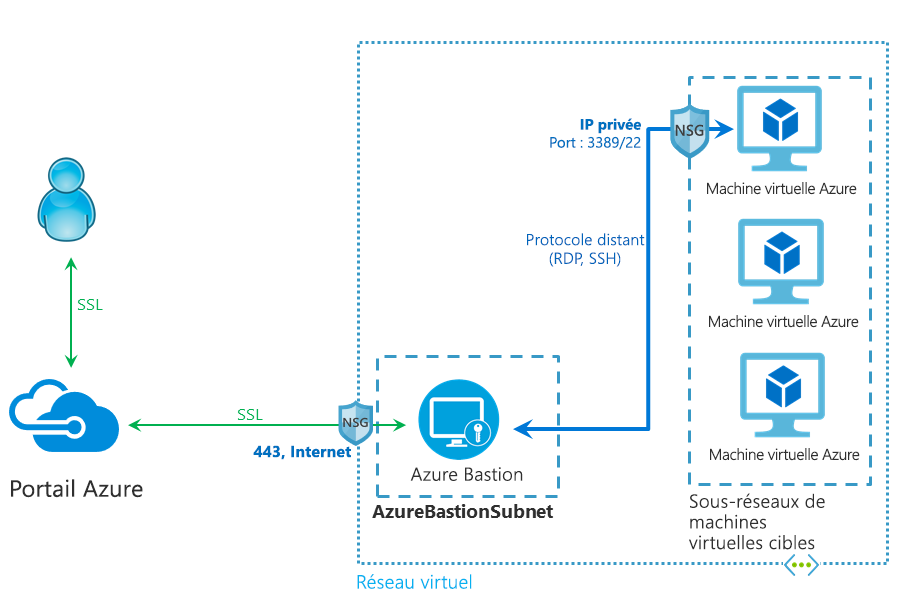

# Qu’est-ce qu’Azure Bastion ?

Azure Bastion est un service que vous déployez et qui vous permet de vous connecter à une machine virtuelle à l’aide de votre navigateur et du portail Azure. Le service Azure Bastion est un service PaaS complètement managé par la plateforme que vous provisionnez au sein de votre réseau virtuel. Il fournit une connectivité RDP/SSH sécurisée et fluide à vos machines virtuelles, directement à partir du portail Azure via TLS. Quand vous vous connectez via Azure Bastion, vos machines virtuelles n’ont pas besoin d’adresse IP publique, d’agent ou de logiciel client spécial.

Bastion fournit une connectivité RDP et SSH sécurisée à toutes les machines virtuelles du réseau virtuel dans lequel il est provisionné. Azure Bastion protège vos machines virtuelles contre l’exposition des ports RDP/SSH au monde extérieur, tout en fournissant un accès sécurisé à l’aide de RDP/SSH.

## Architecture

Le déploiement Azure Bastion est effectué par réseau virtuel et non par abonnement/compte ou machine virtuelle. Une fois que vous avez provisionné le service Azure Bastion dans votre réseau virtuel, l’expérience RDP/SSH est disponible pour toutes vos machines virtuelles sur le même réseau virtuel.

RDP et SSH font partie des moyens fondamentaux par lesquels vous pouvez vous connecter à vos charges de travail exécutées dans Azure. L’exposition des ports RDP/SSH sur Internet est déconseillée car considérée comme une surface de menace importante. Cela est surtout dû aux vulnérabilités du protocole. Pour contenir cette surface de menace, vous pouvez déployer des hôtes Bastion (également appelés serveurs de saut) du côté public de votre réseau périphérique. Les serveurs hôte Bastion sont conçus et configurés pour faire face aux attaques. Les serveurs Bastion fournissent également une connectivité RDP et SSH aux charges de travail situées derrière le bastion, ainsi qu’à l’intérieur du réseau.

Cette figure représente l’architecture d’un déploiement Azure Bastion. Dans ce diagramme :

* l’hôte Bastion est déployé dans le réseau virtuel.
* L’utilisateur se connecte au portail Azure à l’aide de n’importe quel navigateur HTML5.
* L’utilisateur sélectionne la machine virtuelle à laquelle se connecter.
* D’un simple clic, la session RDP/SSH s’ouvre dans le navigateur.
* Aucune adresse IP publique n’est requise sur la machine virtuelle Azure.

## Fonctionnalités clés

Les fonctionnalités suivantes sont disponibles :

* **RDP et SSH directement dans le Portail Azure :** Vous pouvez accéder directement à la session RDP et SSH directement dans le Portail Azure en un clic.
* **Session à distance sur TLS et traversée de pare-feu pour RDP/SSH :** Azure Bastion utilise un client web basé sur HTML5 qui est automatiquement envoyé en streaming sur votre appareil local, si bien que vous obtenez votre session RDP/SSH via TLS sur le port 443, ce qui vous permet de traverser les pare-feu d’entreprise de manière sécurisée.
* **Aucune adresse IP publique n’est requise sur la machine virtuelle Azure :** Azure Bastion ouvre la connexion RDP/SSH à votre machine virtuelle Azure en utilisant une adresse IP privée sur votre machine virtuelle. Vous n’avez pas besoin d’une adresse IP publique sur votre machine virtuelle.
* **Gestion aisée des groupes de sécurité réseau :** Azure Bastion est un service PaaS de plateforme entièrement géré d’Azure, renforcé en interne pour vous fournir une connectivité RDP/SSH sécurisée. Vous n’avez pas besoin d’appliquer de groupes de sécurité réseau sur le sous-réseau Azure Bastion. Comme Azure Bastion se connecte à vos machines virtuelles par le biais d’une adresse IP privée, vous pouvez configurer vos groupes de sécurité réseau pour autoriser RDP/SSH depuis Azure Bastion uniquement. Vous n’avez plus à gérer les groupes de sécurité réseau chaque fois que vous devez vous connecter de manière sécurisée à vos machines virtuelles.
* **Protection contre l’analyse des ports :** Parce que vous n’avez pas besoin d’exposer vos machines virtuelles à l’Internet public, celles-ci sont protégées contre l’analyse des ports par des utilisateurs malveillants situés en dehors de votre réseau virtuel.
* **Protégez-vous contre les exploits du jour zéro. Renforcement de la sécurité dans un seul endroit :** Azure Bastion est un service PaaS complètement managé par la plateforme. Comme il se trouve au périmètre de votre réseau virtuel, vous n’avez pas besoin de vous soucier du renforcement de la sécurité de chacune des machines virtuelles de votre réseau virtuel. La plateforme Azure protège contre les exploits du jour zéro en assurant une sécurité durcie permanente et à jour pour Azure Bastion.

## Nouveautés

Abonnez-vous au flux RSS, puis consultez les dernières mises à jour des fonctionnalités Azure Bastion dans la page [Mises à jour Azure](https://azure.microsoft.com/updates/?category=networking&query=Azure%20Bastion).

## Questions fréquentes (FAQ)

[!INCLUDE [Bastion FAQ](../../includes/bastion-faq-include.md)]

## Étapes suivantes

* [Tutoriel : Créer un hôte Azure Bastion et se connecter à une machine virtuelle Windows](tutorial-create-host-portal.md).
* Découvrez certaines des autres [fonctionnalités de réseau](../networking/networking-overview.md) clés d’Azure.
