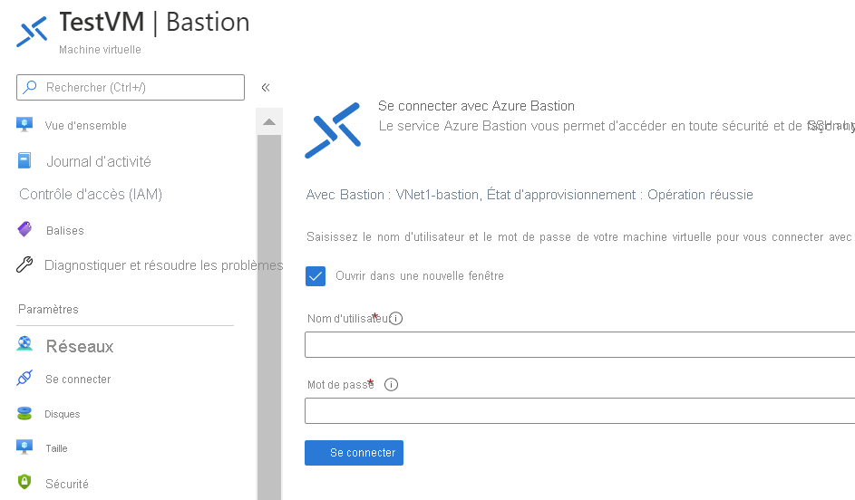

# Démarrage rapide : Se connecter à une machine virtuelle à l’aide d’une adresse IP privée et d’Azure Bastion

Cet article sur le démarrage rapide vous explique comment vous connecter à une machine virtuelle à l’aide d’une adresse IP privée. Lorsque vous vous connectez via Azure Bastion, vos machines virtuelles n’ont pas besoin d’une adresse IP publique. Les étapes décrites dans cet article vous aident à déployer Bastion sur votre réseau virtuel via votre machine virtuelle dans le portail. Une fois le service approvisionné, l’expérience RDP/SSH est disponible pour toutes les machines virtuelles du même réseau virtuel.

## Configuration requise

* Un réseau virtuel Azure.
* Une machine virtuelle Azure située dans le réseau virtuel avec le port 3389 ouvert.

### Exemples de valeurs

|**Nom** | **Valeur** |
| --- | --- |
| Nom |  VNet1Bastion |
| Région | eastus |
| Réseau virtuel |  VNet1 |
| + Nom du sous-réseau | AzureBastionSubnet |
| Adresses AzureBastionSubnet |  10.1.254.0/27 |
| Adresse IP publique |  Création |
| Nom de l’adresse IP publique | VNet1BastionPIP  |
| Référence SKU d’adresse IP publique |  standard  |
| Affectation  | statique |

## Créer un hôte Bastion

Lorsque vous créez un hôte bastion dans le portail à l’aide d’une machine virtuelle existante, différents paramètres sont automatiquement définis par défaut de sorte à correspondre à votre machine virtuelle et/ou réseau virtuel.

1. Ouvrez le [portail Azure](https://portal.azure.com). Accédez à votre machine virtuelle, puis cliquez sur **Se connecter**.

   
1. Dans la liste déroulante, sélectionnez **Bastion**.
1. Sur la page Se connecter, sélectionnez **Utiliser Bastion**.

   

1. Dans la page Bastion, renseignez les champs suivants :

   * **Name** : Nommer l’hôte bastion
   * **Sous-réseau** : Sous-réseau au sein de votre réseau virtuel dans lequel la ressource Bastion est déployée. Le sous-réseau doit être créé avec le nom **AzureBastionSubnet**. Le nom permet à Azure de savoir dans quel sous-réseau déployer la ressource Bastion. Ceci est différent d’un sous-réseau de passerelle. Utilisez un sous-réseau de /27 ou plus (/27, /26, /25, etc.).
   
      * Sélectionnez **Gérer la configuration du sous-réseau**, puis **+ Sous-réseau**.
      * Dans la page Ajouter un sous-réseau, tapez **AzureBastionSubnet**.
      * Spécifiez la plage d’adresses en notation CIDR. Par exemple, 10.1.254.0/27.
      * Sélectionnez **OK** pour créer le sous-réseau. En haut de la page, revenez à Bastion pour renseigner les paramètres restants.

         
   * **Adresse IP publique** : Adresse IP publique de la ressource Bastion où RDP/SSH sera accessible (sur le port 443). Créez une adresse IP publique ou utilisez-en une existante. L’adresse IP publique doit être située dans la même région que la ressource Bastion que vous créez.
   * **Nom de l’adresse IP publique** : Nom de la ressource de l’adresse IP publique.
1. Dans l’écran de validation, cliquez sur **Créer**. Patientez pendant environ 5 minutes pour que la ressource Bastion soit créée et déployée.

   

## Connexion

Une fois Bastion déployé sur le réseau virtuel, l’écran devient la page de connexion.

1. Entrez le nom d’utilisateur et le mot de passe pour votre machine virtuelle. puis **Connecter**.

   
1. La connexion RDP à cette machine virtuelle avec Bastion s’ouvrira directement dans le portail Azure (en HTML5) via le port 443 et le service Bastion.

   

## Nettoyer les ressources

Lorsque vous avez fini d’utiliser le réseau virtuel et les machines virtuelles, supprimez le groupe de ressources et toutes les ressources qu’il contient :

1. Entrez *TestRG1* dans la zone **Recherche** en haut du portail, puis sélectionnez **TestRG1** dans les résultats de la recherche.

2. Sélectionnez **Supprimer le groupe de ressources**.

3. Entrez *TestRG1* dans **TAPER NOM DU GROUPE DE RESSOURCES**, puis sélectionnez **Supprimer**.

## Étapes suivantes

Dans ce guide de démarrage rapide, vous avez créé un hôte Bastion pour votre réseau virtuel, puis vous vous êtes connecté à une machine virtuelle en toute sécurité via l’hôte Bastion.

* Pour en savoir plus sur Azure Bastion, consultez [Vue d’ensemble de Bastion](bastion-overview.md) et le [FAQ Bastion](bastion-faq.md).
* Pour utiliser des groupes de sécurité réseau avec le sous-réseau Azure Bastion, consultez [Utiliser des groupes de sécurité réseau](bastion-nsg.md).
* Pour obtenir des instructions contenant des explications sur les paramètres de l’hôte Azure Bastion, consultez le [tutoriel](bastion-create-host-portal.md).
* Pour vous connecter à un groupe de machines virtuelles identiques, consultez [Se connecter à un groupe de machines virtuelles identiques à l’aide d’Azure Bastion](bastion-connect-vm-scale-set.md).