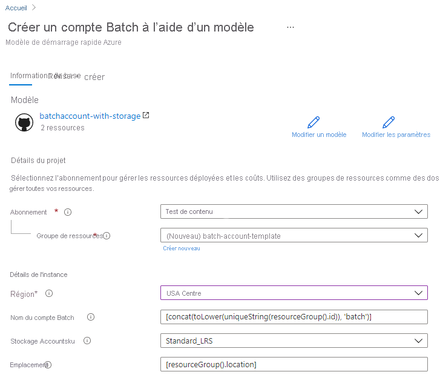

# Démarrage rapide : Création d’un compte Batch à l’aide d’un modèle Azure Resource Manager

Un compte Batch est nécessaire pour créer des ressources de calcul (pools de nœuds de calcul) et des travaux Batch. Vous pouvez lier un compte de stockage Azure avec votre compte Batch, ce qui est utile pour déployer des applications et stocker des données d’entrée et de sortie pour la plupart des charges de travail réelles. Ce guide de démarrage rapide montre comment utiliser un modèle Azure Resource Manager pour créer un compte Batch, stockage compris. À l’issue de ce démarrage rapide, vous maîtriserez les concepts clés du service Batch et serez prêt à essayer Azure Batch avec des charges de travail plus réalistes à plus grande échelle.

[!INCLUDE [About Azure Resource Manager](../../includes/resource-manager-quickstart-introduction.md)]

## Prérequis

Vous devez avoir un abonnement Azure actif.

- [!INCLUDE [quickstarts-free-trial-note](../../includes/quickstarts-free-trial-note.md)]

## Créez un compte de stockage.

### Vérifier le modèle

Le modèle utilisé dans ce démarrage rapide est tiré des [modèles de démarrage rapide Azure](https://azure.microsoft.com/resources/templates/101-batchaccount-with-storage/).

:::code language="json" source="~/quickstart-templates/101-batchaccount-with-storage/azuredeploy.json" range="1-80" highlight="36-69":::

Deux ressources Azure sont définies dans le modèle :

- [Microsoft.Storage/storageAccounts](https://docs.microsoft.com/azure/templates/microsoft.storage/storageaccounts) : Crée un compte de stockage.
- [Microsoft.Batch/batchAccounts](https://docs.microsoft.com/azure/templates/microsoft.batch/batchaccounts) : Crée un compte Batch.

### Déployer le modèle

1. Cliquez sur l’image ci-après pour vous connecter à Azure et ouvrir un modèle. Le modèle crée un compte Azure Batch et un compte de stockage Azure.

   

1. Sélectionnez ou entrez les valeurs suivantes.

   

   - **Abonnement** : sélectionnez un abonnement Azure.
   - **Groupe de ressources** : sélectionnez **Créer**, entrez un nom unique pour le groupe de ressources, puis cliquez sur **OK**.
   - **Emplacement** : sélectionnez un emplacement. Par exemple, **USA Centre**.
   - **Nom du compte Batch** : Conservez la valeur par défaut.
   - **Référence SKU du compte de stockage** : sélectionnez un type de compte de stockage. Par exemple, **Standard_LRS**.
   - **Emplacement** : conservez la valeur par défaut afin que les ressources se trouvent au même emplacement que votre groupe de ressources.
   - J’accepte les conditions générales mentionnées ci-dessus : **cochez la case**.

1. Sélectionnez **Achat**.

Après quelques minutes, une notification indique que le compte Batch a bien été créé.

Dans cet exemple, c’est le Portail Azure qui est utilisé pour déployer le modèle. Outre le portail Azure, vous pouvez également utiliser Azure PowerShell, l’interface Azure CLI et l’API REST. Pour découvrir d’autres méthodes de déploiement, consultez [Déployer des modèles](../azure-resource-manager/templates/deploy-powershell.md).

## Valider le déploiement

Pour valider le déploiement sur le Portail Azure, accédez au groupe de ressources que vous avez créé. Sur l’écran **Vue d’ensemble**, vérifiez que le compte Batch et le compte de stockage sont présents.

## Nettoyer les ressources

Si vous prévoyez de suivre les [tutoriels](./tutorial-parallel-dotnet.md) suivants, il peut être utile de conserver ces ressources. Si au contraire vous n’en avez plus besoin, vous pouvez [supprimer le groupe de ressources](../azure-resource-manager/management/delete-resource-group.md?tabs=azure-portal#delete-resource-group), ce qui supprime également le compte Batch et le compte de stockage que vous avez créés.

## Étapes suivantes

Dans ce guide de démarrage rapide, vous avez créé un compte Batch et un compte de stockage. Pour plus d’informations sur Microsoft Azure Batch, consultez les didacticiels Azure Batch.

> [!div class="nextstepaction"]
> [Didacticiels Azure Batch](./tutorial-parallel-dotnet.md)
