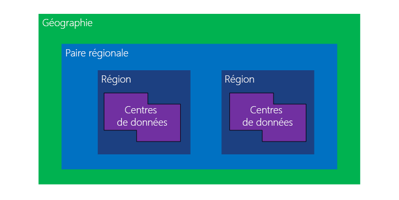
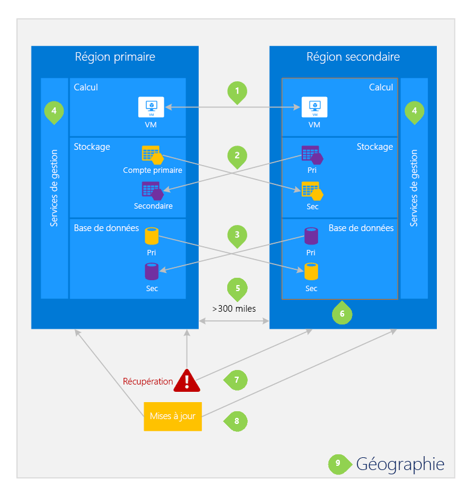

# Continuité et reprise d’activité : Régions jumelées Azure

## Régions jumelées : définition

Une région Azure est un ensemble de centres de données déployés dans un périmètre défini par la latence et connectés via un réseau dédié à faible latence.  Cela garantit que les services Azure dans une région Azure offrent les meilleures performances et la meilleure sécurité possible.  

Une zone géographique Azure désigne une zone du monde contenant au moins une région Azure. Les zones géographiques définissent un marché discret, qui contient généralement deux régions ou plus qui préservent la résidence des données et les limites de conformité.  Obtenez plus d’informations sur l’infrastructure globale d’Azure [ici](https://azure.microsoft.com/global-infrastructure/regions/).

Une paire régionale est constituée de deux régions au sein de la même zone géographique. Azure sérialise les mises à jour de plateforme (maintenance planifiée) à travers les paires régionales, garantissant ainsi qu’une seule région de chaque paire est mise à jour à la fois. Si une panne touche plusieurs régions, au moins l’une des régions de chaque paire est prioritaire pour la récupération.

Certains services Azure tirent parti des régions jumelées pour assurer la continuité des activités et la protection contre la perte de données.  Azure fournit plusieurs [solutions de stockage](./storage/common/storage-redundancy.md#redundancy-in-a-secondary-region) qui tirent parti des régions jumelées pour garantir la disponibilité des données. Par exemple, le [stockage géoredondant Azure](./storage/common/storage-redundancy.md#geo-redundant-storage) (GRS) réplique automatiquement les données dans une région secondaire, garantissant ainsi la durabilité des données même dans le cas où la région primaire n’est pas récupérable. 

Notez que tous les services Azure ne répliquent pas automatiquement les données, et que tous les services Azure ne basculent pas automatiquement d’une région défaillante à son homologue.  Dans ce cas, la récupération et la réplication doivent être configurées par le client.

## Puis-je sélectionner mes paires régionales ?

Non. Certains services Azure s’appuient sur des paires régionales, telles que le [stockage redondant](./storage/common/storage-redundancy.md) d’Azure. Ces services ne vous permettent pas de créer des jumelages régionaux.  De même, étant donné qu’Azure contrôle la hiérarchisation de la maintenance planifiée et de la récupération pour les paires régionales, vous ne pouvez pas définir vos propres paires régionales pour profiter de ces services. Toutefois, vous pouvez créer votre propre solution de récupération d’urgence en créant des services dans un nombre quelconque de régions et en tirant parti des services Azure pour les jumeler. 

Par exemple, vous pouvez utiliser les services Azure, tels que [AzCopy](./storage/common/storage-use-azcopy-v10.md), pour planifier des sauvegardes de données sur un compte de stockage dans une autre région.  En utilisant [Azure DNS et Azure Traffic Manager](./networking/disaster-recovery-dns-traffic-manager.md), les clients peuvent concevoir une architecture résiliente pour leurs applications qui survivra à la perte de la région primaire.

## Mon utilisation des services est-elle limitée à mes paires régionales ?

Non. Même si un service Azure donné peut reposer sur une paire régionale, vous pouvez héberger vos autres services dans n’importe quelle région répondant aux besoins de votre entreprise.  Une solution de stockage GRS Azure peut associer les données de la région Canada Centre à un homologue dans la région Canada Est, tout en utilisant des ressources Compute situées dans la région USA Est.  

## Dois-je utiliser des paires régionales Azure ?

Non. Les clients peuvent tirer parti des services Azure pour concevoir un service résilient sans dépendre des paires régionales d’Azure.  Toutefois, nous vous recommandons de configurer la continuité d’activité et reprise d’activité (BCDR) dans les paires régionales pour tirer parti de l’[isolation](./security/fundamentals/isolation-choices.md) et améliorer la [disponibilité](./availability-zones/az-overview.md). Pour les applications qui prennent en charge plusieurs régions actives, nous vous recommandons d’utiliser les deux régions d’une paire régionale lorsque cela est possible. Cela garantit la disponibilité optimale des applications, ainsi qu’un temps de récupération réduit en cas de sinistre. Dans la mesure du possible, concevez votre application de manière à obtenir une [résilience maximale](/azure/architecture/framework/resiliency/app-design) et à faciliter la [récupération d’urgence](/azure/architecture/framework/resiliency/backup-and-recovery).

## Paires régionales Azure

| Geography | Paire régionale A | Paire régionale B  |
|:--- |:--- |:--- |
| Asie-Pacifique |Asie Est (Hong Kong, R.A.S.) | Asie Sud-Est (Singapour) |
| Australie |Australie Est |Sud-Australie Est |
| Australie |Centre de l’Australie |Australie Centre 2* |
| Brésil |Brésil Sud |États-Unis - partie centrale méridionale |
| Brésil |Brésil Sud-Est* |Brésil Sud |
| Canada |Centre du Canada |Est du Canada |
| Chine |Chine du Nord |Chine orientale|
| Chine |Chine Nord 2 |Chine orientale 2|
| Europe |Europe Nord (Irlande) |Europe Ouest (Pays-Bas) |
| France |France Centre|France Sud*|
| Allemagne |Allemagne Centre-Ouest |Allemagne Nord* |
| Inde |Inde centrale |Inde Sud |
| Inde |Inde Ouest |Inde Sud |
| Japon |Japon Est |OuJapon Est |
| Corée du Sud |Centre de la Corée |Corée du Sud |
| Amérique du Nord |USA Est |USA Ouest |
| Amérique du Nord |USA Est 2 |USA Centre |
| Amérique du Nord |Centre-Nord des États-Unis |États-Unis - partie centrale méridionale |
| Amérique du Nord |USA Ouest 2 |Centre-USA Ouest |
| Amérique du Nord |USA Ouest 3 |USA Est |
| Norvège | Norvège Est | Norvège Ouest* |
| Afrique du Sud | Afrique du Sud Nord |Afrique du Sud Ouest* |
| Suisse | Suisse Nord |Suisse Ouest* |
| Royaume-Uni |Ouest du Royaume-Uni |Sud du Royaume-Uni |
| Émirats Arabes Unis | Émirats arabes unis Nord | Émirats arabes unis Centre* |
| Ministère de la défense des États-Unis |US DoD Est* |US DoD Centre* |
| Gouvernement américain |US Gov Arizona* |US Gov Texas* |
| Gouvernement américain |US Gov Iowa* |US Gov Virginie* |
| Gouvernement américain |US Gov Virginie* |US Gov Texas* |

(*) Certaines régions offrent un accès restreint pour la prise en charge de scénarios client spécifiques, par exemple, la récupération d’urgence dans le pays. Ces régions ne sont disponibles que sur demande en [créant une demande de support dans le portail Azure](https://portal.azure.com/#blade/Microsoft_Azure_Support/HelpAndSupportBlade/newsupportrequest).

> [!Important]
> - La région Inde Ouest est jumelée dans une seule direction. La région secondaire de la région Inde Ouest est Inde Sud, mais la région secondaire de la région Inde Sud est Inde Centre.
> - La région Brésil Sud est unique, car elle est jumelée avec une région située en dehors de sa zone géographique. La région secondaire de la région Brésil Sud est USA Centre Sud. La région secondaire de la région USA Centre Sud n’est pas Brésil Sud.

## Exemple de régions jumelées
L’image ci-dessous illustre une application hypothétique qui utilise les régions jumelées pour la récupération d’urgence. Les numéros verts mettent en surbrillance les activités entre les régions de trois services Azure (stockage, calcul et base de données) et la façon dont ils sont configurés pour se répliquer entre les régions. Les avantages uniques du déploiement entre les régions jumelées sont mis en surbrillance par les nombres en orange.

Figure 2 – Paire régionale Azure hypothétique

## Activités entre régions
Conformément à la figure 2.

1. **Azure Compute (IaaS)**  : vous devez approvisionner des ressources de calcul supplémentaires à l’avance pour garantir la disponibilité des ressources dans une autre région en cas de sinistre. Pour plus d’informations, consultez le [Guide technique de la résilience Azure](https://github.com/uglide/azure-content/blob/master/articles/resiliency/resiliency-technical-guidance.md). 

2. **Stockage Azure** : si vous utilisez des disques managés, découvrez les [sauvegardes interrégions](/azure/architecture/resiliency/recovery-loss-azure-region#virtual-machines) avec Sauvegarde Azure, et la [réplication de machines virtuelles](./site-recovery/azure-to-azure-tutorial-enable-replication.md) d’une région à l’autre avec Azure Site Recovery. Si vous utilisez des comptes de stockage, le stockage géo-redondant (GRS, Geo-Redundant Storage) est configuré par défaut quand vous créez un compte de stockage Azure. Avec GRS, vos données sont répliquées trois fois dans la région principale et trois fois dans la région jumelée. Pour plus d'informations, consultez [Options de redondance du stockage Azure](storage/common/storage-redundancy.md).

3. **Azure SQL Database** : avec la géoréplication dans Azure SQL Database, vous pouvez configurer une réplication asynchrone des transactions vers toute région du monde. En revanche, nous vous recommandons de déployer ces ressources dans une région jumelée pour la plupart des scénarios de récupération d’urgence. Pour plus d’informations, consultez [Géoréplication dans Azure SQL Database](./azure-sql/database/auto-failover-group-overview.md).

4. **Azure Resource Manager** : Resource Manager offre par nature une isolation logique des composants entre les régions. Cela signifie que des échecs logiques dans une région sont moins susceptibles d’avoir un impact sur une autre.

## Avantages des régions jumelées

5. **Isolation physique** : quand cela est possible, Azure préfère une séparation minimum de 483 kilomètres (300 miles) entre les centres de données d’une paire régionale, même si ce n’est pas pratique, voire impossible, dans toutes les régions géographiques. La séparation physique du centre de données réduit la probabilité de catastrophes naturelles, de troubles civils, de coupures de courant ou de pannes de réseau physique affectant les deux régions en même temps. L’isolation est soumise aux contraintes géographiques (étendue, disponibilité de l’infrastructure réseau et de l’alimentation, réglementations, etc.).  

6. **Réplication fournie par plateforme**  certains services tels que le stockage géoredondant fournissent la réplication automatique dans la région jumelée.

7. **Ordre de récupération de la région** : en cas de panne étendue, la récupération d’une région est hiérarchisée pour chaque paire. Les applications déployées dans des régions jumelées ont la garantie que l’une des régions est récupérée en priorité. Si une application est déployée dans des régions qui ne sont pas jumelées, la récupération peut être retardée. Dans le pire des cas, les régions choisies peuvent être les deux dernières à être récupérées.

8. **Mises à jour séquentielles** : les mises à jour planifiées du système Azure sont déployées vers les régions jumelées séquentiellement (pas en même temps) pour limiter les interruptions de service, l’effet des bogues et les échecs logiques dans les rares cas d’échec de mise à jour.

9. **Résidence de données** : une région se trouve dans la même zone géographique que la région avec laquelle elle est jumelée (à l’exception de Brésil Sud) pour répondre aux exigences liées à la résidence des données à des fins de compétence fiscale et légale.
