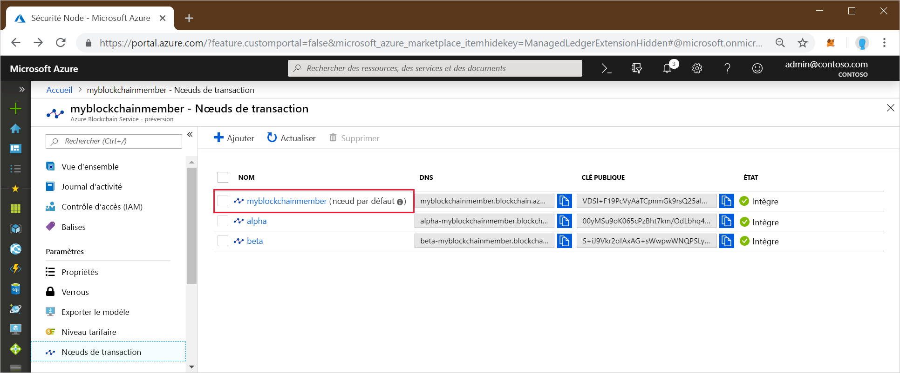
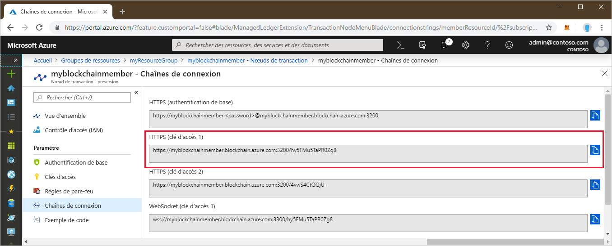

# <a name="quickstart-use-geth-to-attach-to-an-azure-blockchain-service-transaction-node"></a>Démarrage rapide : Utiliser Geth pour effectuer une jonction à un nœud de transaction Azure Blockchain Service

Dans ce guide de démarrage rapide, vous allez utiliser le client Geth pour effectuer une jonction à l’instance Geth sur un nœud de transaction Azure Blockchain Service. Une fois la jonction effectuée, vous utiliserez la console Geth pour appeler une API JavaScript Ethereum.

[!INCLUDE [quickstarts-free-trial-note](../../../includes/quickstarts-free-trial-note.md)]

## <a name="prerequisites"></a>Prérequis

* Installer [Geth](https://github.com/ethereum/go-ethereum/wiki/geth)
* Effectuer l’étape [Démarrage rapide : Créer un membre blockchain à l’aide du portail Azure](create-member.md) ou [Démarrage rapide : Créer un membre blockchain Azure Blockchain Service à l’aide de l’interface Azure CLI](create-member-cli.md)

## <a name="get-geth-connection-string"></a>Obtenir une chaîne de connexion Geth

Vous pouvez obtenir la chaîne de connexion Geth pour un nœud de transaction Azure Blockchain Service dans le portail Azure.

1. Connectez-vous au [portail Azure](https://portal.azure.com).
1. Accédez au membre Azure Blockchain Service. Sélectionnez **Nœuds de transaction**, puis le lien du nœud de transaction par défaut.

    

1. Sélectionnez **Chaînes de connexion**.
1. Copiez la chaîne de connexion située sous **HTTPS (Clé d’accès 1)** . Vous aurez besoin de cette chaîne pour la section suivante.

    

## <a name="connect-to-geth"></a>Se connecter à Geth

1. Ouvrez une invite de commandes ou un interpréteur de commandes.
1. Dans Geth, utilisez la sous-commande attach pour attacher l’instance Geth en cours d’exécution à votre nœud de transaction. Collez la chaîne de connexion en tant qu’argument pour la sous-commande attach. Par exemple :

    ``` bash
    geth attach <connection string>
    ```

1. Une fois connecté à la console Ethereum du nœud de transaction, vous pouvez utiliser l’API JavaScript Ethereum.

    Par exemple, vous pouvez utiliser l’API suivante pour connaître le chainId.

    ``` bash
    admin.nodeInfo.protocols.istanbul.config.chainId
    ```

    Dans cet exemple, le chainId est 661.

    

1. Pour vous déconnecter de la console, tapez `exit`.

## <a name="next-steps"></a>Étapes suivantes

Dans ce guide de démarrage rapide, vous avez utilisé le client Geth pour attacher une instance Geth à un nœud de transaction Azure Blockchain Service. Essayez le tutoriel suivant pour utiliser Azure Blockchain Development Kit pour Ethereum afin de créer, générer, déployer et exécuter une fonction de contrat intelligent via une transaction.

> [!div class="nextstepaction"]
> [Créer, générer et déployer des contrats intelligents sur Azure Blockchain Service](send-transaction.md)
