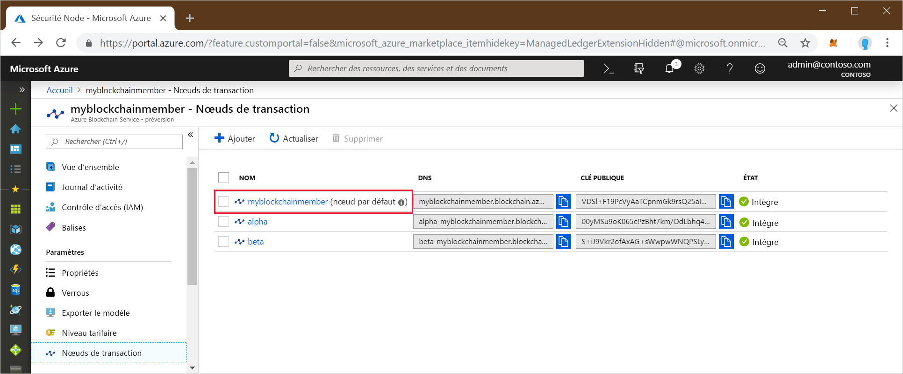
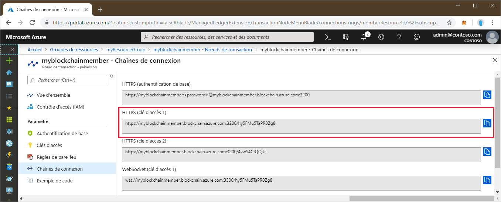
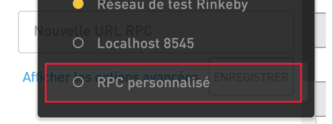
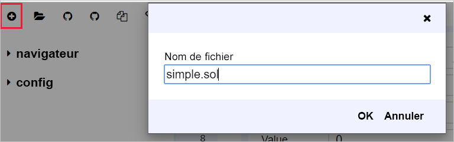
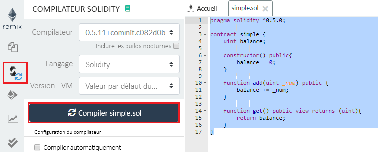
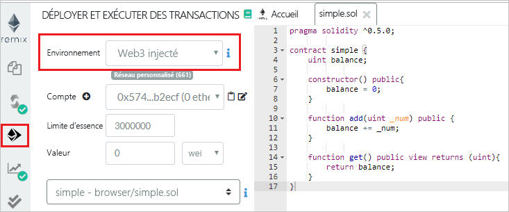
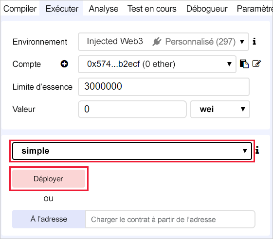
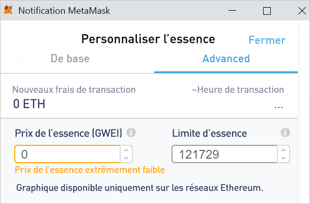
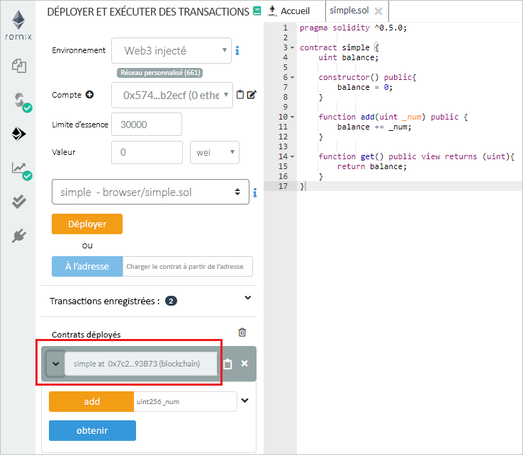
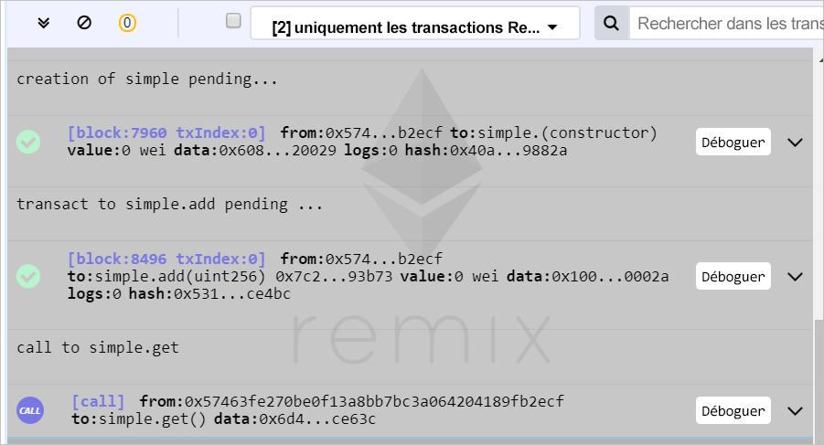

# <a name="quickstart-use-metamask-to-connect-and-deploy-a-smart-contract"></a>Utiliser MetaMask pour vous connecter et déployer un contrat intelligent

Dans ce guide de démarrage rapide, vous allez utiliser MetaMask pour vous connecter à un réseau Azure Blockchain Service, puis vous allez utiliser Remix pour déployer un contrat intelligent. Metamask est une extension de navigateur qui permet de gérer un portefeuille Ether et d’effectuer des actions relatives aux contrats intelligents.

[!INCLUDE [quickstarts-free-trial-note](../../../includes/quickstarts-free-trial-note.md)]

## <a name="prerequisites"></a>Prérequis

* Effectuer l’étape [Démarrage rapide : Créer un membre blockchain à l’aide du portail Azure](create-member.md) ou [Démarrage rapide : Créer un membre blockchain Azure Blockchain Service à l’aide de l’interface Azure CLI](create-member-cli.md)
* Installer l’[extension de navigateur MetaMask](https://metamask.io)
* Générer un [portefeuille](https://metamask.zendesk.com/hc/en-us/articles/360015488971-New-to-MetaMask-Learn-How-to-Setup-MetaMask-the-First-Time) MetaMask

## <a name="get-endpoint-address"></a>Obtenir l’adresse de point de terminaison

Vous avez besoin de l’adresse du point de terminaison Azure Blockchain Service pour vous connecter au réseau Blockchain. L’adresse du point de terminaison et les clés d’accès se trouvent dans le portail Azure.

1. Connectez-vous au [portail Azure](https://portal.azure.com).
1. Accédez au membre Azure Blockchain Service.
1. Sélectionnez **Nœuds de transaction**, puis le lien du nœud de transaction par défaut.

    

1. Sélectionnez **Chaînes de connexion > Clés d’accès**.
1. Copiez l’adresse du point de terminaison située sous **HTTPS (Clé d’accès 1)**.

    

## <a name="connect-metamask"></a>Se connecter à MetaMask

1. Ouvrez l’extension de navigateur MetaMask, puis connectez-vous.
1. Dans la liste déroulante des réseaux, sélectionnez **Custom RPC**.

    

1. Dans **New Network > New RPC URL** (Nouveau réseau > Nouvelle URL RPC), collez l’adresse de point de terminaison que vous avez copiée ci-dessus.
1. Sélectionnez **Enregistrer**.

    Si la connexion réussit, le réseau privé s’affiche dans la liste déroulante des réseaux.

    

## <a name="deploy-smart-contract"></a>Déployer un contrat intelligent

Remix est un environnement de développement Solidity basé sur le navigateur. L’utilisation conjointe de MetaMask et de Remix vous permet de déployer des contrats intelligents et d’effectuer des actions relatives à ces contrats.

1. Dans votre navigateur, accédez à `https://remix.ethereum.org`.
1. Sélectionnez **Nouveau fichier** sous l’onglet **Accueil** sous **Fichier**.

    Nommez le nouveau fichier `simple.sol`.

    

    Sélectionnez **OK**.
1. Dans l’éditeur Remix, collez le code du **contrat intelligent Simple** ci-dessous.

    ```solidity
    pragma solidity ^0.5.0;
             
    contract simple {
        uint balance;
                 
        constructor() public{
            balance = 0;
        }
                 
        function add(uint _num) public {
            balance += _num;
        }
                 
        function get() public view returns (uint){
            return balance;
        }
    }
    ```

    Le **contrat Simple** déclare une variable d’état nommée **balance**. Deux fonctions sont définies. La fonction **add** ajoute un nombre à **balance**. La fonction **get** retourne la valeur de **balance**.
1. Pour compiler le contrat, commencez par sélectionner le volet du compilateur Solidity, puis sélectionnez **Compile simple.sol** (Compiler simple.sol).

    

1. Sélectionnez le volet **Deploy & Run** (Déployer & exécuter), puis définissez **Environment** (Environnement) sur **Injected Web3** (Web3 injecté) pour vous connecter via MetaMask à votre membre blockchain.

    

1. Sélectionnez le contrat **simple**, puis **Deploy** (Déployer).

    


1. Une notification MetaMask vous informe que les fonds sont insuffisants pour effectuer la transaction.

    Pour un réseau public Blockchain, vous avez besoin d’Ether pour payer le coût de la transaction. Dans la mesure où il s’agit d’un réseau privé de consortium, vous pouvez définir le prix du gaz sur zéro.

1.  Sélectionnez **Gas Fee > Edit > Advanced**, puis définissez **Gas Price** sur 0.

    

    Sélectionnez **Enregistrer**.

1. Sélectionnez **Confirm** pour déployer le contrat intelligent dans la blockchain.
1. Dans la section **Deployed Contracts**, développez le contrat **Simple**.

    

    Deux actions, **add** et **get**, correspondent aux fonctions définies dans le contrat.

1. Pour effectuer une transaction **add** dans la blockchain, entrez un nombre à ajouter, puis sélectionnez **add**. Vous allez éventuellement recevoir de la part de Remix un message d’échec relatif à l’évaluation du gaz : « Vous envoyez la transaction à une blockchain privée qui ne nécessite pas de gaz. » Sélectionnez **Send Transaction** (Envoyer la transaction) pour forcer la transaction.
1. Comme au moment où vous avez déployé le contrat, une notification MetaMask vous informe que les fonds sont insuffisants pour effectuer la transaction.

    Dans la mesure où il s’agit d’un réseau privé de consortium, vous pouvez définir le prix du gaz sur zéro.

1. Sélectionnez **Gas Fee > Edit > Advanced** (Frais de gaz > Modifier > Avancé), affectez à **Gas Price** (Prix du gaz) la valeur 0, puis sélectionnez **Save** (Enregistrer).
1. Sélectionnez **Confirm** (Confirmer) pour envoyer la transaction à la blockchain.
1. Sélectionnez l’action **get**. Il s’agit d’un appel pour interroger les données de nœud. Aucune transaction n’est nécessaire.

Le volet de débogage de Remix affiche des détails sur les transactions de la blockchain :



Vous pouvez voir la création du contrat **Simple**, la transaction pour **simple.add** et l’appel à **simple.get**.

Pour voir l’historique des transactions dans MetaMask, ouvrez l’extension de navigateur MetaMask, puis recherchez dans la section **History** (Historique) un journal de déploiement du contrat et des transactions.

## <a name="next-steps"></a>Étapes suivantes

Dans ce guide de démarrage rapide, vous avez utilisé l’extension de navigateur MetaMask pour vous connecter à un nœud de transaction Azure Blockchain Service, pour déployer un contrat intelligent et pour envoyer une transaction à la blockchain. Essayez le tutoriel suivant pour utiliser le kit de développement Azure Blockchain pour Ethereum et Truffle afin de créer, générer, déployer et exécuter une fonction de contrat intelligent via une transaction.

> [!div class="nextstepaction"]
> [Créer, générer et déployer des contrats intelligents sur Azure Blockchain Service](send-transaction.md)