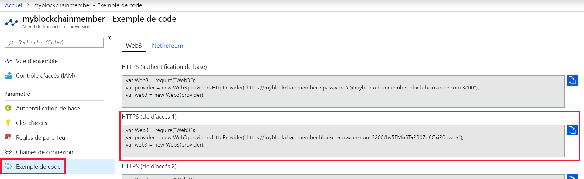

# <a name="quickstart-use-truffle-to-connect-to-a-an-azure-blockchain-service-network"></a>Démarrage rapide : Utiliser Truffle pour vous connecter à un réseau Azure Blockchain Service

Truffle est un environnement de développement blockchain que vous pouvez utiliser pour vous connecter à un nœud Azure Blockchain Service.

[!INCLUDE [quickstarts-free-trial-note](../../../includes/quickstarts-free-trial-note.md)]

## <a name="prerequisites"></a>Prérequis

* [Créer un membre Azure Blockchain](create-member.md)
* Truffle nécessite d’installer plusieurs outils comme [Node.js](https://nodejs.org), [Git](https://git-scm.com/book/en/v2/Getting-Started-Installing-Git) et [Truffle](https://github.com/trufflesuite/truffle).

    Pour une installation rapide sur Windows 10, installez [Ubuntu sur Windows](https://www.microsoft.com/p/ubuntu/9nblggh4msv6) pour un terminal d’interpréteur de commandes Bash Unix, puis installez [Truffle](https://github.com/trufflesuite/truffle). La distribution Ubuntu sur Windows inclut Node.js et Git.

## <a name="create-truffle-project"></a>Créer un projet Truffle

1. Ouvrez un terminal d’interpréteur de commandes Bash.
1. Sélectionnez le répertoire dans lequel vous souhaitez créer le projet Truffle. Par exemple,

    ``` bash
    cd /mnt/c
    ```

1. Créez un répertoire pour le projet, puis remplacez le chemin par celui du nouveau répertoire. Par exemple,

    ``` bash
    mkdir truffledemo
    cd truffledemo
    ```

1. Installez l’API Ethereum JavaScript web3 dans le dossier du projet. La version 1.0.0-beta.37 de web3 est nécessaire.

    ``` bash
    npm install web3@1.0.0-beta.37
    ```

    Vous pouvez recevoir des avertissements de npm lors de l’installation.

1. Initialisez le projet Truffle.

    ``` bash
    truffle init
    ```

1. Lancez la console de développement interactive de Truffle.

    ``` bash
    truffle develop
    ```

    Truffle crée une blockchain de développement locale et fournit une console interactive.

## <a name="connect-to-transaction-node"></a>Se connecter au nœud de transaction

Nous allons utiliser Web3 pour nous connecter au nœud de transaction. Vous pouvez obtenir la chaîne de connexion Web3 à partir du portail Azure.

1. Connectez-vous au [Portail Azure](https://portal.azure.com).
1. Accédez au membre Azure Blockchain Service. Sélectionnez **Nœuds de transaction**, puis le lien du nœud de transaction par défaut.

    

1. Sélectionnez **Exemple de code > Web3**.
1. Copiez le code JavaScript situé sous **HTTPS (clé d’accès 1)**. Vous avez besoin du code pour la console de développement interactif Truffle.

    

1. Collez le code JavaScript de l’étape précédente dans la console de développement interactif Truffle. Le code crée un objet web3 connecté au nœud de transaction Azure Blockchain Service.

    Exemple de sortie :

    ```bash
    truffle(develop)> var Web3 = require("Web3");
    truffle(develop)> var provider = new Web3.providers.HttpProvider("https://myblockchainmember.blockchain.azure.com:3200/hy5FMu5TaPR0Zg8GxiPwned");
    truffle(develop)> var web3 = new Web3(provider);
    truffle(develop)>
     ```

    Vous pouvez appeler des méthodes sur l’objet **web3** pour interagir avec votre nœud de transaction.

1. Appelez la méthode **getBlockNumber** pour retourner le nombre actuel de blocs.

    ```bash
    web3.eth.getBlockNumber();
    ```

    Exemple de sortie :

    ```bash
    truffle(develop)> web3.eth.getBlockNumber();
    18567
    ```
1. Quittez la console de développement Truffle.

    ```bash
    .exit
    ```

## <a name="next-steps"></a>Étapes suivantes

Dans ce guide de démarrage rapide, vous avez créé un projet Truffle pour vous connecter à votre nœud de transaction Azure Blockchain Service par défaut.

Essayez le tutoriel suivant pour envoyer une transaction au réseau blockchain de votre consortium à l’aide de Truffle.

> [!div class="nextstepaction"]
> [Envoyer une transaction](send-transaction.md)