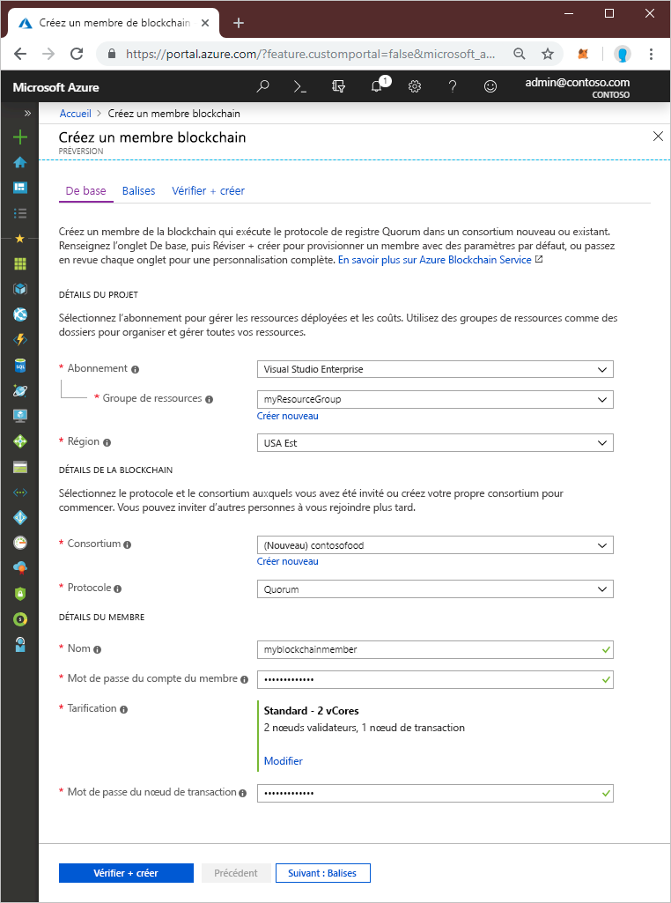
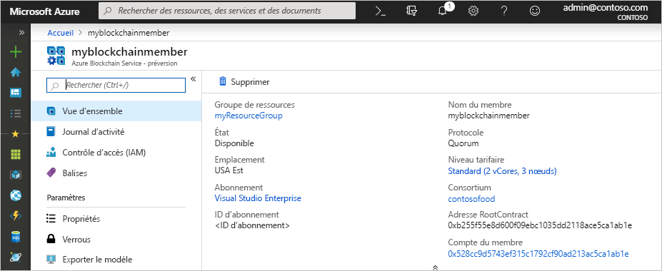

# Démarrage rapide : Créer un membre de blockchain Azure Blockchain Service à l’aide du portail Azure

Dans ce guide de démarrage rapide, vous allez déployer un nouveau membre blockchain et un nouveau consortium dans Azure Blockchain Service à l’aide du portail Azure.

[!INCLUDE [quickstarts-free-trial-note](../../../includes/quickstarts-free-trial-note.md)]

## Prérequis

Aucun.

## Créer un membre blockchain

Un membre Azure Blockchain Service est un nœud blockchain dans un réseau blockchain de consortium privé. Lors du provisionnement d’un membre, vous pouvez créer ou rejoindre un réseau de consortium. Vous avez besoin d’au moins un membre pour former un réseau de consortium. Le nombre de membres blockchain nécessaires par participant dépend de votre scénario. Les participants au consortium peuvent avoir un ou plusieurs membres blockchain ou ils peuvent partager des membres avec d’autres participants. Pour plus d’informations sur les consortiums, consultez [Consortium Azure Blockchain Service](consortium.md).

1. Connectez-vous au [portail Azure](https://portal.azure.com).
1. Sélectionnez **Créer une ressource** dans le coin supérieur gauche du portail Azure.
1. Sélectionnez **Blockchain** > **Azure Blockchain Service (préversion)** .

    

    Paramètre | Description
    --------|------------
    Abonnement | Sélectionnez l’abonnement Azure que vous souhaitez utiliser pour votre serveur. Si vous avez plusieurs abonnements, sélectionnez l’abonnement dans lequel la ressource est facturée.
    Resource group | Créez un nom de groupe de ressources ou choisissez un nom de groupe existant dans votre abonnement.
    Région | Choisissez la région où créer le membre. Tous les membres du consortium doivent se trouver au même emplacement. Les fonctionnalités peuvent ne pas être disponibles dans certaines régions. Azure Blockchain Data Manager est disponible dans les régions Azure suivantes : USA Est et Europe Ouest.
    Protocol | La préversion d’Azure Blockchain Service prend en charge le protocole Quorum.
    Consortium | Pour un nouveau consortium, entrez un nom unique. Si vous rejoignez un consortium par le biais d’une invitation, choisissez le consortium que vous rejoignez. Pour plus d’informations sur les consortiums, consultez [Consortium Azure Blockchain Service](consortium.md).
    Nom | Choisissez un nom unique pour le membre Azure Blockchain Service. Le nom du membre blockchain doit être uniquement composé de lettres minuscules et de chiffres. Le premier caractère doit être une lettre. Le nom doit comprendre entre 2 et 20 caractères.
    Mot de passe du compte du membre | Le mot de passe du compte du membre sert à chiffrer la clé privée du compte Ethereum créé pour votre membre. Vous utilisez le compte du membre et le mot de passe du compte du membre pour la gestion du consortium.
    Tarifs | Configuration des nœuds et coût de votre nouveau service. Sélectionnez le lien **Modifier** pour choisir le niveau **Standard** ou **De base**. Utilisez le niveau *De base* pour le développement, les tests et les preuves de concept. Utilisez le niveau *Standard* pour les déploiements en production. Utilisez également le niveau *Standard* si vous utilisez Blockchain Data Manager ou si vous envoyez un volume élevé de transactions privées. Après la création du membre, le changement du niveau tarifaire entre le niveau de base et le niveau standard n’est pas pris en charge.
    Mot de passe du nœud | Le mot de passe du nœud de transaction par défaut du membre. Utilisez le mot de passe pour l’authentification de base lorsque vous vous connectez au point de terminaison public du nœud de transaction par défaut du membre blockchain.

1. Sélectionnez **Vérifier + créer** pour valider vos paramètres. Sélectionnez **Créer** pour provisionner le service. Le provisionnement prend environ 10 minutes.
1. Pour superviser le processus de déploiement, sélectionnez **Notifications** dans la barre d’outils.
1. Après le déploiement, accédez à votre membre blockchain.

En sélectionnant **Vue d’ensemble**, vous pouvez voir des informations de base concernant votre service, notamment l’adresse RootContract et le compte du membre.

## Nettoyer les ressources

Vous pouvez utiliser le membre que vous avez créé pour le guide de démarrage rapide ou tutoriel suivant. Lorsque vous n’en aurez plus besoin, vous pourrez supprimer les ressources en supprimant le groupe de ressources `myResourceGroup` que vous avez créé dans le guide de démarrage rapide.

Pour supprimer le groupe de ressources :

1. Dans le portail Azure, accédez à **Groupe de ressources** dans le volet de navigation de gauche et sélectionnez le groupe de ressources que vous souhaitez supprimer.
2. Sélectionnez **Supprimer le groupe de ressources**. Validez la suppression en entrant le nom du groupe de ressources, puis sélectionnez **Supprimer**.

## Étapes suivantes

Dans ce guide de démarrage rapide, vous avez déployé un membre Azure Blockchain Service et un nouveau consortium. Dans le guide de démarrage rapide qui suit, vous allez utiliser Azure Blockchain Development Kit pour Ethereum afin d’effectuer une jonction à un membre Azure Blockchain Service.

> [!div class="nextstepaction"]
> [Utiliser Visual Studio Code pour se connecter à Azure Blockchain Service](connect-vscode.md)
