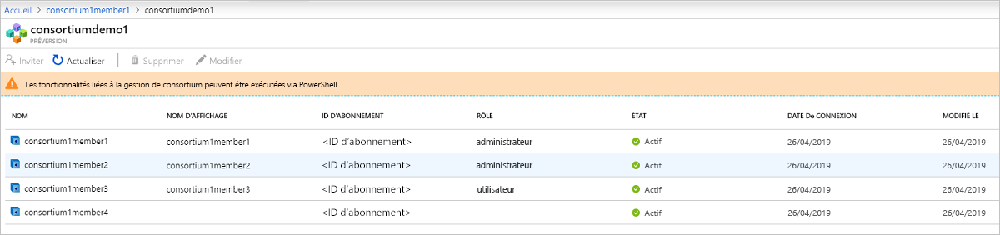

# À propos d’Azure Blockchain Service

Azure Blockchain Service est un service de registre complètement managé qui permet aux utilisateurs de développer et d’exploiter des réseaux blockchain à l’échelle dans Azure. En fournissant un contrôle unifié pour la gestion de l’infrastructure ainsi que la gouvernance du réseau blockchain, Azure Blockchain Service offre :

* Des opérations et un déploiement de réseau simples
* Gestion de consortium intégrée
* Développer des contrats intelligents avec des outils de développement familiers

Azure Blockchain Service est conçu pour prendre en charge plusieurs protocoles de registre. Actuellement, il prend en charge le registre [Quorum](https://www.goquorum.com/) Ethereum à l’aide du mécanisme de consensus [IBFT (Istanbul Byzantine Fault Tolerance)](https://github.com/jpmorganchase/quorum/wiki/Quorum-Consensus).

Ces fonctionnalités ne demandent pratiquement aucune administration, et toutes sont fournies sans coût supplémentaire. Vous pouvez vous concentrer sur la logique métier et le développement d’applications plutôt que sur le temps et les ressources nécessaires à la gestion des machines virtuelles et de l’infrastructure. Vous pouvez également continuer à développer votre application avec les outils open source et la plateforme de votre choix, ce qui vous permet de fournir vos solutions sans avoir besoin d’acquérir de nouvelles compétences.

## Opérations et déploiement de réseau

Vous pouvez déployer Azure Blockchain Service via le portail Azure, Azure CLI ou Visual Studio Code grâce à l’extension Azure Blockchain. Le déploiement est simplifié et comprend l’approvisionnement des nœuds validateur et de transaction, des réseaux virtuels Azure pour l’isolation de sécurité ainsi qu’un stockage managé par le service.  De plus, lorsque du déploiement d’un nouveau membre pour la blockchain, les utilisateurs peuvent également créer, ou rejoindre, un consortium.  Grâce aux consortiums, plusieurs parties présentes dans des abonnements Azure différents peuvent communiquer entre elles de manière sécurisée sur une blockchain partagée.  Ce déploiement simplifié accélère le déploiement de réseau blockchain, ne prenant plus que quelques minutes au lieu de plusieurs jours.

### Niveaux de performance et de service

Azure Blockchain Service propose deux niveaux de service : *De base* et *Standard*. Chaque niveau offre des performances et des fonctionnalités différentes afin de prendre en charge des charges de travail de développement et test légères ainsi que des déploiements de blockchain de production à très grande échelle. Utilisez le niveau *De base* pour le développement, les tests et les preuves de concept. Utilisez le niveau *Standard* pour les déploiements en production. Les deux niveaux comprennent au moins un nœud de transaction, plus un nœud validateur (De base) ou deux nœuds validateur (Standard). 

En plus d’offrir deux nœuds validateur, le niveau *Standard* fournit deux mémoires *vCore* pour chaque nœud validateur et de transaction, tandis que le niveau *De base* offre une configuration contenant un seul vCore.  En proposant deux mémoires vCore pour les nœuds validateur et de transaction, vous pouvez dédier un vCore au registre Quorum. Le vCore restant peut alors être utilisé pour d’autres services liés à l’infrastructure, offrant des performances optimales pour les charges de travail de blockchain de production. Pour plus d’informations sur la tarification, consultez [Tarification Azure Blockchain Service](https://azure.microsoft.com/pricing/details/blockchain-service).

### Sécurité et maintenance

Après avoir approvisionné votre premier membre de blockchain, vous avez la possibilité d’ajouter des nœuds de transactions supplémentaires à votre membre.  Par défaut, les nœuds de transaction sont sécurisés grâce aux règles de pare-feu, et nécessitent que l’accès soit configuré.  En outre, tous les nœuds de transaction chiffrent les données en mouvement via TLS.  Vous disposez de plusieurs options pour sécuriser l’accès au nœud de transaction, notamment les règles de pare-feu, l’authentification de base, les clés d’accès, ainsi que l’intégration d’Azure Active Directory. Pour plus d’informations, consultez [Configurer les nœuds de la transaction](configure-transaction-nodes.md) et [Configurer l’accès Azure Active Directory](configure-aad.md).

En tant que service managé, Azure Blockchain Service s’assure que les nœuds du membre de votre blockchain sont corrigés et disposent du système d’exploitation hôte et des mises à jour logicielles de pile de registre les plus récents. Il garantit également que ces nœuds sont configurés pour offrir une haute disponibilité (niveau Standard uniquement), ce qui permet d’éliminer la majorité des DevOps requis pour les nœuds de blockchain IaaS traditionnels.  Pour plus d’informations sur les correctifs et les mises à jour, consultez [Versions du registre Azure Blockchain Service prises en charge](ledger-versions.md).

### Surveillance et journalisation

De plus, Azure Blockchain Service fournit des métriques riches par le biais du service Azure Monitor, en fournissant des insights sur l’utilisation du processeur, de la mémoire et du stockage des nœuds.  Azure Monitor fournit également des insights sur l’activité du réseau blockchain, telles que les transactions et les blocs explorés, la profondeur de la file d’attente des transactions et les connexions actives.  Les mesures peuvent être personnalisées de manière à afficher les insights essentiels à votre application blockchain.  Vous pouvez également définir des seuils par le biais des alertes, ce qui permet aux utilisateurs de déclencher différentes actions, notamment envoyer des e-mails et des SMS, exécuter une application logique ou une fonction Azure ou encore envoyer vers un webhook personnalisé.

Grâce à Azure Log Analytics, les utilisateurs peuvent afficher les journaux relatifs au registre Quorum ou à d’autres informations importantes comme les tentatives de connexion aux nœuds de transaction.

## Gestion de consortium intégrée

Lorsque vous déployez votre premier membre de blockchain, vous rejoignez un consortium ou vous en créez un nouveau.  Un consortium est un groupe logique permettant de gérer la gouvernance et la connectivité entre les membres de la blockchain qui effectuent des transactions dans un processus comprenant plusieurs parties.  Azure Blockchain Service fournit des contrôles de gouvernance intégrés à l’aide de contrats intelligents prédéfinis déterminant les actions que les membres du consortium peuvent effectuer.  L’administrateur du consortium peut personnaliser à sa guise les contrôles de gouvernance. Lorsque vous créez un consortium, le membre de votre blockchain devient son administrateur par défaut. Il obtient alors le droit d’inviter d’autres parties à rejoindre votre consortium.  Vous ne pouvez rejoindre un consortium que si vous y avez été invité au préalable.  Lorsque vous rejoignez un consortium, les contrôles de gouvernance ajoutés par l’administrateur s’appliquent au membre de votre blockchain.

Vous pouvez accéder aux actions de gestion du consortium, par exemple l’ajout et la suppression des membres d’un consortium, via PowerShell et une API REST. Vous pouvez gérer un consortium par programmation en utilisant des interfaces au lieu de modifier et d’envoyer des contrats intelligents basés sur Solidity. Pour plus d’informations, consultez [Gestion du consortium](consortium.md).

## Développer à l’aide d’outils de développement familiers

En fonction du registre Quorum Ethereum open source utilisé, vous pouvez développer des applications pour Azure Blockchain Service comme des applications Ethereum existantes. Développée en collaboration avec les principaux partenaires du secteur, l’extension Visual Studio Code d’Azure Blockchain Development Kit permet aux développeurs de tirer parti d’outils familiers comme la suite Truffle pour générer des contrats intelligents. À l’aide de l’extension Visual Studio Code d’Azure Blockchain, vous pouvez vous connecter à un consortium existant ou en créer un nouveau afin de générer et déployer des contrats intelligents à partir d’un seul environnement de développement intégré. Pour plus d’informations, consultez [Azure Blockchain Development Kit sur la Place de marché VS Code](https://aka.ms/vscodebcextension) et le [Guide d’utilisation d’Azure Blockchain Development Kit](https://aka.ms/vscodebcextensionwiki).

## Publier des données blockchain

Blockchain Data Manager pour Azure Blockchain Service capture, transforme et fournit des données de transaction Azure Blockchain Service aux rubriques Azure Event Grid proposant une intégration de registre blockchain scalable et fiable aux services Azure. Vous pouvez utiliser Blockchain Data Manager pour intégrer des applications hors chaîne et des magasins de données. Pour plus d’informations, consultez [Blockchain Data Manager pour Azure Blockchain Service](data-manager.md).

## Support et commentaires

Pour vous tenir informé sur Azure Blockchain, visitez le [blog Azure Blockchain](https://azure.microsoft.com/blog/topics/blockchain/). Vous y trouverez les toutes dernières offres du service Blockchain ainsi que diverses informations de l’équipe technique d’Azure Blockchain.

Pour faire des commentaires sur le produit ou suggérer de nouvelles fonctionnalités, postez votre idée ou votez pour une autre idée sur le [forum de commentaires Azure pour Blockchain](https://aka.ms/blockchainuservoice).

### Support de la communauté pour les objets blob

Communiquez avec les ingénieurs Microsoft et les experts de la communauté Azure Blockchain.

* [Page de questions Microsoft Q&A sur Azure Blockchain Service](/answers/topics/azure-blockchain-service.html)
* [Microsoft Tech Community](https://techcommunity.microsoft.com/t5/Blockchain/bd-p/AzureBlockchain)
* [Stack Overflow](https://stackoverflow.com/questions/tagged/azure-blockchain-service)

## Étapes suivantes

Pour commencer, essayez un démarrage rapide ou consultez ces ressources pour en savoir plus.
* [Créer un membre de blockchain à l’aide du portail Azure](create-member.md) ou [Créer un membre de blockchain à l’aide d’Azure CLI](create-member-cli.md)
* Consultez la [page de tarification](https://azure.microsoft.com/pricing/details/blockchain-service) pour des comparaisons de coûts et des calculatrices.
* Générer votre première application à l’aide d’[Azure Blockchain Development Kit](https://github.com/Azure-Samples/blockchain-devkit)
* [Guide d’utilisation](https://github.com/Microsoft/vscode-azure-blockchain-ethereum/wiki)de l’extension VSCode d’Azure Blockchain
