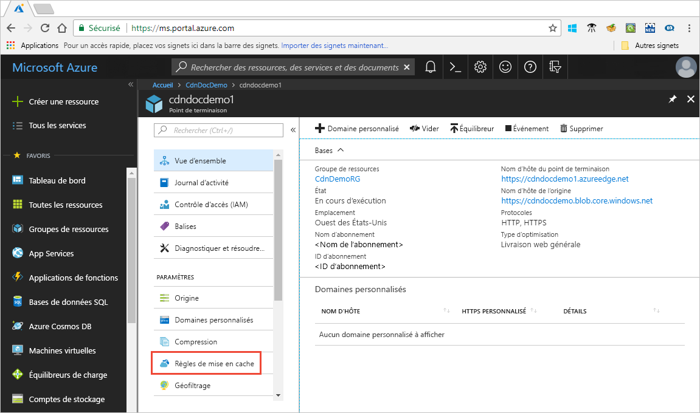

# Contrôler le comportement de mise en cache d’Azure CDN avec des règles de mise en cache

> [!NOTE] 
> Les règles de mise en cache sont disponibles uniquement pour les profils **CDN Azure Standard fourni par Verizon** et **CDN Azure Standard fourni par Akamai**. Pour des profils **Azure CDN de Microsoft**, vous devez utiliser le [moteur de règles standard](cdn-standard-rules-engine-reference.md) Pour les profils **Azure CDN Premium de Verizon**, vous devez utiliser le [moteur de règles Premium Verizon](./cdn-verizon-premium-rules-engine.md) dans le portail **Gérer** pour une fonctionnalité similaire.
 
Azure Content Delivery Network (CDN) offre deux moyens de contrôler la façon dont les fichiers sont mis en cache : 

- Règles de mise en cache : cet article explique comment vous servir des règles de mise en cache du réseau de diffusion de contenu (CDN) pour définir ou modifier le comportement d’expiration du cache par défaut, globalement et avec des conditions personnalisées, telles qu’un chemin URL et une extension de fichier. Azure CDN fournit deux types de règles de mise en cache :

   - Règles de mise en cache globales : vous pouvez définir une règle de mise en cache globale pour chaque point de terminaison dans votre profil, ce qui affecte toutes les requêtes au point de terminaison. La règle de mise en cache globale se substitue à tous les en-têtes à directive de cache HTTP, s’ils sont définis.

   - Règles de mise en cache personnalisées : vous pouvez définir une ou plusieurs règles de mise en cache personnalisées pour chaque point de terminaison dans votre profil. Les règles de mise en cache personnalisées correspondent à des chemins et extensions de fichier spécifiques, elles sont traitées dans l’ordre et remplacent la règle de mise en cache globale, si elle est définie. 

- La mise en cache des chaînes de requête : vous pouvez ajuster la manière dont Azure CDN traite la mise en cache pour les requêtes dotées de chaînes de requête. Pour plus d’informations, consultez [Contrôler le comportement de mise en cache d’Azure CDN avec des chaînes de requête](cdn-query-string.md). Si le fichier ne peut pas être mis en cache, le paramètre de mise en cache des chaînes de requête n’a aucun effet, compte tenu des règles de mise en cache et des comportements CDN par défaut.

Pour plus d’informations sur le comportement de mise en cache par défaut et sur les en-têtes à directive de mise en cache, consultez [Fonctionnement de la mise en cache](cdn-how-caching-works.md). 

## Accès aux règles de mise en cache de CDN Azure

1. Ouvrez le portail Azure, sélectionnez un profil CDN, puis sélectionnez un point de terminaison.

2. Dans le volet gauche, sous Paramètres, sélectionnez **Règles de mise en cache**.

   

   La page **Règles de mise en cache** s’affiche.

   

## Paramètres du comportement de mise en cache
Pour les règles de mise en cache globales et personnalisées, vous pouvez spécifier les paramètres de **Comportement de mise en cache** suivants :

- **Ignorer le cache** : ne pas mettre en cache et ignorer les en-têtes à directive de cache fournis à l’origine.

- **Écraser** : ignorer la durée de cache fournie à l’origine ; utilisez la durée du cache fourni à la place. Cela ne remplace pas cache-control: no-cache.

- **Définir en cas d’absence** : respecter les en-têtes à directive de cache fournis à l’origine, s’ils existent ; sinon, utilisez la durée de cache fournie.

## Durée d’expiration du cache
Pour les règles de mise en cache globales et personnalisées, vous pouvez spécifier la durée d’expiration du cache en jours, heures, minutes et secondes :

- Pour les paramètres de **Comportement de mise en cache****Remplacer et** **Définir en cas d’absence**, la plage des durées de cache valide est comprise entre 0 et 366 jours. Pour une valeur de 0 seconde, le CDN met en cache le contenu, mais doit revalider chaque requête avec le serveur d’origine.

- Pour le paramètre **Ignorer le cache**, la durée du cache est automatiquement définie sur 0 seconde et ne peut pas être modifiée.

## Conditions de correspondance des règles de mise en cache personnalisées

Pour les règles de cache personnalisées, deux conditions de correspondance sont disponibles :
 
- **Chemin** : cette condition correspond au chemin de l’URL, à l’exclusion du nom de domaine, et prend en charge le caractère générique (\*). Par exemple, _/myfile.html_, _/my/folder/*_ et _/my/images/*.jpg_. La longueur maximale est de 260 caractères.

- **Extension** : cette condition correspond à l’extension de fichier du fichier demandé. Vous pouvez fournir une liste d’extensions de fichier séparées par des virgules pour la correspondance. Par exemple, _.jpg_, _.mp3_ ou _.png_. Le nombre maximal d’extensions est de 50 et le nombre maximal de caractères par extension est de 16. 

## Ordre de traitement des règles globales et personnalisées
Les règles de mise en cache globales et personnalisées sont traitées dans l’ordre suivant :

- Les règles de mise en cache globales sont prioritaires sur le comportement de mise en cache CDN par défaut (paramètres d’en-tête à directive de cache HTTP). 

- Les règles de mise en cache personnalisées sont prioritaires sur les règles de mise en cache globales, où elles s’appliquent. Les règles de mise en cache personnalisées sont traitées de haut en bas. Autrement dit, si une requête remplie ces deux conditions, les règles situées au bas de la liste sont prioritaires sur celles qui sont situées en haut. Par conséquent, vous devez placer les règles vraiment spécifiques plus bas dans la liste.

**Exemple** :
- Règles de mise en cache générales : 
   - Comportement de mise en cache : **Remplacer**
   - Durée d’expiration du cache : 1 jour

- Règle no1 de mise en cache personnalisée :
   - Condition de correspondance : **Chemin**
   - Valeur de correspondance : _/home/*_
   - Comportement de mise en cache : **Remplacer**
   - Durée d’expiration du cache : 2 jours

- Règle no2 de mise en cache personnalisée :
   - Condition de correspondance : **Extension**
   - Valeur de correspondance : _.html_
   - Comportement de mise en cache : **Définir en cas d’absence**
   - Durée d’expiration du cache : 3 jours

Quand ces règles sont définies, une requête pour _&lt;nom_d’hôte_du_point_de_terminaison&gt;_ .azureedge.net/home/index.html déclenche la règle n°2 de mise en cache personnalisée, qui est définie sur : **Définir en cas d’absence** et trois jours. Par conséquent, si le fichier *index.html* est doté des en-têtes HTTP `Cache-Control` ou `Expires`, ils sont respectés ; si ces en-têtes ne sont pas définis, le fichier est mis en cache pendant trois jours.

> [!NOTE] 
> Les fichiers qui sont mis en cache avant une modification de règle conservent leur paramètre de durée de cache d’origine. Pour réinitialiser leur durée de cache, vous devez [vider le fichier](cdn-purge-endpoint.md). 
>
> La propagation sur le réseau des changements de configuration d’Azure CDN peut prendre un certain temps : 
> - Pour les profils du **CDN Azure Standard fourni par Akamai**, la propagation s’effectue généralement dans un délai d’une minute. 
> - Pour les profils du **CDN Azure Standard fourni par Verizon**, la propagation s’effectue généralement dans un délai de 10 minutes.  
>

## Voir aussi

- [Comment fonctionne la mise en cache](cdn-how-caching-works.md)
- [Tutoriel : Définir des règles de mise en cache d’Azure CDN](cdn-caching-rules-tutorial.md)