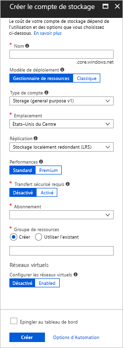
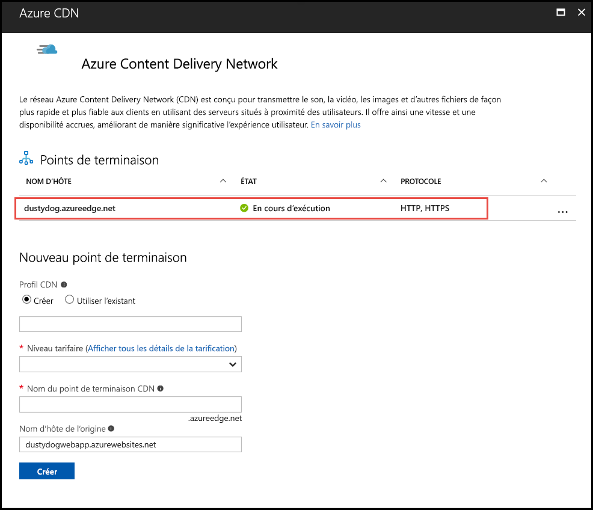
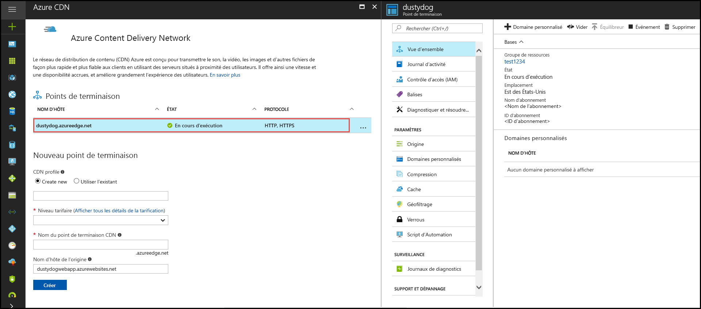

# Démarrage rapide : Intégrer un compte de stockage Azure à Azure CDN
Dans ce guide de démarrage rapide, vous allez activer [Azure Content Delivery Network (CDN)](cdn-overview.md) pour mettre en cache le contenu du stockage Azure. Azure CDN offre aux développeurs une solution globale pour fournir du contenu à bande passante élevée. Il peut mettre en cache les objets blob et le contenu statique des instances de calcul au niveau de nœuds physiques aux États-Unis, ainsi qu’en Europe, Asie, Australie et Amérique du Sud.

[!INCLUDE [quickstarts-free-trial-note](../../includes/quickstarts-free-trial-note.md)]

## Se connecter au portail Azure.
Connectez-vous au [portail Azure](https://portal.azure.com) avec votre compte Azure.

## Créez un compte de stockage.
Utilisez la procédure suivante pour créer un compte de stockage pour un abonnement Azure. Un compte de stockage donne accès aux services de stockage Azure. Le compte de stockage représente le niveau le plus élevé de l’espace de noms pour l’accès à chacun des composants du service de stockage Azure : Azure Blob, File d’attente et Table. Pour plus d’informations, consultez l’article [Introduction à Microsoft Azure Storage](../storage/common/storage-introduction.md).

Pour créer un compte de stockage, vous devez être l’administrateur de service ou un co-administrateur de l’abonnement associé.

Vous pouvez utiliser plusieurs méthodes pour créer un compte de stockage, y compris le portail Azure et PowerShell. Ce guide de démarrage rapide montre comment utiliser le portail Azure.   

**Pour créer un compte de stockage pour un abonnement Azure**

1. Dans le portail Azure en haut à gauche, sélectionnez **Créer une ressource**. 

    Le volet **Nouveau** s’affiche.

2. Sélectionnez **Stockage**, puis **Compte de stockage - blob, fichier, table, file d’attente**.
    
    

    Le volet **Créer un compte de stockage** s’affiche.   

    

3. Dans la zone **Nom**, entrez un nom de sous-domaine. Cette entrée peut être composée de 3 à 24 lettres minuscules et chiffres.
   
    Cette valeur devient le nom d’hôte contenu dans l’URI utilisé pour adresser les ressources d’objets blob, de files d’attente et de tables pour l’abonnement. Pour résoudre une ressource de conteneur dans le stockage Blob, utilisez un URI au format suivant :
   
    http:// *&lt;LibelléCompteStockage&gt;* .blob.core.windows.net/ *&lt;mycontainer&gt;*

    où *&lt;StorageAccountLabel&gt;* fait référence à la valeur que vous avez entrée dans la zone **Nom**.
   
    > [!IMPORTANT]    
    > L’étiquette de l’URL forme le sous-domaine de l’URI du compte de stockage et doit être unique parmi tous les services hébergés dans Azure.
   
    Cette valeur est également utilisée comme nom pour le compte de stockage dans le portail ou lorsque vous accédez à ce compte par programme.
    
4. Pour les autres paramètres, utilisez les valeurs spécifiées dans le tableau suivant :

    | Paramètre  | Valeur |
    | -------- | ----- |
    | **Modèle de déploiement** | Utilisez la valeur par défaut. |
    | **Type de compte** | Utilisez la valeur par défaut. |
    | **Lieu**    | Sélectionnez **USA Centre** dans la liste déroulante. |
    | **Réplication** | Utilisez la valeur par défaut. |
    | **Performances** | Utilisez la valeur par défaut. |
    | **Transfert sécurisé requis** | Utilisez la valeur par défaut. |
    | **Abonnement** | Sélectionnez un abonnement Azure dans la liste déroulante. |
    | **Groupe de ressources** | Sélectionnez **Créer** et entrez *my-resource-group-123* comme nom pour votre groupe de ressources. Ce nom doit être globalement unique. S’il est déjà utilisé, vous pouvez entrer un nom différent, ou vous pouvez sélectionner **Utiliser l’existant**, puis **my-resource-group-123** dans la liste déroulante.  Pour plus d’informations sur les groupes de ressources, consultez la page [Présentation d’Azure Resource Manager](../azure-resource-manager/management/overview.md#resource-groups).| 
    | **Configurer des réseaux virtuels** | Utilisez la valeur par défaut. |  
    
5. Sélectionnez **Épingler au tableau de bord** pour enregistrer le compte de stockage sur votre tableau de bord après l’avoir créé.
    
6. Sélectionnez **Create** (Créer). La création du compte de stockage peut prendre quelques minutes.

## Activer Azure CDN pour le compte de stockage

Vous pouvez activer Azure CDN pour votre compte de stockage directement depuis votre compte de stockage. Si vous souhaitez spécifier des paramètres de configuration avancés pour votre point de terminaison CDN, notamment [l’optimisation du téléchargement des fichiers volumineux](cdn-optimization-overview.md#large-file-download), vous pouvez utiliser à la place [l’extension Azure CDN](cdn-create-new-endpoint.md) pour créer un profil et un point de terminaison CDN.

1. Sélectionnez un compte de stockage à partir du tableau de bord, puis sélectionnez **Azure CDN** dans le volet gauche. Si le bouton **Azure CDN** n’est pas visible immédiatement, vous pouvez saisir CDN dans la zone de **recherche** du volet gauche pour le trouver.
    
    La page **Azure CDN** s’affiche.

    
    
2. Créez un nouveau point de terminaison en saisissant les informations requises spécifiées dans le tableau suivant :

    | Paramètre  | Valeur |
    | -------- | ----- |
    | **Profil CDN** | Sélectionnez **Créer** et entrez votre nom de profil, par exemple *my-cdn-profile-123*. Ce nom doit être globalement unique.  |
    | **Niveau tarifaire** | Sélectionnez **Standard Verizon** dans la liste déroulante. |
    | **Nom du point de terminaison CDN** | Entrez votre nom d’hôte de point de terminaison, à savoir *my-endpoint-123*. Ce nom doit être globalement unique. Ce nom sert à accéder à vos ressources en cache au niveau du domaine _&lt;endpoint name&gt;_ .azureedge.net. |
    | **Nom d’hôte de l’origine** | Par défaut, le nouveau point de terminaison CDN utilise le nom d’hôte de votre compte de stockage en tant que serveur d’origine. |

3. Sélectionnez **Create** (Créer). Une fois le point de terminaison créé, il s'affiche dans la liste des points de terminaison.

    

## Activer d’autres fonctionnalités du CDN
Sur la page **Azure CDN** du compte de stockage, sélectionnez le point de terminaison CDN dans la liste pour ouvrir la page de configuration du point de terminaison CDN. À partir de cette page, vous pouvez activer des fonctionnalités supplémentaires du CDN pour la livraison, comme la [compression](cdn-improve-performance.md), la [mise en cache des chaînes de requête](cdn-query-string.md) et le [filtrage géographique](cdn-restrict-access-by-country.md). 
    

## Activer la signature d’accès partagé
Si vous souhaitez accorder un accès limité à des conteneurs de stockage privé, vous pouvez utiliser la fonctionnalité de signature d’accès partagé (SAP) de votre compte de stockage Azure. Une SAP est un URI qui octroie des droits d’accès restreints à vos ressources Stockage Azure sans exposer votre clé de compte. Pour plus d’informations, consultez [Utilisation d’Azure CDN avec une signature d’accès partagé](cdn-sas-storage-support.md).

## Accès au contenu du CDN
Pour accéder au contenu mis en cache sur le CDN, utilisez l’URL CDN fournie dans le portail. L’adresse d’un objet blob mis en cache est au format suivant :

http://<*nom_point_de_terminaison*\>.azureedge.net/<*MonConteneurPublic*\>/<*Nom_blob*\>

> [!NOTE]
> Dès que vous activez un accès à Azure CDN pour un compte de stockage, tous les objets disponibles publiquement peuvent bénéficier de la mise en cache des points de présence du CDN. Si vous modifiez un objet actuellement mis en cache dans le CDN, le nouveau contenu ne sera pas disponible via Azure CDN avant son actualisation, c’est-à-dire avant expiration de la durée de vie du contenu mis en cache.

## Supprimer le contenu d’Azure CDN
Si vous ne voulez plus mettre en cache un objet dans Azure CDN, vous pouvez procéder comme suit :

* Changez le statut du conteneur de public à privé. Pour plus d’informations, consultez [Gestion de l’accès en lecture anonyme aux conteneurs et aux objets blob](../storage/blobs/storage-manage-access-to-resources.md).
* Désactivez ou supprimez le point de terminaison CDN à l’aide du portail Azure.
* Modifiez votre service hébergé pour qu’il ne réponde plus aux demandes de l’objet.

Un objet déjà mis en cache dans Azure CDN y reste jusqu’à ce que sa durée de vie expire ou que le point de terminaison soit [purgé](cdn-purge-endpoint.md). Après expiration de la durée de vie, Azure CDN vérifie si le point de terminaison CDN est encore valide et si l’objet est encore accessible de manière anonyme. Si ce n’est pas le cas, l’objet n’est plus mis en cache.

## Nettoyer les ressources
Au cours des étapes précédentes, vous avez créé un profil et un point de terminaison CDN au sein d’un groupe de ressources. Enregistrez ces ressources si vous souhaitez passer à la section [Étapes suivantes](#next-steps) et apprendre à ajouter un domaine personnalisé à votre point de terminaison. Toutefois, si vous ne pensez pas utiliser ces ressources à l’avenir, vous pouvez les supprimer en supprimant le groupe de ressources. Vous éviterez ainsi de payer des frais supplémentaires :

1. Dans le menu de gauche du portail Azure, cliquez sur **Groupes de ressources**, puis sur **my-resource-group-123**.

2. Sur la page **Groupe de ressources**, sélectionnez **Supprimer le groupe de ressources**, saisissez *my-resource-group-123* dans la zone de texte, puis sélectionnez **Supprimer**.

    Cette action supprimera le groupe de ressources, le profil et le point de terminaison que vous avez créés dans ce démarrage rapide.

3. Pour supprimer votre compte de stockage, sélectionnez-le dans le tableau de bord, puis sélectionnez **Supprimer** dans le menu supérieur.

## Étapes suivantes
Pour en savoir plus sur l’ajout d’un domaine personnalisé et l’activation du protocole HTTPS sur votre point de terminaison CDN, consultez le tutoriel suivant :

> [!div class="nextstepaction"]
> [Tutoriel : Accéder aux objets blob de stockage à l’aide d’un domaine personnalisé Azure CDN via HTTPS](cdn-storage-custom-domain-https.md)

