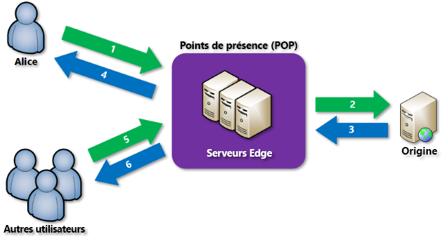

# Qu’est-ce qu’un réseau de distribution de contenu sur Azure ?
Un réseau de diffusion de contenu (CDN) est un réseau distribué de serveurs capables de fournir efficacement du contenu web aux utilisateurs. Les CDN stockent le contenu en cache sur des serveurs Edge situés à des emplacements de point de présence (POP) proches des utilisateurs finaux afin de réduire la latence. 

Le réseau de diffusion de contenu (CDN) Azure offre aux développeurs une solution globale pour la distribution rapide de contenu haut débit aux utilisateurs en mettant en cache leur contenu sur des nœuds physiques disposés stratégiquement dans le monde entier. Azure CDN peut aussi accélérer le contenu dynamique, qui ne peut être mis en cache, en exploitant diverses optimisations réseau à l’aide de points de présence du CDN. L’optimisation d’itinéraire pour contourner le protocole de passerelle frontière (BGP) en est un exemple.

Les avantages de l’utilisation d’Azure CDN pour distribuer les ressources de site web incluent :

* De meilleures performances et une expérience enrichie pour les utilisateurs finaux, en particulier ceux qui utilisent des applications ayant recours à de nombreux allers-retours pour charger le contenu.
* Une mise à grande échelle pour améliorer la gestion instantanée des charges importantes, par exemple le début de l’événement de lancement d’un produit.
* La distribution des requêtes utilisateur et la diffusion de contenu directement depuis des serveurs Edge sont là pour que le trafic transmis au serveur d’origine soit moins important.

Pour obtenir la liste actuelle des emplacements de nœuds CDN, consultez la page [Emplacements des points de présence CDN Azure](cdn-pop-locations.md).

## Fonctionnement

1. Un utilisateur (Alice) demande un fichier (également appelé ressource) à l’aide d’une URL avec un nom de domaine spécial, par exemple _&lt;nom de point de terminaison&gt;_ .azureedge.net. Il peut s’agir d’un nom d’hôte de point de terminaison ou de domaine personnalisé. Le DNS achemine la requête vers l’emplacement du meilleur point de présence (POP), généralement le POP géographiquement le plus proche de l’utilisateur.
    
2. Si aucun serveur Edge du point de présence ne dispose du fichier dans son cache, le POP demande le fichier au serveur d’origine. Le serveur d’origine peut être une application web Azure, un service cloud Azure, un compte de stockage Azure ou n'importe quel serveur web accessible publiquement.
   
3. Le serveur d’origine renvoie le fichier à un serveur Edge du point de présence.
    
4. Un serveur Edge du point de présence met en cache le fichier et le renvoie au demandeur d'origine (Alice). Le fichier demeure en cache sur le serveur Edge du point de présence jusqu’à expiration de la durée de vie (TTL) spécifiée par les en-têtes HTTP. Si le serveur d’origine n’a pas spécifié de durée de vie, elle est par défaut de 7 jours.
    
5. Des utilisateurs supplémentaires peuvent ensuite demander le même fichier en utilisant la même URL qu’Alice, et peuvent aussi être dirigés vers le même point de présence.
    
6. Si la durée de vie du fichier n'a pas expiré, le serveur Edge du point de présence renvoie le fichier directement depuis le cache. L’expérience utilisateur est en conséquence plus rapide et plus réactive.

## Spécifications
Pour utiliser Azure CDN, vous devez posséder au moins un abonnement Azure. Vous devez aussi créer au moins un profil CDN, qui est une collection des points de terminaison du CDN. Chaque point de terminaison du CDN représente une configuration spécifique d’accès et de comportement de distribution de contenu. Vous pouvez utiliser plusieurs profils pour organiser vos points de terminaison CDN par domaine Internet, application web ou d’autres critères. La [tarification Azure CDN](https://azure.microsoft.com/pricing/details/cdn/) s’applique au niveau du profil CDN. Vous devez donc créer plusieurs profils CDN si vous souhaitez utiliser plusieurs niveaux de tarification. Pour plus d’informations sur la structure de facturation d’Azure CDN, consultez [Understanding Azure CDN billing](cdn-billing.md) (Présentation de la facturation d’Azure CDN).

### Limites
Chaque abonnement Azure comprend des limites par défaut pour les ressources suivantes :
 - Le nombre de profils CDN qui peuvent être créés.
 - Le nombre de points de terminaison qui peuvent être créés dans un profil CDN. 
 - Le nombre de domaines personnalisés qui peuvent être mappés à un point de terminaison.

Pour plus d’informations sur les limites d’abonnement CDN, consultez [Limites de CDN](../azure-resource-manager/management/azure-subscription-service-limits.md).
    
## Fonctionnalités d’Azure CDN
Azure CDN offre les fonctionnalités suivantes :

- [Accélération de site dynamique](cdn-dynamic-site-acceleration.md)
- [Règles de mise en cache de CDN](cdn-caching-rules.md)
- [Assistance pour les domaines personnalisés HTTPS](cdn-custom-ssl.md)
- [Journaux de diagnostics Azure](cdn-azure-diagnostic-logs.md)
- [Compression de fichiers](cdn-improve-performance.md)
- [Filtrage géographique](cdn-restrict-access-by-country.md)

Pour obtenir la liste complète des fonctionnalités prises en charge par chaque produit Azure CDN, consultez [Comparer les fonctionnalités des produits Azure CDN](cdn-features.md).

## Étapes suivantes

- Pour prendre en main avec le CDN, consultez [Créer un profil et un point de terminaison CDN](cdn-create-new-endpoint.md).
- Gérez vos points de terminaison CDN via le [portail Microsoft Azure](https://portal.azure.com) ou avec [PowerShell](cdn-manage-powershell.md).
- Apprenez à automatiser Azure CDN avec [.NET](cdn-app-dev-net.md) ou [Node.js](cdn-app-dev-node.md).
