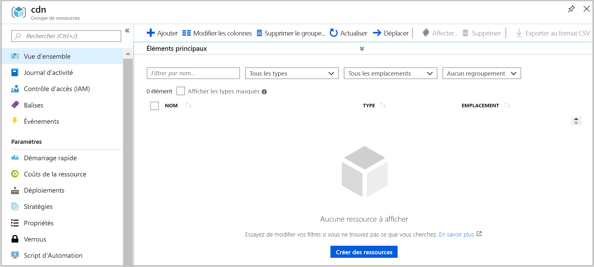

# <a name="quickstart-create-an-azure-cdn-profile-and-endpoint-using-resource-manager-template"></a>Démarrage rapide : Créer un point de terminaison et un profil Azure Content Delivery Network à l’aide d’un modèle Resource Manager

Dans ce démarrage rapide, vous déployez un modèle Azure Resource Manager à l’aide de l’interface CLI. Le modèle que vous créez déploie un profil CDN et un point de terminaison CDN sur le devant de votre application web.
La procédure doit prendre environ 10 minutes.

[!INCLUDE [quickstarts-free-trial-note](../../includes/quickstarts-free-trial-note.md)]

## <a name="prequisites"></a>Configuration requise

Dans le cadre de ce démarrage rapide, vous devez disposer d’une application web à utiliser comme origine. L’exemple d’application web utilisé dans ce démarrage rapide a été déployé sur https://cdndemo.azurewebsites.net

Pour plus d’informations, consultez [Créer une application web HTML statique dans Azure](https://docs.microsoft.com/azure/app-service/app-service-web-get-started-html).

## <a name="create-a-resource-group"></a>Créer un groupe de ressources

Toutes les ressources doivent être déployées dans le même groupe de ressources.

Créez le groupe de ressources à l’emplacement sélectionné. Cet exemple illustre la création d’un groupe de ressources nommé cdn dans la région USA Est.

```azurecli-interactive
az group create --name cdn --location eastus
```



## <a name="create-the-resource-manager-template"></a>Créer le modèle Resource Manager

Dans cette étape, vous créez un fichier de modèle qui déploie les ressources.

Bien que cet exemple décrive un scénario d’accélération de site web général, il existe de nombreux autres paramètres qui peuvent être configurés. Ces paramètres sont disponibles dans la documentation sur les modèles Azure Resource Manager. Consultez les références pour le [profil CDN](https://docs.microsoft.com/azure/templates/microsoft.cdn/2017-10-12/profiles) et le [point de terminaison de profil CDN](https://docs.microsoft.com/azure/templates/microsoft.cdn/2017-10-12/profiles/endpoints).

Notez que Microsoft CDN ne prend pas en charge la modification de la liste de type de contenu.

Enregistrez le modèle sous le nom de fichier **resource-manager-cdn.json**.

```json
{
    "$schema": "https://schema.management.azure.com/schemas/2015-01-01/deploymentTemplate.json#",
    "contentVersion": "1.0.0.0",
    "parameters": {
        "cdnProfileSku": {
            "type": "string",
            "allowedValues": [
                "Standard_Microsoft",
                "Standard_Akamai",
                "Standard_Verizon",
                "Premium_Verizon"
            ]
        },
        "endpointOriginHostName": {
            "type": "string"
        }
    },
    "variables": {
        "profile": {
            "name": "[replace(toLower(parameters('cdnProfileSku')), '_', '-')]"
        },
        "endpoint": {
            "name": "[replace(toLower(parameters('endpointOriginHostName')), '.', '-')]",
            "originHostName": "[parameters('endpointOriginHostName')]"
        }
    },
    "resources": [
        {
            "type": "Microsoft.Cdn/profiles",
            "apiVersion": "2017-10-12",
            "location": "[resourceGroup().location]",
            "name": "[variables('profile').name]",
            "sku": {
                "name": "[parameters('cdnProfileSku')]"
            }
        },
        {
            "dependsOn": [
                "[resourceId('Microsoft.Cdn/profiles', variables('profile').name)]"
            ],
            "type": "Microsoft.Cdn/profiles/endpoints",
            "apiVersion": "2017-10-12",
            "location": "[resourceGroup().location]",
            "name": "[concat(variables('profile').name, '/', variables('endpoint').name)]",
            "properties": {
                "hostName": "[concat(variables('endpoint').name, '.azureedge.net')]",
                "originHostHeader": "[variables('endpoint').originHostName]",
                "isHttpAllowed": true,
                "isHttpsAllowed": true,
                "queryStringCachingBehavior": "IgnoreQueryString",
                "origins": [
                    {
                        "name": "[replace(variables('endpoint').originHostName, '.', '-')]",
                        "properties": {
                            "hostName": "[variables('endpoint').originHostName]",
                            "httpPort": 80,
                            "httpsPort": 443
                        }
                    }
                ],
                "contentTypesToCompress": [
                    "application/eot",
                    "application/font",
                    "application/font-sfnt",
                    "application/javascript",
                    "application/json",
                    "application/opentype",
                    "application/otf",
                    "application/pkcs7-mime",
                    "application/truetype",
                    "application/ttf",
                    "application/vnd.ms-fontobject",
                    "application/xhtml+xml",
                    "application/xml",
                    "application/xml+rss",
                    "application/x-font-opentype",
                    "application/x-font-truetype",
                    "application/x-font-ttf",
                    "application/x-httpd-cgi",
                    "application/x-javascript",
                    "application/x-mpegurl",
                    "application/x-opentype",
                    "application/x-otf",
                    "application/x-perl",
                    "application/x-ttf",
                    "font/eot",
                    "font/ttf",
                    "font/otf",
                    "font/opentype",
                    "image/svg+xml",
                    "text/css",
                    "text/csv",
                    "text/html",
                    "text/javascript",
                    "text/js",
                    "text/plain",
                    "text/richtext",
                    "text/tab-separated-values",
                    "text/xml",
                    "text/x-script",
                    "text/x-component",
                    "text/x-java-source"
                ],
                "isCompressionEnabled": true,
                "optimizationType": "GeneralWebDelivery"
            }
        }
    ],
    "outputs": {
        "cdnUrl": {
            "type": "string",
            "value": "[concat('https://', variables('endpoint').name, '.azureedge.net')]"
        }
    }
}
```

## <a name="create-the-resources"></a>Créer les ressources

Déployez le modèle à l’aide d’Azure CLI. Vous êtes invité à entrer deux informations :

**cdnProfileSku** : fournisseur CDN que vous souhaitez utiliser. Les options sont :

* Standard_Microsoft
* Standard_Akamai
* Standard_Verizon
* Premium_Verizon.

**endpointOriginHostName** : point de terminaison qui est servi via le CDN, par exemple cdndemo.azurewebsites.net.

```azurecli-interactive
az group deployment create --resource-group cdn --template-file arm-cdn.json
```


## <a name="view-the-cdn-profile"></a>Afficher le profil CDN

```azurecli-interactive
az cdn profile list --resource-group cdn -o table
```


## <a name="view-the-cdn-endpoint-for-the-profile-standard-microsoft"></a>Afficher le point de terminaison CDN pour le profil standard-microsoft

```azurecli-interactive
az cdn endpoint list --profile-name standard-microsoft --resource-group cdn -o table
```


Utilisez le nom d’hôte pour afficher le contenu. Par exemple, accédez à https://cdndemo-azurewebsites-net.azureedge.net à l’aide de votre navigateur.

## <a name="clean-up"></a>Nettoyer

La suppression du groupe de ressources supprime automatiquement toutes les ressources qui ont été déployées dans celui-ci.

```azurecli-interactive
az group delete --name cdn
```


## <a name="references"></a>References

* Profil CDN - [Documentation de référence sur le modèle Azure Resource Manager](https://docs.microsoft.com/azure/templates/microsoft.cdn/2017-10-12/profiles)
* Point de terminaison CDN - [Documentation de référence sur le modèle Azure Resource Manager](https://docs.microsoft.com/azure/templates/microsoft.cdn/2017-10-12/profiles/endpoints)

## <a name="next-steps"></a>Étapes suivantes

Pour en savoir plus sur l’ajout d’un domaine personnalisé à votre point de terminaison CDN, consultez le didacticiel suivant :

> [!div class="nextstepaction"]
> [Tutoriel : Ajouter un domaine personnalisé à votre point de terminaison Azure CDN](cdn-map-content-to-custom-domain.md)
