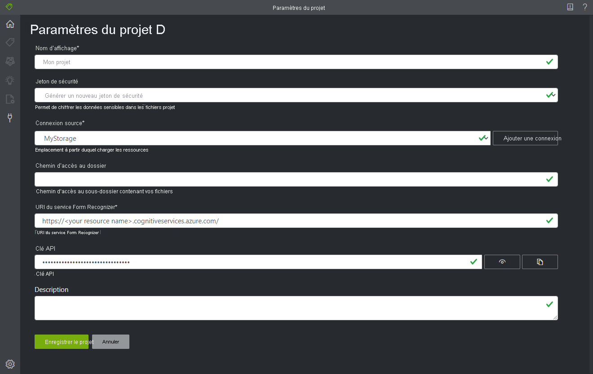

# <a name="train-a-form-recognizer-model-with-labels-using-the-sample-labeling-tool"></a>Entraîner un modèle Form Recognizer avec des étiquettes à l’aide de l’outil d’étiquetage des exemples

Dans ce guide de démarrage rapide, vous allez utiliser l’API REST Form Recognizer avec l’outil d’étiquetage des exemples pour entraîner un modèle personnalisé avec des données étiquetées manuellement. Consultez la section [Effectuer un entraînement avec des étiquettes](../overview.md#train-with-labels) de la vue d’ensemble pour en savoir plus sur cette fonctionnalité.

Si vous n’avez pas d’abonnement Azure, créez un [compte gratuit](https://azure.microsoft.com/free/?WT.mc_id=A261C142F) avant de commencer.

## <a name="prerequisites"></a>Prérequis

Pour suivre cette procédure de démarrage rapide, vous avez besoin des éléments suivants :

- Au minimum un ensemble de six formulaires du même type. Vous allez utiliser ces données pour entraîner le modèle et tester un formulaire. Vous pouvez utiliser un [exemple de jeu de données](https://go.microsoft.com/fwlink/?linkid=2090451) pour ce guide de démarrage rapide. Chargez les fichiers d’entraînement à la racine d’un conteneur de stockage d’objets blob dans un compte Stockage Azure.

## <a name="create-a-form-recognizer-resource"></a>Créer une ressource Form Recognizer

[!INCLUDE [create resource](../includes/create-resource.md)]

## <a name="set-up-the-sample-labeling-tool"></a>Configurer l’outil d’étiquetage des exemples

Vous allez utiliser le moteur Docker pour exécuter l’outil d’étiquetage des exemples. Procédez comme suit pour configurer le conteneur Docker. Pour apprendre les principes de base de Docker et des conteneurs, consultez la [vue d’ensemble de Docker](https://docs.docker.com/engine/docker-overview/).
1. Tout d’abord, installez Docker sur un ordinateur hôte. Ce guide va vous montrer comment utiliser l’ordinateur local en tant qu’hôte. Si vous voulez utiliser un service d’hébergement Docker dans Azure, consultez le guide pratique [Déployer l’outil d’étiquetage des exemples](../deploy-label-tool.md). 

   L’ordinateur hôte doit satisfaire à la configuration matérielle suivante :

    | Conteneur | Minimum | Recommandé|
    |:--|:--|:--|
    |Outil d’étiquetage des exemples|2 cœurs, 4 Go de mémoire|4 cœurs, 8 Go de mémoire|

   Installez Docker sur votre ordinateur en suivant les instructions appropriées pour votre système d’exploitation : 
   * [Windows](https://docs.docker.com/docker-for-windows/)
   * [macOS](https://docs.docker.com/docker-for-mac/)
   * [Linux](https://docs.docker.com/install/).

1. Récupérez le conteneur de l’outil d’étiquetage des exemples avec la commande `docker pull`.
    ```
    docker pull mcr.microsoft.com/azure-cognitive-services/custom-form/labeltool
    ```
1. Vous êtes maintenant prêt à exécuter le conteneur avec `docker run`.
    ```
    docker run -it -p 3000:80 mcr.microsoft.com/azure-cognitive-services/custom-form/labeltool eula=accept
    ```

   Cette commande rend l’outil d’étiquetage des exemples disponible par le biais d’un navigateur web. Accédez à [http://localhost:3000](http://localhost:3000).

> [!NOTE]
> Vous pouvez également étiqueter des documents et entraîner des modèles à l’aide de l’API REST Form Recognizer. Pour effectuer un entraînement et une analyse avec l’API REST, consultez [Entraîner avec des étiquettes en utilisant l’API REST et Python](./python-labeled-data.md).

## <a name="set-up-input-data"></a>Configurer les données d’entrée

Tout d’abord, vérifiez que tous les documents d’entraînement ont le même format. Si vous avez des formulaires dans plusieurs formats, organisez-les en sous-dossiers en fonction du format. Lors de l’entraînement, vous devez diriger l’API vers un sous-dossier.

### <a name="configure-cross-domain-resource-sharing-cors"></a>Configurer le partage des ressources inter-domaines (CORS)

Activez CORS sur votre compte de stockage. Sélectionnez votre compte de stockage dans le portail Azure, puis cliquez sur l’onglet **CORS** dans le volet gauche. Sur la ligne inférieure, renseignez les valeurs suivantes. Cliquez ensuite sur **Enregistrer** en haut.

* Origines autorisées = * 
* Méthodes autorisées = \[tout sélectionner\]
* En-têtes autorisés = *
* En-têtes exposés = * 
* Âge maximal = 200

> [!div class="mx-imgBorder"]
> 

## <a name="connect-to-the-sample-labeling-tool"></a>Se connecter à l’outil d’étiquetage des exemples

L’outil d’étiquetage des exemples se connecte à une source (où se trouvent vos formulaires d’origine) et à une cible (vers laquelle il exporte les étiquettes et les données de sortie créées).

Les connexions peuvent être configurées et partagées entre les projets. Elles utilisent un modèle de fournisseur extensible, ce qui vous permet d’ajouter facilement de nouveaux fournisseurs sources/cibles.

Pour créer une connexion, cliquez sur l’icône **Nouvelles connexions** (fiche électrique) dans la barre de navigation de gauche.

Renseignez les champs avec les valeurs suivantes :

* **Display Name** (nom d’affichage) : nom d’affichage de la connexion.
* **Description** : description de votre projet.
* **SAS URL** (URL SAS) : URL de signature d’accès partagé (SAS) de votre conteneur Stockage Blob Azure. Pour récupérer l’URL SAS, ouvrez l’Explorateur Stockage Microsoft Azure, cliquez avec le bouton droit sur votre conteneur, puis sélectionnez **Obtenir une signature d’accès partagé**. Définissez le délai d’expiration sur une heure à laquelle vous aurez fini d’utiliser le service. Assurez-vous que les autorisations **Read** (Lecture), **Write** (Écriture), **Delete** (Suppression) et **List** (Listage) sont cochées, puis cliquez sur **Create** (Créer). Copiez alors la valeur dans la section **URL**. Il doit avoir le format : `https://<storage account>.blob.core.windows.net/<container name>?<SAS value>`.


## <a name="create-a-new-project"></a>Création d'un projet

Dans l’outil d’étiquetage des exemples, les projets stockent vos configurations et paramètres. Créez un projet et renseignez les champs avec les valeurs suivantes :

* **Display Name** (Nom d’affichage) : nom d’affichage du projet
* **Security Token** (Jeton de sécurité) : certains paramètres de projet peuvent inclure des valeurs sensibles, telles que des clés API ou d’autres secrets partagés. Chaque projet génère un jeton de sécurité qui peut être utilisé pour chiffrer/déchiffrer les paramètres de projet sensibles. Vous trouvez les jetons de sécurité dans les paramètres de l’application ; pour y accéder, cliquez sur l’icône d’engrenage en bas de la barre de navigation de gauche.
* **Source Connection** (Connexion source) : connexion au Stockage Blob Azure que vous avez créée à l’étape précédente et que vous souhaitez utiliser pour ce projet.
* **Folder Path** (Chemin du dossier) : (facultatif) Si vos formulaires sources se trouvent dans un dossier sur le conteneur d’objets blob, spécifiez le nom du dossier ici.
* **Form Recognizer Service Uri** (URI du service Form Recognizer) : votre URL de point de terminaison Form Recognizer.
* **API Key** (Clé API) : votre clé d’abonnement Form Recognizer.
* **Description** : (facultatif) Description du projet



## <a name="label-your-forms"></a>Étiqueter vos formulaires

Quand vous créez ou ouvrez un projet, la fenêtre principale de l’éditeur d’étiquettes s’ouvre. L’éditeur d’étiquettes est composé de trois parties :

* Un volet de visualisation redimensionnable, qui contient une liste déroulante de formulaires à partir de la connexion source.
* Le volet principal de l’éditeur, qui vous permet d’appliquer des étiquettes.
* Le volet de l’éditeur d’étiquettes, qui permet aux utilisateurs de modifier, de verrouiller, de réorganiser et de supprimer des étiquettes. 

### <a name="identify-text-elements"></a>Identifier les éléments de texte

Cliquez sur **Run OCR on all files** (Exécuter l’OCR sur tous les fichiers) dans le volet gauche pour obtenir des informations de disposition du texte pour chaque document. L’outil d’étiquetage dessine des rectangles englobants autour de chaque élément de texte.

### <a name="apply-labels-to-text"></a>Appliquer des étiquettes à du texte

Vous allez ensuite créer des balises (étiquettes) et les appliquer aux éléments de texte que vous souhaitez que le modèle reconnaisse.

1. Tout d’abord, utilisez le volet de l’éditeur d’étiquettes pour créer les étiquettes que vous souhaitez identifier.
  1. Cliquez sur **+** pour créer une étiquette.
  1. Entrez le nom de l’étiquette.
  1. Appuyez sur Entrée pour enregistrer l’étiquette.
1. Dans l’éditeur principal, cliquez et faites glisser pour sélectionner un ou plusieurs mots parmi les éléments de texte mis en évidence.
1. Cliquez sur l’étiquette que vous souhaitez appliquer ou appuyez sur la touche du clavier correspondante. Les touches numériques sont affectées comme touches d’accès rapide pour les 10 premières étiquettes. Vous pouvez réorganiser vos étiquettes à l’aide des icônes de flèches haut et bas dans le volet de l’éditeur d’étiquettes.
    > [!Tip]
    > Gardez à l’esprit les conseils suivants quand vous étiquetez vos formulaires.
    > * Vous ne pouvez appliquer qu’une seule étiquette à chaque élément de texte sélectionné.
    > * Chaque étiquette ne peut être appliquée qu’une seule fois par page. Si une valeur apparaît plusieurs fois sur le même formulaire, créez des étiquettes différentes pour chaque instance, par exemple « facture n° 1 », « facture n° 2 », etc.
    > * Les étiquettes ne peuvent pas s’étendre sur plusieurs pages.
    > * Étiquetez les valeurs telles qu’elles apparaissent sur le formulaire ; n’essayez pas de fractionner une valeur en deux parties avec deux étiquettes différentes. Par exemple, un champ d’adresse doit être étiqueté avec une étiquette unique, même s’il s’étend sur plusieurs lignes.
    > * N’incluez pas de clés dans vos champs étiquetés&mdash;uniquement les valeurs.
    > * Les données de la table doivent être détectées automatiquement et seront disponibles dans le fichier JSON de sortie final. Toutefois, si le modèle ne parvient pas à détecter toutes les données de votre table, vous pouvez aussi étiqueter manuellement ces champs. Étiquetez chaque cellule de la table avec une étiquette différente. Si vos formulaires comportent des tables avec un nombre variable de lignes, veillez à étiqueter au moins un formulaire avec la table la plus grande possible.


Suivez les étapes ci-dessus pour étiqueter cinq de vos formulaires, puis passez à l’étape suivante.


## <a name="train-a-custom-model"></a>Entraîner un modèle personnalisé

Dans le volet gauche, cliquez sur l’icône Train (Entraîner) (wagon) pour ouvrir la page Training (Entraînement). Cliquez ensuite sur le bouton **Train** pour commencer l’entraînement du modèle. Une fois le processus d’entraînement terminé, les informations suivantes s’affichent :

* **Model ID** : ID du modèle qui a été créé et entraîné. Chaque appel d’entraînement crée un modèle avec son propre ID. Copiez cette chaîne en lieu sûr ; vous en aurez besoin si vous souhaitez effectuer des appels de prédiction par le biais de l’API REST.
* **Average Accuracy** : justesse moyenne du modèle. Vous pouvez améliorer la justesse du modèle en étiquetant des formulaires supplémentaires et en effectuant un nouvel entraînement pour créer un modèle. Nous vous recommandons de commencer par étiqueter cinq formulaires et d’ajouter des formulaires en fonction des besoins.
* Liste des étiquettes et justesse estimée par étiquette.


Une fois l’entraînement terminé, examinez la valeur **Average Accuracy**. Si cette valeur est petite, vous devez ajouter d’autres documents d’entrée et répéter les étapes ci-dessus. Les documents que vous avez déjà étiquetés sont conservés dans l’index du projet.

> [!TIP]
> Vous pouvez également exécuter le processus d’entraînement avec un appel d’API REST. Pour savoir comment procéder, consultez [Effectuer un entraînement avec des étiquettes à l’aide de Python](./python-labeled-data.md).

## <a name="analyze-a-form"></a>Analyser un formulaire

Cliquez sur l’icône Predict (Prédire) (rectangles) sur la gauche pour tester votre modèle. Chargez un document de formulaire que vous n’avez pas utilisé dans le processus d’entraînement. Cliquez ensuite sur le bouton **Predict** à droite pour obtenir les prédictions de clé/valeur pour le formulaire. L’outil applique des étiquettes dans les cadres englobants et signale la confiance de chaque étiquette.

> [!TIP]
> Vous pouvez également exécuter l’API Analyze (Analyser) avec un appel REST. Pour savoir comment procéder, consultez [Effectuer un entraînement avec des étiquettes à l’aide de Python](./python-labeled-data.md).

## <a name="improve-results"></a>Améliorer les résultats

Selon la justesse signalée, vous souhaiterez peut-être effectuer d’autres entraînements pour améliorer le modèle. Une fois que vous avez effectué une prédiction, examinez les valeurs de confiance de chacune des étiquettes appliquées. Si la valeur d’entraînement de la justesse moyenne était élevée, mais que les scores de confiance sont faibles (ou que les résultats sont imprécis), vous devez ajouter le fichier utilisé pour la prédiction dans le jeu d’entraînement, l’étiqueter et renouveler l’entraînement.

La justesse moyenne signalée, les scores de confiance et la justesse réelle peuvent être incohérents quand les documents analysés diffèrent de ceux utilisés dans l’entraînement. N’oubliez pas que certains documents peuvent sembler similaires aux yeux de l’utilisateur, mais distincts du point de vue du modèle IA. Par exemple, vous pouvez effectuer l’entraînement avec un type de formulaire qui a deux variantes, où le jeu d’entraînement est constitué de 20 % de variante A et de 80 % de variante B. Au cours de la prédiction, les scores de confiance des documents de variante A sont susceptibles d’être inférieurs.

## <a name="save-a-project-and-resume-later"></a>Enregistrer un projet et le reprendre plus tard

Pour reprendre votre projet à un autre moment ou dans un autre navigateur, vous devez enregistrer son jeton de sécurité et le retaper ultérieurement. 

### <a name="get-project-credentials"></a>Récupérer les informations d’identification du projet
Accédez à la page des paramètres du projet (icône en forme de curseurs) et prenez note du nom du jeton de sécurité. Accédez ensuite aux paramètres d’application (icône en forme d’engrenage), où apparaissent tous les jetons de sécurité dans votre instance de navigateur actuelle. Recherchez le jeton de sécurité de votre projet et copiez son nom et sa valeur de clé en lieu sûr.

### <a name="restore-project-credentials"></a>Restaurer les informations d’identification du projet
Quand vous souhaitez reprendre votre projet, vous devez d’abord créer une connexion au même conteneur de stockage d’objets blob. Pour ce faire, répétez les étapes ci-dessus. Ensuite, accédez à la page des paramètres de l’application (icône en forme d’engrenage) et vérifiez si le jeton de sécurité de votre projet y figure. Si ce n’est pas le cas, ajoutez un nouveau jeton de sécurité et copiez le nom et la clé de votre jeton obtenus à l’étape précédente. Cliquez ensuite sur Save Settings (Enregistrer les paramètres). 

### <a name="resume-a-project"></a>Reprendre un projet
Enfin, accédez à la page principale (icône en forme de maison), puis cliquez sur Open Cloud Project (Ouvrir le projet cloud). Sélectionnez ensuite la connexion au stockage d’objets blob, puis sélectionnez le fichier *.vott* de votre projet. L’application chargera tous les paramètres du projet, car elle contient le jeton de sécurité.

## <a name="next-steps"></a>Étapes suivantes

Dans ce guide de démarrage rapide, vous avez appris à utiliser l’outil d’étiquetage des exemples Form Recognizer pour entraîner un modèle avec des données étiquetées manuellement. Si vous souhaitez intégrer l’outil d’étiquetage à votre propre application, utilisez les API REST qui traitent de l’entraînement des données étiquetées.

> [!div class="nextstepaction"]
> [Effectuer un entraînement avec des étiquettes à l’aide de Python](./python-labeled-data.md)
