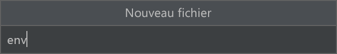
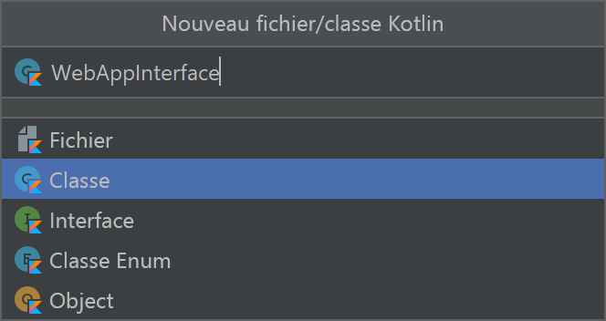
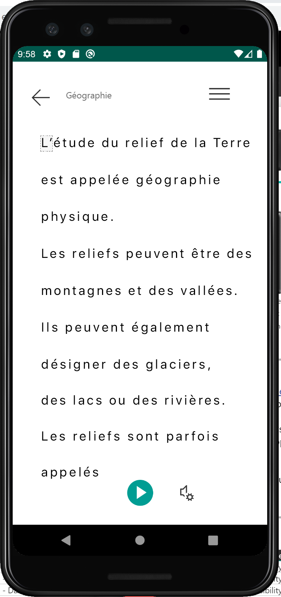

Le [Lecteur immersif](https://www.onenote.com/learningtools) est un outil qui permet d’implémenter des techniques éprouvées pour améliorer la compréhension dans le cadre de l’apprentissage de la lecture, l’apprentissage d’une langue et pour les personnes avec des difficultés d’apprentissage, comme la dyslexie. Vous pouvez utiliser le Lecteur immersif dans vos applications pour isoler du texte afin d’améliorer le focus, afficher des images pour les mots couramment utilisés, mettre en évidence des parties d’une discours parlé, lire le texte sélectionné à voix haute, traduire des mots et des expressions en temps réel, etc.

Dans ce guide de démarrage rapide, vous créez une application Android à partir de zéro et vous intégrez le lecteur immersif. Un exemple complet et fonctionnel de ce guide de démarrage rapide est disponible [sur GitHub](https://github.com/microsoft/immersive-reader-sdk/tree/master/js/samples/quickstart-kotlin).

## <a name="prerequisites"></a>Prérequis

* Abonnement Azure - [En créer un gratuitement](https://azure.microsoft.com/free/cognitive-services)
* Une ressource Lecteur immersif configurée pour l’authentification Azure Active Directory. Suivez [ces instructions](../../how-to-create-immersive-reader.md) pour la configurer. Vous aurez besoin de certaines des valeurs créées ici quand vous configurerez les propriétés d’environnement. Enregistrez la sortie de votre session dans un fichier texte pour référence ultérieure.
* [Git](https://git-scm.com/).
* [Kit SDK Lecteur immersif](https://github.com/microsoft/immersive-reader-sdk).
* [Android Studio](https://developer.android.com/studio).

## <a name="create-an-android-project"></a>Création d’une application Android

Démarrez un nouveau projet dans Android Studio. Le code source de cet exemple est disponible dans le cadre du [Kit SDK Lecteur immersif](https://github.com/microsoft/immersive-reader-sdk/tree/master/js/samples/quickstart-kotlin).


Dans la fenêtre **Choose your project** (Choisir votre projet), sélectionnez **Empty Activity** (Activité vide), puis sélectionnez **Next** (Suivant).


## <a name="configure-the-project"></a>Configurer le projet

Nommez le projet **QuickstartKotlin**, puis sélectionnez un emplacement où l’enregistrer. Sélectionnez **Kotlin** en tant que langage de programmation, puis sélectionnez **Finish** (Terminer).


## <a name="set-up-assets-and-authentication"></a>Configurer les ressources et l’authentification

Créez un dossier **/assets**.


 Créez un fichier nommé **env** dans le dossier assets. Ajoutez les noms et valeurs suivants, puis indiquez les valeurs appropriées. Ne validez pas ce fichier env dans le contrôle de code source, car il contient des secrets qui ne doivent pas être rendus publics.



```text
TENANT_ID=<YOUR_TENANT_ID>
CLIENT_ID=<YOUR_CLIENT_ID>
CLIENT_SECRET=<YOUR_CLIENT_SECRET>
SUBDOMAIN=<YOUR_SUBDOMAIN>
```


## <a name="add-dependencies"></a>Ajout de dépendances

Remplacez les dépendances existantes dans le fichier **build.gradle** par les implémentations suivantes pour permettre aux coroutines (programmation asynchrone), à gson (analyse et sérialisation JSON) et à dotenv de référencer les variables définies dans le fichier env. Vous devrez peut-être resynchroniser le projet quand vous implémenterez MainActivity.kt au cours d’une prochaine étape dans ce guide de démarrage rapide.

```build.gradle
dependencies {
    implementation fileTree(dir: 'libs', include: ['*.jar'])
    implementation"org.jetbrains.kotlin:kotlin-stdlib-jdk7:$kotlin_version"
    implementation 'androidx.appcompat:appcompat:1.0.2'
    implementation 'androidx.core:core-ktx:1.0.2'
    implementation 'androidx.constraintlayout:constraintlayout:1.1.3'
    implementation "org.jetbrains.kotlinx:kotlinx-coroutines-core:1.1.1"
    implementation "org.jetbrains.kotlinx:kotlinx-coroutines-android:1.1.1"
    implementation 'com.google.code.gson:gson:2.8.6'
    implementation 'io.github.cdimascio:java-dotenv:5.1.3'
    testImplementation 'junit:junit:4.12'
    androidTestImplementation 'androidx.test.ext:junit:1.1.0'
    androidTestImplementation 'androidx.test.espresso:espresso-core:3.1.1'
}
```


## <a name="update-app-strings-and-layout-resources"></a>Mettre à jour les chaînes de l’application et les ressources de disposition

Remplacez le contenu de **res/strings/strings.xml** par les chaînes suivantes à utiliser dans l’application.


```strings.xml
<resources>

    <!-- Copyright (c) Microsoft Corporation. All rights reserved. -->
    <!-- Licensed under the MIT License. -->

    <string name="app_name">ImmersiveReaderSDK</string>
    <string name="geographyTitle">Geography</string>
    <string name="geographyTextEn">The study of Earth's landforms is called physical geography. Landforms can be mountains and valleys. They can also be glaciers, lakes or rivers. Landforms are sometimes called physical features. It is important for students to know about the physical geography of Earth. The seasons, the atmosphere and all the natural processes of Earth affect where people are able to live. Geography is one of a combination of factors that people use to decide where they want to live.The physical features of a region are often rich in resources. Within a nation, mountain ranges become natural borders for settlement areas. In the U.S., major mountain ranges are the Sierra Nevada, the Rocky Mountains, and the Appalachians. Fresh water sources also influence where people settle. People need water to drink. They also need it for washing. Throughout history, people have settled near fresh water. Living near a water source helps ensure that people have the water they need. There was an added bonus, too. Water could be used as a travel route for people and goods. Many Americans live near popular water sources, such as the Mississippi River, the Colorado River and the Great Lakes.Mountains and deserts have been settled by fewer people than the plains areas. However, they have valuable resources of their own.</string>
    <string name="geographyTextFr">L\'étude des reliefs de la Terre est appelée géographie physique. Les reliefs peuvent être des montagnes et des vallées. Il peut aussi s\'agira de glaciers, delacs ou de rivières. Les reliefs sont parfois appelés caractéristiques physiques. Il est important que les élèves connaissent la géographie physique de laTerre. Les saisons, l\'atmosphère et tous les processus naturels de la Terre affectent l\'endroit où les gens sont capables de vivre. La géographie est l\'un desfacteurs que les gens utilisent pour décider où ils veulent vivre. Les caractéristiques physiques d\'une région sont souvent riches en ressources. Àl\'intérieur d\'une nation, les chaînes de montagnes deviennent des frontières naturelles pour les zones de peuplement. Aux États-Unis, les principaleschaînes de montagnes sont la Sierra Nevada, les montagnes Rocheuses et les Appalaches.Les sources d\'eau douce influencent également l\'endroit où lesgens s\'installent. Les gens ont besoin d\'eau pour boire. Ils en ont aussi besoin pour se laver. Tout au long de l\'histoire, les gens se sont installés près del\'eau douce. Vivre près d\'une source d\'eau permet de s\'assurer que les gens ont l\'eau dont ils ont besoin. Il y avait un bonus supplémentaire, aussi. L\'eaupourrait être utilisée comme voie de voyage pour les personnes et les marchandises. Beaucoup d\'Américains vivent près des sources d\'eau populaires,telles que le fleuve Mississippi, le fleuve Colorado et les Grands Lacs.Mountains et les déserts ont été installés par moins de gens que les zones desplaines. Cependant, ils disposent de ressources précieuses.Les gens ont une réponse.</string>
    <string name="immersiveReaderButtonText">Immersive Reader</string>
</resources>
```

Remplacez le contenu de **res/layout/activity_main.xml** par le code XML suivant à utiliser dans l’application. Ce code XML représente la disposition de l’IU de l’application.


```activity_main.xml
<?xml version="1.0" encoding="utf-8"?>

<!-- Copyright (c) Microsoft Corporation. All rights reserved. -->
<!-- Licensed under the MIT License. -->

<androidx.constraintlayout.widget.ConstraintLayout xmlns:android="http://schemas.android.com/apk/res/android"
    xmlns:app="http://schemas.android.com/apk/res-auto"
    xmlns:tools="http://schemas.android.com/tools"
    android:layout_width="match_parent"
    android:layout_height="match_parent"
    android:background="#FFFFFF"
    tools:context=".MainActivity">

    <LinearLayout
        android:id="@+id/linearLayout"
        android:layout_width="match_parent"
        android:layout_height="0dp"
        android:background="#FFFFFF"
        android:orientation="vertical"
        app:layout_constraintBottom_toBottomOf="parent"
        app:layout_constraintEnd_toEndOf="parent"
        app:layout_constraintHorizontal_bias="0.0"
        app:layout_constraintStart_toStartOf="parent"
        app:layout_constraintTop_toTopOf="parent"
        app:layout_constraintVertical_bias="0.0">

        <TextView
            android:id="@+id/Title"
            android:layout_width="match_parent"
            android:layout_height="wrap_content"
            android:layout_marginLeft="48dp"
            android:layout_marginTop="24dp"
            android:layout_marginRight="48dp"
            android:layout_marginBottom="24dp"
            android:text="@string/geographyTitle"
            android:textSize="24sp"
            android:textStyle="bold" />

        <ScrollView
            android:id="@+id/ContentPane"
            android:layout_width="match_parent"
            android:layout_height="480dp"
            android:layout_marginBottom="48dp"
            android:clipToPadding="false"
            android:fillViewport="false"
            android:paddingLeft="48dp"
            android:paddingRight="48dp"
            android:scrollbarStyle="outsideInset"
            android:visibility="visible"
            tools:visibility="visible">

            <LinearLayout
                android:layout_width="match_parent"
                android:layout_height="match_parent"
                android:orientation="vertical">

                <TextView
                    android:id="@+id/Content1"
                    android:layout_width="match_parent"
                    android:layout_height="wrap_content"
                    android:background="#00FFFFFF"
                    android:text="@string/geographyTextEn"
                    android:textSize="18sp" />

                <TextView
                    android:id="@+id/Content2"
                    android:layout_width="match_parent"
                    android:layout_height="wrap_content"
                    android:background="#00FFFFFF"
                    android:text="@string/geographyTextFr"
                    android:textSize="18sp" />

            </LinearLayout>

        </ScrollView>

        <Button
            android:id="@+id/LaunchImmersiveReaderButton"
            android:layout_width="match_parent"
            android:layout_height="60dp"
            android:layout_marginLeft="40dp"
            android:layout_marginRight="40dp"
            android:layout_marginBottom="80dp"
            android:text="@string/immersiveReaderButtonText"
            android:textAllCaps="false"
            android:textSize="24sp"
            android:visibility="visible"
            tools:visibility="visible" />

    </LinearLayout>

</androidx.constraintlayout.widget.ConstraintLayout>
```

## <a name="set-up-the-app-kotlin-code-javascript-interface"></a>Configurer l’interface JavaScript du code Kotlin de l’application

Dans le dossier **/Java/com.example.quickstartkotlin**, créez une classe Kotlin, et nommez-la **WebAppInterface**. Ajoutez-y ensuite le code suivant. Ce code permet à l’application de s’interfacer avec des fonctions JavaScript en HTML, qui vont être ajoutées au cours d’une prochaine étape.




```WebAppInterface.kt
// Copyright (c) Microsoft Corporation. All rights reserved.
// Licensed under the MIT License.

package com.example.quickstartkotlin

import android.content.Context
import android.webkit.JavascriptInterface
import android.webkit.WebView
import android.widget.LinearLayout
import android.widget.Toast

class WebAppInterface(private val mContext: Context, var parentLayout: LinearLayout, var webView: WebView) {

    // Show a toast from html.
    @JavascriptInterface
    fun showToast(toast: String) {
        Toast.makeText(mContext, toast, Toast.LENGTH_SHORT).show()
    }

    // Exit the Immersive Reader.
    @JavascriptInterface
    fun immersiveReaderExit() {
        webView.post(Runnable { destroyWebView(parentLayout, webView) })

        // Any additional functionality may be added here.
        Toast.makeText(mContext, "The Immersive Reader has been closed!", Toast.LENGTH_SHORT).show()
    }

    // Disposes of the WebView when the back arrow is tapped.
    private fun destroyWebView(parentLayout: LinearLayout, webView: WebView) {

        // Removes the WebView from its parent view before doing anything.
        parentLayout.removeView(webView)

        // Cleans things up before destroying the WebView.
        webView.clearHistory()
        webView.clearCache(true)
        webView.loadUrl("about:blank")
        webView.onPause()
        webView.removeAllViews()
        webView.pauseTimers()
        webView.destroy()
    }
}
```

## <a name="set-up-the-app-kotlin-code-main-activity"></a>Configurer l’activité principale du code Kotlin de l’application

Dans le dossier **/Java/com.example.quickstartkotlin**, il existe un fichier de classe Kotlin **MainActivity.kt**. Ce fichier est l’emplacement où la logique de l’application est créée. Remplacez son contenu par le code ci-dessous :

```MainActivity.kt
// Copyright (c) Microsoft Corporation. All rights reserved.
// Licensed under the MIT License.

package com.example.quickstartkotlin

import android.app.Activity
import androidx.appcompat.app.AppCompatActivity
import android.os.Bundle
import android.webkit.CookieManager
import android.webkit.WebView
import android.widget.Button
import android.webkit.WebViewClient
import android.widget.LinearLayout
import android.widget.TextView
import com.google.gson.*
import io.github.cdimascio.dotenv.dotenv
import java.io.IOException
import java.io.*
import java.net.HttpURLConnection
import java.net.HttpURLConnection.HTTP_OK
import java.net.URL
import kotlinx.coroutines.*
import org.json.JSONObject
import java.util.*

// This sample app uses the Dotenv. It's a module that loads environment variables from a .env file to better manage secrets.
// https://github.com/cdimascio/java-dotenv
// Be sure to add a "env" file to the /assets folder.
// Instead of '.env', use 'env'.

class MainActivity : AppCompatActivity() {
    private val dotEnv = dotenv {
        directory = "/assets"
        filename = "env"
        ignoreIfMalformed = true
        ignoreIfMissing = true
    }

    private lateinit var contextualWebView: WebView

    override fun onCreate(savedInstanceState: Bundle?) {
        super.onCreate(savedInstanceState)
        this.supportActionBar!!.hide()
        setContentView(R.layout.activity_main)
        val immersiveReaderButton = findViewById<Button>(R.id.LaunchImmersiveReaderButton)
        immersiveReaderButton.setOnClickListener { GlobalScope.launch { handleLoadImmersiveReaderWebView() } }
    }

    // Assigns values to the objects sent to the Immersive Reader SDK,
    // acquires the token and authorizes the app, then launches
    // the Web View to get the response and load the Immersive Reader
    // when the button is clicked in HTML.
    private suspend fun handleLoadImmersiveReaderWebView() {
        val exampleActivity = this
        val subdomain = dotEnv["SUBDOMAIN"]
        val irTitle = findViewById<TextView>(R.id.Title)
        val irText1 = findViewById<TextView>(R.id.Content1)
        val irText2 = findViewById<TextView>(R.id.Content2)

        // The content of the request that's shown in the Immersive Reader.
        // This basic example contains chunks of two different languages.
        val chunk1 = Chunk()
        chunk1.content = irText1.text.toString()
        chunk1.lang = "en"
        chunk1.mimeType = "text/plain"

        val chunk2 = Chunk()
        chunk2.content = irText2.text.toString()
        chunk2.lang = "fr"
        chunk2.mimeType = "text/plain"

        val chunks = ArrayList<Chunk>()
        chunks.add(chunk1)
        chunks.add(chunk2)

        val content = Content()
        content.title = irTitle.text.toString()
        content.chunks = chunks

        // Options may be assigned values here (e.g. options.uiLang = "en").
        val options = Options()

        var token: String

        runBlocking{
            val resp = async { getImmersiveReaderTokenAsync() }
            token = resp.await()
            val jsonResp = JSONObject(token)
            loadImmersiveReaderWebView(exampleActivity, jsonResp.getString("access_token"), subdomain, content, options)
        }
    }

    // The next two functions get the token from the Immersive Reader SDK
    // and authorize the app.
    private suspend fun getImmersiveReaderTokenAsync(): String {
        return getToken()
    }

    @Throws(IOException::class)
    fun getToken(): String {
        val clientId = dotEnv["CLIENT_ID"]
        val clientSecret = dotEnv["CLIENT_SECRET"]
        val tenantId = dotEnv["TENANT_ID"]
        val tokenUrl = URL("https://login.windows.net/$tenantId/oauth2/token")
        val form = "grant_type=client_credentials&resource=https://cognitiveservices.azure.com/&client_id=$clientId&client_secret=$clientSecret"

        val connection = tokenUrl.openConnection() as HttpURLConnection
        connection.requestMethod = "POST"
        connection.setRequestProperty("content-type", "application/x-www-form-urlencoded")
        connection.doOutput = true

        val writer = DataOutputStream(connection.outputStream)
        writer.writeBytes(form)
        writer.flush()
        writer.close()

        val responseCode = connection.responseCode

        if (responseCode == HTTP_OK) {
            val readerIn = BufferedReader(InputStreamReader(connection.inputStream))
            var inputLine = readerIn.readLine()
            val response = StringBuffer()

            do {
                response.append(inputLine)
            } while (inputLine.length < 0)
            readerIn.close()

            // Return token
            return response.toString()
        } else {
            val responseError = Error(code = "BadRequest", message = "There was an error getting the token.")
            throw IOException(responseError.toString())
        }
    }

    // To be assigned values and sent to the Immersive Reader SDK
    class Chunk(var content: String? = null,
                var lang: String? = null,
                var mimeType: String? = null)

    class Content(var title: String? = null,
                  var chunks: List<Chunk>? = null)

    class Message(var cogSvcsAccessToken: String? = null,
                  var cogSvcsSubdomain: String? = null,
                  var content: Content? = null,
                  var launchToPostMessageSentDurationInMs: Int? = null,
                  var options: Options? = null)

    // Only includes Immersive Reader options relevant to Android apps.
    // For a complete list, visit https://docs.microsoft.com/azure/cognitive-services/immersive-reader/reference
    class Options(var uiLang: String? = null, // Language of the UI, e.g. en, es-ES (optional). Defaults to browser language if not specified.
                  var timeout: Int? = null, // Duration (in milliseconds) before launchAsync fails with a timeout error (default is 15000 ms).
                  var uiZIndex: Int? = null, // Z-index of the iframe that will be created (default is 1000)
                  var onExit: (() -> Any)? = null, // Executes a callback function when the Immersive Reader exits
                  var customDomain: String? = null, // Reserved for internal use. Custom domain where the Immersive Reader webapp is hosted (default is null).
                  var allowFullscreen: Boolean? = null, // The ability to toggle fullscreen (default is true).
                  var hideExitButton: Boolean? = null // Whether or not to hide the Immersive Reader's exit button arrow (default is false). This should only be true if there is an alternative mechanism provided to exit the Immersive Reader (e.g a mobile toolbar's back arrow).
    )

    class Error(var code: String? = null,
                var message: String? = null)

    // A custom Web View component that launches inside the app
    @Throws(IOException::class)
    fun loadImmersiveReaderWebView(
        exampleActivity: Activity,
        token: String,
        subdomain: String?,
        content: Content,
        options: Options
    ) {
        val startPostMessageSentDurationInMs = Date()

        // Populate the message
        val messageData = Message()
        messageData.cogSvcsAccessToken = token
        messageData.cogSvcsSubdomain = subdomain
        messageData.content = content
        messageData.options = options

        GlobalScope.launch {
            withContext(Dispatchers.Main) {
                contextualWebView = WebView(exampleActivity)
                val parentLayout = findViewById<LinearLayout>(R.id.linearLayout)
                val contextualWebViewSettings = contextualWebView.settings

                contextualWebViewSettings.allowContentAccess = true
                contextualWebViewSettings.builtInZoomControls = true
                contextualWebViewSettings.javaScriptEnabled = true
                contextualWebViewSettings.loadsImagesAutomatically = true
                contextualWebViewSettings.loadWithOverviewMode = true
                contextualWebViewSettings.useWideViewPort = true
                contextualWebViewSettings.userAgentString = "Android"
                contextualWebViewSettings.domStorageEnabled = true

                contextualWebViewSettings.setAppCacheEnabled(false)
                contextualWebViewSettings.setSupportZoom(true)
                contextualWebView.setInitialScale(1)

                // Enables WebView Cookies
                if (android.os.Build.VERSION.SDK_INT >= android.os.Build.VERSION_CODES.LOLLIPOP) {
                    CookieManager.getInstance().setAcceptThirdPartyCookies(contextualWebView, true)
                } else {
                    CookieManager.getInstance().setAcceptCookie(true)
                }

                val contextualWebViewLayout = LinearLayout.LayoutParams(LinearLayout.LayoutParams.MATCH_PARENT, LinearLayout.LayoutParams.MATCH_PARENT)
                parentLayout.addView(contextualWebView, 0, contextualWebViewLayout)

                // This is required to launch the WebView *inside* the host application.
                contextualWebView.webViewClient = object : WebViewClient() {
                    override fun shouldOverrideUrlLoading(view: WebView, url: String): Boolean {
                        view.loadUrl(url)
                        return true
                    }

                    // Send message JSON object to Immersive Reader html
                    override fun onPageFinished(view: WebView, url: String) {
                        val endPostMessageSentDurationInMs = Date()
                        val postMessageSentDurationInMs = (endPostMessageSentDurationInMs.time - startPostMessageSentDurationInMs.time).toInt()

                        // Updates launchToPostMessageSentDurationInMs
                        messageData.launchToPostMessageSentDurationInMs = postMessageSentDurationInMs

                        // Serializes message data class to JSON
                        val gson = Gson()
                        val message = gson.toJson(messageData)

                        // Calls the handleLaunchImmersiveReader function in HTML
                        if (android.os.Build.VERSION.SDK_INT >= android.os.Build.VERSION_CODES.KITKAT) {
                            view.evaluateJavascript("handleLaunchImmersiveReader($message)", null)
                        } else {
                            view.loadUrl("javascript:handleLaunchImmersiveReader($message)")
                        }

                        // Sets the visibility of the WebView after the function has been called.
                        view.visibility = WebView.VISIBLE
                    }
                }

                // This is where the WebAppInterface Class is used.
                // Affords a way for JavaScript to work with the app directly from
                // the Web View's HTML.
                val jsInterface = WebAppInterface(exampleActivity, parentLayout, contextualWebView)
                contextualWebView.addJavascriptInterface(jsInterface, "Android")
                contextualWebView.loadUrl("file:///android_asset/immersiveReader.html")
            }
        }
    }
}
```

## <a name="add-the-app-html-to-the-web-view"></a>Ajouter le code HTML de l’application à la vue web

L’implémentation de la vue web a besoin du code HTML pour fonctionner. Cliquez avec le bouton droit sur le dossier **/assets**, créez un fichier, puis nommez-le **immersiveReader.html**.


Ajoutez les codes HTML et JavaScript suivants. Cela permet d’ajouter le kit SDK Lecteur immersif à l’application et de l’utiliser pour ouvrir le lecteur immersif à l’aide du code d’application que nous avons écrit.

```immersiveReader.html
<!-- Copyright (c) Microsoft Corporation. All rights reserved.
Licensed under the MIT License. -->

<!DOCTYPE html>
<html>
<head>
    <meta charset="utf-8">
    <meta name="viewport" content="width=device-width, initial-scale=1, shrink-to-fit=no">
    <script type="text/javascript" src="https://contentstorage.onenote.office.net/onenoteltir/immersivereadersdk/immersive-reader-sdk.1.0.0.js"></script>
</head>
<body>
<script type="text/javascript">
        function handleLaunchImmersiveReader(message) {
            if (!message) {
                Android.showToast('Message is null or undefined!');
            } else {
                // Learn more about chunk usage and supported MIME types https://docs.microsoft.com/azure/cognitive-services/immersive-reader/reference#chunk
                var data = {
                    title: message.content.title,
                    chunks: message.content.chunks
                };

                // A simple declarative function used to close the Immersive Reader WebView via @JavaScriptInterface
                var exitCallback = function() {
                    Android.immersiveReaderExit();
                }

                // Learn more about options https://docs.microsoft.com/azure/cognitive-services/immersive-reader/reference#options
                var options = {
                    onExit: exitCallback,
                    uiZIndex: 2000
                };

                // Use the JavaScript SDK to launch the Immersive Reader.
                ImmersiveReader.launchAsync(message.cogSvcsAccessToken, message.cogSvcsSubdomain, data, options);
            }
        }
    </script>
</body>
</html>
```

## <a name="set-up-app-permissions"></a>Configurer des autorisations d’application


Dans la mesure où l’application doit effectuer des appels réseau au kit SDK Lecteur immersif pour fonctionner, nous devons vérifier que les autorisations de l’application sont configurées pour permettre l’accès au réseau. Remplacez le contenu du fichier **/manifests/AndroidManifest.xml** par le code XML suivant :

```AndroidManifest.xml
<?xml version="1.0" encoding="utf-8"?>
<manifest xmlns:android="http://schemas.android.com/apk/res/android"
    package="com.example.quickstartkotlin">

    <uses-permission android:name="android.permission.INTERNET" />

    <application
        android:allowBackup="true"
        android:icon="@mipmap/ic_launcher"
        android:label="@string/app_name"
        android:roundIcon="@mipmap/ic_launcher_round"
        android:supportsRtl="true"
        android:theme="@style/AppTheme">
        <activity android:name=".MainActivity">
            <intent-filter>
                <action android:name="android.intent.action.MAIN" />

                <category android:name="android.intent.category.LAUNCHER" />
            </intent-filter>
        </activity>
    </application>

</manifest>
```

## <a name="run-the-app"></a>Exécuter l’application

Utilisez Android Studio pour exécuter l’application sur un émulateur d’appareil. Quand vous sélectionnez **Lecteur immersif**, le Lecteur immersif s’ouvre avec le contenu de l’application.



## <a name="next-steps"></a>Étapes suivantes

Explorez le [kit SDK Lecteur Immersif](https://github.com/microsoft/immersive-reader-sdk) et la [référence du kit SDK Lecteur immersif](../../reference.md).