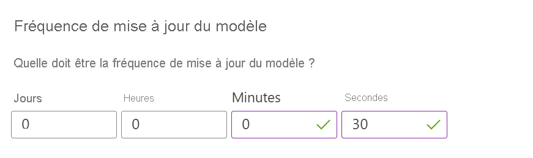

# <a name="quickstart-personalizer-client-library-for-nodejs"></a>Démarrage rapide : Bibliothèque de client Personalizer pour Node.js

Dans ce guide de démarrage rapide Node.js, vous allez afficher du contenu personnalisé avec le service Personalizer.

Commencez à utiliser la bibliothèque de client Personalizer pour Node.js. Suivez les étapes suivantes pour installer le package et essayer l’exemple de code pour les tâches de base.

 * Classer une liste d’actions pour la personnalisation.
 * Envoyer le score de récompense indiquant la réussite de l’action classée en premier.

[Documentation de référence](https://docs.microsoft.com/javascript/api/@azure/cognitiveservices-personalizer/?view=azure-node-latest) | [Code source de la bibliothèque](https://github.com/Azure/azure-sdk-for-js/tree/master/sdk/cognitiveservices/cognitiveservices-personalizer) | [Package (NPM)](https://www.npmjs.com/package/@azure/cognitiveservices-personalizer) | [Exemples](https://github.com/Azure-Samples/cognitive-services-personalizer-samples/blob/master/quickstarts/node/sample.js)

## <a name="prerequisites"></a>Conditions préalables requises

* Abonnement Azure - [En créer un gratuitement](https://azure.microsoft.com/free/)
* Version actuelle de [Node.js](https://nodejs.org) et NPM.

## <a name="using-this-quickstart"></a>Utilisation de ce guide de démarrage rapide


Plusieurs étapes sont nécessaires pour utiliser ce guide de démarrage rapide :

* Dans le portail Azure, créer une ressource Personalizer
* Dans le portail Azure, pour la ressource Personalizer, dans la page **Configuration**, changez la fréquence de mise à jour du modèle.
* Dans un éditeur de code, créer un fichier de code et le modifier
* À partir de la ligne de commande ou du terminal, installer le SDK
* À partir de la ligne de commande ou du terminal, exécuter le fichier de code


## <a name="create-a-personalizer-azure-resource"></a>Créer une ressource Azure Personalizer

Les services Azure Cognitive Services sont représentés par des ressources Azure auxquelles vous vous abonnez. Créez une ressource pour Personalizer en utilisant le [portail Azure](https://docs.microsoft.com/azure/cognitive-services/cognitive-services-apis-create-account) ou [Azure CLI](https://docs.microsoft.com/azure/cognitive-services/cognitive-services-apis-create-account-cli) sur votre ordinateur local. Vous pouvez également :

* Obtenir une [clé d’évaluation](https://azure.microsoft.com/try/cognitive-services) valide pendant 7 jours gratuitement. Une fois l’inscription terminée, elle sera disponible sur le [site web Azure](https://azure.microsoft.com/try/cognitive-services/my-apis/).
* Afficher cette ressource sur le [portail Azure](https://portal.azure.com/).

Après avoir obtenu une clé à partir de votre ressource ou abonnement d’essai, créez deux [variables d’environnement](https://docs.microsoft.com/azure/cognitive-services/cognitive-services-apis-create-account#configure-an-environment-variable-for-authentication) :

* `PERSONALIZER_KEY` pour la clé de ressource
* `PERSONALIZER_ENDPOINT` pour le point de terminaison de ressource

Dans le portail Azure, les valeurs de clé et de point de terminaison sont disponibles à partir de la page **Démarrage rapide**.


## <a name="create-a-new-nodejs-application"></a>Création d’une application Node.js

Dans une fenêtre de console (telle que cmd, PowerShell ou bash), créez un répertoire pour votre application et accédez-y.

```console
mkdir myapp && cd myapp
```

Exécutez la commande `npm init -y` pour créer un fichier `package.json`.

```console
npm init -y
```

## <a name="install-the-nodejs-library-for-personalizer"></a>Installer la bibliothèque Node.js pour Personalizer

Installez la bibliothèque de client Personalizer pour Node.js avec la commande suivante :

```console
npm install @azure/cognitiveservices-personalizer --save
```

Installez les packages NPM restants pour ce guide de démarrage rapide :

```console
npm install @azure/ms-rest-azure-js @azure/ms-rest-js readline-sync uuid --save
```

## <a name="change-the-model-update-frequency"></a>Changer la fréquence de mise à jour du modèle

Dans le portail Azure, dans la ressource Personalizer dans la page **Configuration**, affectez à la **fréquence de mise à jour du modèle** la valeur 10 secondes. Ainsi, le service est entraîné rapidement, ce qui vous permet de voir comment la première action change pour chaque itération.



Quand une boucle Personalizer est instanciée pour la première fois, aucun modèle n’est disponible puisqu’il n’y a pas encore d’appels d’API Reward à partir desquels s’entraîner. Les appels Rank retourneront des probabilités égales pour chaque élément. Votre application doit toujours classer le contenu à l’aide de la sortie de RewardActionId.

## <a name="object-model"></a>Modèle objet

Le client Personalizer est un objet PersonalizerClient qui s’authentifie auprès d’Azure à l’aide de Microsoft.Rest.ServiceClientCredentials, qui contient votre clé.

Pour demander un classement du contenu, créez une classe RankRequest, puis passez-la à la méthode client.Rank. La méthode Rank retourne un RankResponse contenant le contenu classé.

Pour envoyer une récompense à Personalizer, créez une classe RewardRequest, puis passez-la à la méthode client.Reward.

Dans le cadre de ce guide de démarrage rapide, il n’est pas important de déterminer la récompense. Dans un système de production, déterminer les éléments ayant un impact sur le [score de récompense](concept-rewards.md) (et dans quelle mesure) peut être un processus complexe, que vous pouvez décider de modifier au fil du temps. Il doit s’agir de l’une des principales décisions de conception à prendre pour votre architecture Personalizer.

## <a name="code-examples"></a>Exemples de code

Ces extraits de code montrent comment effectuer les opérations suivantes avec la bibliothèque de client Personalizer pour Node.js :

* [Créer un client Personalizer](#create-a-personalizer-client)
* [Demander un classement](#request-a-rank)
* [Envoyer une récompense](#send-a-reward)

## <a name="create-a-new-nodejs-application"></a>Création d’une application Node.js

Créez une application Node.js dans votre éditeur ou IDE favori et nommez-la `sample.js`.

## <a name="add-the-dependencies"></a>Ajouter les dépendances

Ouvrez le fichier **sample.js** dans votre éditeur ou votre IDE favori. Ajoutez les `requires` suivants pour ajouter les packages NPM :

[!code-javascript[Add module dependencies](~/samples-personalizer/quickstarts/node/sample.js?name=Dependencies)]

## <a name="add-personalizer-resource-information"></a>Ajouter des informations sur la ressource Personalizer

Créez des variables pour le point de terminaison et la clé Azure de votre ressource, extraits à partir des variables d’environnement `PERSONALIZER_KEY` et `PERSONALIZER_ENDPOINT`. Si vous avez créé les variables d’environnement après le lancement de l’application, l’éditeur, l’IDE ou l’interpréteur de commandes les exécutant doit être fermé et rechargé pour y accéder. Les méthodes seront créées ultérieurement dans le cadre de ce guide de démarrage rapide.

[!code-javascript[Add Personalizer resource information](~/samples-personalizer/quickstarts/node/sample.js?name=AuthorizationVariables)]

## <a name="create-a-personalizer-client"></a>Créer un client Personalizer

Ensuite, créez une méthode pour retourner un client Personalizer. Le paramètre de la méthode est `PERSONALIZER_RESOURCE_ENDPOINT` et l’ApiKey est `PERSONALIZER_RESOURCE_KEY`.

[!code-javascript[Create a Personalizer client](~/samples-personalizer/quickstarts/node/sample.js?name=Client)]

## <a name="get-content-choices-represented-as-actions"></a>Représenter les choix de contenu sous forme d’actions

Les actions représentent les choix de contenu qui doivent être classés par Personalizer. Ajoutez les méthodes suivantes à la classe Program pour obtenir les entrées d’un utilisateur à partir de la ligne de commande : heure de la journée et préférence alimentaire actuelle.

[!code-javascript[Create user features](~/samples-personalizer/quickstarts/node/sample.js?name=createUserFeatureTimeOfDay)]

[!code-javascript[Create actions](~/samples-personalizer/quickstarts/node/sample.js?name=getActions)]

## <a name="create-the-learning-loop"></a>Créer la boucle d’apprentissage

La boucle d’apprentissage Personalizer est un cycle d’appels de [classement](#request-a-rank) et de [récompense](#send-a-reward). Dans ce guide de démarrage rapide, chaque appel de classement, qui personnalise le contenu, est suivi d’un appel de récompense, qui indique à Personalizer avec quelle efficacité le service a classé le contenu.

Le code de bouclage ci-après applique, en boucle, le cycle suivant : il demande à l’utilisateur d’indiquer ses préférences à partir de la ligne de commande, envoie ces informations à Personalizer en vue de leur classement, présente la sélection classée au client, qui peut faire son choix dans la liste, puis envoie une récompense à Personalizer, indiquant avec quelle efficacité le service a classé la sélection.

[!code-javascript[Create the learning loop](~/samples-personalizer/quickstarts/node/sample.js?name=mainLoop)]

Dans les sections suivantes, examinez de plus près les appels de classement et de récompense.

Ajoutez les méthodes suivantes, qui [obtiennent les choix de contenu](#get-content-choices-represented-as-actions) avant d’exécuter le fichier de code :

* getActionsList
* getContextFeaturesList

## <a name="request-a-rank"></a>Demander un classement

Pour traiter la demande de classement, le programme demande les préférences de l’utilisateur pour créer des choix de contenu. Le processus peut créer du contenu à exclure du classement, indiqué en tant que `excludeActions`. La demande de classement a besoin des éléments suivants pour recevoir la réponse classée : [actions](concepts-features.md#actions-represent-a-list-of-options), currentContext, excludeActions et un ID d’événement de classement unique (en tant que GUID).

Ce guide de démarrage rapide utilise des caractéristiques de contexte simples basées sur l’heure de la journée et les préférences alimentaires de l’utilisateur. Dans les systèmes de production, il peut être important de déterminer et d’[évaluer](concept-feature-evaluation.md) les [actions et caractéristiques](concepts-features.md).

[!code-javascript[The Personalizer learning loop ranks the request.](~/samples-personalizer/quickstarts/node/sample.js?name=rank)]

## <a name="send-a-reward"></a>Envoyer une récompense

Pour traiter la demande de récompense, le programme récupère la sélection de l’utilisateur à partir de la ligne de commande, attribue une valeur numérique à chaque sélection, puis envoie l’ID d’événement de classement unique et la valeur numérique à la méthode de récompense.

Dans le cadre de ce guide de démarrage rapide, un simple numéro est attribué en tant que récompense : 0 ou 1. Dans les systèmes de production, il peut être important de déterminer ce qui doit être envoyé à l’appel de [récompense](concept-rewards.md) (et à quel moment) selon vos besoins spécifiques.

[!code-javascript[The Personalizer learning loop sends a reward.](~/samples-personalizer/quickstarts/node/sample.js?name=reward)]

## <a name="run-the-program"></a>Exécuter le programme

Exécutez l’application avec Node.js à partir de votre répertoire d’application.

```console
node sample.js
```


## <a name="clean-up-resources"></a>Nettoyer les ressources

Si vous souhaitez nettoyer et supprimer un abonnement Cognitive Services, vous pouvez supprimer la ressource ou le groupe de ressources. La suppression du groupe de ressources efface également les autres ressources qui y sont associées.

* [Portail](../cognitive-services-apis-create-account.md#clean-up-resources)
* [Azure CLI](../cognitive-services-apis-create-account-cli.md#clean-up-resources)

## <a name="next-steps"></a>Étapes suivantes

> [!div class="nextstepaction"]
>[Fonctionnement de Personalizer](how-personalizer-works.md)

* [Qu’est-ce que Personalizer ?](what-is-personalizer.md)
* [Où utiliser Personalizer ?](where-can-you-use-personalizer.md)
* [Dépannage](troubleshooting.md)
* Le code source de cet exemple est disponible sur [GitHub](https://github.com/Azure-Samples/cognitive-services-personalizer-samples/blob/master/quickstarts/node/sample.js).
